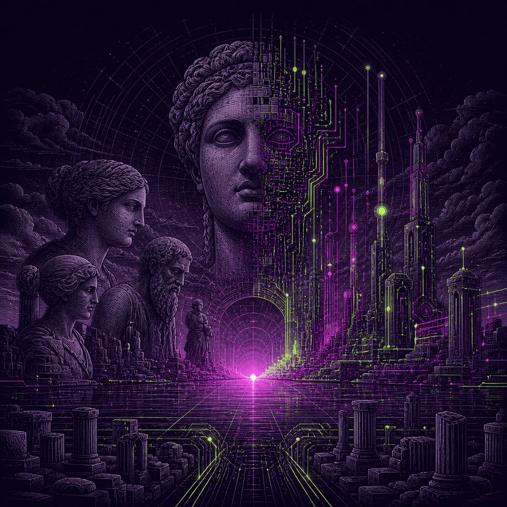
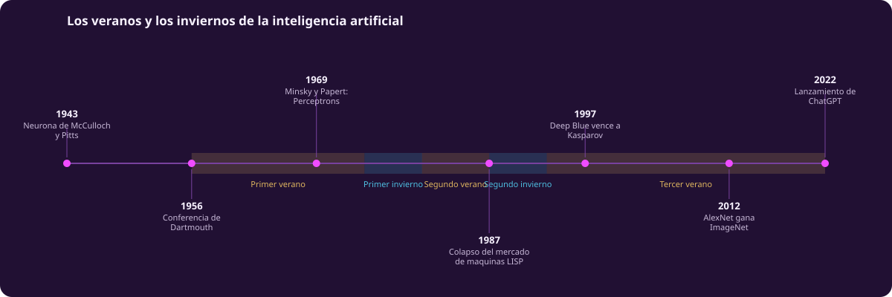

# Historia de la inteligencia artificial

::: figure {#portada-unidad title="De Nuwa a los transformers"}

:::

La inteligencia artificial no empezó en 2022, ni en 2012, ni en 1956. Empezó como
una fantasía sobre crear vida, y esa fantasía es mucho más vieja que cualquier
computadora.

Esta unidad recorre esa historia por una razón práctica: casi todo lo que hoy se
dice sobre la inteligencia artificial —que cambiará todo, que está a punto de
pensar, que se llevará el trabajo— ya se dijo antes. Saber cuándo se dijo, quién
lo dijo y qué pasó después es la mejor defensa contra repetir el ciclo sin darse
cuenta.

## Qué vas a poder hacer al terminar

- Distinguir conceptualmente qué es el aprendizaje máquina y en qué se diferencia
  de la estadística, de la inteligencia artificial como campo, y de los modelos de
  lenguaje.
- Reconstruir el proceso histórico del desarrollo de la inteligencia artificial y
  sus implicaciones.
- Identificar las principales técnicas generales de entrenamiento del aprendizaje
  máquina.
- Situar el contexto histórico y ético del campo.

## El mapa completo

::: figure {#linea-tiempo-maestra title="Dos mil años de máquinas que piensan"}

:::

Las bandas amarillas son los **veranos** de la inteligencia artificial: periodos de
entusiasmo, financiamiento abundante y promesas grandes. Las azules son los
**inviernos**: cuando el dinero se retira. Esa alternancia es uno de los cuatro
hilos que sigue esta unidad.

## Los cuatro hilos

Cada página los retoma explícitamente.

| Hilo | Pregunta que sostiene |
|---|---|
| Esencia contra comportamiento | ¿Qué cuenta como inteligencia, y quién lo decide? |
| Expectativa y decepción | ¿Por qué los inviernos son un patrón y no un accidente? |
| Tres linajes | ¿De dónde vienen el enfoque simbólico, el conexionista y el de refuerzo? |
| Quién paga y quién decide | ¿Cómo cambia el campo cuando cambia quién lo financia? |

## Recorrido

1. [[imaginar-la-maquina]] — los mitos, la ficción y los autómatas.
2. [[que-es-inteligencia]] — inteligencia, la taxonomía IA/ML/LLM, y causalidad.
3. [[arco-historico]] — de la cibernética a ChatGPT.
4. [[por-que-el-boom]] — qué cambió para que funcionara.
5. [[estado-actual]] — dónde estamos, con fecha de corte.
6. [[otras-raices]] — lo que no es aprendizaje máquina.
7. [[ia-y-sociedad]] — trabajo, poder e ideologías.
8. [[material-adicional]] — para seguir.
