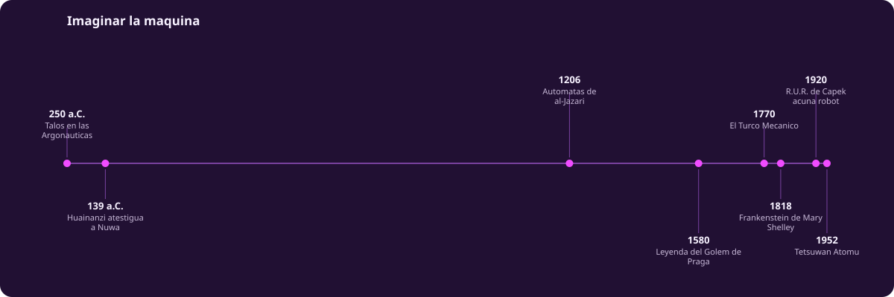
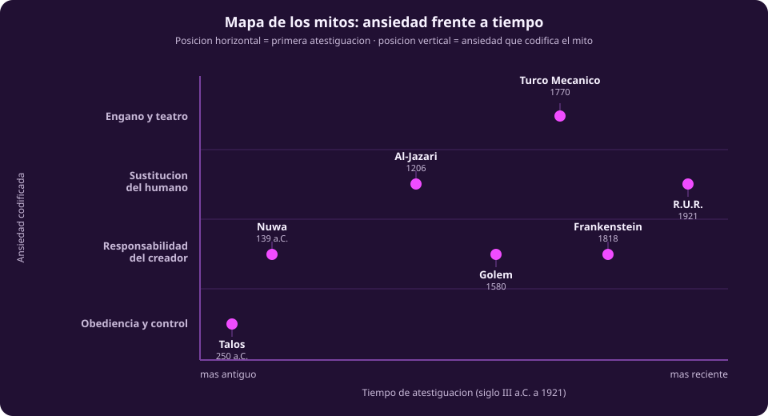
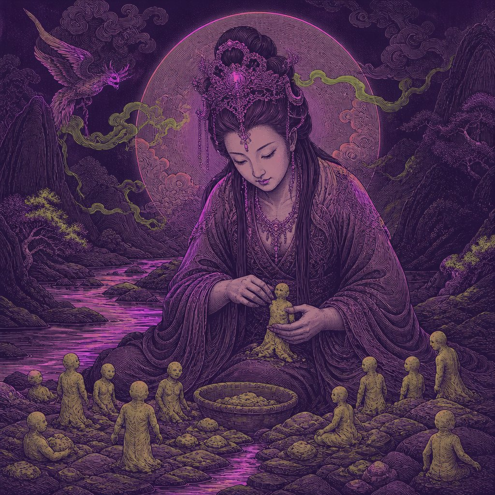
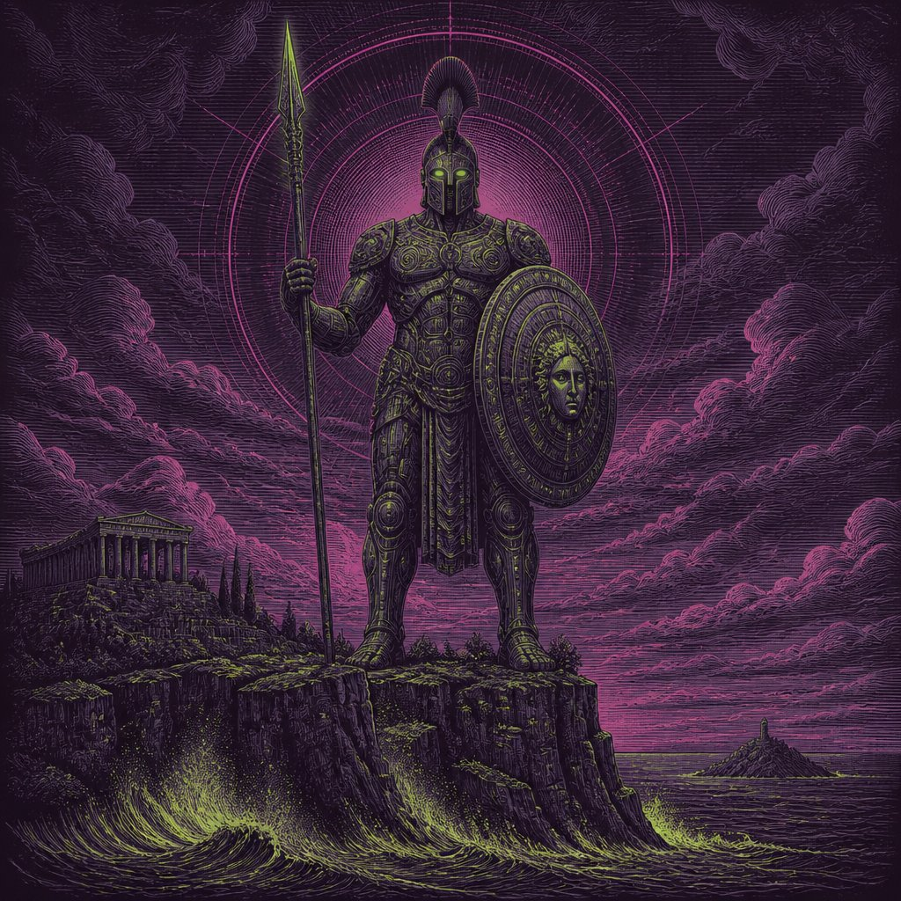
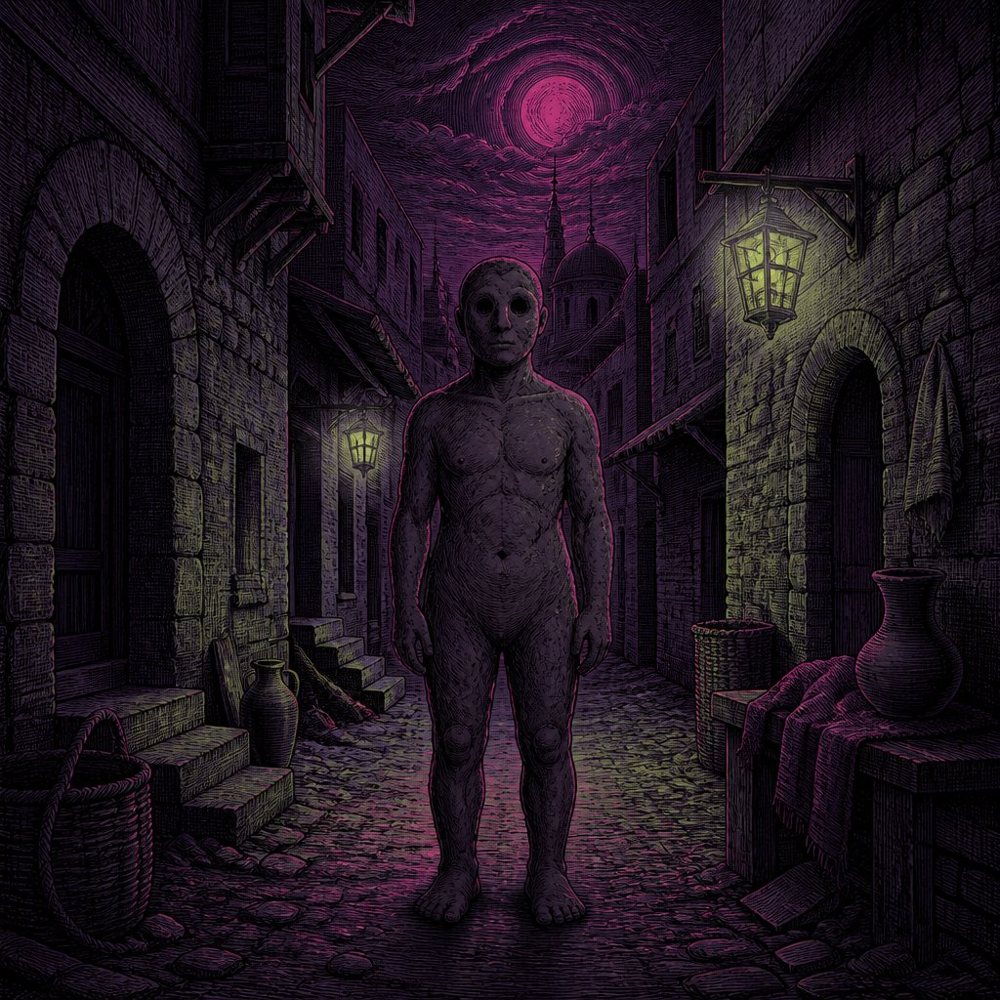
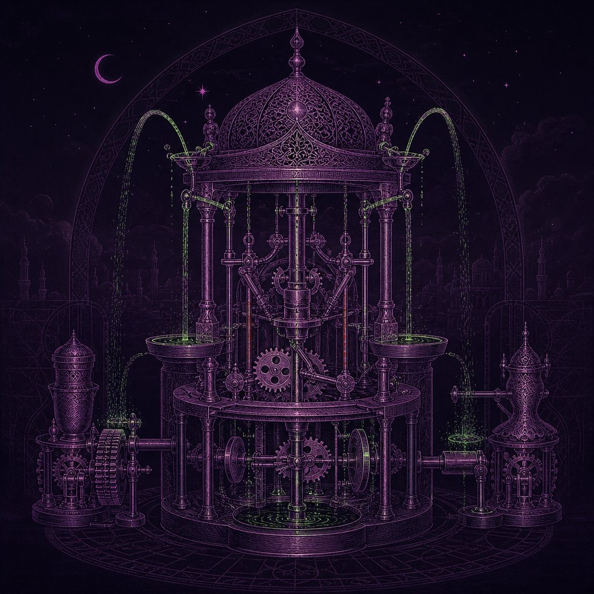
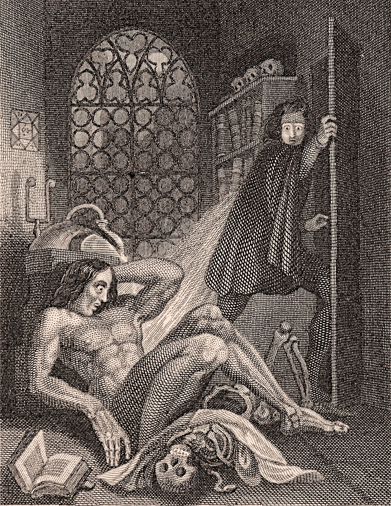
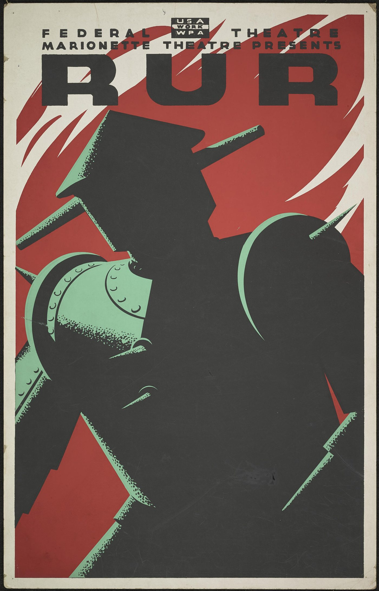

# Imaginar la máquina

::: figure {#tiempo-mitos title="Línea del tiempo de la sección"}

:::

## La fantasía es más vieja que la máquina

Crear vida artificial no empezó con la computación ni con la palabra "robot". Es
una fantasía recurrente: aparece en China en el siglo II a. C., en Grecia en el
siglo III a. C., en Bagdad en el siglo XIII, en Praga en el siglo XVI, en Londres
en 1818 y otra vez en Praga en 1921 —culturas que no se copiaron ni se conocían
entre sí. La idea es transcultural: aparece dondequiera que hay artesanos capaces
de dar forma a la materia y una pregunta abierta sobre qué distingue a lo vivo de
lo fabricado.

## Cuatro ansiedades, no cinco anécdotas

::: figure {#mapa-mitos title="Mapa de los mitos: ansiedad frente a tiempo"}

:::

El material original ordenaba estos mitos en "Occidente" y "Oriente", como si la
geografía explicara algo. No explica nada: agrupa a Nuwa con nadie y separa al
Golem de Frankenstein, casi la misma historia. El eje que sí ordena algo es
vertical: la ansiedad que codifica cada mito. Talos plantea la obediencia y el
control —¿qué pasa si el guardián deja de obedecer? Nuwa, el Golem y Frankenstein
plantean la responsabilidad del creador —¿qué le debe quien fabrica una vida a lo
que fabricó? Al-Jazari y R.U.R. plantean la sustitución del humano. Y el Turco
Mecánico plantea el engaño y el teatro: ¿cómo se demuestra que algo piensa?

## Nuwa y el barro

::: figure {#nuwa title="Nuwa moldeando figuras de barro"}

:::

*(Esta imagen es una ilustración generada, no una fotografía ni un dato real.)*

En la mitología china, Nuwa modela a los primeros humanos con barro amarillo a la
orilla de un río. El relato más completo está en el *Huainanzi*, presentado en 139
a. C. —siglo II a. C., no el 2070–1600 a. C. que le atribuía el material original,
una fecha de la dinastía Xia que ningún texto liga a Nuwa. Cansada de modelar a
mano, Nuwa termina salpicando barro con una cuerda: las gotas se vuelven la gente
común, y las figuras hechas a mano, la nobleza. Es el mito que más directamente
liga la creación de vida artificial con la desigualdad.

## Talos y la guardia

::: figure {#talos title="Talos, autómata de bronce"}

:::

*(Esta imagen es una ilustración generada, no una fotografía ni un dato real.)*

Talos es un gigante de bronce forjado por Hefesto que patrulla Creta arrojando
piedras a cualquier barco que se acerque. Aparece en las *Argonáuticas* de Apolonio
de Rodas, del siglo III a. C.: ahí lo derrota Medea, que le promete la inmortalidad
y le quita el perno que sella la única vena por la que corre su sangre. Talos es
puro control: obedece una orden —vigilar la isla— hasta que alguien encuentra el
punto exacto donde ese control puede desactivarse. Es la primera aparición de una
idea que el curso repite: todo sistema que "solo obedece" tiene un punto de falla.

## El Golem y la responsabilidad

::: figure {#golem title="El Golem de Praga"}

:::

*(Esta imagen es una ilustración generada, no una fotografía ni un dato real.)*

La versión más conocida del Golem se atribuye al rabino Judah Loew de Praga, en el
siglo XVI —no el año 38 a. C. del deck original, una fecha sin texto que la
sostenga. Loew moldea una figura de arcilla del río Moldava y la anima con una
fórmula sagrada para proteger a la comunidad judía de la persecución. El motivo es
más antiguo: ya aparece en el Talmud, en el tratado Sanhedrin, donde Adán es
materia sin forma antes del alma, y el sabio Rava crea un hombre —siglos antes de
que la leyenda se fijara en Praga. Lo distintivo de esta versión: el Golem no falla
porque alguien manipule su control, como Talos, sino porque su creador olvida
desactivarlo.

## Al-Jazari y los autómatas que sí existieron

::: figure {#al-jazari title="Autómata hidráulico de al-Jazari"}

:::

*(Esta imagen es una ilustración generada, no una fotografía ni un dato real.)*

Hasta aquí, mito. Con Ismail al-Jazari cambia el registro: en 1206 completa *El
libro del conocimiento de los dispositivos mecánicos ingeniosos*, con instrucciones
para construir cincuenta máquinas —relojes de agua, músicos automáticos, un
dispositivo para lavarse las manos con forma de pavorreal. No son metáforas: son
máquinas que existieron. Al-Jazari es el puente entre la fantasía y la ingeniería:
el primer punto del mapa donde la ansiedad deja de ser hipotética, porque estas
máquinas sustituyen tareas que antes hacía una persona.

## El Turco Mecánico: el primer fraude de la inteligencia artificial

::: figure {#turco-mecanico title="El Turco Mecánico"}

:::

*(Esta imagen es una ilustración generada, no una fotografía ni un dato real.)*

En 1770, Wolfgang von Kempelen presenta en la corte de Viena una máquina que juega
ajedrez contra cualquier retador —y gana. Antes de cada partida abre el gabinete
para mostrar solo engranajes. No hay ningún engranaje jugando: hay una persona
escondida en el falso fondo, moviendo las piezas con imanes y palancas mientras el
público mira relojería. El fraude dura ochenta años y solo se revela por completo
tras la muerte de Kempelen. Es el mito fundacional de una pregunta que este curso
repite: cuando algo parece pensar, ¿cómo se sabe si de verdad piensa o si alguien,
oculto, hace el trabajo? Esa pregunta le da nombre a un producto de hoy: Amazon
llamó *Mechanical Turk* a su plataforma de trabajo humano bajo demanda,
precisamente porque —igual que en 1770— hay personas escondidas detrás de una
interfaz que aparenta automatización. [[ia-y-sociedad]] retoma ese hilo del trabajo
humano oculto.

## Frankenstein y R.U.R.

::: figure {#frankenstein title="Frontispicio de Frankenstein"}

:::

::: figure {#rur title="Cartel de una producción de R.U.R."}

:::

*Frankenstein; o, el moderno Prometeo* se publica de forma anónima el 1 de enero de
1818; el nombre de Mary Shelley se asocia por primera vez a la novela en 1821, en
una traducción al francés, y no aparece en una edición en inglés hasta la segunda,
de 1823. La novela
retoma casi la misma pregunta que el Golem: Victor Frankenstein construye una
criatura y la abandona, y es ese abandono, no la criatura en sí, lo que produce la
tragedia. Poco más de un siglo después, el 25 de enero de 1921, se estrena en Praga
*R.U.R. (Robots Universales Rossum)*, de Karel Čapek. La obra acuña la palabra
"robot" —de una raíz eslava para "trabajo forzado"—, que Karel atribuyó a su
hermano Josef. En R.U.R. los robots sustituyen el trabajo humano y luego se
rebelan: sustitución y responsabilidad convergen en la misma obra. (La línea
del tiempo de esta página marca 1920, el año en que Čapek escribió la obra;
esta prosa usa 1921, el año de su estreno —ambas fechas son correctas, para
eventos distintos.)

## Astroboy

*Tetsuwan Atomu* —Astroboy— comienza a serializarse en la revista *Shōnen* en 1952,
obra de Osamu Tezuka. Astroboy invierte el patrón de los seis mitos anteriores: no
es una amenaza que hay que controlar. Es un niño-robot que sufre discriminación por
no ser humano, busca ser aceptado y defiende a los humanos que lo rechazan. Con
Astroboy, el robot deja de ser sujeto de control ajeno y pasa a ser sujeto que
padece —la vuelta de tuerca que este mapa no anticipa, y que anuncia una pregunta
que la unidad toma en serio: ¿de quién es la responsabilidad cuando lo fabricado
empieza a parecer, también, alguien?

## Qué se llevan estas historias

Ningún mito de este mapa predijo la computación. Ninguno necesitaba hacerlo: cada
uno ya había identificado, siglos antes de que existiera una máquina capaz de
calcular, la pregunta que esa máquina volvería a plantear. Obediencia y control,
responsabilidad del creador, sustitución del humano, engaño y teatro —estas cuatro
ansiedades no desaparecen cuando la ficción se vuelve ingeniería. Reaparecen en
cada página que sigue: en los inviernos de la inteligencia artificial, en el
trabajo oculto detrás de los sistemas automatizados, y en la pregunta, todavía sin
resolver, de qué cuenta como pensar.
