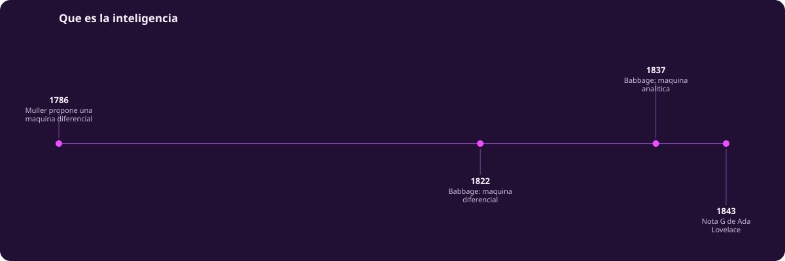
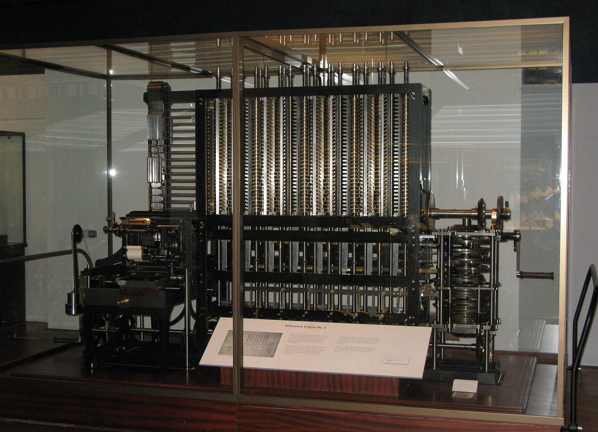
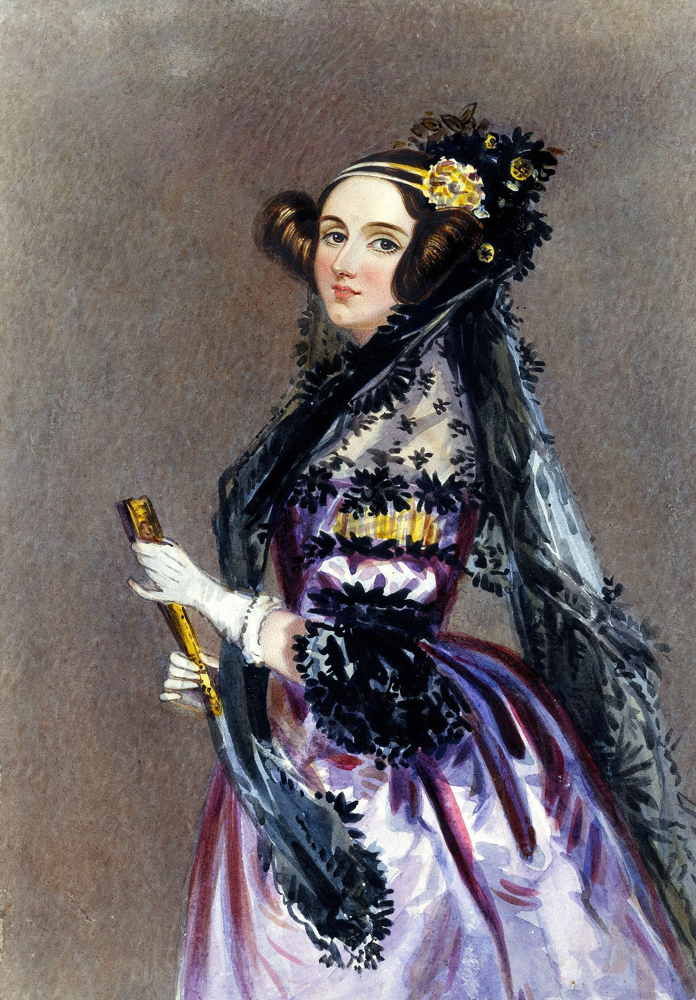
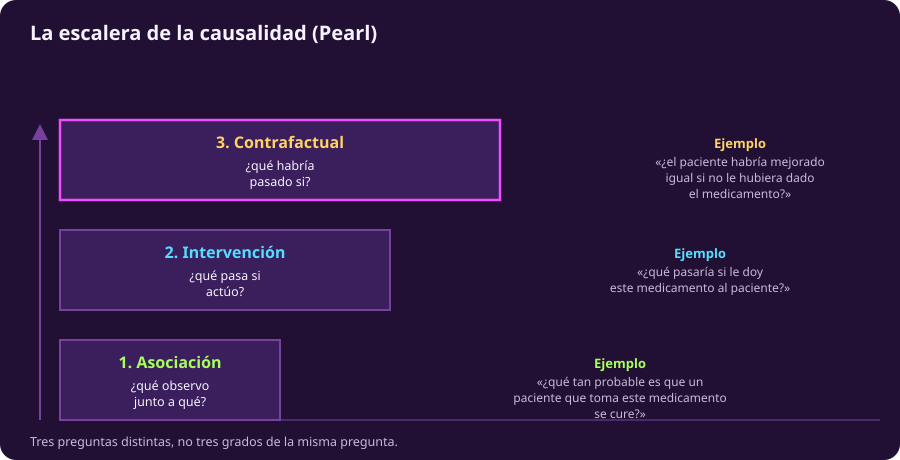

# Qué es la inteligencia

::: figure {#tiempo-inteligencia title="De la máquina diferencial a la escalera de la causalidad"}

:::

Esta es la página más importante de la unidad, no la más vistosa. Si en 2026
alguien te pregunta qué es la inteligencia artificial y respondes describiendo
un modelo de lenguaje, has confundido el todo con una rama de una rama.

## De la fantasía al mecanismo

En 1822 Charles Babbage propuso a la Royal Astronomical Society la **máquina
diferencial**: un dispositivo mecánico para calcular tablas matemáticas —de
logaritmos, de navegación— reduciendo el cálculo de polinomios a sumas
mecánicas, con una prensa que imprimía los resultados sin el error humano de
copiarlos a mano. El gobierno británico financió el proyecto en 1823. No fue
la primera vez que alguien pensó en algo así: en 1786 el ingeniero alemán
Johann Helfrich von Müller ya había publicado el diseño de una máquina
diferencial con el mismo propósito, aunque nunca encontró financiamiento para
construirla.

::: figure {#babbage-maquina title="La máquina diferencial de Babbage"}

:::

Aquí conviene una corrección explícita: el material original de este curso
databa en 1822 una «máquina analítica», fundiendo en una sola fecha dos
máquinas distintas de Babbage. La diferencial de 1822 solo calculaba tablas. La
**máquina analítica**, un diseño mucho más ambicioso con unidad de control,
memoria, unidad aritmética y tarjetas perforadas para programar operaciones
—inspiradas en el telar de Jacquard—, es de 1837. La distinción no es un
detalle de anticuario: la diferencial es una calculadora; la analítica, de
haberse construido, habría sido una computadora de propósito general. Por
falta de financiamiento, nunca se terminó en vida de Babbage.

## Lovelace y la pregunta que sigue abierta

::: figure {#lovelace title="Ada Lovelace"}

:::

En 1842, el ingeniero italiano Luigi Menabrea publicó en francés un resumen de
las conferencias que Babbage había dado en Turín sobre la máquina analítica. Ada
Lovelace lo tradujo al inglés y, por sugerencia de Babbage, añadió sus propias
notas —tres veces más largas que el texto original—, publicadas en 1843 como
«Sketch of the Analytical Engine... with Notes by the Translator». La más
célebre, la **Nota G**, contiene el algoritmo para calcular los números de
Bernoulli usando la máquina analítica: se reconoce hoy como el primer programa
de cómputo de la historia, escrito para una máquina que nunca llegó a existir.

Lovelace también dejó una objeción que sigue viva: la máquina analítica «no
tiene pretensiones de originar nada. Puede hacer lo que sepamos ordenarle que
haga». Un siglo después, Alan Turing la retoma por su nombre —la «objeción de
Lovelace»— en su artículo de 1950 «Computing Machinery and Intelligence», y
responde que una máquina que aprende puede sorprender a quien la programó. Si
eso basta para llamarlo pensar sigue sin respuesta consensuada, y
[[arco-historico|el arco histórico]] retoma el hilo con Turing.

## Qué es la inteligencia

Antes de construir la taxonomía conviene tener una definición de trabajo. Una
formulación habitual —la que usaba el material original de este curso— describe
la inteligencia como la capacidad mental general de razonar, planear, resolver
problemas y también plantearlos, pensar de forma abstracta, comprender ideas
complejas y aprender con facilidad de la experiencia.

Es una buena definición de trabajo, y hay que problematizarla de inmediato:
toda definición de inteligencia elige qué cuenta y qué queda fuera. Esta
prioriza el razonamiento verbal y matemático sobre, por ejemplo, la
coordinación motriz o la percepción social —criterios por los que un pulpo
resolviendo un laberinto también reclamaría el término—. No hay una
definición neutral que preceda a la pregunta de para qué la queremos; cada
vez que alguien dice que un sistema «es inteligente», aplica, casi siempre
sin decirlo, un recorte como este.

## Inteligencia artificial, aprendizaje máquina, redes profundas, LLM

Esta es la sección central de la página, y la razón por la que existe.

::: figure {#taxonomia-ia title="La taxonomía de la inteligencia artificial"}

:::

@taxonomia-ia no dibuja anillos concéntricos porque la inteligencia artificial no
es una cebolla. Es un campo con varias ramas que nacieron por caminos distintos
y que en buena parte de su historia casi no se hablaron entre sí: **búsqueda y
planificación** (explorar un espacio de estados para llegar a una meta),
**lógica y GOFAI** —*Good Old-Fashioned Artificial Intelligence*, término
acuñado por el filósofo John Haugeland en 1985 para la IA simbólica basada en
reglas—, **teoría de juegos**, **sistemas expertos** y **aprendizaje
máquina**. Cinco enfoques hermanos; ninguno contiene a los demás.

El anidamiento estricto —donde cada categoría sí es subconjunto propio de la
anterior— existe únicamente dentro de una de esas cinco ramas: aprendizaje
máquina contiene a las redes neuronales profundas, que contienen a los
transformers (una arquitectura de red profunda publicada en 2017), que
contienen a los modelos de lenguaje grandes o LLM. Un LLM es un transformer;
un transformer es una red profunda; una red profunda es aprendizaje máquina.
Pero un LLM no es «lógica y GOFAI», ni «búsqueda y planificación»: son ramas
distintas del mismo árbol, no antepasados suyos. Cuando en 2026 se usa
«inteligencia artificial» como sinónimo de «modelo de lenguaje», se toma la
hoja más reciente de la rama más reciente y se le llama el árbol entero.
[[otras-raices|Otras raíces]] recorre esas otras ramas —lo que la IA hizo, y sigue
haciendo, sin una sola red neuronal de por medio.

## GOFAI contra aprendizaje máquina

La tabla compara los dos extremos de la taxonomía.

| | GOFAI (enfoque simbólico) | Aprendizaje máquina |
|---|---|---|
| Cómo se especifica el conocimiento | Reglas y hechos escritos a mano por expertos humanos | Parámetros ajustados automáticamente a partir de datos |
| Qué se necesita para que funcione | Un dominio bien delimitado y expertos capaces de formalizarlo | Datos representativos, suficientes y una función de pérdida bien definida |
| Cómo se explica una decisión | Se puede trazar la cadena exacta de reglas que la produjo | Rara vez es transparente; a menudo requiere herramientas aparte para interpretarla |
| En qué falla | No generaliza fuera de lo que alguien anticipó y escribió como regla | Puede fallar de formas impredecibles ante datos distintos a los de entrenamiento |

Ninguna fila es un juicio de superioridad. Un sistema experto puede explicar
exactamente por qué recomendó algo; un modelo de aprendizaje profundo puede
acertar más sin poder decir por qué. Son compromisos distintos, no una escala
de progreso donde uno reemplaza al otro sin costo.

## Tres formas de aprender

Dentro del aprendizaje máquina hay, a grandes rasgos, tres paradigmas.

El **aprendizaje supervisado** entrena un sistema con ejemplos ya etiquetados
—esta imagen es un gato, este correo es spam— y ajusta sus parámetros para
minimizar el error entre lo que predice y la etiqueta correcta. Es el paradigma
detrás de la mayoría de los clasificadores y de gran parte del entrenamiento de
los modelos de lenguaje.

El **aprendizaje no supervisado** no tiene etiquetas: el sistema busca
estructura en los datos por sí mismo, agrupando lo similar o reduciendo su
dimensionalidad, sin que nadie le diga de antemano qué buscar.

El **aprendizaje por refuerzo** es el tercer paradigma, y el que más se presta
a confusión porque no se parece a los otros dos: un agente actúa sobre un
entorno, recibe una señal de recompensa o castigo, y ajusta su comportamiento
para maximizar la recompensa acumulada, no el acierto en un ejemplo aislado. Es
el linaje detrás de que un programa aprenda a jugar mejor que su programador
—de Arthur Samuel enseñando a una computadora a jugar damas en 1959 a AlphaGo
venciendo a Lee Sedol en 2016—, episodios que [[arco-historico|el arco histórico]] desarrolla.

## Aprender no es explicar

::: figure {#escalera-causal title="La escalera de la causalidad"}

:::

El aprendizaje máquina, incluso cuando funciona muy bien, no implica
causalidad. Que un modelo prediga con precisión que B ocurre después de A no
significa que A cause B; puede que ambos respondan a una tercera causa común.

Hay al menos dos maneras filosóficamente distintas de pensar qué significa que
algo cause algo. La **regularidad**, que se remonta a David Hume, sostiene que
A es causa de B si B se observa regularmente después de A: causalidad como
patrón constante. El **contrafactualismo**, formulado con más rigor por el
filósofo David Lewis, sostiene en cambio que A es causa de B si, de no haber
ocurrido A, B tampoco habría ocurrido: causalidad como dependencia entre un
mundo real y uno hipotético.

Judea Pearl formalizó esta distinción en su **escalera de la causalidad**, con
tres niveles que @escalera-causal ilustra con la misma pregunta clínica
formulada en cada uno. El primer nivel, **asociación**, es pura correlación:
qué se observa junto a qué —el nivel en el que opera casi todo el aprendizaje
máquina—. El segundo, **intervención**, pregunta qué pasa si actúo sobre el
sistema. El tercero, **contrafactual**, pregunta qué habría pasado si el
pasado hubiera sido distinto: la pregunta más difícil, porque exige razonar
sobre un mundo que no ocurrió. No son grados de la misma pregunta, sino
preguntas distintas; responder una no responde las otras.

Vale una corrección aquí también: el material original de este curso mencionaba
a Pearl entre las figuras del resurgimiento de los sistemas expertos en los
años ochenta. Pearl trabajó en heurísticas de búsqueda en esa década, pero su
aportación central —la que le valió el Turing Award en 2011— son las redes
bayesianas y el cálculo formal de la causalidad, no los sistemas basados en
reglas de la sección anterior.

## Cierre

Esta página deja tres herramientas: una definición de inteligencia que se
sabe parcial, no neutral; una taxonomía donde solo una rama —aprendizaje
máquina, redes profundas, transformers, LLM— se anida de verdad, mientras las
demás son hermanas; y la distinción entre predecir y explicar, que va a
volver cada vez que un sistema entrenado con datos parezca «entender» algo
que en realidad solo asocia. [[arco-historico|El arco histórico]] retoma la cronología donde la
dejó [[imaginar-la-maquina|Imaginar la máquina]] y sigue el hilo desde la cibernética hasta hoy.
