# El arco histórico

::: figure {#tiempo-arco-1 title="El arco histórico: 1936-1973"}
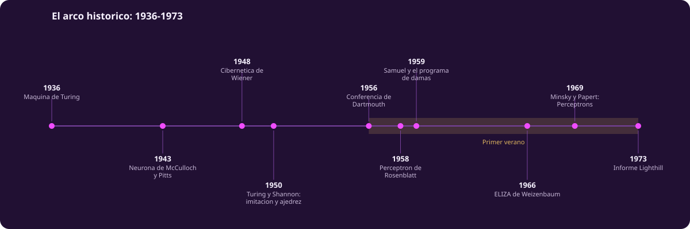
:::

Esta página recorre casi un siglo en veinte hitos. No es un catálogo: es un
argumento. La inteligencia artificial no avanzó en línea recta ni por
acumulación uniforme de progreso. Avanzó en oleadas, con al menos tres
linajes distintos entrelazándose, y con dos colapsos de financiamiento que
casi la mataron. Entender por qué esos colapsos ocurrieron —no solo que
ocurrieron— es la mejor herramienta para leer el entusiasmo actual con
criterio.

## Antes de que existiera el nombre

El campo tiene una raíz que casi siempre se omite: la cibernética. En 1943,
Warren McCulloch y Walter Pitts publicaron un modelo matemático de la
neurona como unidad lógica —un interruptor que se activa si la suma de sus
entradas supera un umbral—. No pretendía ser neurociencia precisa: era una
prueba de que redes de esas unidades podían, en principio, calcular
cualquier función lógica. Es el primer antepasado directo de las redes
neuronales.

Ese modelo circuló entre un grupo interdisciplinario —matemáticos,
neurofisiólogos, antropólogos, psicólogos— que se reunió en las
**conferencias Macy** entre 1946 y 1953 bajo el título "Circular Causal and
Feedback Mechanisms in Biological and Social Systems". Ahí se discutía una
idea que hoy damos por sentada: que el control y la comunicación —en una
máquina, un organismo o una sociedad— podían estudiarse con el mismo
lenguaje matemático de la retroalimentación.

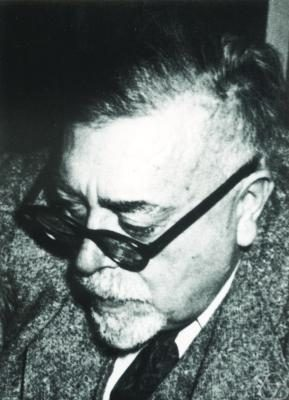

Norbert Wiener le dio nombre a ese lenguaje en 1948, con *Cybernetics: Or
Control and Communication in the Animal and the Machine*. La palabra no
sobrevivió como etiqueta del campo, pero la pregunta sí: ¿qué tienen en
común un termostato, un misil que se autocorrige y un sistema nervioso? Esa
pregunta, no la de "máquinas que piensan", es el origen real del linaje
conexionista.

## 1950 · Turing y la pregunta mal planteada

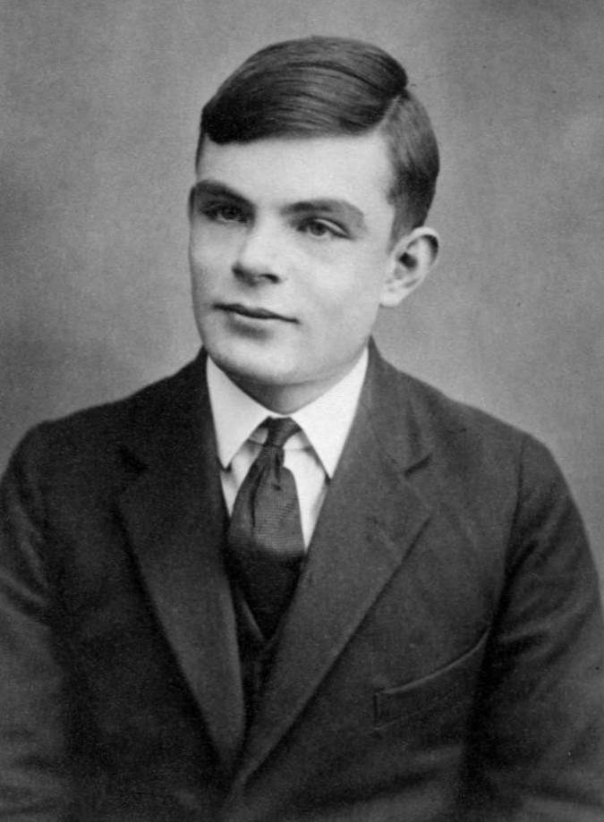

Alan Turing abre su artículo de 1950, "Computing Machinery and
Intelligence", publicado en la revista *Mind*, con una jugada retórica: la
pregunta "¿pueden pensar las máquinas?" es demasiado ambigua para
responderse, así que la sustituye por otra, expresada en términos de
comportamiento observable. Es el **juego de la imitación**.

::: figure {#juego-imitacion title="El juego de la imitación"}
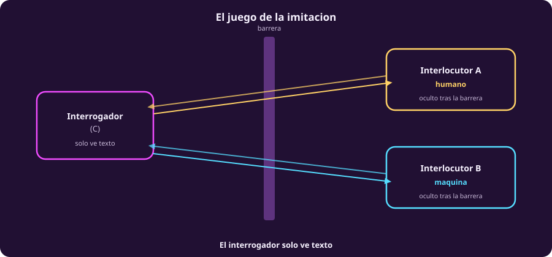
:::

Turing anticipa nueve objeciones y las responde una por una. La más citada
es la **objeción de Lovelace**: que una máquina nunca puede originar nada,
solo hacer lo que se le ordena. Turing responde con algo que suena moderno
—que la sorpresa que produce un programa no depende de que su
programador lo haya previsto todo—. Y en la sección final propone algo que
adelanta el aprendizaje máquina por siete décadas: en vez de simular una
mente adulta, ¿por qué no simular una **máquina niña**, y someterla a un
proceso de educación? Sustituir el diseño explícito por el entrenamiento.

## 1950 · Shannon y el ajedrez

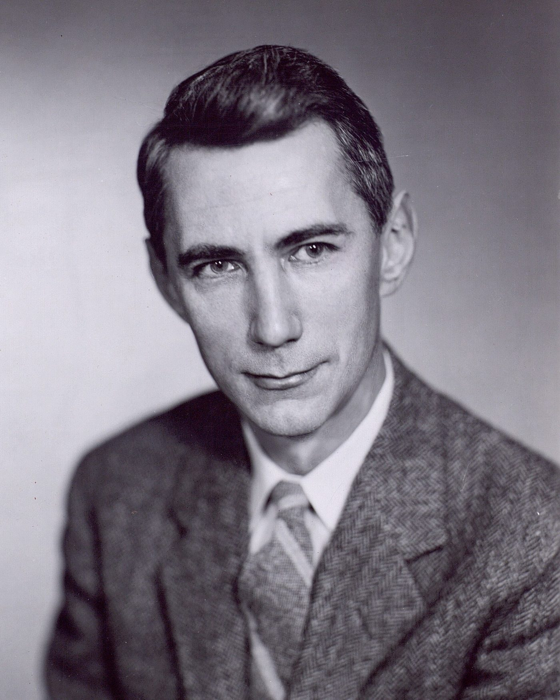

El mismo año, Claude Shannon publica "Programming a Computer for Playing
Chess". No construye una máquina jugadora: propone cómo se buscaría en el
árbol de jugadas y cómo se evaluaría una posición sin llegar al final de la
partida. El ajedrez se vuelve, desde ese momento, el banco de pruebas
favorito del campo durante cuarenta años.

## 1956 · Dartmouth y el nombre

En el verano de 1956, John McCarthy, Marvin Minsky, Nathaniel Rochester y
Claude Shannon organizan un taller de dos meses en Dartmouth College, a
partir de una propuesta que habían escrito el año anterior, en 1955. Esa
propuesta contiene la primera aparición impresa de la frase "inteligencia
artificial". Nombrar un campo no es un trámite: convierte un conjunto disperso
de intuiciones sobre autómatas, lógica y cómputo en un programa de
investigación con presupuesto propio.

## 1958 · El perceptrón

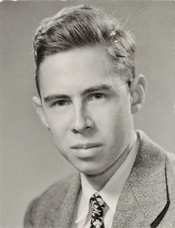

Frank Rosenblatt construye el perceptrón: una red de una sola capa que
ajusta sus pesos cada vez que se equivoca, hasta aprender a separar dos
categorías. Es el primer sistema conexionista que aprende de ejemplos, no
que se programa regla por regla, y llega apenas doce años después de la
neurona de McCulloch y Pitts.

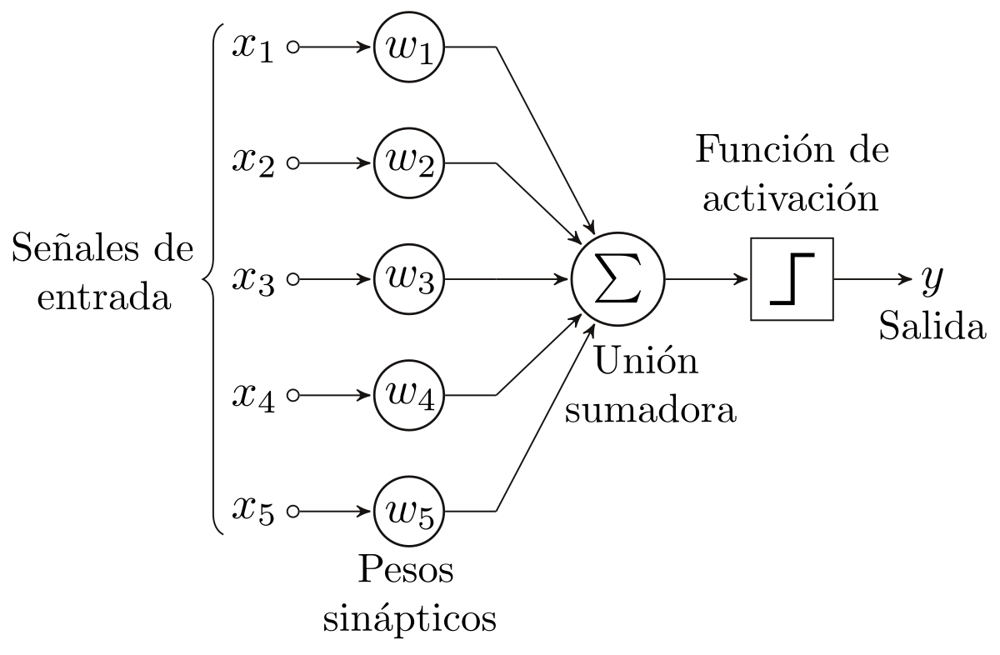

## 1959 · Samuel y las damas

Arthur Samuel publica un programa de damas que mejora jugando contra sí
mismo, y en el artículo que lo describe acuña el término *machine
learning*. Es el origen del **linaje de refuerzo**: un sistema que no
recibe la respuesta correcta, sino una señal de qué tan bien le fue, y
ajusta su comportamiento futuro en consecuencia. Esa misma idea, décadas
después, entrena a AlphaGo.

## 1966 · ELIZA y el espejo

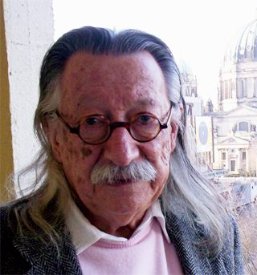

Joseph Weizenbaum escribe ELIZA, un programa que imita a un terapeuta
rogeriano reformulando lo que el usuario escribe como pregunta. El programa
es, técnicamente, casi trivial: coincidencia de patrones y sustitución de
texto, sin ningún modelo del lenguaje ni del mundo.

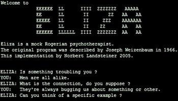

Lo que sorprendió a Weizenbaum no fue lo que ELIZA lograba, sino lo que la
gente le atribuía: su propia secretaria le pidió salir de la sala para
hablar con el programa en privado. Weizenbaum pasó el resto de su carrera
advirtiendo sobre esa disposición humana a proyectar comprensión donde solo
hay reflejo. El descubrimiento no fue sobre el programa. Fue sobre nosotros.

## Tres linajes, no uno

::: figure {#tres-linajes title="Tres linajes de la inteligencia artificial, 1930-2026"}
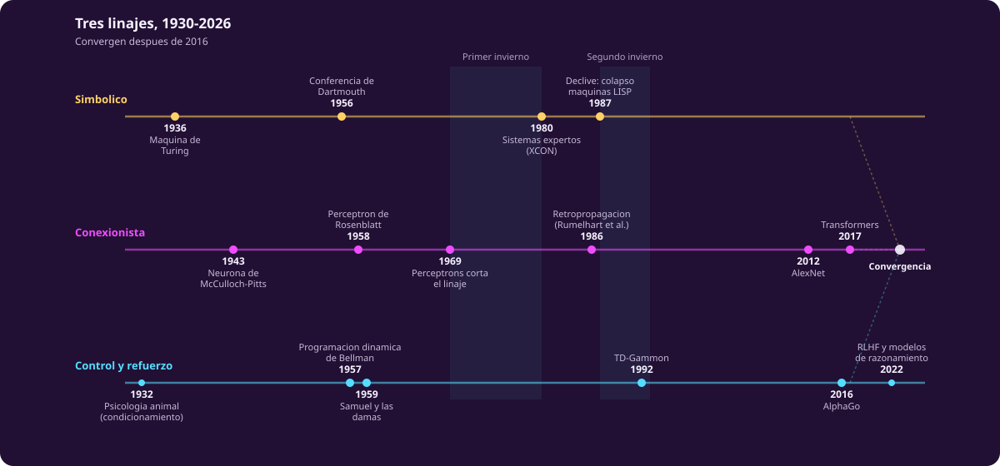
:::

Hasta aquí conviven tres tradiciones que casi nunca comparten sala en los
relatos populares. La **simbólica** manipula símbolos y reglas explícitas
—de la máquina de Turing a Dartmouth y de ahí a los sistemas expertos—.
La **conexionista** aprende parámetros a partir de ejemplos —de
McCulloch-Pitts al perceptrón, y de ahí, con una interrupción larga, a las
redes profundas—. La de **control y refuerzo** optimiza una señal de
recompensa a lo largo del tiempo —de la psicología animal a Samuel, y de
ahí a AlphaGo—. No convergen hasta bien entrado el siglo XXI, y cuando lo
hacen, lo hacen en el mismo sistema.

## Anatomía de un invierno

::: figure {#anatomia-invierno title="Anatomía de un invierno de la inteligencia artificial"}
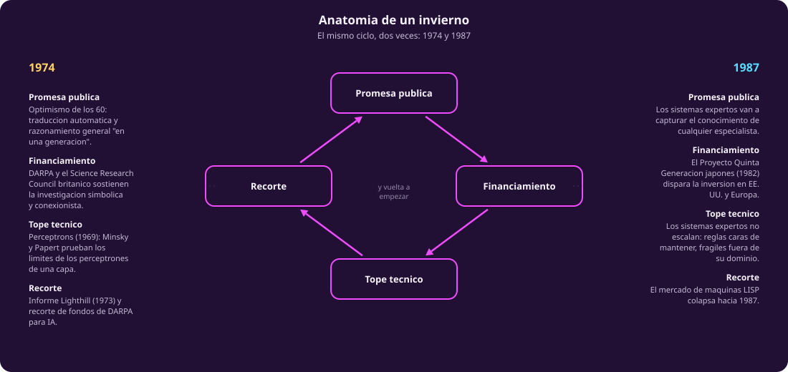
:::

Los relatos que solo enumeran "hubo un invierno en los setenta y otro en
los ochenta" tratan el fenómeno como clima: algo que pasa, sin causa. No es
clima. Es un ciclo con cuatro pasos reconocibles, y se repitió dos veces con
actores distintos.

**El primer invierno** empieza con un tope técnico muy concreto: en 1969,
Marvin Minsky y Seymour Papert publican *Perceptrons*, una prueba formal de
que los perceptrones de una sola capa no pueden aprender funciones tan
simples como el XOR. El libro no mata al conexionismo por sí solo, pero le
quita el oxígeno: la investigación en redes neuronales se reduce a un
goteo durante casi dos décadas. Encima, en 1973 el gobierno británico
publica el **informe Lighthill**, un balance deliberadamente pesimista del
campo que le cuesta buena parte de su financiamiento académico en el Reino
Unido, y en Estados Unidos DARPA recorta fondos de investigación
exploratoria en IA por la misma época. Promesa pública desbordada,
financiamiento que la siguió sin exigir evidencia, un límite técnico que
salió a la luz, y el recorte que llegó después. Ese es el patrón.

**El segundo invierno**, entre 1987 y 1993, repite el ciclo con otro
protagonista: los sistemas expertos.

## 1980-1987 · Los sistemas expertos y el segundo verano

Entre 1980 y 1987 el linaje simbólico vive su propio verano. **XCON**, un
sistema experto de Digital Equipment Corporation, automatiza la
configuración de sus computadoras VAX a partir de miles de reglas escritas
a mano, y le ahorra a la empresa millones de dólares al año. El anuncio en
1982 del **Proyecto Quinta Generación** japonés —una apuesta estatal de
diez años por cómputo masivamente paralelo y programación lógica— dispara
una reacción defensiva en Estados Unidos y Europa: si Japón va a dominar la
próxima generación de cómputo, hay que financiar la propia.

## 1987-1993 · El segundo invierno

El tope técnico llega por un lado inesperado: no es que los sistemas
expertos fallen espectacularmente, es que **no escalan**. Cada regla nueva
hay que mantenerla a mano, y el costo de mantenimiento crece más rápido que
el beneficio. Al mismo tiempo, las computadoras personales genéricas
alcanzan la potencia de las máquinas LISP especializadas —esas
estaciones de trabajo de cien mil dólares diseñadas para ese único
propósito— a una fracción del precio. El **mercado de máquinas LISP
colapsa hacia 1987**: empresas completas del sector desaparecen en menos de
un año, y el financiamiento de defensa que las sostenía se retira. El
mismo ciclo, otro linaje golpeado.

::: figure {#tiempo-arco-2 title="El arco histórico: 1980-2022"}
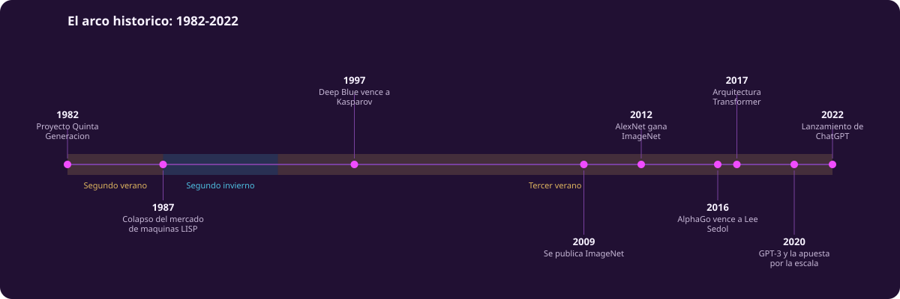
:::

## 1997 · Deep Blue

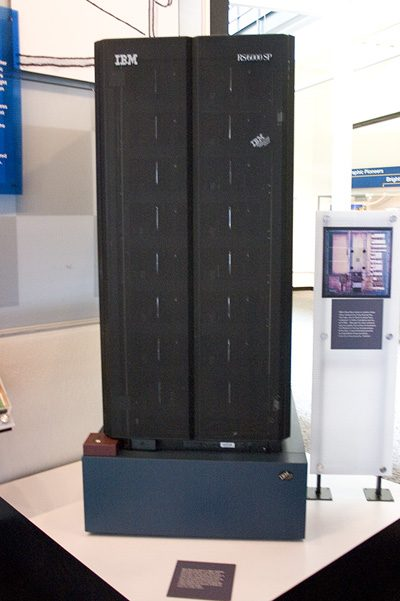

En 1997, Deep Blue, de IBM, vence a Garry Kasparov, campeón mundial vigente,
en un encuentro de seis partidas. Es una victoria real del linaje simbólico
—búsqueda en árbol con enorme capacidad de cómputo y evaluación afinada a
mano—, y también una demostración de sus límites: Deep Blue no aprendía
nada, no generalizaba a otro juego, y no entendía el ajedrez en ningún
sentido que se pareciera a como lo entiende un humano. Fue fuerza bruta con
puntería, no inteligencia general.

## 2009-2012 · ImageNet y AlexNet

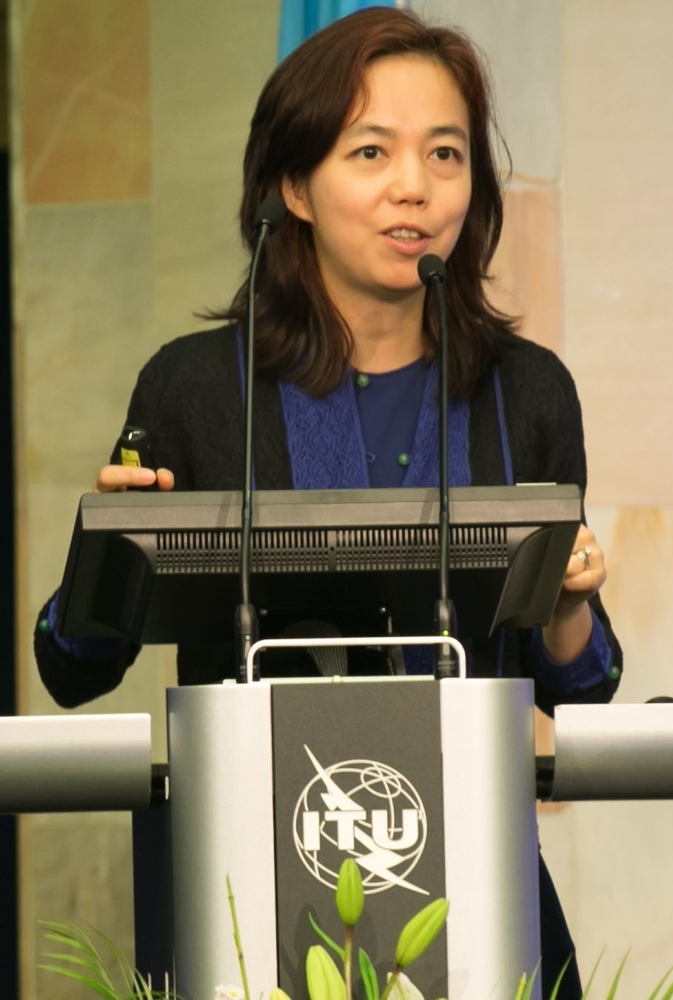

En 2009, Fei-Fei Li y su equipo presentan **ImageNet**: una base de datos de
millones de imágenes etiquetadas según la jerarquía de WordNet. No es un
algoritmo. Es un conjunto de datos, y esa distinción importa: durante los
tres años siguientes, ImageNet se convierte en la competencia de referencia
para clasificación de imágenes.

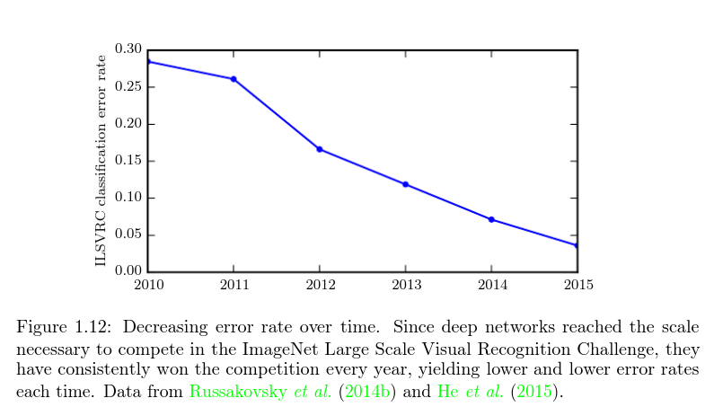

En 2012, **AlexNet**, una red convolucional profunda, gana esa competencia
por un margen que ninguna técnica anterior había logrado. La tesis vale la
pena subrayarla: no fue un algoritmo nuevo el que destrabó el momento —las
redes convolucionales y la retropropagación existían desde los ochenta—.
Fue un benchmark bien diseñado, con suficientes datos y suficiente cómputo
disponible, el que hizo visible lo que ya era posible. Los benchmarks no
solo miden el progreso del campo: lo dirigen.

## 2016 · AlphaGo y el movimiento 37

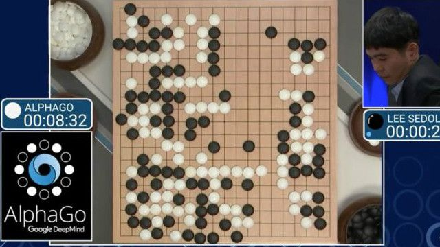

AlphaGo, de DeepMind, vence al campeón Lee Sedol cuatro partidas a una en
2016. Go tiene más posiciones posibles que átomos en el universo observable:
no se puede resolver por fuerza bruta, como el ajedrez. AlphaGo combina
redes neuronales profundas con búsqueda en árbol y aprendizaje por
refuerzo contra sí mismo —el linaje que arrancó con Samuel y las damas,
sesenta años antes—. En la segunda partida juega el **movimiento 37**, una
jugada que ningún jugador profesional habría considerado y que los
comentaristas describieron como "hermosa" y "no humana". Es el momento en
que el linaje de refuerzo entra, con fuerza, en el arco central de la
historia.

## 2017-2022 · Transformers y ChatGPT

En 2017, un equipo de Google publica "Attention Is All You Need", que
introduce la arquitectura **Transformer**: prescinde de la recurrencia y
procesa una secuencia completa en paralelo mediante mecanismos de
atención. Es la pieza que hacía falta para entrenar modelos de lenguaje a
una escala antes impráctica. Cinco años después, en **noviembre de 2022**,
OpenAI lanza ChatGPT al público general. No es el modelo más grande ni el
primero de su tipo: es el primero empaquetado como conversación accesible
para cualquiera. En cinco días supera el millón de usuarios.

Ahí se cierra el arco que cuenta esta página. Lo que ha pasado desde
entonces —y sigue pasando cada semestre— vive en [[estado-actual]].
