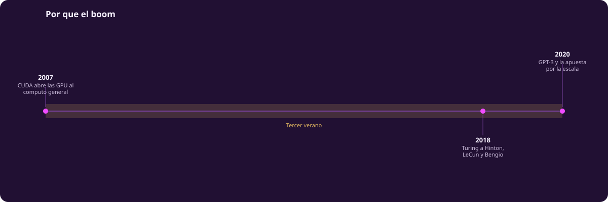
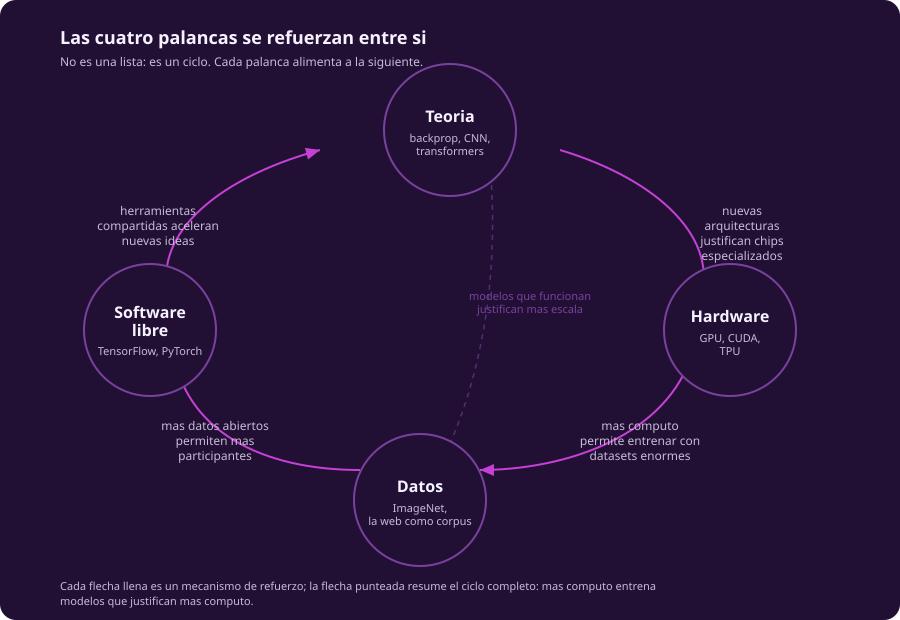
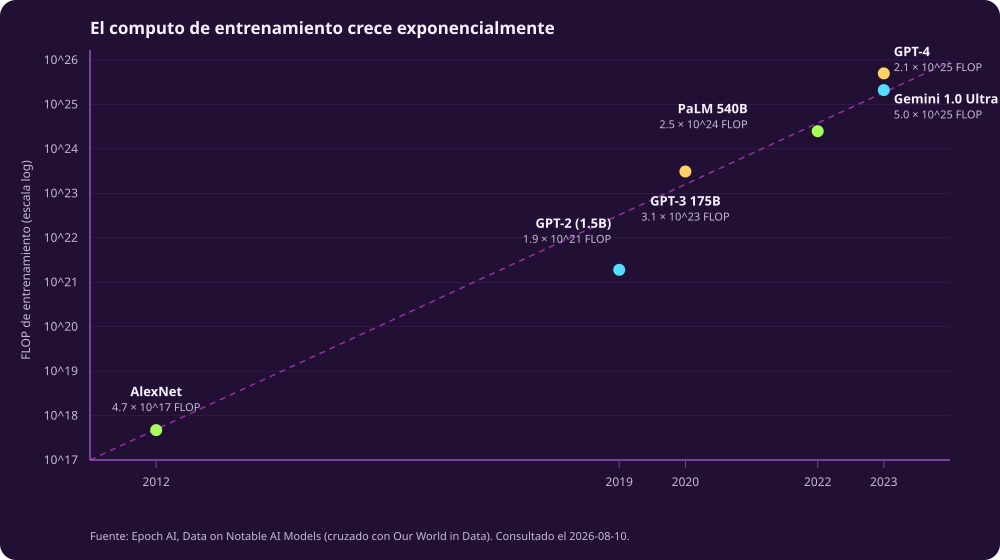

# Por qué el boom

[[arco-historico]] mostró que las ideas centrales de las redes neuronales —capas,
retropropagación, convoluciones— circulaban desde los años sesenta y ochenta. Esta
página responde a la pregunta que deja pendiente: si las ideas ya existían, ¿por
qué el boom llegó hasta la década de 2010, y no antes?

::: figure {#tiempo-boom title="Por qué el boom: de la retropropagación a la disputa por el crédito"}

:::

## La pregunta correcta

La pregunta mal hecha es «¿quién inventó la inteligencia artificial moderna?».
Esa pregunta busca un momento de inspiración y un nombre propio. La pregunta bien
hecha es distinta: ¿qué tuvo que dejar de faltar para que ideas de 1986 empezaran
a funcionar en 2012?

La respuesta no es una idea nueva. Yann LeCun ya aplicaba convoluciones y
retropropagación a dígitos escritos a mano en 1989. El problema no era
conceptual: entrenar una red con datos y cómputo suficientes para que la idea
se notara era, hasta cierto punto, sencillamente imposible. Faltaban tres cosas
a la vez —hardware, datos y una comunidad capaz de compartir código sin
reinventar la rueda en cada laboratorio— y la teoría necesitaba que las otras
tres existieran para poder probarse a escala. El boom no ocurrió porque alguien
tuvo una idea mejor. Ocurrió porque, alrededor de 2012, las cuatro condiciones
se cumplieron al mismo tiempo.

## Las cuatro palancas

::: figure {#palancas title="Un ciclo de refuerzo mutuo, no una lista de causas"}

:::

Es tentador enumerar las palancas como si fueran cuatro causas independientes.
No lo son: se alimentan entre sí, y ese refuerzo mutuo —no cualquiera de las
cuatro por separado— es lo que explica por qué el crecimiento fue exponencial y
no lineal.

**Teoría.** La retropropagación de Rumelhart, Hinton y Williams (1986) y las
redes convolucionales de LeCun (1989) llevaban entrenamiento incluido desde el
principio, pero no correlacionaba con nada útil hasta que hubo con qué entrenar.

**Hardware.** En 2007, NVIDIA liberó CUDA, una plataforma que permitía usar
tarjetas gráficas —diseñadas para videojuegos, no para ciencia— como
procesadores de propósito general. Una GPU hace miles de operaciones
aritméticas en paralelo, y entrenar una red neuronal es, en esencia, hacer
muchísimas operaciones aritméticas en paralelo. El acoplamiento fue casi
accidental y resultó decisivo.

**Datos.** Fei-Fei Li y su equipo publicaron ImageNet en 2009: catorce millones
de imágenes etiquetadas a mano, organizadas según una taxonomía. Antes de
ImageNet no había datos suficientes para que la diferencia entre arquitecturas
se notara; después, la visión por computadora tuvo una competencia con una vara
de medir común.

**Software libre.** TensorFlow (Google, 2015) y, poco después, PyTorch,
liberaron a cada laboratorio de reimplementar retropropagación desde cero. Un
estudiante de posgrado en 2016 podía tener en un fin de semana la
infraestructura que a un laboratorio de 1990 le habría tomado años construir.
Eso multiplicó el número de personas capaces de probar ideas.

Cada palanca vuelve a la primera: más cómputo permite entrenar modelos más
grandes; esos modelos, si funcionan, justifican comprar todavía más cómputo. Es
un ciclo que se autoalimenta, y entender eso importa más que memorizar las
cuatro palabras.

## Qué es un FLOP

Para hablar de la palanca del cómputo con precisión hace falta una unidad. Un
**FLOP** (*floating-point operation*) es una sola operación aritmética de punto
flotante: una suma o una multiplicación. Entrenar un modelo grande requiere
billones de ellas, así que la unidad útil casi siempre es una tasa —FLOP por
segundo, o FLOP/s— o un total acumulado a lo largo de todo el entrenamiento, que
es como se miden los puntos de la siguiente sección.

Aquí conviene una corrección. Es común escuchar que «un chip de IA hace un
ExaFLOP», y algún material de este mismo curso lo dijo así en una versión
anterior. Es impreciso. La cifra de 1 ExaFLOP/s —mil trillones de operaciones
por segundo— no describe a un chip individual: describe a un **pod** de TPU v4
de Google, un clúster interconectado y enfriado por líquido de 4 096 chips
trabajando en conjunto. Un solo chip rinde varios órdenes de magnitud menos. La
confusión no es inocente: minimiza cuánta infraestructura —edificios, redes
eléctricas, sistemas de enfriamiento— hace falta detrás de una cifra que suena a
logro de ingeniería de bolsillo.

## La curva del cómputo

::: figure {#computo title="El cómputo de entrenamiento crece exponencialmente"}

:::

La curva no es sutil. AlexNet, el modelo que ganó ImageNet en 2012 y que suele
marcarse como el inicio simbólico del boom, se entrenó con del orden de
4,7 × 10¹⁷ FLOP. GPT-3, ocho años después, usó del orden de 3,1 × 10²³ FLOP:
casi un millón de veces más. GPT-4, tres años después de GPT-3, usó del orden de
2,1 × 10²⁵ FLOP. Esa progresión —de cientos de miles de millones de operaciones a
decenas de septillones— no es una mejora incremental. Es un cambio de escala que
vuelve irreconocible el campo de una generación a la siguiente, y que exige
presupuestos que ya no caben en un laboratorio universitario.

## De la academia a la industria

Aquí reaparece el cuarto hilo de la unidad, quién paga y quién decide. Ahí
está el desplazamiento institucional. Backprop se publicó desde una
universidad; CUDA lo escribió una empresa de hardware para vender tarjetas
gráficas; ImageNet lo construyó un laboratorio académico con etiquetado manual
masivo; TensorFlow lo liberó Google; GPT-3 y GPT-4 los entrenaron OpenAI y
Microsoft con presupuestos que ninguna universidad puede igualar. La mezcla de
orígenes de las cuatro palancas —académico, industrial, académico, industrial—
se fue inclinando: hoy entrenar un modelo de frontera cuesta decenas o cientos
de millones de dólares en cómputo, y ese costo es, por sí mismo, un filtro. Ya
no decide la agenda de investigación quien tiene la mejor idea, sino quien puede
pagar para probarla a la escala en la que las ideas empiezan a notarse. Eso no
vuelve irrelevante a la academia, pero cambia qué preguntas puede hacerse sin
depender de financiamiento corporativo, y quién se sienta en la mesa cuando se
decide qué se entrena a continuación.

## Los «padrinos» y la disputa

En marzo de 2019, la ACM anunció que el Premio Turing 2018 —el reconocimiento
más prestigioso en ciencias de la computación— se otorgaba conjuntamente a
Geoffrey Hinton, Yann LeCun y Yoshua Bengio por los avances conceptuales y de
ingeniería que hicieron de las redes neuronales profundas un componente central
de la computación. La prensa los llamó, desde entonces, los «padrinos de la
inteligencia artificial».

En junio de 2020, Jürgen Schmidhuber —investigador que llevaba décadas
publicando sobre redes profundas, memoria de largo plazo y redes generativas
adversariales antes de que se llamaran así— publicó una crítica pública y
extensa a esa atribución. Su argumento no es que Hinton, LeCun y Bengio no
hayan hecho contribuciones reales, sino que sus artículos —incluidos los de
revisión, publicados años después, con oportunidad de corregir— omitieron citar
trabajo anterior que resolvía problemas equivalentes: el de Alexey Ivakhnenko,
que con Valentin Lapa publicó en 1965 el primer algoritmo de entrenamiento
funcional para perceptrones multicapa de profundidad arbitraria, con un ejemplo
de ocho capas ya en 1971; el de Kunihiko Fukushima, con las redes
convolucionales tempranas; el de Sepp Hochreiter, alumno de Schmidhuber, que
documentó el problema del gradiente que se desvanece en 1991.

Vale la pena leer esa disputa no como chisme académico, sino como una pregunta
abierta sobre cómo funciona el crédito científico: ¿a quién se le atribuye una
idea, a quien la formuló primero, a quien la hizo funcionar a escala, o a quien
convenció a una comunidad de que importaba? Ivakhnenko trabajaba en Kiev, en la
Unión Soviética, publicando en revistas que la comunidad occidental de
inteligencia artificial prácticamente no leía. Que su prioridad tardara décadas
en discutirse en inglés dice algo sobre qué idiomas e instituciones deciden qué
historia se cuenta primero. Este curso no va a zanjar esa pregunta aquí, pero
notarla —y no solo memorizar los nombres del podio— es parte de lo que significa
estudiar historia de la inteligencia artificial en vez de solo su mitología.
