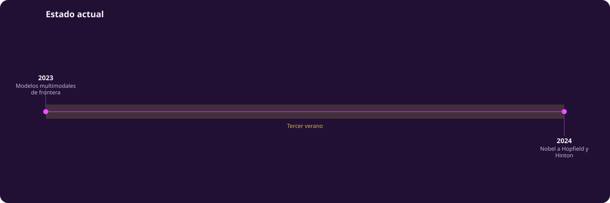

# Estado actual

> **Esta página tiene fecha de corte.** Se escribió en agosto de 2026 y cada
> afirmación se verificó con búsqueda web contra una fuente reputada —el
> registro completo está en `docs/verificacion/5_estado_actual.md`—, no de
> memoria. Todo lo demás en esta unidad es historia razonablemente estable:
> mitos, cibernética, inviernos, transformers. **Nada en las páginas
> anteriores depende de lo que digas aquí.** Si estás leyendo esto en un
> semestre posterior, la tabla de laboratorios ya está desactualizada y el
> ejercicio correcto es reemplazarla, no corregirla línea por línea.

::: figure {#tiempo-actual title="2023–2025: del modelo multimodal al modelo que piensa"}

:::

Tres años resumen el tramo más reciente: 2023 consolidó los modelos
multimodales de frontera; 2024 trajo el reconocimiento institucional de toda
una generación de investigación en redes neuronales; 2025 abrió una grieta
nueva, la de los pesos abiertos, con un modelo chino compitiendo de tú a tú
con los modelos cerrados de Silicon Valley.

## El regreso del aprendizaje por refuerzo

@tres-linajes, el diagrama de [[arco-historico|el arco histórico]], cerraba su banda azul
—control y refuerzo— con AlphaGo en 2016. Ese linaje no se detuvo ahí: en
2022–2025 volvió a tomar el centro del campo, aunque con un papel distinto al
de Samuel o AlphaGo.

**RLHF** (aprendizaje por refuerzo desde retroalimentación humana) no entrena
un agente para ganar un juego: entrena un modelo de lenguaje ya preentrenado
para que sus respuestas se parezcan a lo que prefieren evaluadores humanos.
El mecanismo, popularizado por InstructGPT en 2022, combina ajuste fino
supervisado, un modelo de recompensa entrenado con comparaciones humanas, y
una fase de refuerzo que optimiza el modelo de lenguaje contra esa
recompensa. Es, en sentido literal, la diferencia entre GPT-3 y ChatGPT: por
qué un modelo de lenguaje responde como asistente y no como autocompletado.

Desde septiembre de 2024, con el modelo o1 de OpenAI, el mismo linaje ganó
una segunda aplicación: los **modelos de razonamiento**. En vez de usar el
refuerzo solo para pulir el estilo, estos modelos lo usan para aprender a
producir una cadena de razonamiento larga —explorar, retroceder, verificar—
antes de dar la respuesta final. En enero de 2025, DeepSeek-R1 mostró algo
incómodo para la industria: es posible entrenar un modelo de razonamiento
competitivo usando el refuerzo como método principal, sin depender tanto del
ajuste fino supervisado, y publicar los pesos en abierto. Así se cierra el
linaje azul, por ahora: de la psicología animal de Thorndike a un mecanismo
que decide, token por token, cuánto «pensar» antes de contestar.

## El mapa de laboratorios

Esta tabla es la parte más volátil de toda la unidad. Actualízala primero.

| Laboratorio | País | Apuesta técnica | Pesos | Financiamiento (agosto 2026) |
|---|---|---|---|---|
| OpenAI | EE. UU. | Modelos generalistas de frontera y agentes | Cerrados | Valuación de 852 000 millones de dólares (ronda de 122 000 millones, marzo 2026) |
| Anthropic | EE. UU. | Razonamiento y código, seguridad como argumento comercial | Cerrados | Ingresos anualizados de ~47 000 millones de dólares (mayo 2026), desde 1000 millones en diciembre de 2024 |
| Google DeepMind | EE. UU. | Multimodalidad e integración con ciencia (Gemini, AlphaFold) | Cerrados | Interno de Alphabet; Gemini 3 (noviembre 2025), Gemini 3.6 Flash (julio 2026) |
| Meta Superintelligence Labs | EE. UU. | Giro hacia modelos propietarios (Muse Spark, abril 2026) tras años de Llama en abierto | Mixtos, cerrando | Interno de Meta; reorganización liderada por Alexandr Wang |
| xAI | EE. UU. | Integración con la red social X para datos en tiempo real | Cerrados | Fusionado con SpaceX (febrero 2026), valuación combinada de 1.25 billones |
| Mistral AI | Francia / UE | Infraestructura de cómputo soberana europea | Mixtos | 1700 millones de euros a valuación de 11 700 millones (septiembre 2025); ASML, principal accionista |
| DeepSeek | China | Eficiencia de entrenamiento, refuerzo como método primario | Abiertos | Respaldado por High-Flyer, fondo de cobertura chino |
| Moonshot (Kimi) y Alibaba (Qwen) | China | Escala multimodal (Kimi K3, 2.8 billones de parámetros) y ecosistema (Qwen) | Abiertos | Kimi K3 liberó pesos en julio de 2026; Qwen es interno de Alibaba |

La línea que separa esta tabla no es solo geográfica. Es también una apuesta
de negocio: los laboratorios que cobran acceso por API defienden los pesos
cerrados; los que compiten por adopción y ecosistema —o que no pueden ganar
la carrera de cómputo bruto— compiten liberando pesos.

## Reconocimiento institucional

2024 fue, para el aprendizaje máquina, un año de premios que no se esperaban
en esa forma. El Nobel de Física se otorgó a John Hopfield y Geoffrey Hinton
«por descubrimientos e invenciones fundacionales que permiten el aprendizaje
máquina con redes neuronales artificiales»: la red de Hopfield como memoria
asociativa, la máquina de Boltzmann de Hinton como método para que una red
aprenda regularidades por sí sola. El Nobel de Química se dividió entre David
Baker, por el diseño computacional de proteínas, y Demis Hassabis y John
Jumper, por AlphaFold. El Premio Turing —anunciado en marzo de 2025, porque
la ACM lo entrega meses después del año que nombra— fue para Andrew Barto y
Richard Sutton, por los fundamentos del aprendizaje por refuerzo: el mismo
linaje que cierra la sección anterior.

Que un premio de física se otorgue por una técnica de aprendizaje máquina no
es un accidente de comité: es una señal de que estas herramientas —tomadas de
la física estadística, aplicadas a redes de unidades que se activan o no—
pertenecen a esa disciplina tanto como a la computación. Es también la
culminación de un argumento que viene desde [[que-es-inteligencia|Qué es la inteligencia]]: los
linajes que hoy dominan el campo no nacieron en departamentos de ciencias de
la computación, sino en la intersección de la física, la psicología animal y
la lógica.

## Lo que sigue sin resolverse

Tres tensiones sin resolver, a agosto de 2026:

**Evaluación.** Los benchmarks estándar se contaminan: preguntas de examen
terminan filtradas en los datos de entrenamiento de modelos posteriores, y un
modelo puede parecer mejor por haber memorizado el examen, no por razonar
mejor. El reporte técnico de LLaMA-2 encontró que más del 16 % de las
muestras del benchmark MMLU estaban contaminadas así. La comunidad llama a
esto una «crisis de evaluación»: no hay consenso sobre cómo medir capacidades
que cambian más rápido de lo que se pueden diseñar exámenes limpios.

**Costo.** Entrenar y servir estos modelos requiere cómputo concentrado en
centros de datos con demandas de energía cada vez mayores; varias regiones ya
reportan tensión en su red eléctrica por esa concentración. El costo no es
solo económico: es también una barrera de entrada que separa a quien puede
entrenar un modelo de frontera de quien no.

**Concentración.** Un puñado de laboratorios —casi todos en la tabla de
arriba— capturan la mayor parte de la inversión, el talento y la atención del
campo. La discusión sobre pesos abiertos frente a cerrados es, en el fondo,
una discusión sobre esa concentración: si el acceso a modelos capaces debe
pasar por una API que cobra, o si debe poder descargarse y ejecutarse fuera
del control de quien lo entrenó. En julio de 2026, veinticinco empresas
—Nvidia, Microsoft, Meta, IBM y Palantir entre ellas— pidieron por carta a
Estados Unidos no restringir los pesos abiertos, argumentando que
restringirlos solo cedería terreno a los laboratorios chinos que ya compiten
ahí. Es una discusión sin resolver, no una que ya se ganó de un lado.

## Cómo se mide hoy la inteligencia

[[que-es-inteligencia|Qué es la inteligencia]] abrió esta unidad con uno de sus hilos: esencia
contra comportamiento. Turing, en 1950, propuso una salida pragmática a esa
pregunta con @juego-imitacion: no preguntar qué es pensar, sino si el
comportamiento de una máquina es indistinguible del de una persona en una
conversación por texto.

En 2026, esa prueba ya no funciona como instrumento de medición. No porque la
pregunta de Turing esté resuelta, sino porque conversar de forma fluida dejó
de ser el cuello de botella: hoy es la parte fácil. Lo que reemplazó al test
de Turing son benchmarks de razonamiento, programación y conocimiento
experto, con el problema de contaminación descrito arriba: si las preguntas
se filtran a los datos de entrenamiento, pasar el examen deja de ser
evidencia de la capacidad que quería medir. La industria responde con
benchmarks que se renuevan sin parar para esquivar la contaminación, lo cual
es en sí una admisión: ningún examen fijo sobrevive mucho tiempo.

Esto no cierra el problema que planteó Turing: lo reabre en otro nivel. Un
sistema puede pasar cualquier examen de comportamiento y seguir sin resolver
la pregunta de fondo de @taxonomia-ia, en [[que-es-inteligencia|Qué es la inteligencia]]: que un
modelo de lenguaje sea una rama, dentro de una rama, dentro de una rama del
aprendizaje máquina no lo vuelve sinónimo de inteligencia artificial, y pasar
una prueba de comportamiento no dice nada, por sí solo, sobre qué ocurre —si
es que ocurre algo comparable a entender— del otro lado del examen. Ese es,
en agosto de 2026, el mismo lugar en el que Turing dejó la pregunta en 1950:
sin resolver, pero con una manera cada vez más precisa de fallar en medirla.
