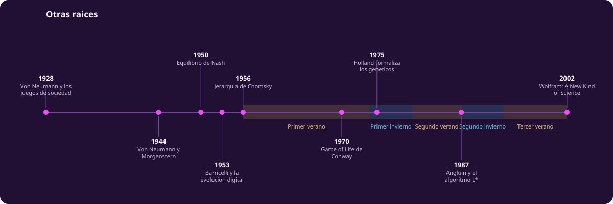
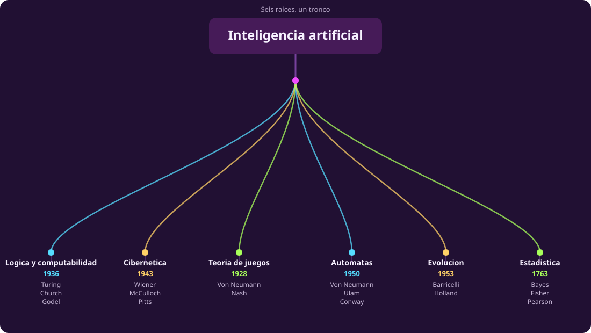
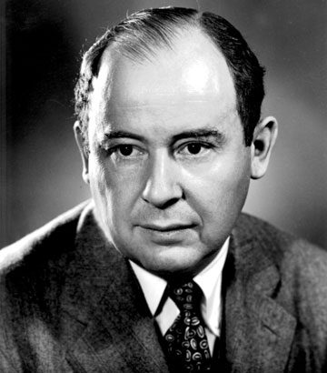
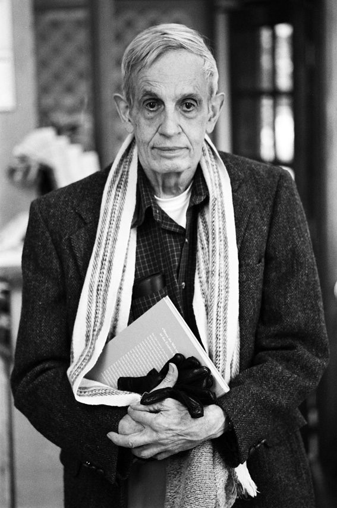
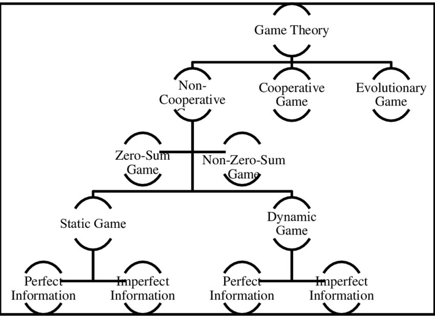
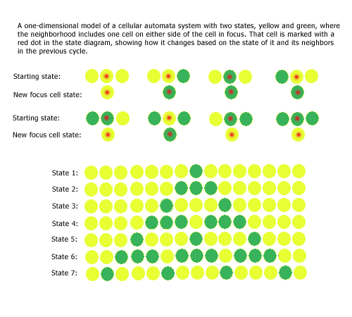
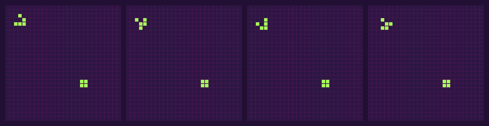
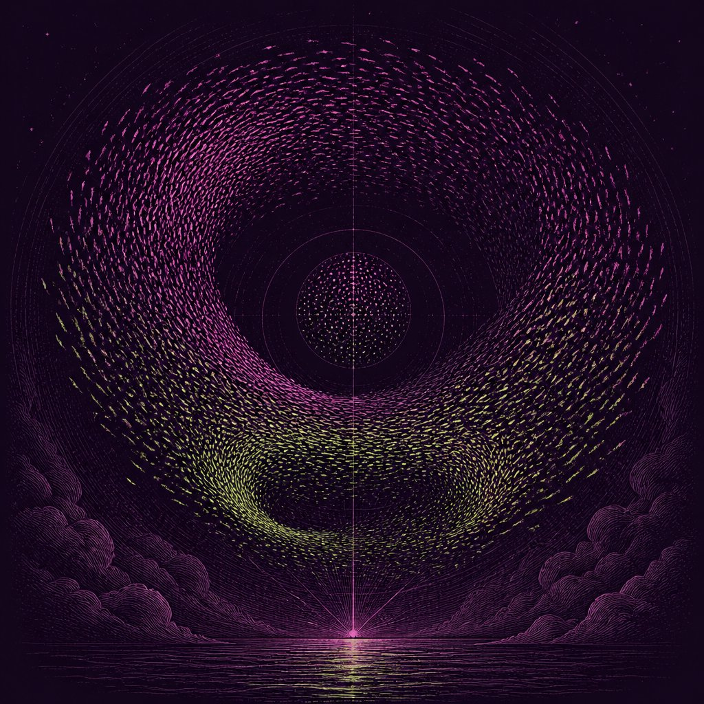

# Otras raíces

::: figure {#tiempo-raices title="Línea del tiempo: otras raíces"}

:::

Si esta unidad terminara en la página anterior, sería razonable salir de ella
pensando que la inteligencia artificial es, en esencia, aprendizaje máquina a
gran escala. Esa impresión es el error más extendido entre quienes entran al
campo en 2026, y esta página existe para corregirlo antes de que se instale.

## Un campo más ancho que su rama de moda

En [[que-es-inteligencia]] se presentó @taxonomia-ia: dentro del rectángulo
grande de la inteligencia artificial hay cinco cajas hermanas —búsqueda y
planificación, lógica y GOFAI, teoría de juegos, sistemas expertos y
aprendizaje máquina— y solo la última se subdivide en redes neuronales
profundas, transformers y modelos de lenguaje. La nota al pie de esa figura
era deliberada: los LLM son una rama de una rama de una rama.

Esta página recorre el resto del árbol. La teoría de juegos, los autómatas, los
algoritmos genéticos y el estudio del comportamiento emergente no son
antecedentes que el aprendizaje máquina dejó atrás: son programas de
investigación propios, con sus propias preguntas, que siguen activos. Ninguno
necesita una red neuronal para funcionar, y varios son más viejos que la
propia disciplina que hoy llamamos inteligencia artificial.

::: figure {#arbol-raices title="Seis raíces de la inteligencia artificial"}

:::

Seis raíces alimentan el tronco: la lógica y la computabilidad de Turing y
Church, la cibernética de Wiener, la teoría de juegos de von Neumann y Nash,
los autómatas de von Neumann y Conway, la evolución digital de Barricelli y
Holland, y la estadística que va de Bayes a Fisher y Pearson. El aprendizaje
máquina bebe de varias de ellas, pero no las agota: cada una siguió su propio
curso, con sus propias comunidades, y varias siguen produciendo resultados
que el aprendizaje máquina no reemplaza.

## Teoría de juegos

::: figure {#retrato-von-neumann title="John von Neumann"}

:::

John von Neumann publicó «Zur Theorie der Gesellschaftsspiele» («Sobre la
teoría de los juegos de sociedad») en 1928, en la revista *Mathematische
Annalen*. Ahí demostró el teorema minimax para juegos de suma cero entre dos
personas: existe una estrategia que garantiza a cada jugador el mejor
resultado posible asumiendo que el rival juega para minimizarlo. Vale la pena
decirlo con precisión porque el material heredado de este curso lo confundía:
ese artículo **no fue la tesis doctoral** de von Neumann. Su doctorado, obtenido
en Budapest en 1926, fue sobre la axiomatización de la teoría de conjuntos —un
tema de lógica matemática, no de juegos.

Von Neumann volvió al tema dieciséis años después: con el economista Oskar
Morgenstern publicó en 1944 *Theory of Games and Economic Behavior*, el libro
que convirtió la teoría de juegos en una disciplina, con aplicaciones en
economía, biología y estrategia militar.

::: figure {#retrato-nash title="John Nash"}

:::

La generalización decisiva llegó en 1950, cuando John Nash —entonces
estudiante de posgrado— publicó «Equilibrium Points in N-Person Games», un
artículo de una sola página en las *Proceedings of the National Academy of
Sciences*. Nash extendió el análisis a juegos no cooperativos de cualquier
número de jugadores y demostró que siempre existe al menos un equilibrio: una
combinación de estrategias en la que ningún jugador gana nada cambiando de
estrategia mientras los demás mantienen la suya. Ese concepto —el equilibrio
de Nash— sigue siendo la herramienta central del diseño de subastas y de la
teoría de juegos algorítmica que usan hoy los sistemas multiagente.

El caso más citado para introducir la teoría de juegos es el dilema del
prisionero. Dos sospechosos, interrogados por separado, deciden si colaborar
entre sí (callar) o traicionar al otro (delatar). La matriz de pagos, en años
de prisión, es esta:

| | B calla | B delata |
|---|---|---|
| **A calla** | A: 1 año · B: 1 año | A: 3 años · B: libre |
| **A delata** | A: libre · B: 3 años | A: 2 años · B: 2 años |

Delatar domina individualmente —da un resultado igual o mejor sin importar lo
que haga el otro—, pero si ambos delatan, ambos terminan peor que si hubieran
cooperado. Ese desajuste entre el óptimo individual y el óptimo conjunto
reaparece en economía, biología evolutiva y política de armamento cada vez que
hace falta modelar por qué la cooperación es difícil de sostener. El diagrama
heredado del material original del curso resume el vocabulario que usa el
campo para clasificar variantes de este mismo problema: juegos cooperativos o
no, de suma cero o no, estáticos o dinámicos, de información perfecta o
imperfecta.

::: figure {#legacy-taxonomia-juegos title="Taxonomía de la teoría de juegos"}

:::

## Autómatas y computación

Alan Turing describió en 1936, en «On Computable Numbers», una máquina
abstracta —cinta, cabezal y una tabla finita de reglas— capaz de ejecutar
cualquier procedimiento que pueda especificarse con precisión. Es el modelo
formal sobre el que descansa toda la teoría de la computación, incluida la
pregunta de qué problemas son irresolubles para cualquier computadora, sin
importar cuánta potencia tenga.

Von Neumann volvió a este terreno más tarde, y aquí el material heredado del
curso también fechaba mal los hechos: no en 1943, sino de manera gradual entre
finales de los cuarenta y 1953. En conferencias de 1948 y 1949 planteó, como
experimento mental, un autómata cinemático capaz de construir una copia de sí
mismo a partir de un depósito de piezas sueltas. Fue Stanislaw Ulam quien,
alrededor de 1951, sugirió formalizarlo como una retícula de celdas —lo que
hoy se llama un autómata celular—, donde cada celda cambia de estado según el
estado de sus vecinas. Von Neumann trabajó el modelo entre 1952 y 1953 y lo
presentó en Princeton sin terminarlo; Arthur Burks lo editó y publicó tras su
muerte, en 1966. El diagrama heredado de un autómata celular unidimensional
—una fila de celdas que evoluciona en el tiempo según reglas locales— ilustra
el mismo principio en su versión más simple.

::: figure {#legacy-automata-1d title="Autómata celular unidimensional"}

:::

El ejemplo más conocido de autómata celular es posterior y bidimensional: el
Juego de la Vida, que el matemático John Conway ideó y que se dio a conocer en
octubre de 1970, en la columna «Mathematical Games» de Martin Gardner en
*Scientific American*. Las reglas son mínimas —una celda viva sobrevive con
dos o tres vecinas vivas, una celda muerta nace con exactamente tres— y aun
así producen estructuras estables, osciladores y patrones que se desplazan
indefinidamente por la rejilla sin que nadie los controle desde fuera.

::: figure {#game-of-life title="Cuatro generaciones del Juego de la Vida"}

:::

En la figura, la nave planeadora —el grupo de cinco celdas de la esquina
superior— se desplaza en diagonal de un cuadro al siguiente mientras cicla
por sus cuatro orientaciones; el bloque de cuatro celdas de abajo no cambia en
ningún cuadro, porque ya satisface la regla de supervivencia y no tiene
vecinas de más. Ese contraste —algo que viaja, algo que se queda quieto,
ambos gobernados por la misma regla local— es el punto del ejemplo.

Décadas después, el físico Stephen Wolfram retomó los autómatas celulares como
objeto de estudio sistemático. Aquí también hay que corregir al material
heredado, que situaba esta investigación alrededor de 1960 —una fecha que en
realidad pertenece a von Neumann y Ulam, y que además es imposible por una
razón más simple: Wolfram nació en 1959. Wolfram empezó a publicar sobre el
tema en 1983, clasificando los autómatas celulares según su comportamiento a
largo plazo, y esa investigación culminó hasta 2002 con *A New Kind of
Science*, donde propone que sistemas computacionales simples —no solo
ecuaciones diferenciales— son el lenguaje natural para modelar la complejidad
física.

Otra rama de esta raíz mira las cosas al revés: en vez de simular un autómata
desde reglas conocidas, ¿se puede *aprender* el autómata a partir de
observarlo? En 1956 Noam Chomsky publicó «Three Models for the Description of
Language», con una jerarquía de gramáticas —regulares, libres de contexto,
sensibles al contexto y sin restricción— que sigue siendo el mapa de
referencia de los lenguajes formales. Tres décadas más tarde, en 1987, Dana
Angluin publicó el algoritmo L*, que aprende un autómata de estados finitos
desconocido haciendo preguntas de pertenencia y de equivalencia a un
«maestro»: aprendizaje por consulta activa, no solo por observación pasiva.

## Algoritmos genéticos

La idea de programar por selección en vez de por reglas explícitas tiene un
origen sorprendentemente temprano. A partir de 1953, el matemático
ítalo-noruego Nils Aall Barricelli obtuvo acceso —como investigador sin
sueldo— a la computadora que von Neumann había construido en el Institute for
Advanced Study de Princeton. Ahí sembró un universo digital con números
generados al azar y dejó que poblaciones de organismos numéricos se
reprodujeran, mutaran y compitieran por espacio, sin haberlas programado
explícitamente. Observó la aparición espontánea de especiación, parasitismo y
simbiosis: evolución darwiniana ocurriendo dentro de una máquina.

El campo se formalizó dos décadas después. En 1975, John Holland publicó
*Adaptation in Natural and Artificial Systems*, el libro que dio a los
algoritmos genéticos su base teórica: una población de soluciones candidatas
representadas como cadenas, sometidas a selección, cruza y mutación
generación tras generación, optimizando sin que nadie le diga al sistema
*cómo* resolver el problema, solo qué tan bien lo resuelve cada candidato. Es
una familia distinta del aprendizaje supervisado: no hay gradiente ni
etiquetas, solo una función de aptitud y variación aleatoria filtrada por
selección.

## Comportamiento emergente

::: figure {#emergencia title="Comportamiento emergente"}

:::

*(Esta imagen es una ilustración generada, no una fotografía ni un dato real.)*

El hilo que conecta la teoría de juegos, los autómatas y los algoritmos
genéticos no depende de ninguno en particular: reglas locales simples,
aplicadas muchas veces por muchos agentes sin coordinación central, producen
orden global que ninguna regla describe por sí sola. La nave planeadora del
Juego de la Vida no está escrita en ninguna parte del código; emerge de
aplicar la misma regla de vecindad a cada celda, cuadro tras cuadro. Una
bandada de aves no tiene un líder que calcule la formación; cada ave ajusta su
distancia a las vecinas más próximas. Una población de Barricelli no fue
programada para producir parasitismo; apareció porque la selección lo
permitía.

Esa es la razón de fondo para que esta página exista en una unidad sobre
inteligencia artificial: la pregunta de cómo surge comportamiento coordinado a
partir de reglas locales sin control central es más vieja que las redes
neuronales y sigue sin resolverse del todo. El aprendizaje máquina es una
respuesta posible. No es la única, y tampoco fue la primera.
