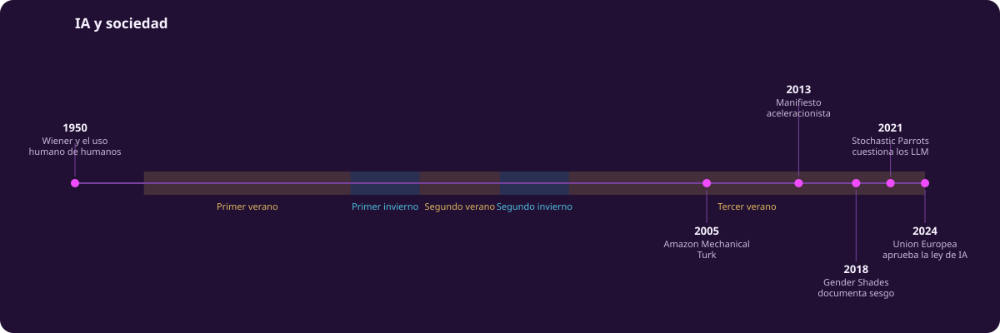
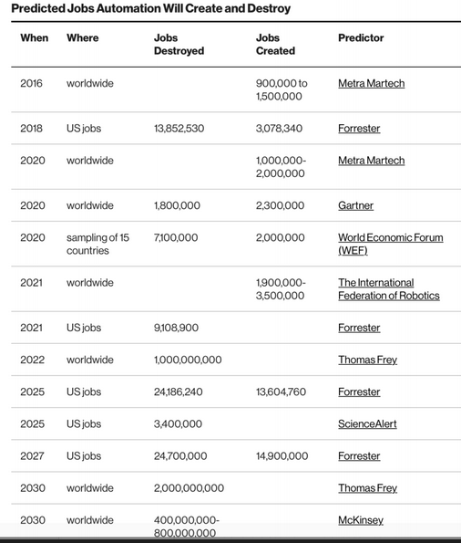
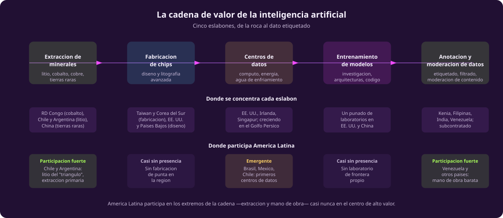
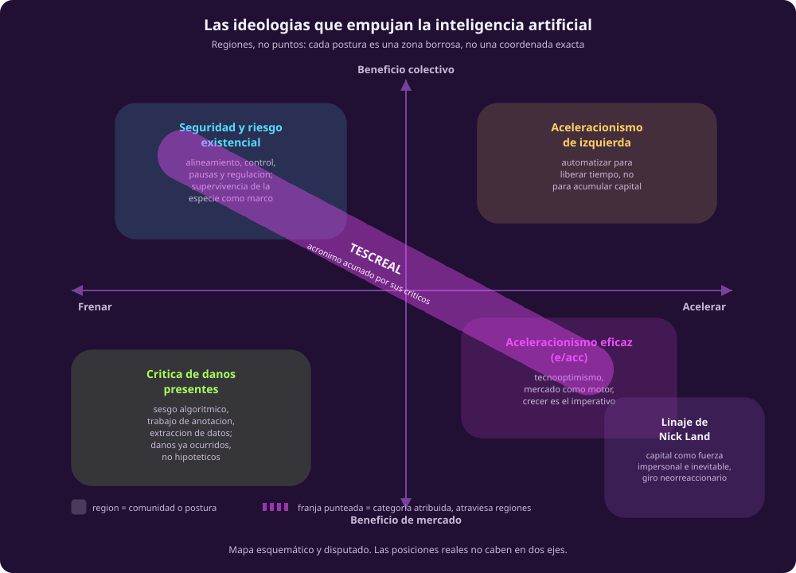

# IA y sociedad

::: figure {#tiempo-sociedad title="Línea del tiempo: IA y sociedad"}

:::

Todo lo anterior en esta unidad cuenta una historia de ideas: mitos, arquitecturas, algoritmos, la alternancia de veranos e inviernos. Esta página cuenta la otra mitad: quién trabaja para que la inteligencia artificial funcione, quién se beneficia, quién carga el costo, y qué visiones del futuro compiten por decidir hacia dónde va el campo. Ninguna de esas preguntas tiene una respuesta limpia. Esa incomodidad es el punto.

## La primera vez que delegamos trabajo mental

::: figure {#trabajo-mental title="Delegar trabajo mental"}

:::

*(Esta imagen es una ilustración generada, no una fotografía ni un dato real.)*

La automatización mecánica sustituyó músculo: el telar, el tractor, la línea de ensamblaje. La automatización con inteligencia artificial promete sustituir algo distinto —clasificar, resumir, decidir, redactar—, y esa promesa no es nueva. Norbert Wiener la planteó ya en 1950, en *The Human Use of Human Beings*: automatizar el pensamiento podía desplazar empleo intelectual igual que la mecánica había desplazado empleo manual. Setenta años después seguimos haciendo la misma pregunta con otro vocabulario, y respondiéndola con la misma incertidumbre. La tabla siguiente recoge estimaciones publicadas entre 2016 y 2030, de fuentes y metodologías distintas, sobre empleos destruidos y creados por la automatización:

::: figure {#prediccion-empleos title="Predicciones dispersas sobre empleos y automatización"}

:::

Las cifras van de un millón de empleos destruidos a ochocientos millones, según a quién se le pregunte. Esa dispersión no es ruido que mejores datos vayan a resolver: "cuántos empleos destruirá la IA" no tiene una sola respuesta esperando a ser calculada, sino que depende de supuestos sobre adopción, regulación y qué tan rápido las empresas sustituyen personas en vez de darles herramientas. Es real que el trabajo cambia, y es real que casi ninguna predicción puntual sobre cuánto y cuándo se sostiene diez años después.

## Quién construye realmente los modelos

::: figure {#turco-hoy title="El Turco Mecánico, otra vez"}

:::

En [[imaginar-la-maquina]] esta unidad contó la historia del Turco Mecánico: el autómata ajedrecista que Wolfgang von Kempelen presentó en 1770, que en realidad escondía a una persona moviendo las piezas desde dentro del gabinete. Esa página cerraba señalando que Amazon nombró *Mechanical Turk* a su plataforma de trabajo humano bajo demanda a propósito: detrás de una interfaz que aparenta automatización, hay personas.

Esta es esa persona, hecha trabajo real y documentado. Los modelos de lenguaje no aprenden a distinguir contenido aceptable de contenido dañino por sí solos: alguien etiqueta millones de ejemplos —discurso de odio, violencia, abuso sexual— para que el producto final llegue "limpio". Ese trabajo está mayormente subcontratado a países de renta baja: trabajadores en Kenia han etiquetado contenido extremo para OpenAI y Meta, vía la firma Sama, por menos de dos dólares la hora, frente a veintiuno a veintisiete dólares de un moderador equivalente en Estados Unidos. En Filipinas, parte de ese trabajo se paga por debajo del salario mínimo local, y el costo psicológico de la exposición sostenida a contenido extremo rara vez recibe el acompañamiento clínico de las contrapartes mejor pagadas.

Aquí se cierra el círculo. En 1770 el fraude era ocultar que había una persona operando la máquina. Hoy no hay fraude técnico —nadie niega que existan anotadores humanos—, pero sí una ocultación distinta: la interfaz pulida no muestra el trabajo humano mal pagado que hizo falta para entrenar el modelo y mantenerlo seguro. El gabinete cambió; el operador escondido, en cierto sentido, sigue ahí.

## La cadena de valor y dónde estamos

::: figure {#cadena-valor title="La cadena de valor de la inteligencia artificial"}

:::

Ampliar la cámara ayuda a ver el patrón completo. La inteligencia artificial llega a un centro de datos por una cadena de cinco eslabones: litio, cobalto y tierras raras extraídos de minas concentradas en pocos países; chips diseñados y fabricados por un oligopolio todavía más concentrado —Taiwán y Corea del Sur en manufactura de punta, Estados Unidos y Países Bajos en diseño—; centros de datos que consumen electricidad y agua a una escala que ya choca con la infraestructura local donde se instalan; entrenamiento, concentrado en un puñado de laboratorios; y, otra vez, anotación y moderación de datos, subcontratada donde la mano de obra es más barata.

América Latina participa en los dos extremos de esa cadena y casi nunca en el centro. Chile y Argentina extraen litio del "triángulo" que comparten con Bolivia; Venezuela y otros países aportan mano de obra de anotación. En el medio —diseño de chips, fabricación de punta, entrenamiento de frontera— la presencia de la región es casi nula, con excepciones incipientes como los primeros centros de datos en Brasil, México y Chile.

Vale la pena decir por qué esa posición es estructural, no un simple atraso que se corrige con voluntad. Copiar código es fácil: un modelo abierto, un paper, un repositorio, se replican con una conexión a internet y alguien que sepa leerlo. Sostener una fábrica de semiconductores de punta o un centro de datos a escala de laboratorio de frontera no es fácil de la misma manera: exige capital que se mide en decenas de miles de millones de dólares, cadenas de suministro de décadas, energía firme y barata, y estabilidad regulatoria sostenida por años. Esa asimetría —barreras bajas para consumir o adaptar modelos, altísimas para producir la infraestructura que los hace posibles— es la diferencia real entre participar en la conversación sobre inteligencia artificial y participar en su cadena de valor. Confundirlas produce un optimismo que la infraestructura no respalda.

## Daños documentados

::: figure {#despido-gebru title="Timnit Gebru y su salida de Google"}

:::

Quedarse en lo abstracto —"la IA puede tener sesgos"— es fácil de asentir y fácil de olvidar. El registro concreto es más útil. En 2018, Joy Buolamwini y Timnit Gebru publicaron *Gender Shades*, una evaluación de tres sistemas comerciales de clasificación de género por rostro. El resultado: hasta 34.7% de error en mujeres de piel oscura, contra un máximo de 0.8% en hombres de piel clara. La causa no era misteriosa: los conjuntos de datos con los que se habían entrenado esos sistemas eran, de manera abrumadora, rostros de piel clara. El estudio no midió un sesgo hipotético; midió uno ya desplegado en productos comerciales en uso.

Tres años después, Gebru —para entonces codirectora del equipo de IA ética de Google— fue coautora de "On the Dangers of Stochastic Parrots", sobre el costo ambiental del entrenamiento y los sesgos que los modelos de lenguaje heredan de sus datos. Google le pidió retirar el artículo o quitar los nombres de sus autores empleados; Gebru se negó y fue despedida en diciembre de 2020, en un episodio ampliamente cubierto por la prensa. El caso importa no como anécdota sobre una persona, sino como patrón: documentar daños de sistemas ya desplegados tiene, para quien lo hace desde dentro de la industria, un costo profesional real.

A esa misma familia pertenece COMPAS, el sistema usado en Florida para puntuar el riesgo de reincidencia de personas acusadas. En 2016, ProPublica encontró que, entre quienes no reincidieron, 45% de las personas afroamericanas habían sido marcadas como "alto riesgo", contra 24% de las blancas —casi el doble de falsos positivos—, mientras la empresa detrás del sistema defendía su diseño como neutral. El patrón es el mismo en los tres casos: entrenar con datos que reflejan desigualdades existentes produce sistemas que las reproducen, y esa reproducción rara vez es visible hasta que alguien la mide y la publica.

## Las ideologías que empujan

::: figure {#mapa-ideologico title="Mapa de las ideologías que empujan la inteligencia artificial"}

:::

Nadie desarrolla inteligencia artificial en un vacío de valores. Distintas comunidades tienen visiones explícitas —y en conflicto— sobre qué tan rápido debería avanzar el campo y a quién debería beneficiar. Esta sección describe posiciones y dice dónde se enuncian; no las juzga ni las adjudica, y el mapa está marcado como esquemático porque las posiciones reales no caben ordenadas en dos ejes limpios.

El **aceleracionismo de izquierda** tiene un origen textual preciso: el "Manifiesto Aceleracionista" que Alex Williams y Nick Srnicek publicaron en 2013, que reclama la tecnología y la automatización como herramientas para liberar tiempo humano del trabajo asalariado, no para acumular capital. Es autodescripción: los autores firman el manifiesto con ese nombre.

El **linaje de Nick Land** ocupa el extremo opuesto en el eje de beneficio. Land —descrito por comentaristas como "el padre del aceleracionismo"— empezó como marxista deleuziano en el Cybernetic Culture Research Unit de Warwick en los noventa y derivó, desde inicios de los 2000, hacia posiciones neorreaccionarias que tratan al capital como una fuerza impersonal e inevitable, mejor acelerada que dirigida. Land sí se identifica con el aceleracionismo; la etiqueta "de derecha" que lo distingue de Srnicek y Williams es, en buena medida, categorización de quienes escriben sobre el campo, no un nombre que Land haya reclamado para sí.

El **aceleracionismo eficaz**, o e/acc, es más reciente y más autodescrito: nació en mayo de 2022 como cuenta pseudónima (@BasedBeffJezos) y se hizo público en diciembre de 2023, cuando Forbes reveló que la persona detrás era Guillaume Verdon, físico e investigador en computación cuántica. Verdon aceptó el rol de fundador públicamente —incluida una entrevista donde se le presenta como "creador" del movimiento— y hoy figuras de peso en Silicon Valley usan la etiqueta abiertamente en sus perfiles. Su idea central: el mercado y el crecimiento tecnológico sin freno son, en sí mismos, el mecanismo correcto para el progreso humano.

Frente a esas tres corrientes que discuten *qué tan rápido*, hay otras dos que discuten *qué tan seguro* y *qué tan justo ya*. La **seguridad y riesgo existencial** teme perder el control sobre sistemas cada vez más capaces, y favorece pausas, alineamiento técnico y regulación. La **crítica de daños presentes** —a la que pertenecen *Gender Shades* y *Stochastic Parrots*, ya vistos aquí— desconfía de encuadrar el riesgo como algo mayormente futuro, cuando el sesgo algorítmico, la explotación laboral en la cadena de anotación y la concentración de poder ya están ocurriendo.

Un término más merece precisión, porque es fácil malinterpretarlo como autodescripción: **TESCREAL**. Es un acrónimo —Transhumanismo, Extropianismo, Singularitarismo, Cosmismo moderno, Racionalismo, Altruismo Eficaz y Longtermismo— que Timnit Gebru y el filósofo Émile P. Torres propusieron en 2023 y formalizaron en un artículo de 2024, para nombrar y criticar un conjunto de ideologías que ven interrelacionadas en el entorno tecnológico de Silicon Valley, con una genealogía que ligan a corrientes eugenésicas del siglo XX. Ninguna de las personas o comunidades agrupadas bajo TESCREAL usa el término para describirse; varias lo rechazan explícitamente. Por eso el mapa lo dibuja distinto a las demás regiones: no como zona propia, sino como franja punteada que atraviesa varias —principalmente seguridad y riesgo existencial, y aceleracionismo eficaz—, con la nota de que es categoría atribuida por sus críticos, no adoptada por quienes quedan dentro de ella.

## La ficción como herramienta de pensamiento

Antes de que existiera vocabulario técnico para hablar de estos problemas, la ciencia ficción ya los pensaba con otras herramientas. Isaac Asimov introdujo la **psicohistoria** en la trilogía *Fundación* (1951-1953): una rama matemática ficticia capaz de predecir el comportamiento agregado de poblaciones enormes, aunque no el de ningún individuo. Es una fantasía sobre lo que hoy llamaríamos modelado predictivo a escala civilizatoria, consciente de su propio límite: la trama entera gira en torno a lo que la psicohistoria no puede anticipar, un individuo suficientemente anómalo para romper el promedio.

Frank Herbert tomó el camino contrario en *Dune*: en vez de una predicción perfecta, imaginó una prohibición total. Diez mil años antes de la novela, la Jihad Butleriana destruye computadoras, robots conscientes y "máquinas pensantes", y deja un mandamiento que gobierna la civilización posterior: "No harás una máquina a semejanza de una mente humana". La consecuencia no es un mundo sin cómputo complejo, sino uno que reinvierte esa capacidad en entrenamiento humano extremo —los Mentat, adiestrados para calcular como calculaba una máquina—. Dune es una fábula sobre qué le pasa a una civilización que decide, tras una crisis, que ciertas formas de delegar el pensamiento son inaceptables sin importar el costo de no delegarlas.

Ninguna de las dos ficciones predijo el presente con precisión. Las dos siguen siendo útiles porque plantean, mejor que un ensayo técnico, la pregunta que atraviesa esta página: qué se gana y qué se pierde cuando una sociedad decide cuánto del pensamiento delega, y a quién.

## Conciencia

::: figure {#conciencia title="La pregunta de la conciencia"}

:::

*(Esta imagen es una ilustración generada, no una fotografía ni un dato real.)*

Esta página no va a cerrar con una respuesta sobre si algún sistema de inteligencia artificial es, o podría llegar a ser, consciente. No porque el tema sea menor, sino porque no hay consenso científico ni filosófico sobre qué contaría como evidencia suficiente, y cualquier afirmación categórica —en cualquier dirección— dice más sobre las convicciones de quien la hace que sobre el estado del conocimiento. La pregunta no es nueva —Turing la esquivó deliberadamente en 1950, proponiendo una prueba de comportamiento en vez de una prueba de experiencia interna— y seguirá abierta después de esta unidad. Vale más terminar reconociendo la pregunta que fingiendo haberla resuelto.
