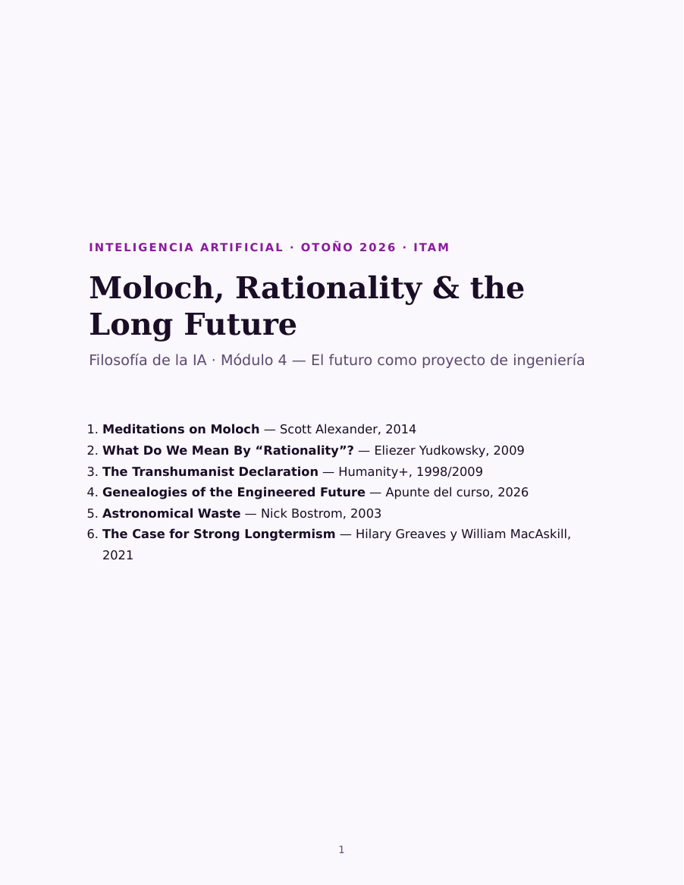

# Moloch, Rationality & the Long Future

[[accelerate-what|El módulo 1]] preguntaba **acelerar qué**. [[left-takes-future|El
módulo 2]], **quién lo construye**. [[exit-nrx|El módulo 3]], **quién se queda**.
Los tres discuten sobre el presente. Este lee a quienes contestan que la
discusión está mal escalada: que antes de pelear la dirección hay que hacer la
cuenta de cuántos vienen después, y que hecha la cuenta, ella decide.

La cuenta sale enorme, y de ahí sale todo lo demás. Son las ideas con las que
trabajan buena parte de los laboratorios de IA, las fundaciones que financian
seguridad y una porción visible de la discusión pública sobre regulación. En
[[ia-y-sociedad]] aparecieron como una posición del mapa; aquí se leen en sus
fuentes.

## Qué se lee, y por qué

| # | Lectura | Por qué está aquí |
|---|---|---|
| 1 | **Scott Alexander**, «Meditations on Moloch» (2014) | El problema: competencias que nadie eligió, que todos odian y de las que nadie puede salir solo |
| 2 | **Eliezer Yudkowsky**, «What Do We Mean By "Rationality"?» (2009) | El método, en mil ochocientas palabras: creer con exactitud y conseguir lo que valoras |
| 3 | **Humanity+**, «The Transhumanist Declaration» (1998/2009) | La meta, en ocho proposiciones y sin argumento — un documento, no un ensayo |
| 4 | **Apunte del curso**, «Genealogies of the Engineered Future» (2026) | De dónde salió esa meta: cinco linajes, de Fiódorov al altruismo eficaz, con un fragmento de cada uno |
| 5 | **Nick Bostrom**, «Astronomical Waste» (2003) | La aritmética: el costo de cada año de retraso, medido en vidas que pudieron existir |
| 6 | **Greaves y MacAskill**, «The Case for Strong Longtermism» (2021), secciones 1–4 y 10 | El argumento completo, escrito con la precisión de un artículo académico |

## Cómo leer este cuadernillo

Las seis se leen con una sola pregunta: **qué mete cada una en la cuenta, y qué
deja fuera.** Todas cuentan gente que todavía no existe. Difieren en cuánta, con
qué certeza, y en qué autoriza a pasar de la suma a una instrucción sobre lo que
hay que hacer hoy.

El orden no es cronológico sino de dependencia. Alexander nombra el problema;
Yudkowsky da el método; la Declaración pone la meta y el apunte cuenta de dónde
viene; Bostrom hace la aritmética; Greaves y MacAskill la convierten en un
argumento con objeciones adentro. Leerlas al revés funciona mal: las cifras del
final no se sostienen sin el aparato del principio.

Está bien no estar de acuerdo. Lo que no funciona es rechazar el conjunto en
bloque, porque el conjunto es una cadena y las cadenas se rompen en un eslabón.
Llega a la sesión sabiendo en cuál.

## Un aviso sobre la primera lectura

«Meditations on Moloch» son catorce mil trescientas palabras: el texto más largo
de la unidad, casi la mitad del cuadernillo, y él solo toma casi tanto tiempo
como las cuatro lecturas del módulo 3 juntas. Se lee fácil —es un blog, tiene chistes,
abre con un poema— y por eso se subestima. **Empieza temprano**; va primero para
que no quede al final. Dos cosas más: el poema de Ginsberg trae lenguaje crudo,
y hay pasajes incómodos —la esclavitud antigua, el patriarcado, un párrafo sobre
coeficientes intelectuales— que están ahí como piezas de un argumento sobre la
competencia, no como tesis morales.

## El cuadernillo

::: figure {#cuadernillo-modulo-4 title="Las seis lecturas en un solo archivo"}

:::

**78 páginas**, cada lectura con su portadilla y la razón por la que se lee.
Es el cuadernillo más largo de la unidad: calcula entre tres horas y tres y
media, con más de la mitad en la primera lectura.

- **[Leer en el navegador →](_assets/visor_modulo_4.html)** — se abre completo,
  sin descargar nada. También puedes hacer clic en la portada de arriba.
- **[Descargar el PDF](_assets/cuadernillo_modulo_4_long_future.pdf)** — 403 KB,
  para leerlo sin conexión o imprimirlo.

## Sobre las fuentes, y cómo citarlas

Cinco de las seis son páginas web abiertas y van en inglés; la cuarta la
escribimos para el curso, en español. Abierto no quiere decir libre de derechos:
las cinco siguen siendo de sus autores y están aquí como material de clase, con
la fuente al pie de cada una.

- **Alexander** va completo, partes I a VIII, del original en `slatestarcodex.com`
  ([enlace](https://slatestarcodex.com/2014/07/30/meditations-on-moloch/)). La
  entrada tiene imágenes y enlaces que el cuadernillo no reproduce; si algo te
  interesa, vale la pena verlo en la página.
- **Yudkowsky** va completo, del post en LessWrong del 16 de marzo de 2009
  ([enlace](https://www.lesswrong.com/posts/RcZCwxFiZzE6X7nsv/what-do-we-mean-by-rationality-1)).
  El temario lo fecha en 2012, que es la fecha de la recopilación en libro, no la
  del texto.
- **La Declaración** va completa, con la lista de sus veintidós redactores de
  1998, desde el sitio de Humanity+
  ([enlace](https://www.humanityplus.org/the-transhumanist-declaration)).
- **El apunte** es material propio y se escribió con ayuda de un modelo de
  lenguaje; lo dice en su primera línea. Cada fragmento que cita lleva su fuente.
- **Bostrom** va completo, en la versión que el autor aloja en `nickbostrom.com`
  ([enlace](https://nickbostrom.com/astronomical/waste)). El temario lo cita por
  la paginación de *Utilitas* 15(3), pp. 308–314, que es donde se publicó en
  2003; el texto es el mismo y la versión del autor no trae esos números.
- **Greaves y MacAskill** van recortados: solo las secciones 1 a 4 y la 10, del
  documento de trabajo que publica el Global Priorities Institute
  ([enlace](https://globalprioritiesinstitute.org/wp-content/uploads/The-Case-for-Strong-Longtermism-GPI-Working-Paper-June-2021-2-2.pdf)).
  Quedan fuera las objeciones técnicas y el apéndice, que siguen en el PDF
  completo para quien las quiera.

## Qué hay que hacer

Leer. Como en los dos módulos anteriores, no hay cuestionario ni nada que
entregar: la tarea es llegar a la sesión con las seis lecturas leídas.

Sigue con [[las-lecturas-del-futuro-largo]].
