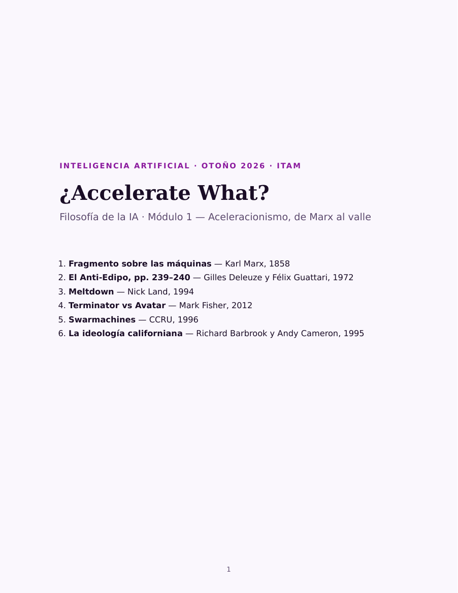

# ¿Accelerate What?

La pregunta que da título al módulo es de Mark Fisher, y es una objeción: si hay
que acelerar, ¿acelerar **qué**, exactamente? Las seis lecturas recorren de dónde
viene esa idea —Marx viendo la máquina absorber el saber colectivo— hasta dónde
llegó: el capital como proceso autónomo en Land, y la crítica de Barbrook y
Cameron a la mezcla de contracultura y libre mercado que hoy llamamos Silicon
Valley.

Enlaza con la sección de aceleracionismos y TESCREAL de [[ia-y-sociedad]]: aquí
están los textos que ese mapa resume.

## Cómo leer este cuadernillo

El aceleracionismo es una apuesta incómoda: que la salida del capitalismo no está atrás —en volver a algo más simple, más lento, más humano— sino adelante, atravesándolo. Nadie en estas páginas usa «acelerar» como sinónimo de «ir más rápido»: dicen que el proceso que nos trajo hasta aquí no se detiene pidiéndole que se detenga.

Mark Fisher le puso a esa apuesta la objeción que da título al módulo: si hay que acelerar, ¿acelerar **qué**? ¿El capital? ¿La tecnología? ¿Son lo mismo? Las seis lecturas son seis respuestas distintas, y no coinciden entre ellas. Léelas discutiendo, no como una doctrina.

**Cuatro ideas que atraviesan todo.**

- **General intellect** (Marx). El saber colectivo de una sociedad, acumulado y depositado en máquinas. Cuando la riqueza sale de ahí y no de las horas trabajadas, medirla en horas se vuelve absurdo.
- **Desterritorialización** (Deleuze y Guattari). Arrancar algo de su lugar —una tradición, un oficio, un significado— y ponerlo a circular. El capitalismo lo hace sin parar; la pregunta es si eso libera o solo recodifica.
- **Cibernética.** Sistemas que se regulan solos por retroalimentación, sin nadie al mando. Es el modelo que Land y el CCRU le aplican al capital: un proceso sin sujeto.
- **Izquierda y derecha.** La misma palabra sostiene dos programas opuestos: acelerar el capital (Land) o acelerar la tecnología para salir del capital (Fisher). Su descendiente vivo se llama e/acc, nació en 2022, y está en el mapa ideológico de [[ia-y-sociedad]].

**Por qué van en este orden.** Marx primero, porque de ahí sale todo. Deleuze y Guattari en segundo lugar: una página, justo la que Land cita. Land tercero. Fisher enseguida —fuera de cronología, a propósito— porque explica a Land mejor que cualquier introducción: úsalo como llave. El CCRU quinto, la prosa más difícil, cuando ya tienes el mapa. Barbrook y Cameron al final, que aterrizan todo en Silicon Valley, que es donde sigue el curso.

**Son textos difíciles, y está bien.** Dos de ellos —Land y el CCRU— están escritos a propósito para resistirse a la lectura ordenada. No vas a entenderlos completos a la primera y nadie espera que lo hagas. El trabajo no es descifrar cada línea: es llegar a la sesión con dos pasajes subrayados, uno que te convenza y uno que te moleste. Con eso discutimos.

**Lo práctico.** Cinco de las seis van en inglés; la de Deleuze y Guattari, en español. Calcula entre tres horas y media y cuatro. El cuestionario se contesta después de leer, no antes.

## El cuadernillo

::: figure {#cuadernillo title="Las seis lecturas en un solo archivo"}

:::

**57 páginas**, cada lectura con una ficha que explica qué vas a leer, qué
palabras necesitas y qué retener. Calcula entre tres horas y media y cuatro.

- **[Leer en el navegador →](../_assets/visor_modulo_1.html)** — se abre completo,
  sin descargar nada. También puedes hacer clic en la portada de arriba.
- **[Descargar el PDF](../_assets/cuadernillo_modulo_1_accelerate.pdf)** — 1.2 MB,
  para leerlo sin conexión o imprimirlo.

## Qué hay que entregar

Después de leer —no antes—, contesta el **[cuestionario del
módulo](https://forms.gle/bBHJVMfvKFEr599s5)**. Es lo único que se entrega, y
está pensado para que llegues a la sesión con una posición tomada, no para
comprobar que pasaste las páginas.

## Qué se lee, y por qué

| # | Lectura | Por qué está aquí |
|---|---|---|
| 1 | **Marx**, Fragmento sobre las máquinas (1858) | La máquina que absorbe el saber colectivo y vuelve marginal al obrero. De aquí sale el «general intellect» |
| 2 | **Deleuze y Guattari**, El Anti-Edipo (1972) | pp. 239–240: no retirarse del proceso, sino acelerarlo. La divisa que el aceleracionismo adoptó, casi siempre citada fuera de contexto |
| 3 | **Land**, Meltdown (1994) | El texto fundacional del aceleracionismo de derecha: el capital como proceso autónomo que se desmantela hacia adelante |
| 4 | **Fisher**, Terminator vs Avatar (2012) | Recupera a Land para la izquierda: acepta el diagnóstico y rechaza la conclusión. Responde directamente a *Meltdown* |
| 5 | **CCRU**, Swarmachines (1996) | La insurrección como enjambre: no un sujeto que dirige, sino un proceso que se propaga |
| 6 | **Barbrook y Cameron**, La ideología californiana (1995) | La crítica que nombró la fusión de contracultura y libre mercado. Describe el e/acc de 2026 con treinta años de anticipación |

Cuatro se tomaron de fuentes primarias abiertas — el archivo del propio CCRU, el
sitio de Barbrook y Cameron, y el archivo Marx/Engels. Las de Deleuze y Guattari
(2ª) y Fisher (4ª) se reproducen de la edición citada.

## Sobre la paginación

El temario cuenta páginas de la antología *#Accelerate* (Urbanomic, 2014) y el
cuadernillo toma cada texto de su fuente. El texto es el mismo; la numeración no.

Dos avisos para cuando cites en clase. «Swarmachines» son **7 páginas en el
original**, no las 11 del temario: la diferencia es la introducción que le
anteponen los editores de la antología. Y el pasaje de Deleuze y Guattari
corresponde a las pp. 239–240 de la edición de Minnesota, pero **cabe entero en
la p. 247** de la edición española que se reproduce aquí, que es más densa.

Sigue con [[ideas-aceleracionismo]].
