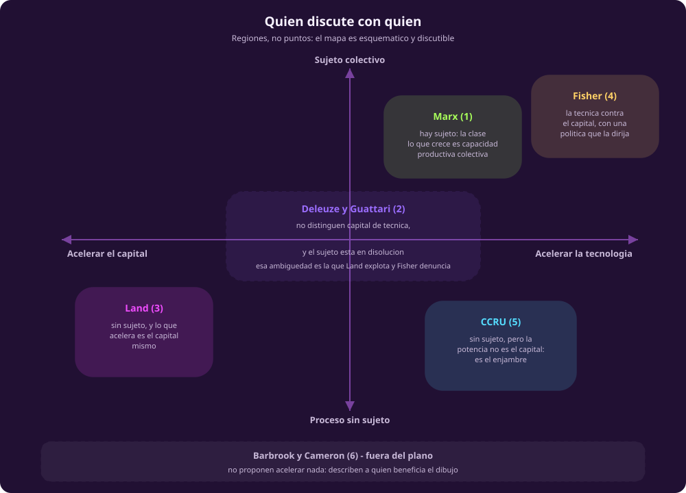

# Para discutir

**Qué te llevas:** el mapa de las seis lecturas en dos ejes, y las cinco
tensiones con las que se discuten en sesión. ~10 min.

## El mapa: quién discute con quién · ~3 min

::: figure {#cuadrante title="Las seis lecturas en dos ejes"}

:::

Dos preguntas ordenan a los seis. La horizontal es la de Fisher: **acelerar
qué**, el capital o la técnica. La vertical es la que parte el cuadernillo en
dos: **quién conduce**, si es que alguien.

Marx y Fisher comparten la mitad de arriba: los dos suponen que hay un sujeto
capaz de decidir. Land y el CCRU comparten la de abajo, y ahí está su desacuerdo
—para Land lo que acelera es el capital; para el CCRU, un enjambre que el
capital no controla—. Deleuze y Guattari no caben en un punto: su región cruza
el eje porque no distinguen capital de técnica y porque el sujeto, en su libro,
se está disolviendo. **Esa ambigüedad no es un defecto del dibujo: es lo que
hace posible que Land los cite y que Fisher diga que los citó mal.**

Barbrook y Cameron quedan fuera del plano, y es la decisión más discutible de
la figura. No proponen acelerar ni frenar: describen a quién le conviene el
dibujo entero. Ponerlos dentro habría sido inventarles una posición que su texto
no toma —el mismo problema que en [[ia-y-sociedad|IA y sociedad]] obliga a dibujar TESCREAL
como franja punteada y no como región.

El mapa es esquemático y se puede discutir. De hecho, tres de las cinco
tensiones que siguen salen de discutirlo.

## Para discutir · ~5 min

Ninguna tiene respuesta correcta, y ninguna se contesta con una cita. Cada una
abre con quién dice qué, que es la puerta de entrada si no leíste.

### 1 · ¿Hay alguien al volante?

Marx y Fisher suponen un sujeto capaz de decidir —una clase, una política—.
Land y el CCRU dicen que no lo hay. Deleuze y Guattari están, justamente,
disolviéndolo.

- Si el capital es un proceso sin sujeto, ¿qué significa «decidir» algo sobre la
  inteligencia artificial?
- ¿Quién decide hoy qué modelo se entrena: un consejo directivo, un mercado, o
  nadie?

### 2 · ¿Acelerar qué?

Land dice el capital. Fisher dice que eso es rendirse, y que hay que acelerar la
técnica **contra** el capital. Deleuze y Guattari no distinguen las dos cosas.

- ¿Se pueden separar hoy capital y tecnología, o es una distinción de escritorio?
- Los modelos abiertos, ¿son técnica contra el capital o el mejor marketing que
  el capital ha tenido?

### 3 · ¿La crítica frena o acelera?

Barbrook y Cameron describen sin proponer. Fisher acusa a la izquierda de
refugiarse en una nostalgia que no incomoda a nadie.

- ¿Existe una crítica de la inteligencia artificial que no sea nostálgica?
- Nombrar una ideología, ¿la debilita o le da marca? «Aceleracionismo» empezó
  como acusación y e/acc lo lleva en la biografía.

### 4 · ¿Quién es «nosotros»?

El CCRU dice enjambre. Marx dice clase. El discurso de riesgo existencial dice
«la humanidad». Ninguno dice desde dónde habla.

- Desde México, y desde la posición en la cadena de valor que viste en
  [[ia-y-sociedad|IA y sociedad]], ¿acelerar es una decisión o algo que a uno le pasa?
- ¿El «nosotros» de e/acc te incluye?

### 5 · ¿Es esto una descripción o un deseo?

Land insiste en que solo describe lo que ya está ocurriendo; sus lectores lo
leen como programa. Marx también describía una tendencia, no un plan.

- ¿Qué tendría que pasar en el mundo para que la tesis de Land fuera falsa?
- Si una teoría no puede fallar, ¿sirve para decidir algo?

## Y ahora, otra vez el mapa · ~2 min

Vuelve al mapa ideológico de [[ia-y-sociedad|IA y sociedad]]. La primera vez fue una lista de
etiquetas con una posición cada una; ahora cada etiqueta tiene textos debajo, y
las fronteras entre ellas se ven por lo que son: discutibles. Esa es toda la
diferencia entre saber cómo se llaman las posiciones y poder sostener una.

Sigue con [[left-takes-future|The Left Takes the Future Back]].
