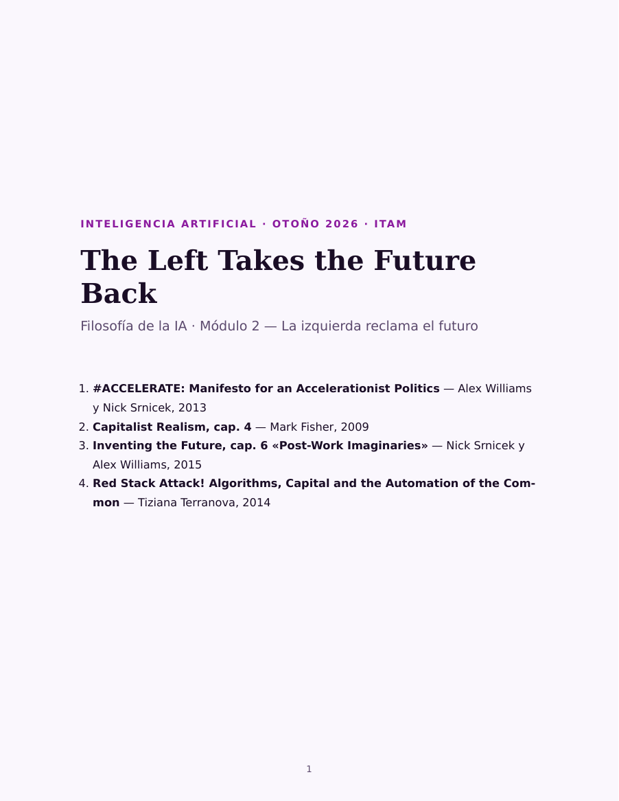

# The Left Takes the Future Back

[[accelerate-what]] terminó en Barbrook y Cameron, con la ideología
californiana aterrizando la discusión en Silicon Valley; antes había dejado a
Land —el capital como proceso autónomo que no responde a nadie— y a Fisher
aceptando ese diagnóstico para virarlo hacia la izquierda. Este módulo retoma
el hilo desde el otro lado. Cuatro lecturas que
reclaman la aceleración —la tecnología, la planeación, el futuro mismo— para
un proyecto de izquierda, en vez de dejárselos al capital sin sujeto de Land
o a la mezcla de contracultura y libre mercado que describen Barbrook y
Cameron.

Enlaza con el vocabulario de [[ideas-aceleracionismo]]: estas cuatro lecturas
dan por conocidos el general intellect, la desterritorialización y la
distinción entre aceleracionismo de izquierda y de derecha que ese módulo
explica.

## Qué se lee, y por qué

| # | Lectura | Por qué está aquí |
|---|---|---|
| 1 | **Williams y Srnicek**, «#ACCELERATE: Manifesto for an Accelerationist Politics» (2013) | El documento fundacional del aceleracionismo de izquierda: reclamar la tecnología y la planeación del capital en vez de retirarse de ellas |
| 2 | **Fisher**, *Capitalist Realism*, cap. 4 (2009) | Por qué la izquierda no logra ni intentarlo: impotencia reflexiva, hedonia depresiva, las protestas francesas de 2006 y el «comunismo liberal» de Žižek. Se lee segundo porque plantea el problema que las otras tres lecturas intentan resolver |
| 3 | **Srnicek y Williams**, *Inventing the Future*, cap. 6 (2015) | El programa concreto: automatización total, renta básica universal, la exigencia de reducir el trabajo |
| 4 | **Terranova**, «Red Stack Attack!» (2014) | La versión infraestructural del argumento: algoritmos, dinero y redes sociales como un stack que se puede construir de otra manera. Aterriza la discusión en la tecnología, que es por donde sigue el curso |

## Cómo leer este cuadernillo

El módulo anterior se podía leer como un mapa: quién dijo qué, cuándo, contra
quién. Estas cuatro lecturas no te dejan ahí —piden un programa, y un
programa se evalúa preguntando qué construirías tú con él. El manifiesto de
Williams y Srnicek plantea ese programa de una vez; Fisher explica, fuera de
cronología a propósito, por qué suena imposible antes de que lo leas con esa
sospecha ya instalada; Srnicek y Williams lo aterrizan en propuestas
concretas; Terranova lo baja a infraestructura. Está bien no estar de
acuerdo con ninguna de las cuatro: llega a la sesión con la objeción, no con
el resumen.

## El cuadernillo

::: figure {#cuadernillo-modulo-2 title="Las cuatro lecturas en un solo archivo"}

:::

**53 páginas**, cada lectura con su portadilla y la razón por la que se lee.
Calcula entre tres horas y media y cuatro.

- **[Leer en el navegador →](../_assets/visor_modulo_2.html)** — se abre completo,
  sin descargar nada. También puedes hacer clic en la portada de arriba.
- **[Descargar el PDF](../_assets/cuadernillo_modulo_2_left_future.pdf)** — 1.0 MB,
  para leerlo sin conexión o imprimirlo.

## Sobre la paginación

Dos avisos para cuando cites estas lecturas en un trabajo escrito. El capítulo
de **Fisher** se reproduce de la edición Zero Books de 2009 y se cita **pp.
21–30 de esa edición**, no el número de página del cuadernillo. El capítulo de
**Srnicek y Williams** llegó como archivo digital cuya numeración no corresponde
a ninguna edición en papel: se cita **pp. 107–128 de la edición de Verso, 2015**.
En ambos casos el texto es el mismo; lo que no transfiere es el número de
página.

## Qué hay que hacer

Leer. Esta vez no hay cuestionario ni nada que entregar: la tarea es llegar
a la sesión con las cuatro lecturas leídas.

Sigue con [[las-cuatro-lecturas]].
