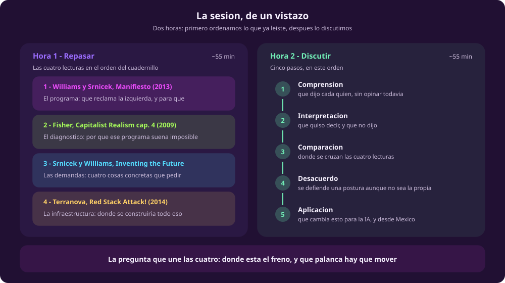
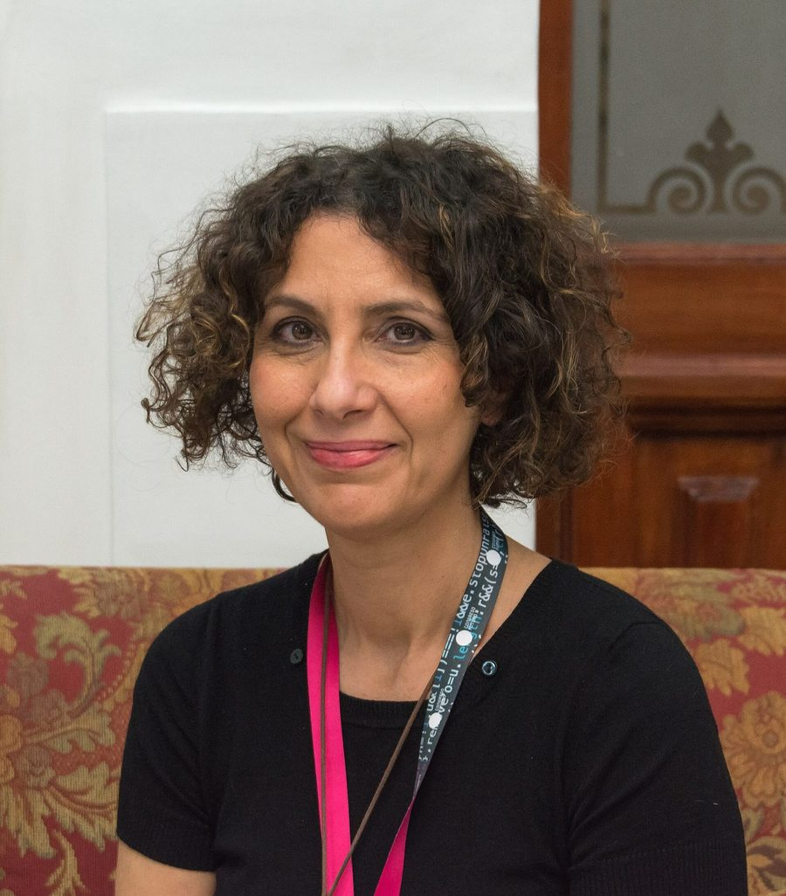

# Las cuatro lecturas, en claro

**Qué te llevas:** un mapa de las cuatro lecturas que leíste de tarea —qué dice
cada una, qué concepto aporta y con qué pregunta te deja—.

Esto no sustituye el cuadernillo: lo ordena. Si no alcanzaste a leer, entra
igual y usa las fichas como muleta; lo que no vas a tener es haber discutido con
el texto, que es la mitad de lo que importa.

::: figure {#mapa-sesion title="Las dos horas de la sesión, y la pregunta que las une"}

:::

Las cuatro quieren lo mismo: que la izquierda deje de defender el pasado y
reclame el futuro. **Discrepan en qué es lo que está atorado.** Esa es la
pregunta con la que conviene leer las cuatro fichas, y con la que empieza la
segunda hora.

> **Cómo se corre cada ficha en clase (~13 min).** Dos minutos de lectura, tres
> en parejas —y las parejas se arman con alguien que leyó y alguien que no— y el
> resto en plenaria, con la respuesta anotada en el pizarrón. La ficha 4 es la
> excepción: ahí la pregunta abierta se discute entera en voz alta, porque de
> ella sale la segunda hora.

## 1 de 4 · Williams y Srnicek, «#ACCELERATE» (2013) · ~13 min

::: figure {#retrato-srnicek title="Nick Srnicek"}

:::

**De dónde sale.** Se publicó el 14 de mayo de 2013 en el sitio *Critical Legal
Thinking*, no en una revista, y con formato de manifiesto: tesis cortas y
numeradas, y una etiqueta en el propio título con la que circuló. Es el
documento fundacional del aceleracionismo **de izquierda**. Nick Srnicek, el del
retrato, vuelve en la lectura 3 con el mismo coautor.

**Qué dice.** Le concede a Land la mitad del diagnóstico —el capitalismo suelta
fuerzas técnicas enormes— y le corrige la otra mitad: lo que el capital produce
es **velocidad**, no aceleración. Y hoy ni siquiera eso: patentes, monopolios de
ideas y aparatos apenas un poco mejores donde se habían prometido otras cosas.
De ahí el giro que sostiene todo el módulo: **el argumento contra el capitalismo
deja de ser solo que es injusto, y pasa a ser que frena.** La izquierda,
mientras tanto, se refugia en lo local, lo asambleario y la nostalgia —la *folk
politics* que el cuadernillo traduce como «política popular»— frente a un
adversario global y abstracto.

**Lo difícil, en claro: velocidad no es aceleración.** *Velocidad* es ir cada vez
más rápido por el mismo carril: el capital innova sin parar, pero siempre dentro
de los mismos parámetros de ganancia y competencia. *Aceleración*, para ellos, es
además poder **cambiar de carril y de reglas**. Por eso no proponen destruir la
infraestructura existente sino reprogramarla —es un *trampolín*, dicen, no un
decorado que haya que echar abajo—, y por eso piden a la vez «el mando del Plan»
y «el orden improvisado de la Red»: planeación y coordinación distribuida, no
una u otra. Ese par es lo único que el manifiesto dice sobre **cómo**.

> «However Landian neoliberalism confuses speed with acceleration. We may be moving fast, but only within a strictly defined set of capitalist parameters that themselves never waver.» — cuadernillo, p. 6

**En tres líneas:**

- **Idea central** — el capitalismo ya no libera la técnica, la estrangula; reclamarla es tarea de la izquierda, no una traición a la izquierda.
- **Conceptos clave** — velocidad ≠ aceleración · política popular (*folk politics*) · el Plan y la Red.
- **Pregunta abierta** — de la infraestructura que hoy existe, ¿qué sería trampolín y qué habría que desmontar?

## 2 de 4 · Fisher, *Capitalist Realism*, cap. 4 (2009) · ~13 min

**De dónde sale.** A Mark Fisher ya lo leíste en el módulo 1, con *Terminator vs
Avatar*. Este capítulo es anterior —2009— y viene de *Capitalist Realism*.
Fisher daba clases en un *college* inglés —sus alumnos eran adolescentes, no
universitarios—, y una parte del capítulo describe ese salón. **Va en segundo
lugar aunque sea el más antiguo, a propósito:** explica por qué el programa que
acabas de leer suena imposible.

**Qué dice.** Sus estudiantes saben perfectamente que las cosas están mal, y aun
así no actúan. Fisher descarta las dos explicaciones fáciles —apatía y
cinismo— y propone una tercera: **impotencia reflexiva**. Y añade la parte
incómoda: ese malestar llega vestido de diagnóstico clínico privado —depresión,
déficit de atención, dislexia—, y en cuanto se vuelve cosa de química cerebral o
de familia, ya no se puede discutir como problema político.

::: figure {#ilus-realismo-capitalista title="El horizonte cerrado del realismo capitalista"}

:::

*(Esta imagen es una ilustración generada, no una fotografía ni un dato real.)*

**Lo difícil, en claro: tres términos que suenan a diagnóstico y no lo son.**

- **Impotencia reflexiva.** No es que no te importe (apatía) ni que finjas
  distancia (cinismo). Es *saber* que esto está mal y saber, al mismo tiempo, que
  no puedes hacer nada. Lo importante es que ese saber no describe una situación
  previa: **la produce**. Es una profecía que se cumple sola.
- **Hedonia depresiva.** La depresión suele definirse como no poder sentir
  placer. Fisher describe lo contrario: no poder hacer **otra cosa** que
  perseguirlo. Queda la sensación de que algo falta, y el remedio a mano —una
  pantalla más— es justo lo que la sostiene.
- **Sociedades de control.** El término es de Deleuze, y Fisher lo usa para
  nombrar el relevo: las instituciones que encerraban —la fábrica, la escuela,
  la prisión— ceden ante formas que no necesitan encierro porque no terminan
  nunca. Capacitación permanente, trabajo que sigue en casa, deuda en vez de
  reja. Su figura no es el preso: es el endeudado.

> «They know things are bad, but more than that, they know they can't do anything about it.» — cuadernillo, p. 14

**En tres líneas:**

- **Idea central** — la impotencia no es un rasgo de carácter de una generación: es algo que el sistema produce, y por eso es política.
- **Conceptos clave** — impotencia reflexiva · hedonia depresiva · sociedades de control.
- **Pregunta abierta** — de lo que sueles explicarte como «no tengo tiempo» o «no sirve de nada», ¿cuánto es diagnóstico personal y cuánto es efecto de algo que no empezó en ti?

## 3 de 4 · Srnicek y Williams, *Inventing the Future*, cap. 6 (2015) · ~13 min

**De dónde sale.** Los mismos dos autores de la lectura 1, dos años después. El
manifiesto enunciaba el programa en tesis numeradas; aquí lo aterrizan en cuatro
demandas.

**Qué dice.** Parte de una parálisis doble: hoy las demandas revolucionarias
parecen ingenuas y las reformistas parecen inútiles (p. 25). Su salida son
cuatro demandas que se pueden pedir hoy y que, cumplidas, no dejarían el mundo
donde estaba:

1. **Automatización plena** — que las máquinas hagan el trabajo que hoy hace la gente, y que eso se exija en vez de resistirlo.
2. **Semana laboral más corta**, sin recorte de sueldo — su propuesta concreta es el fin de semana de tres días.
3. **Renta básica universal** — suficiente para vivir, sin condiciones, y además del estado de bienestar, nunca en lugar de él.
4. **Desarmar la ética del trabajo** — la idea de que hay que sufrir un empleo para merecer vivir bien, y de que uno es su empleo.

::: figure {#cuatro-demandas title="Cómo se sostienen entre sí las cuatro demandas"}

:::

**Lo difícil, en claro: qué es una demanda «no reformista».** Es una demanda que
cabe en las instituciones de hoy —se puede escribir en una ley—, pero que, si se
cumpliera de verdad, tensaría el límite de lo que el capitalismo puede conceder.
Los propios autores lo dicen sin adornos: estas cuatro no nos sacan del
capitalismo, pero prometen sacarnos del neoliberalismo (p. 26).

**Y lo que casi siempre se lee mal.** El capítulo **no** dice que la
automatización ya esté ocurriendo sola. Concede que la productividad no ha
crecido como cabría esperar y responde que su argumento es **normativo, no
descriptivo**. De ahí sale el lazo más contraintuitivo del libro: si hay mano de
obra suficientemente barata, a nadie le conviene comprar la máquina, así que
pelear por salarios altos es parte de exigir la automatización, y no su enemigo.

**Lo que el capítulo deja abierto.** Encarecer el trabajo también puede destruir
empleo antes de traer una sola máquina, y eso el texto no lo contesta. Tampoco
dice qué resultado dejaría demostrado que el programa entero está equivocado. Sí
admite algo incómodo: que los obstáculos mayores de la renta básica no son
económicos sino **políticos y culturales** —la fuerza que se moviliza en contra,
y la creencia de que uno es su empleo—. Los obstáculos políticos los deja para
dos capítulos más adelante.

> «Full automation is something that can and should be achieved, regardless of whether it is yet being carried out.» — cuadernillo, p. 29

**En tres líneas:**

- **Idea central** — cuatro demandas que se pueden pedir hoy, y cuya fuerza está en que se sostienen entre sí.
- **Conceptos clave** — reforma no reformista · automatización plena · renta básica universal · ética del trabajo.
- **Pregunta abierta** — de las cuatro, ¿cuál te parece la más difícil de conseguir, y el obstáculo que ves es económico, político o cultural?

## 4 de 4 · Terranova, «Red Stack Attack!» (2014) · ~13 min

::: figure {#retrato-terranova title="Tiziana Terranova"}

:::

**De dónde sale.** Tiziana Terranova es teórica italiana de los medios. El
ensayo se remite a un taller celebrado en Londres en enero de 2014 y se publicó
abierto en *euronomade.info*. Cierra el cuadernillo porque baja todo lo anterior
a infraestructura, que es por donde sigue el curso.

**Qué dice.** Los algoritmos organizan hoy desde la logística hasta el orden en
que ves las publicaciones de tus amigos. Cierta lectura marxista los da por
perdidos: son *capital fijo*, trabajo muerto, captura. Terranova concede eso y
señala dónde se rompe el argumento, con una frase del propio Marx: que una
máquina exista **como máquina** no es lo mismo que exista **como capital**. Que
hoy los algoritmos sean del capital no demuestra que solo puedan serlo. De ahí
su propuesta: no frenar la automatización, sino construir otra pila —y quienes
la construirían, dice al cerrar, son los programadores, los hackers y los
movimientos *maker*—.

**Lo difícil, en claro: qué es un *stack*.** En cómputo, una pila es un conjunto
de capas donde cada una da servicio a la de arriba y se apoya en la de abajo:
así está construido internet, del cable al protocolo, y de ahí a la aplicación.
Ese salto —de arquitectura de ingeniería a mapa político— Terranova lo toma de
Benjamin Bratton, y lo que ella propone es la versión **roja**: si la
infraestructura que hoy existe está apilada de cierta manera, se puede apilar de
otra. Lo que se construiría tiene nombre: **lo común**, ni del Estado ni de una
empresa, sino la riqueza que produce la cooperación de mucha gente —lenguajes,
conocimientos, redes— antes de que alguien la registre a su nombre.

**Las capas que nombra son al menos tres**: dinero, redes sociales y
*bio-hipermedia* —la capa donde el aparato deja de estar enfrente y se acopla al
cuerpo—. Y advierte que no se apilan una sobre otra sin más: se cruzan.

::: figure {#ilus-red-stack title="Una pila que se puede construir de otra manera"}

:::

*(Esta imagen es una ilustración generada, no una fotografía ni un dato real.)*

> «From the point of view of capitalism, however, algorithms are mainly a form of ‘fixed capital’—that is, they are just means of production.» — cuadernillo, p. 45

**En tres líneas:**

- **Idea central** — el algoritmo es capital fijo *para el capital*; que hoy sea suyo no demuestra que no pueda ser de otros.
- **Conceptos clave** — el stack · lo común · capital fijo · bio-hipermedia.
- **Pregunta abierta** — de las capas que nombra, ¿cuál se ve más cerca de poder construirse de otra manera, y cuál parece imposible?

---

*La ficha 3 va sin retrato: de Alex Williams no existe ninguna fotografía en
Wikimedia Commons, y el de Srnicek ya salió en la ficha 1. Este curso solo
publica imágenes que puede publicar, y rellenar un hueco con una cara generada
no es una opción: sería inventar el rostro de una persona real.*

Sigue con [[discutir-el-programa|Discutir el programa]].
