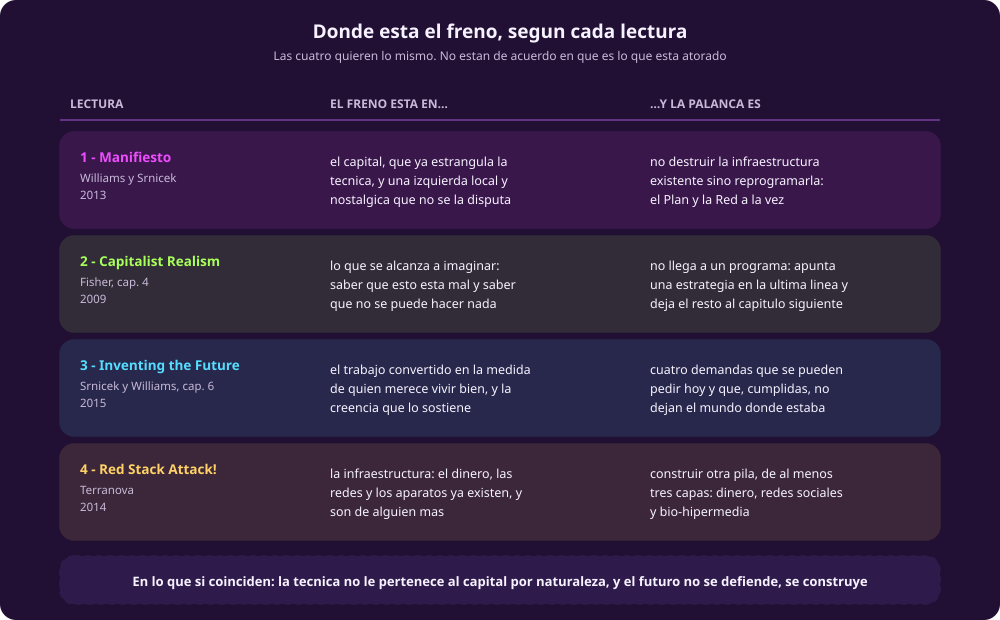

# Discutir el programa

**Qué te llevas:** el mapa que cruza las cuatro lecturas, y los cinco
movimientos con los que se discuten. Es la **segunda hora** de la sesión, y los
minutos de cada sección son minutos de clase.

## El puente: dónde está el freno · ~8 min

::: figure {#donde-esta-el-freno title="Las cuatro lecturas, por dónde localizan el freno"}

:::

Puestas juntas, las cuatro dejan ver algo que por separado no se nota: **Fisher
es el único que no llega a un programa.** Su capítulo apenas apunta una
estrategia en la última línea —desplazar el terreno de la lucha sindical: del
salario a las formas de descontento propias del posfordismo, el trabajo
flexible y sin horario que sustituyó a la fábrica— y remite al capítulo
siguiente. No es un descuido: es coherente con su tesis. Mientras la impotencia
se viva como carácter propio y no como algo producido, cualquier programa suena
a fantasía. Los otros tres escriben como si ese paso ya estuviera dado.

Esta figura conviene dejarla proyectada el resto de la hora.

## Cinco movimientos · ~43 min

### 1 · Comprensión · ~5 min

Reconstruir dos cosas, sin opinar todavía: qué pide el manifiesto, en una frase
y sin usar la palabra «acelerar»; y cuáles son las cuatro demandas de *Inventing
the Future*, de memoria.

### 2 · Interpretación · ~8 min

Qué quiso decir cada quien, y qué decidió no decir. De aquí en adelante ninguna
pregunta tiene respuesta correcta, y ninguna se contesta con una cita.

- Fisher deja el programa para después y se queda en el diagnóstico. ¿Qué haría
  falta para que la impotencia dejara de vivirse como carácter propio, y quién
  tendría que hacerlo?
- Terranova dice que el algoritmo es capital fijo «desde el punto de vista del
  capitalismo». ¿Qué cambia esa salvedad? ¿Desde qué otro punto de vista se
  vería, y quién lo ocuparía?

### 3 · Comparación · ~8 min

Dónde se cruzan las cuatro.

- El manifiesto dice que la infraestructura existente es un **trampolín** que hay
  que reprogramar. Terranova propone **construir otra pila**. ¿Es lo mismo dicho
  de dos maneras, o son dos programas incompatibles?
- El manifiesto pide «el Plan y la Red» a la vez. ¿Cuál de las otras tres
  lecturas encaja mejor con el Plan, y cuál con la Red?

### 4 · Desacuerdo · ~14 min

Aquí se parte el salón en dos —basta con dividirlo por el pasillo— y a cada
mitad le toca defender una posición aunque no sea la propia. Cuatro minutos para
preparar el argumento, ocho de debate, dos para cerrar.

**La tesis a debate:** «la renta básica universal empuja la automatización,
porque encarece el trabajo barato». Una mitad la defiende con el argumento del
capítulo; la otra sostiene que encarecer el trabajo destruye empleo antes de
traer una sola máquina, que es justamente lo que el capítulo no contesta.

### 5 · Aplicación · ~8 min

Qué cambia esto para la inteligencia artificial, y desde dónde lo miras.

- Un modelo se entrena con el saber acumulado de mucha gente: es *general
  intellect* puesto a producir. De las cuatro lecturas, ¿cuál da la mejor
  herramienta para reclamarlo, y cuál se queda corta?
- Si el trabajo barato frena la automatización, ¿qué significa eso para quien
  etiqueta datos desde México, en el lugar de la cadena de valor que viste en
  [[ia-y-sociedad]]? ¿La renta básica lo protege o lo vuelve prescindible?

## Síntesis · ~4 min

Tres cosas quedan sin resolver, y conviene salir sabiendo cuáles son:

1. **Quién es el sujeto.** El manifiesto pide una ecología de organizaciones y
   una infraestructura intelectual; Terranova apuesta por programadores, hackers
   y movimientos *maker*. Ninguno demuestra que ese sujeto exista.
2. **Si un programa se puede equivocar.** ¿Qué tendría que pasar en el mundo
   para que el programa de las cuatro demandas quedara refutado? Si no se te
   ocurre nada, es la misma sospecha que en [[para-discutir|el módulo 1]] se le
   hizo a Land, y ahora le toca a este lado.
3. **Si Fisher tiene razón.** Si la impotencia es tan estructural como él la
   describe, las otras tres lecturas están escribiendo para un lector que
   todavía no existe.

El módulo 1 preguntaba **acelerar qué**. Este pregunta **quién lo construye, y
con qué**. Esa es la distancia que recorre la unidad hasta aquí: la que hay
entre tener una posición y tener un programa.

Falta la tercera respuesta, que es la que menos se parece a estas dos: la de
quienes contestan que la pregunta está mal planteada porque de la política hay
que salirse. Sigue con [[exit-nrx]].
