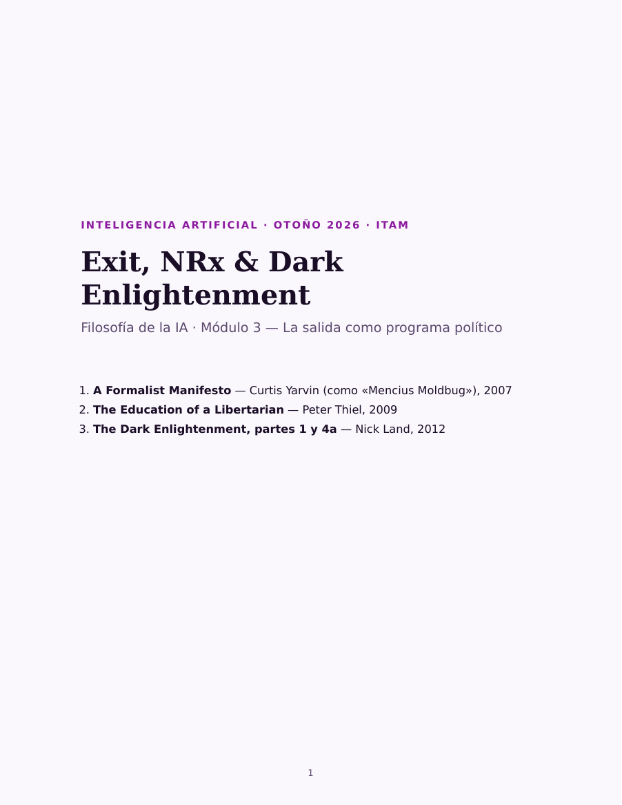

# Exit, NRx & Dark Enlightenment

[[accelerate-what|El módulo 1]] preguntaba **acelerar qué**. [[left-takes-future|El
módulo 2]] preguntaba **quién lo construye**. Este lee a quienes contestan que
las dos preguntas están mal planteadas, porque de la política no se discute: se
sale.

Esa es la posición que en [[ideas-aceleracionismo]] apareció de refilón —Yarvin,
*Patchwork*, la Catedral, el par salida/voz de Hirschman— y que aquí se lee
entera y en su propio idioma. Es también la mitad del árbol que faltaba: cuando
en [[ia-y-sociedad]] viste e/acc en el mapa ideológico, estos son los textos de
los que desciende.

## Qué se lee, y por qué

| # | Lectura | Por qué está aquí |
|---|---|---|
| 1 | **Yarvin** (como «Mencius Moldbug»), «A Formalist Manifesto» (2007) | El argumento en su origen, escrito desde cero y sin suponer nada leído: si el único mal que importa es la violencia, formalizar el poder que ya existe |
| 2 | **Yarvin**, *Patchwork*, cap. 1 (2008) | El mismo autor año y medio después, con el plano en la mano: qué es un parche, quién es su dueño, qué firma quien vive ahí y qué pasa con quien no puede pagar. Es lo que el repaso del módulo 1 nombró sin leer |
| 3 | **Thiel**, «The Education of a Libertarian» (2009) | El mismo argumento en mil doscientas palabras, dicho por alguien que se presenta en el texto como emprendedor e inversionista. Aquí aparece la frase que Land cita en la lectura 4, y que es la soldadura entre las dos |
| 4 | **Land**, *The Dark Enlightenment*, partes 1 y 4a (2012) | La parte 1 lee las anteriores y les pone nombre; la 4a saca la consecuencia que Land cree que se sigue. Se leen juntas a propósito: la segunda no es un desvío de la primera |

## Cómo leer este cuadernillo

Los cuatro textos comparten una forma: aceptan un diagnóstico y declaran
imposible arreglarlo discutiendo. De ahí en adelante se separan, y la diferencia
es la pregunta con la que conviene leerlos: **de qué proponen salirse.** Yarvin
sale de la discusión y se queda —primero escritura el poder, después diseña el
lugar—; Thiel se va de la política entera; Land lee esa salida en un
desplazamiento de gente.

Van en orden cronológico, que aquí sí es el orden en que se entienden. **Yarvin
ocupa las dos primeras**, y no por descuido: en 2007 escribe la tesis y en 2008
la convierte en un diseño con accionistas, contratos y llaves criptográficas.
Léelas seguidas, como una sola pieza en dos tiempos. Thiel lo dice en dos
páginas en 2009. Land, en 2012, **lee a los tres**: cita a Thiel en su quinto
párrafo, resume a Moldbug en extenso y bautiza el conjunto. Leerlo al final te
deja hacer algo mejor que creerle — comparar su resumen con el original.

Está bien no estar de acuerdo con ninguno —lo esperable es que no lo estés—. Lo
que no funciona es rechazarlos sin haberlos entendido: eso deja el argumento
intacto y a ti sin nada que decirle. Llega a la sesión sabiendo en qué paso
concreto se rompe la cadena, no con la conclusión.

## Un aviso sobre la parte 4a de Land

El ensayo de Land tiene diez partes; en el cuadernillo van dos. **La parte 4a
habla de raza en términos que este curso no comparte, y no viene suavizada.**
Trata el despido del periodista John Derbyshire de la revista *National Review*
—ocurrido en 2012, por un artículo suyo en *Taki's Magazine*— **y se pone del
lado de Derbyshire**; lee la llamada *fuga blanca* de las ciudades
estadounidenses como un caso de salida; y trata la herencia biológica como una
de las explicaciones disponibles de las diferencias de conducta entre
poblaciones, con la que explica que unas ciudades sean seguras y otras se hayan
deteriorado.

Está aquí como fuente primaria, no como material que se dé por bueno. Se lee
porque es el punto donde el argumento abstracto de la salida aterriza en algo
concreto, y porque saltárselo dejaría el módulo cómodo y falso: la parte 4a no
es un desvío del ensayo, es su continuación numerada. Puedes leerla con enojo.
Lo que se te pide es poder decir **cuál es el paso del argumento** con el que no
estás de acuerdo, que es distinto de decir que el texto es repugnante.

## El cuadernillo

::: figure {#cuadernillo-modulo-3 title="Las cuatro lecturas en un solo archivo"}

:::

**45 páginas**, cada lectura con su portadilla y la razón por la que se lee.
Sigue siendo el cuadernillo más corto de la unidad: calcula entre una hora y
treinta y cinco y una hora y cincuenta.

- **[Leer en el navegador →](../_assets/visor_modulo_3.html)** — se abre completo,
  sin descargar nada. También puedes hacer clic en la portada de arriba.
- **[Descargar el PDF](../_assets/cuadernillo_modulo_3_exit_nrx.pdf)** — 182 KB,
  para leerlo sin conexión o imprimirlo.

## Sobre las fuentes, y cómo citarlas

Las cuatro son páginas web abiertas. Dos van completas —el manifiesto y
Thiel—, de *Patchwork* va la segunda mitad del capítulo 1, y de Land van dos
partes de las diez del ensayo. **Es el primer módulo de la unidad cuyas lecturas no
se toman de ninguna edición impresa**, así que casi no hay avisos de paginación
que dar. Abierto no quiere decir libre de derechos: las
cuatro siguen siendo de sus autores, y están aquí como material de clase, con la
fuente al pie de cada una.

- **Yarvin, «A Formalist Manifesto»**, se cita por fecha y título: entrada del
  24 de abril de 2007 en *Unqualified Reservations*. El texto viene del archivo
  del blog en
  [unqualified-reservations.org](https://www.unqualified-reservations.org/2007/04/formalist-manifesto-originally-posted/).
- **Yarvin, *Patchwork***, es la única que sí tiene aviso de paginación. Se cita
  como capítulo 1, «A Positive Vision», pp. 7–18 de la recopilación en PDF que
  circula como libro; el texto del cuadernillo viene de la
  [entrada original del 13 de noviembre de 2008](https://www.unqualified-reservations.org/2008/11/patchwork-positive-vision-part-1/),
  que el propio sitio titula ya «Chapter 1: A Positive Vision». Va **la segunda
  mitad del capítulo**: empieza donde el texto deja las anécdotas y se pone a
  diseñar. Y ojo con el final — remite al capítulo 2, que no está aquí.
- **Thiel** se cita como *Cato Unbound*, 13 de abril de 2009. El cuadernillo
  reproduce el ensayo y **no** la nota que la revista añadió después, en la que
  el propio Thiel matiza el pasaje sobre el voto femenino. Esa nota está al pie
  de la misma página y remite a un texto suyo del **1 de mayo de 2009**,
  [«Your Suffrage Isn't in Danger. Your Other Rights Are.»](https://www.cato-unbound.org/2009/05/01/peter-thiel/suffrage-isnt-danger-other-rights-are);
  conviene leerla antes de la sesión, porque de ella se habla en clase.
- **Land** se cita por parte, no por página: partes 1 y 4a de
  *The Dark Enlightenment*. Las otras ocho partes no están en el cuadernillo.
  **Y hay que decir de dónde sale el texto, porque no es de Land.** El sitio
  donde el ensayo se publicó, *xenosystems.net*, ya no existe. El alojamiento
  completo y estable que encontramos es
  [thedarkenlightenment.com](https://www.thedarkenlightenment.com/the-dark-enlightenment-by-nick-land/),
  hecho por un tercero que firma como «Charon» — y que en su propia página
  aclara que **Land se deslindó públicamente de ese sitio**. Que el texto más
  conocido de la neorreacción solo sobreviva en un archivo que su autor
  desautoriza es, por sí mismo, algo que vale la pena notar al citarlo. (Que sea
  «el texto más citado» de la neorreacción es fama, no una cuenta que nadie haya
  hecho; lo que sí se puede decir es que es el que más circula fuera del
  ambiente.)

## Qué hay que hacer

Leer. Como en el módulo anterior, no hay cuestionario ni nada que entregar: la
tarea es llegar a la sesión con las cuatro lecturas leídas.

Sigue con [[las-lecturas-de-la-salida]].
