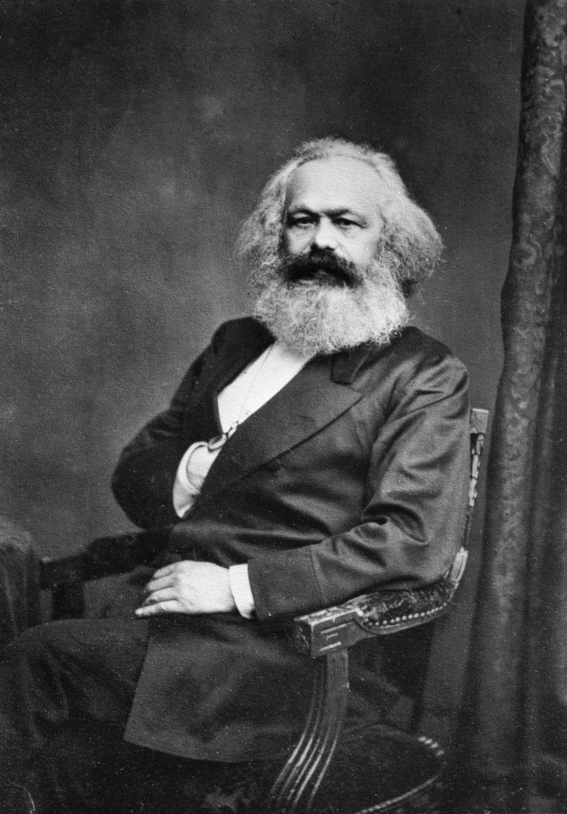
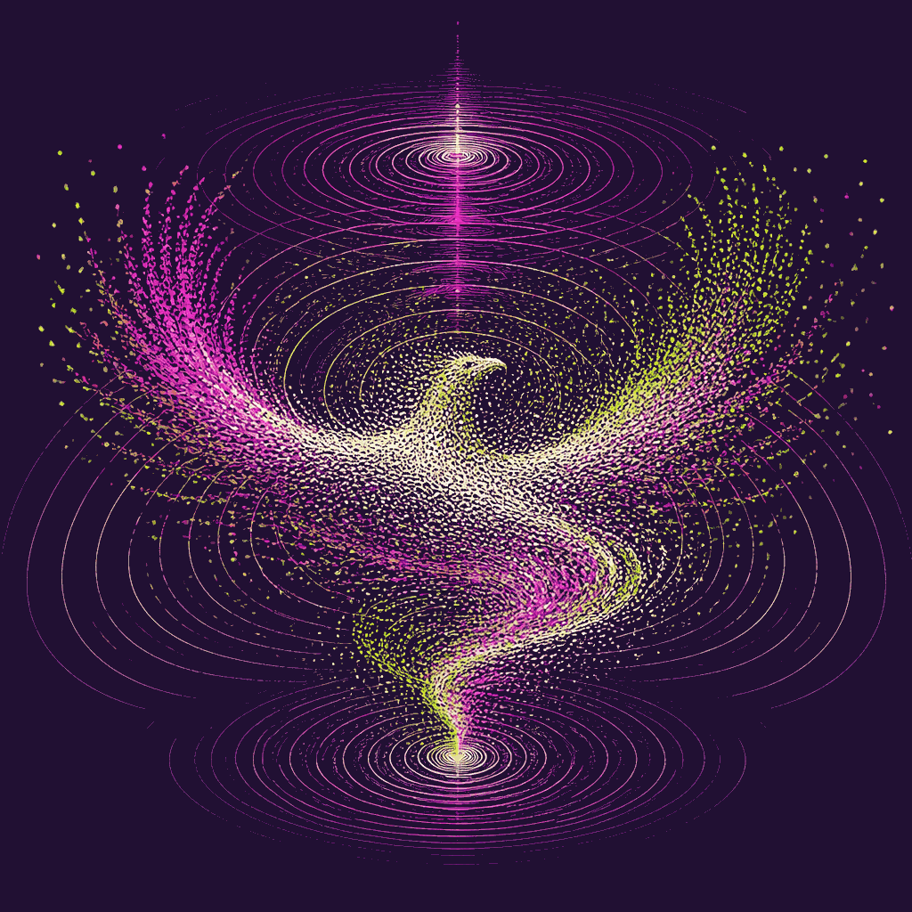
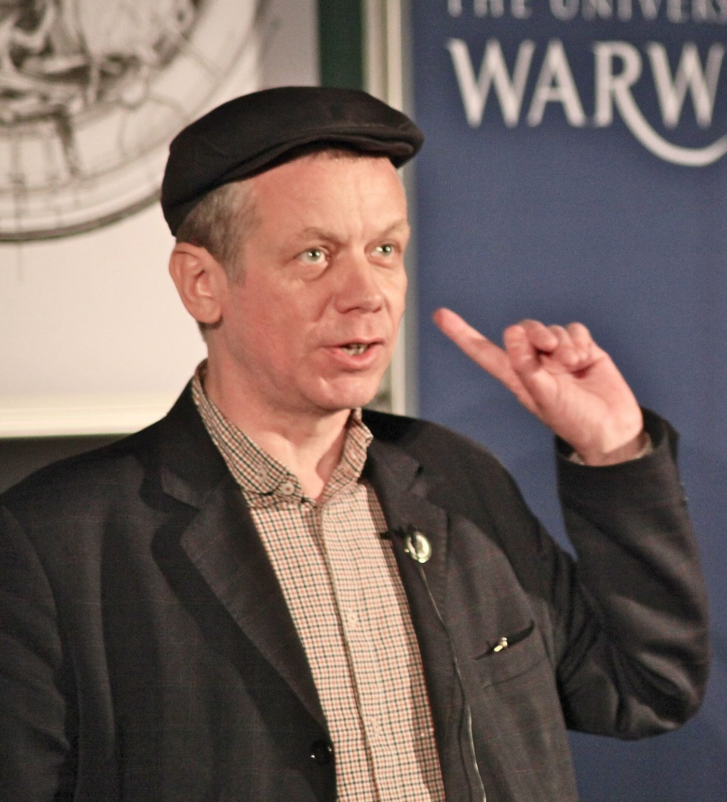

# Las seis lecturas, en claro

**Qué te llevas:** qué dice cada uno de los seis textos, qué concepto aporta,
qué predijo y cómo se ve hoy. ~20 min, ~3–4 min por ficha.

Cada ficha va igual: de qué viene, qué dice, qué concepto aporta, qué predijo y
cómo se ve hoy, la línea que la resume y quién le contesta. El orden es el del
cuadernillo, que no es el cronológico —eso lo explica la genealogía de
[[ideas-aceleracionismo|Las ideas del módulo]].

> **Los campos «Qué predijo» y «Hoy, 2026» de cada ficha tienen fecha de
> corte.** Se escribieron en agosto de 2026, y cada afirmación sobre el
> presente se verificó contra una fuente concreta, anotada en el registro de
> verificación que el repositorio del curso guarda para esta página. El resto de cada
> ficha —qué dice el texto, qué concepto aporta, la cita— no caduca. **Si lees
> esto en un semestre posterior, revisa primero el campo «Hoy, 2026» de cada
> una.**

## 1 de 6 · Marx, *Fragmento sobre las máquinas* (1858) · ~4 min

::: figure {#retrato-marx title="Karl Marx"}

:::

Empieza aquí porque de aquí sale todo lo demás, incluida la palabra
«aceleracionismo», que Marx nunca usó.

**Qué dice en una frase.** Cuando la producción depende del saber social vuelto
máquina y ya no de las horas que pone cada obrero, medir la riqueza en horas
trabajadas se vuelve una contradicción con patas.

**Predijo en 1858.** Que llegaría un punto en que la riqueza dependiera del saber
social depositado en la máquina y no del tiempo de trabajo de cada quien, y que
entonces seguir midiendo el valor en horas trabajadas sería una contradicción
abierta, con el obrero puesto al lado del proceso en vez de dentro de él.

**Hoy, 2026.** **El pleito por los datos llegó a los tribunales, y la
productividad que produce nadie la mide igual.** Los modelos de frontera se
entrenan con texto que reunieron millones de personas que no cobraron por
ello, y el pleito por ese saber ya llegó a los tribunales: en julio de 2026
quedó firme el acuerdo de 1,500 millones de dólares que Anthropic paga a los
autores de cerca de medio millón de libros descargados de bibliotecas
piratas. La medición es lo que sigue sin cuadrar: las estimaciones de cuánta
productividad genera todo esto se separan por un orden de magnitud y ni
siquiera miden lo mismo —0.66% de productividad total de factores en diez
años según Acemoglu, 1.5 puntos porcentuales al año de productividad laboral
según Goldman Sachs— y ninguna se deja convertir en horas-hombre.

**El concepto que aporta.** *General intellect*, y con él la distinción entre
**trabajo vivo** —el que alguien está haciendo ahora— y **trabajo muerto**, el
que ya está congelado en la máquina.

::: figure {#ilus-general-intellect title="El saber colectivo, depositado en la máquina"}

:::

*(Esta imagen es una ilustración generada, no una fotografía ni un dato real.)*

> «The development of fixed capital indicates to what degree general social knowledge has become a direct force of production, and to what degree, hence, the conditions of the process of social life itself have come under the control of the general intellect and been transformed in accordance with it.» — cuadernillo, p. 11

**Quién le contesta.** Nadie, aquí. Deleuze y Guattari le quitan el sujeto
histórico; Fisher lo revive siglo y medio después.

## 2 de 6 · Deleuze y Guattari, *El Anti-Edipo* (1972) · ~3 min

Una página, y es exactamente la página que Land va a citar.

**Qué dice en una frase.** Frente al capitalismo no hay que retirarse ni frenar:
hay que ir más lejos en la descodificación, «acelerar el proceso».

**Predijo en 1972.** Nada, y vale la pena decirlo con todas sus letras: *El
Anti-Edipo* no anuncia un estado futuro del mundo, provoca. Lo más parecido a un
pronóstico es el diagnóstico de que los flujos aún no están suficientemente
descodificados —«todavía no hemos visto nada»—, y eso es un desafío, no algo que
pueda salir bien o mal.

**Hoy, 2026.** Lo fechable no es un acierto sino un uso: la palabra
«aceleracionismo» empezó a circular con Benjamin Noys en 2010, en un libro que
criticaba esa corriente, cuando Guattari llevaba dieciocho años muerto y Deleuze
quince. La frase de esta ficha es hoy la divisa de un movimiento que ellos no
fundaron ni alcanzaron a ver.

**El concepto que aporta.** Desterritorialización.

::: figure {#ilus-desterritorializacion title="El territorio disolviéndose en corriente"}

:::

*(Esta imagen es una ilustración generada, no una fotografía ni un dato real.)*

> «No retirarse del proceso, sino ir más lejos, «acelerar el proceso», como decía Nietzsche: en verdad, en esta materia todavía no hemos visto nada.» — cuadernillo, p. 13

**Quién le contesta.** La discusión no es si la frase existe, sino si Land la
leyó bien: en el original es un gesto nietzscheano dentro de un libro sobre el
deseo, no un programa político. Es la cita más usada fuera de contexto de todo
el cuadernillo.

## 3 de 6 · Land, *Meltdown* (1994) · ~3 min

Land toma la divisa de la lectura anterior y le quita lo que le quedaba de
sujeto.

**Qué dice en una frase.** El capital no es una herramienta que alguien usa: es
un proceso cibernético que se desarma hacia adelante y no tiene quién lo
conduzca.

**Predijo en 1994.** Que la fusión de técnica y economía se aceleraría sola hasta
desarmar el orden social, sin nadie al volante y sin institución capaz de
frenarla: nada humano saldría entero del futuro cercano.

**Hoy, 2026.** Se puede leer que acertó a medias, y la lectura es discutible. La
velocidad y la autonomía del proceso están a la vista; lo que no ocurrió fue que
el Estado se apartara. Desde octubre de 2022 el gobierno de Estados Unidos decide
por reglamento quién puede comprar los chips con los que se entrena un modelo, y
la regla vigente desde enero de 2026 reabre a medias la venta a China con
certificaciones, pruebas de laboratorio y un arancel presidencial de 25%. El
proceso corre rápido, pero pasa por la aduana.

**El concepto que aporta.** Proceso sin sujeto, movido por retroalimentación
positiva.

::: figure {#ilus-meltdown title="Un mecanismo que se derrite hacia adelante, sin quien lo opere"}

:::

*(Esta imagen es una ilustración generada, no una fotografía ni un dato real.)*

> «Logistically accelerating techno-economic interactivity crumbles social order in auto-sophisticating machine runaway.» — cuadernillo, p. 14

**Quién le contesta.** Fisher, en la siguiente ficha, de frente.

## 4 de 6 · Fisher, *Terminator vs Avatar* (2012) · ~3 min

Va aquí y no en su lugar cronológico a propósito: explica a Land mejor que
cualquier introducción.

**Qué dice en una frase.** Acepta el diagnóstico de Land y rechaza su
conclusión: la nostalgia orgánica —el mundo de *Avatar*— no es respuesta, pero
acelerar el capital tampoco es lo mismo que acelerar la técnica.

**Predijo en 2012.** Que si la izquierda no reclamaba para sí la modernidad y la
técnica —si se quedaba en la nostalgia orgánica de *Avatar*—, ese terreno lo
ocuparía quien sí lo quisiera.

**Hoy, 2026.** **Quién terminó ocupando el lugar que Fisher le pedía a la
izquierda.** Se puede leer que es la apuesta que perdió, y no por falta de
intentos: un año después de este ensayo, en 2013, Williams y Srnicek
publicaron el *Manifiesto aceleracionista*, que reclama para la izquierda
justo lo que Fisher pedía. Lo que no consiguió fue el público. Ese lugar en la
conversación lo ocupó el aceleracionismo de derecha: e/acc aparece en 2022 y
en octubre de 2023 el *Manifiesto tecno-optimista* de Marc Andreessen lo pone
por escrito, con Land entre sus santos patronos, la máquina tecno-capital como
motor y el estatismo en la lista de enemigos. Fisher murió en enero de 2017 y
no vio ninguna de las dos cosas.

**El concepto que aporta.** La distinción **capital ≠ tecnología**, que es la
bisagra de todo el cuadernillo y de donde sale el título del módulo: acelerar,
sí, pero **qué**.

> «markets may or may not be the self-organising meshworks described by Fernand Braudel and Manuel Delanda, but what is certain is that capitalism, dominated by quasi-monopolies such as Microsoft and Wal-Mart, is an anti-market.» — cuadernillo, p. 35

**Quién le contesta.** Land, por anticipado: si de verdad no hay sujeto, «usar
la técnica contra el capital» es un deseo sin nadie que pueda ejecutarlo.

## 5 de 6 · CCRU, *Swarmachines* (1996) · ~4 min

La prosa más difícil del cuadernillo, puesta cuando ya tienes el mapa.

**Qué dice en una frase.** Si el capital no tiene sujeto, la resistencia tampoco
necesita uno: no vanguardia ni partido, sino enjambre —contagio, ritmo,
propagación sin centro.

**Predijo en 1996.** Que la acción colectiva tomaría forma de enjambre —sin
vanguardia, sin programa, propagándose por contagio y por ritmo— y que ahí, y no
en la organización, estaría su fuerza.

**Hoy, 2026.** Es la forma normal de la coordinación en red, y no trae política
propia. En enero de 2021 un foro sin líderes movió el precio de una acción lo
suficiente para que la SEC le dedicara un informe entero al episodio; la misma
forma sin centro describe tanto las protestas en red que estudió Zeynep Tufekci
como la movilización de QAnon. El enjambre organiza; qué organiza depende de
quién lo levante.

**El concepto que aporta.** Enjambre y emergencia, los mismos que viste en
[[otras-raices|la página de otras raíces]] como comportamiento colectivo sin
control central.

::: figure {#ilus-enjambre title="El enjambre sin centro que ningún punto dirige"}

:::

*(Esta imagen es una ilustración generada, no una fotografía ni un dato real.)*

> «Only multiplicities, decolonized ants, swarms without strategies, insectoid freeways burrowed through the screens of spectacular time.» — cuadernillo, p. 38

**Quién le contesta.** Barbrook y Cameron, sin nombrarlo: la fantasía de red
horizontal sin poder es justo lo que el valle aprendió a vender.

## 6 de 6 · Barbrook y Cameron, *La ideología californiana* (1995) · ~3 min

::: figure {#retrato-barbrook title="Richard Barbrook"}

:::

Cierra el cuadernillo porque aterriza todo donde sigue el curso.

**Qué dice en una frase.** Silicon Valley funde contracultura hippie con libre
mercado, borra el dinero público que lo hizo posible y descansa sobre trabajo
que no aparece en la foto.

**Predijo en 1995.** Que la mezcla de contracultura y libre mercado se volvería
el sentido común de la industria, que el relato borraría el dinero público que la
hizo posible y que todo descansaría sobre una subclase que no sale en la foto.

**Hoy, 2026.** Es el acierto más limpio del cuadernillo, y quien lo confirma es
el bando descrito: el manifiesto de Andreessen de 2023 celebra la máquina
tecno-capital de mercados e innovación y nombra al estatismo su enemigo, y el
propio Andreessen le dijo después a Ross Douthat, del *New York Times*, que la
ideología californiana era real y correcta. Treinta años después el ensayo se lee
menos como crítica que como descripción.

**El concepto que aporta.** Ideología californiana, y con ella el determinismo
tecnológico: creer que la técnica decide sola hacia dónde va la sociedad.

> «the Californian Ideology promiscuously combines the free-wheeling spirit of the hippies and the entrepreneurial zeal of the yuppies.» — cuadernillo, p. 44

**Quién le contesta.** Nadie del cuadernillo. Contesta ella: describe a e/acc
con treinta años de anticipación.

*No todas las fichas llevan retrato, y no es descuido. De Deleuze, Guattari,
Fisher y Land no encontramos ninguna fotografía cuya licencia pudiéramos
verificar —lo que sí circula son imágenes de prensa bajo derechos de autor, o
subidas a Wikimedia Commons con una licencia que no resiste revisión—, y este
curso solo publica imágenes que puede publicar. Rellenar el hueco con una cara
generada por IA no es opción: sería inventar el rostro de una persona real. De
paso, la asimetría dice algo cierto sobre quién circula con qué permisos.*

Sigue con [[para-discutir]].
