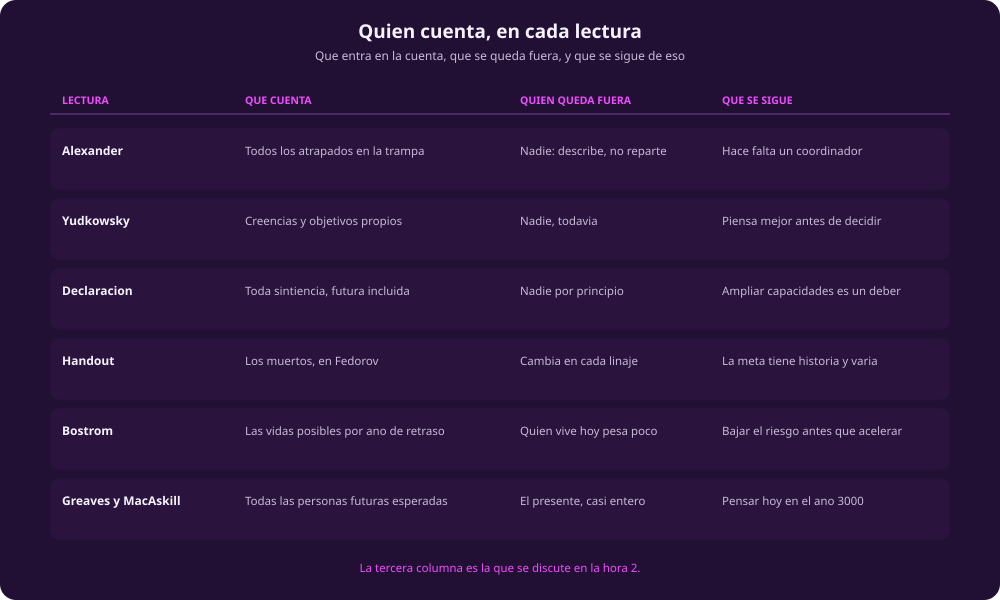

# Discutir el futuro largo

**Qué te llevas:** el mapa que cruza las seis lecturas, y los cinco movimientos
con los que se discuten. Es la **segunda hora** de la sesión, y los minutos de
cada sección son minutos de clase.

## El puente: quién cuenta · ~8 min

::: figure {#quien-cuenta title="Qué cuenta cada lectura, y quién queda fuera"}

:::

Puestas juntas, las seis dejan ver algo que por separado no se nota: **el
tamaño del futuro no está en disputa, y aun así no decide nada solo.** Bostrom
cuenta 10³⁸ vidas perdidas por siglo de retraso; Greaves y MacAskill trabajan
con 10²⁴ personas futuras esperadas; nadie discute los números de nadie. Lo que
separa una conclusión de otra es un paso que no está escrito en ninguna parte:
el de «el futuro es enorme» a «entonces el futuro manda».

Bostrom lo enseña sin querer, en tres párrafos. Su sección II termina en que
casi ninguna otra actividad iguala el rédito de adelantar la colonización un
segundo. Su sección III abre con «However, the true lesson is a different one»
y cierra en «Minimize existential risk!». Entre las dos secciones no cambió una
sola cifra. Cambió qué término se metió en la cuenta.

Ese es el primer hilo. El segundo es el que organiza la hora, y hay que
enunciarlo con cuidado porque es fácil decirlo mal, y decirlo mal lo vuelve
trivial: **quien queda fuera de la cuenta no queda fuera por olvido, sino como
resultado de haber contado bien.**

Las seis lecturas hacen cosas distintas con eso, y la novedad está en las dos
últimas:

- **Greaves y MacAskill sí meten el presente en la cuenta, con número.** El
  mosquitero contra la malaria salva una vida por cada 4000 dólares: 0.025
  vidas por cada 100 dólares. No es que lo ignoren, es que lo midieron, y
  después lo pusieron a competir contra 200 millones. El presente entra a la
  comparación y pierde, y pierde por la elección de las unidades, no por
  descuido. Y anotan algo más: con su estimación restringida —10¹⁴— los
  ejemplos del asteroide y de la pandemia dejan de funcionar. Ellos mismos
  escribieron la cifra que los derrota.
- **Bostrom sí distingue quién cuenta, y la distinción le cambia la política.**
  En su sección IV supone una ética que solo obliga con las personas que existen
  o existirán, y ahí la extinción es mala nada más porque le corta unos cuarenta
  años a cada vida en curso: algo, escribe, del mismo tamaño que la pobreza, el
  hambre y la enfermedad que ya ocurren. Con ese supuesto solo, dice, no hay
  respuesta fácil; y si además le concedes una probabilidad no despreciable a
  que alguien vivo hoy alcance a ver la diáspora cósmica, la recomendación se
  invierte y pasa a ser velocidad. Es el mismo autor, dos maneras de contar,
  dos políticas opuestas.
- **Alexander no reparte, describe.** En la trampa están todos y no queda nadie
  afuera. El trabajador etíope de la plantación de café aparece una vez, cuando
  el robot lo deja en la calle, y aparece como ilustración del mecanismo, no
  como alguien cuya suerte entre en el cálculo.
- **La Declaración incluye a todos y no dice quién decide.** El punto 7 extiende
  el bienestar a toda sintiencia —animales no humanos e intelectos artificiales
  futuros incluidos— y el 6 habla de solidaridad con todas las personas del
  planeta. Nadie queda fuera por principio. Tampoco hay, en los ocho puntos, un
  solo argumento ni una sola indicación de quién tiene autoridad para fijar la
  meta.

Esta figura conviene dejarla proyectada el resto de la hora, junto a la cadena
de [[las-lecturas-del-futuro-largo]].

## Cinco movimientos · ~43 min

> **Cómo se corre la hora.** Por defecto, plenaria con las respuestas anotadas
> en el pizarrón; el movimiento 4 es el único con otra modalidad, y la trae
> escrita. En los movimientos 2, 3 y 5 **no hay que agotar las viñetas**:
> alcanzan dos de cada uno, así que elige las que el grupo pida. Si el tiempo
> aprieta, lo que se recorta es el movimiento 3 —la comparación con los módulos
> anteriores—, que es el que menos depende de haber leído. Y una advertencia
> propia de este módulo: es en el que más gente llega sin terminar, porque
> Moloch son catorce mil palabras. El movimiento 1 sirve también de diagnóstico:
> si el salón no reconstruye la trampa, hay que reconstruirla desde el pizarrón
> antes de seguir.

### 1 · Comprensión · ~6 min

Reconstruir cuatro cosas, sin opinar todavía:

- Qué es una trampa multipolar, en una frase y **sin usar la palabra
  «Moloch»**. Y dos de los catorce ejemplos que da Alexander, de memoria.
- Las cuatro cosas que, según Alexander, hoy nos protegen de las trampas —tres
  malas razones y una buena, y hay que decir cuál es la buena—. Y una quinta:
  de las cuatro, cuál es la única que la tecnología, según él, también puede
  fortalecer.
- La diferencia entre racionalidad epistémica e instrumental en una frase cada
  una, y los dos estándares contra los que Yudkowsky las mide.
- Las tres cifras de la sección 3 de Greaves y MacAskill —principal, baja y
  restringida— y qué escenario corresponde a cada una. Después, la que separa a
  quien leyó la sección 4: de los tres ejemplos que dan, ¿cuál sigue en pie con
  la cifra restringida?

### 2 · Interpretación · ~8 min

Qué quiso decir cada quien, y qué decidió no decir. De aquí en adelante ninguna
pregunta tiene respuesta correcta, y ninguna se contesta con una cita.

- Bostrom hace la aritmética, concluye que hay que acelerar, y tres párrafos
  después la misma aritmética le dice que hay que minimizar el riesgo. ¿La
  cuenta se corrigió sola, o había un juicio previo sobre qué es un desastre que
  la cuenta solo ordenó después? Y antes de contestar: ¿qué término habría que
  meterle a la cuenta para que volviera a salir «acelerar»?
- El argumento de Greaves y MacAskill se sostiene en que basta una credibilidad
  diminuta en el escenario más grande para que ese escenario domine el promedio
  —un 0.01% en la Vía Láctea aporta 10³² y todo lo demás deja de importar—.
  Ellos lo nombran y lo ponen entre los tres puntos más débiles de su propio
  texto. ¿Enunciar la objeción es trabajarla, o es la manera de dejarla anotada
  y seguir usando el número igual? Y antes de contestar: ¿qué tendrías que
  encontrar en el texto para distinguir una cosa de la otra?
- Alexander pasa el ensayo entero mostrando que no existe jardinero fuera del
  sistema, y termina proponiendo uno: una entidad con más del 51% de la fuerza,
  tan por encima de la competencia que puede suprimirla para siempre. Es la
  misma descripción que le dio al monstruo, con el signo cambiado. ¿Es la única
  salida que su diagnóstico permite —si nadie puede coordinar desde adentro, lo
  que coordine tiene que estar afuera—, o el diagnóstico se escribió ya con la
  solución puesta?
- Yudkowsky define la racionalidad instrumental como conseguir lo que valoras, y
  deja los valores fuera del método. Cuando alguien dice «lo racional es X pero
  lo correcto es Y», contesta que está usando mal una de las dos palabras.
  ¿Eso resuelve el problema o lo declara resuelto por definición? Y luego: las
  lecturas 5 y 6 usan este método para llegar a un fin. ¿El método puede decir
  algo sobre ese fin, o solo sobre cómo perseguirlo?
- La Declaración enuncia una meta en ocho puntos y ningún argumento; el apunte
  muestra que esa meta lleva siglo y medio circulando, de Fiódorov al altruismo
  eficaz, cambiando de vocabulario en cada paso. ¿Tener genealogía le quita
  fuerza a una idea, o solo se la quita a la versión que se presenta como
  conclusión de un cálculo reciente?

### 3 · Comparación · ~7 min

Dónde se cruza este módulo con los tres anteriores. Estas tres son las que más
rinden.

- **El mismo monstruo, dos instrucciones opuestas.** Alexander y Land describen
  el mismo proceso ciego que nadie eligió y del que nadie puede salirse solo;
  Alexander lo dice explícitamente, que Land recorrió el 99.9% del camino y
  falló en la última vuelta. Uno concluye que hay que someterse y el otro que
  hay que matarlo. Con [[exit-nrx]] y [[ideas-aceleracionismo]] frescos:
  ¿discrepan sobre los hechos, o sobre qué se hace con un hecho — y si es lo
  segundo, de dónde saca cada uno el «se hace»?
- **La salida contra la coordinación, y una responde a la otra.** El módulo 3
  contesta a la trampa saliéndose: un muro, un parche, un territorio propio.
  Alexander contesta a esa respuesta por adelantado —tu jardín amurallado
  también es parte del cosmos, y o te alcanza la competencia o gastas todo en el
  muro—. ¿Eso refuta el programa de la salida, o solo demuestra que la salida
  tendría que ser global, que es exactamente lo que él llama coordinador?
- **Dos maneras de que el futuro mande sobre el presente.** El manifiesto de
  [[left-takes-future]] quiere reprogramar la infraestructura hacia un futuro
  que todavía no existe, y [[accelerate-what]] preguntaba hacia qué. Greaves y
  MacAskill quieren que el año 3000 decida en qué se gasta cada peso hoy. Los
  dos subordinan el presente a algo que no está. ¿Qué los separa — el contenido
  del futuro, o que uno nombra un sujeto que actúa y puede equivocarse y el otro
  nombra un cálculo que no puede?

### 4 · Desacuerdo · ~14 min

**Primero, tres minutos a solas.** Cada quien escribe el número del eslabón de
la cadena donde cree que el argumento se rompe, y una frase con la razón. No
vale «todos»: hay que elegir uno. Se levantan las manos por número y se anota el
reparto en el pizarrón. Aquí, a diferencia del módulo pasado, el reparto casi
nunca sale disperso: se amontona en el 5 y en el 6. Vale la pena decirlo en voz
alta, porque romper en el 6 aceptando el 5 es la posición más difícil de
sostener de las seis —hay que explicar por qué una enormidad que sí se puede
contar no cuenta—, y quien la eligió tiene trabajo por delante en lo que sigue.

**Después se parte el salón en dos** —basta con dividirlo por el pasillo— y a
cada mitad le toca defender una posición aunque no sea la propia. Cuatro minutos
para preparar, cinco de debate, dos para cerrar.

**La tesis a debate:** «aceptada la suma, el mosquitero pierde: el dinero que
hoy salva una vida tiene que irse a bajar el riesgo de extinción». Una mitad la
defiende con el argumento de la cadena, que es el argumento del texto y está
hecho para ganar esta discusión. La otra sostiene que la comparación está
armada por el lado que gana —el presente entra medido en vidas y el futuro en
órdenes de magnitud— y que las propias lecturas lo conceden: con la cifra
restringida que ellos mismos publican, dos de sus tres ejemplos se caen.

### 5 · Aplicación · ~8 min

Qué cambia esto para la inteligencia artificial, y desde dónde lo miras.

- La sección 4.3 no habla de la IA en abstracto: nombra los laboratorios y las
  fundaciones donde se hace el trabajo de seguridad, y varios de ellos son los
  mismos que entrenan y venden los modelos. ¿Un argumento que concluye «hay que
  financiar seguridad en IA» y sale del entorno de quien construye la IA es un
  conflicto de interés, o es lo que uno esperaría si el argumento fuera cierto,
  que lo vea primero quien está más cerca? Y para no quedarse en la sospecha:
  ¿qué predicen distinto las dos hipótesis?
- Si la competencia entre laboratorios es una trampa multipolar de manual
  —cada uno acorta pruebas porque el que no las acorta llega tarde—, entonces
  del módulo 3 ya sabes que salirse solo es justo lo que la trampa castiga.
  ¿Qué queda: un coordinador con fuerza suficiente, que es la respuesta de
  Alexander y trae su propio problema, o la posibilidad de que esto no sea una
  trampa sino una decisión con responsables identificables?
- Para quien etiqueta datos desde México, en el lugar de la cadena de valor que
  viste en [[ia-y-sociedad]], la cuenta de este módulo lo deja del lado que
  pierde: su daño es medible, ocurre hoy, y en la comparación de la sección 2 se
  enfrenta a un número con veinticuatro ceros. ¿Es un defecto del argumento, o
  una consecuencia que sus autores aceptarían sin incomodarse? Y si es lo
  segundo, que es lo más probable: ¿qué le contestas a alguien que ya aceptó el
  costo y te está dando el número?

## Síntesis · ~4 min

Tres cosas quedan sin resolver, y conviene salir sabiendo cuáles son:

1. **Dónde deja de ser aritmética.** El paso de «el futuro es enorme» a «entonces
   el futuro manda» no aparece como paso en ninguna de las seis lecturas:
   aparece ya como conclusión. La prueba de que no es aritmético la da el propio
   Bostrom, que con las mismas cifras llega primero a acelerar y después a
   frenar.
2. **Quién está autorizado a contar.** Ninguna de las seis lecturas tiene un
   argumento sobre esto, y ninguna lo necesita, que es precisamente el problema:
   la cuenta se presenta como si no fuera de nadie. Pero es de alguien. Bostrom
   firma la Declaración en 1998 y hace la aritmética en 2003; Alexander discute
   con Land y cita el libro de Bostrom; Greaves y MacAskill citan a Bostrom en
   la primera página. Son pocos y se leen entre ellos.
   Eso no vuelve falsas las cifras. Sí deja abierta la pregunta de qué se
   contaría distinto si contara alguien más.
3. **La diferencia entre que te importe el futuro y que su tamaño decida el
   presente.** Nadie en el salón está en contra de lo primero. Lo segundo es una
   tesis distinta y mucho más fuerte, y ninguna de las seis lecturas marca en
   qué renglón se pasa de una a la otra.

El módulo 1 preguntaba **acelerar qué**. El módulo 2, **quién lo construye**. El
módulo 3, **quién se queda**. Este pregunta **quién cuenta**, y mueve el
terreno: los otros tres discutían qué hacer con el presente, y este sostiene que
el presente no es donde se decide. La unidad te deja lo mismo en los cuatro
módulos, ahora sobre una cadena de seis eslabones: saber en qué paso concreto no
estás de acuerdo, y poder decirlo.

Lo que sigue en el temario no es otro cuadernillo. Es «Agentes, ambientes,
modelado y optimización», y todavía no está escrito.

Con esto cierra la unidad de filosofía. El calendario de lo que sigue está en la
[página de inicio](raya:course-root).
