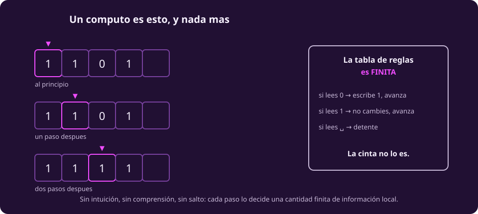
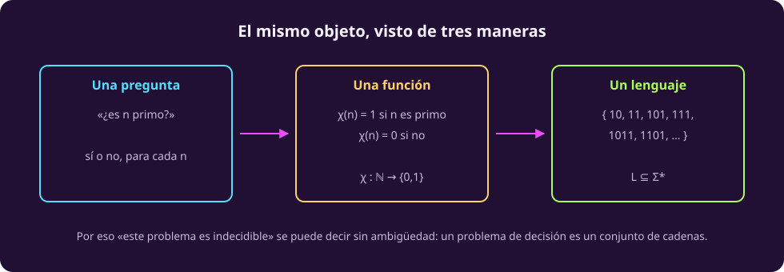

# Qué es el cómputo

La pregunta de esta unidad es qué puede calcular una máquina. Antes de poder
contestarla hay que decir qué cuenta como calcular — y la respuesta es más
pequeña y más rígida de lo que parece.

> [!NOTE]
> **Un cómputo es una transformación de símbolos por reglas finitas, en pasos
> discretos, donde cada paso queda enteramente determinado por una cantidad
> finita de información local.**

Sin intuición. Sin comprensión. Sin salto. Esa frase se ve modesta y es el
cimiento de todo lo demás: en la página 6 vamos a usarla para decir que **una
demostración matemática también es un cómputo**, y de ahí sale el resultado más
famoso de la unidad.

::: figure {#comp-esencia title="Un cómputo es esto, y nada más"}

:::

Fíjate en el reparto de la figura: **la tabla de reglas es finita; la cinta de
símbolos no lo es.** Ese contraste va a reaparecer, ya con nombre propio, en la
página siguiente.

::: figure {#ilus-simbolos title="Símbolos que se transforman, y nada más"}

:::

*(Esta imagen es una ilustración generada, no una fotografía ni un dato real.)*

## El vocabulario mínimo

Son cuatro objetos y se definen en cascada: cada uno usa el anterior. Vale la
pena leerlos despacio una vez, porque el resto de la unidad los da por sabidos.

::: definition {#comp-alfabeto title="Alfabeto"}
Un **alfabeto** $\Sigma$ es un conjunto finito y no vacío de símbolos.

Ejemplo: $\Sigma = \{0,1\}$. También vale $\Sigma = \{a, b, c\}$, o el conjunto
de caracteres de tu teclado. Lo único que importa es que sean **finitos**.
:::

::: definition {#comp-cadena title="Cadena"}
Una **cadena** sobre $\Sigma$ es una sucesión finita de símbolos de $\Sigma$.

$0110$ es una cadena sobre $\{0,1\}$, y su longitud es $\lvert 0110\rvert = 4$.
La **cadena vacía** se escribe $\varepsilon$ y tiene longitud $0$: no es «nada»,
es una cadena legítima con cero símbolos, igual que $0$ es un número legítimo.
:::

::: definition {#comp-sigma-estrella title="El conjunto de todas las cadenas"}
$\Sigma^*$ es el conjunto de **todas** las cadenas finitas sobre $\Sigma$,
$\varepsilon$ incluida.

Para $\Sigma=\{0,1\}$:
$\Sigma^* = \{\varepsilon,\ 0,\ 1,\ 00,\ 01,\ 10,\ 11,\ 000,\ \dots\}$

$\Sigma^*$ es infinito, pero **cada cadena suya es finita**. No hay cadenas de
longitud infinita: eso es otro objeto y no vive aquí.
:::

::: definition {#comp-lenguaje title="Lenguaje"}
Un **lenguaje** sobre $\Sigma$ es cualquier subconjunto $L \subseteq \Sigma^*$.

Cualquiera. No tiene que tener regla, ni patrón, ni sentido. El conjunto de
cadenas que empiezan con $0$ es un lenguaje; el conjunto de las que a ti te
caen bien también.
:::

Y una quinta que no es de este tema pero que la página 5 va a necesitar, y que
conviene tener desde ahora para no encontrársela de golpe:

::: definition {#comp-numerable title="Numerable"}
Un conjunto es **numerable** si sus elementos se pueden poner en una lista
$x_1, x_2, x_3, \dots$ de modo que **todo** elemento aparezca en alguna posición.

Los naturales lo son, por definición. Los enteros también, alternando
($0, 1, -1, 2, -2, \dots$). Y $\Sigma^*$ también lo es — lo veremos con una lista
concreta en [[todo-es-un-numero|Todo es un número]].
:::

> [!WARNING]
> **Tres notaciones que chocan con lo que ya sabes**, y conviene desactivar la
> lectura equivocada de una vez:
>
> - El `*` de $\Sigma^*$ **no multiplica** ni es un comodín de archivos. Se llama
>   *estrella de Kleene* y significa «todas las sucesiones finitas de».
> - El exponente de $0^n1^n$ es **repetición**, no potencia: $0^3 = 000$, no $8$.
> - En toda esta unidad $\mathbb{N} = \{0, 1, 2, \dots\}$, **con el cero**.

## Un problema es un lenguaje

Aquí está el giro que carga con el resto de la unidad, y es puramente
notacional — pero cambia lo que se puede decir.

Piensa en una pregunta de sí o no: *«¿es $n$ un número primo?»*. Esa pregunta
parece un objeto vago, con aire alrededor. No lo es. Escribe cada número en
binario y junta los que son primos:

$$
L_{\text{primos}} = \{\, w \in \{0,1\}^* : w \text{ es la escritura binaria de un primo} \,\}
$$

$$
L_{\text{primos}} = \{\, 10,\ 11,\ 101,\ 111,\ 1011,\ 1101,\ \dots \,\}
$$

Contestar «¿es $n$ primo?» es exactamente lo mismo que contestar «¿está esta
cadena en $L_{\text{primos}}$?». No se parece: **es lo mismo**.

::: figure {#comp-tres-vistas title="El mismo objeto, visto de tres maneras"}

:::

Y esto vale para toda pregunta de sí o no, no solo para los primos:

| La pregunta | El lenguaje |
|---|---|
| ¿Es $n$ primo? | las escrituras binarias de los primos |
| ¿Este programa tiene un error de sintaxis? | los textos que **no** compilan |
| ¿Estas dos gráficas son la misma con otros nombres? | los pares de gráficas isomorfas |
| ¿Este programa termina alguna vez? | *ése es el de la página 5* |

**Por qué importa.** Porque a partir de ahora, cuando digamos «este problema no
se puede resolver», no vamos a estar diciendo algo vago sobre dificultad.
Vamos a estar diciendo algo preciso sobre un **conjunto de cadenas**: que no
existe ninguna máquina capaz de separarlo del resto. Eso es lo que permite
demostrarlo en lugar de discutirlo.

## Ejercicios

::: exercise {#comp-ej-lenguajes title="Escribe el lenguaje"}
Para cada pregunta, escribe el lenguaje correspondiente sobre $\Sigma=\{0,1\}$
usando la notación de conjuntos, y da tres cadenas que le pertenezcan.

1. ¿La cadena tiene una cantidad par de unos?
2. ¿La cadena es un palíndromo?
:::

::: answer {#comp-resp-lenguajes of="comp-ej-lenguajes"}
1. $L = \{\, w \in \{0,1\}^* : w \text{ tiene una cantidad par de } 1 \,\}$.
   Pertenecen $\varepsilon$ (cero unos, y cero es par), $00$, $11$, $0110$.
   Ojo con $\varepsilon$: es el caso que casi siempre se olvida.
2. $L = \{\, w \in \{0,1\}^* : w = w^R \,\}$, donde $w^R$ es $w$ al revés.
   Pertenecen $\varepsilon$, $0$, $010$, $1001$.
:::

::: exercise {#comp-ej-vacio title="Dos lenguajes que se parecen y no son iguales"}
¿Cuál es la diferencia entre el lenguaje $\emptyset$ y el lenguaje
$\{\varepsilon\}$? ¿Cuántos elementos tiene cada uno?
:::

::: answer {#comp-resp-vacio of="comp-ej-vacio"}
$\emptyset$ es el lenguaje **sin ninguna cadena**: tiene $0$ elementos.
$\{\varepsilon\}$ es el lenguaje que contiene **una** cadena, la vacía: tiene
$1$ elemento.

Es la misma distinción que entre una caja vacía y una caja que contiene una hoja
en blanco. En la página 3 esta diferencia va a decidir si una máquina acepta o
rechaza, así que no es un tecnicismo.
:::

## A dónde va esto

Ya tenemos qué es calcular y qué es un problema. Falta la máquina que calcula, y
esa es [[maquina-de-turing|la página siguiente]]: la definición formal de lo que
una computadora puede hacer, con una máquina de juguete completa que vas a poder
seguir paso por paso.
