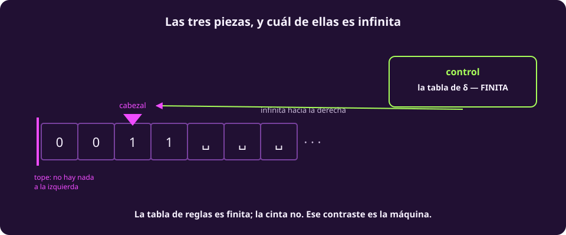
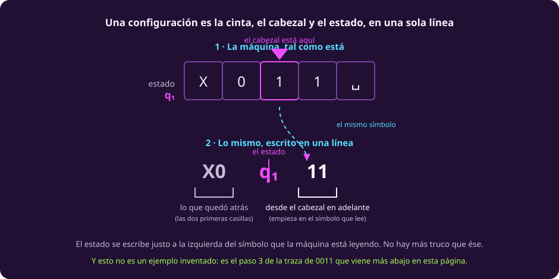
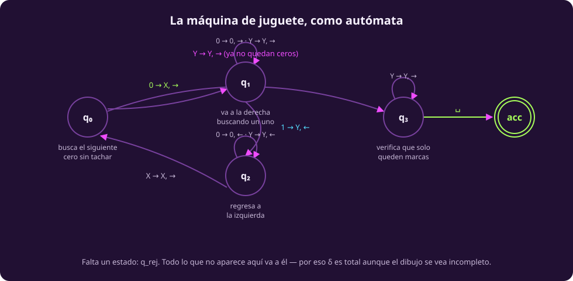

# La máquina de Turing

Esta es la página más larga de la unidad y la única que hay que leer entera y
despacio. Todo lo que viene después habla de este objeto.

El orden es deliberado: **primero qué hace la máquina en español, después en
símbolos.** Si empiezas por la tabla de reglas no vas a entender qué está
pasando, y no es culpa tuya.

## Qué contesta la máquina de juguete

Vamos a construir una máquina que contesta **una sola pregunta**:

> *¿Lo que me diste son unos cuantos ceros seguidos de exactamente la misma
> cantidad de unos?*

| Acepta | Rechaza | Por qué rechaza |
|---|---|---|
| `01` | `001` | sobra un cero |
| `0011` | `00111` | sobra un uno |
| `000111` | `0101` | están intercalados, no en bloques |
| | `ε` (la cadena vacía) | pedimos al menos un par |

En la notación de la página anterior, el lenguaje que decide es

$$L = \{\, 0^n1^n : n \ge 1 \,\}$$

Recuerda que el exponente es **repetición**: $0^31^3 = 000111$.

**Si programas, tienes un ancla.** Es el caso más simple de *verificar
paréntesis balanceados*: un solo nivel de anidamiento, todos los que abren antes
que todos los que cierran. Sirve para ubicarte, pero ojo con la analogía —
`()()`, que sería `0101`, **está balanceado y esta máquina lo rechaza**. El
lenguaje de los paréntesis balanceados es más grande; éste es su caso más chico.

## La estrategia, sin notación

Antes de ver una sola regla, la idea completa:

> **La máquina no puede contar.** No tiene dónde guardar un número. Lo que hace
> es **emparejar**: tacha un cero, camina a la derecha hasta encontrar un uno, lo
> tacha, regresa a la izquierda, y repite. Si al final todo quedó emparejado,
> acepta.

Esa frase —*no puede contar, así que empareja*— es la que hay que llevarse de
esta página. Explica por qué la cinta es indispensable: **la memoria no está en
los estados, está en las marcas que va dejando.** Los estados son unos pocos y
fijos; las marcas son tantas como haga falta.

## El mismo algoritmo, como programa

Si te sirve verlo en código antes que en símbolos:

```python
def acepta(w):                     # w es una cadena de '0' y '1'
    i, j = 0, len(w) - 1           # un dedo en cada extremo
    while i < j:
        if w[i] != '0' or w[j] != '1':
            return False           # el emparejamiento falló
        i, j = i + 1, j - 1
    return len(w) > 0 and i == j + 1
```

> [!NOTE]
> **El programa hace trampa, y vale la pena saber cuál.** Usa dos índices y
> salta de un extremo al otro. La máquina solo puede moverse **una casilla a la
> vez**, así que tiene que caminar de ida y de vuelta cada vez.
>
> Es el mismo algoritmo con distinto presupuesto de movimiento — y esa
> diferencia es de **eficiencia**, no de computabilidad. Las dos resuelven
> exactamente el mismo problema. Esta unidad trata de qué se puede resolver, no
> de cuánto cuesta.

## Ahora sí, la definición formal

::: definition {#comp-mt title="Máquina de Turing"}
Una **máquina de Turing** es una tupla de siete componentes

$$M = (Q,\ \Sigma,\ \Gamma,\ \delta,\ q_0,\ q_{\text{acc}},\ q_{\text{rej}})$$

donde

- $Q$ es un conjunto **finito** de estados;
- $\Sigma$ es el alfabeto de entrada, con $\sqcup \notin \Sigma$;
- $\Gamma \supseteq \Sigma$ es el alfabeto de cinta, con el símbolo blanco
  $\sqcup \in \Gamma$;
- $q_0 \in Q$ es el estado inicial, y $q_{\text{acc}}, q_{\text{rej}} \in Q$ son
  los estados de aceptación y de rechazo, con $q_{\text{acc}} \ne q_{\text{rej}}$;
- $\delta$ es la **función de transición**:

$$\delta : (Q \setminus \{q_{\text{acc}}, q_{\text{rej}}\}) \times \Gamma \longrightarrow Q \times \Gamma \times \{\leftarrow, \rightarrow\}$$

Es decir: dado un estado y el símbolo que se está leyendo, $\delta$ dice a qué
estado pasar, qué escribir en esa casilla, y hacia dónde mover el cabezal.
:::

::: figure {#comp-anatomia title="Las tres piezas, y cuál de ellas es infinita"}

:::

Tres cosas que la definición no dice en voz alta y conviene subrayar:

- **La tabla de reglas es finita; la cinta no.** $Q$ y $\Gamma$ son finitos, así
  que $\delta$ es una tabla con una cantidad finita de renglones. La cinta, en
  cambio, es infinita hacia la derecha. Ese contraste *es* la máquina.
- **La cinta es infinita hacia la derecha y tiene tope izquierdo.** Si $\delta$
  ordena moverse a la izquierda estando en la casilla más izquierda, el cabezal
  se queda donde está.
- **$\delta$ excluye de su dominio a $q_{\text{acc}}$ y $q_{\text{rej}}$.** Al
  llegar a uno de ellos, la máquina se detiene: no hay regla que aplicar.

### Cómo se escribe una configuración

Una **configuración** es una fotografía del cómputo completo: qué hay en la
cinta, dónde está el cabezal y en qué estado está la máquina. Se escribe como
una sola cadena, $u\,q\,v$.

::: figure {#comp-configuracion title="Cómo se lee una configuración"}

:::

El estado va escrito **justo a la izquierda del símbolo que la máquina está
leyendo**. Así, $X0\,q_1\,11$ dice tres cosas a la vez: en la cinta está escrito
`X011`, la máquina está en el estado $q_1$, y el cabezal está parado sobre el
primer `1` — el que sigue inmediatamente al estado. La configuración inicial con
entrada $w$ es simplemente $q_0 w$: todo a la derecha, nada atrás.

Y con eso ya se puede decir qué acepta una máquina:

::: definition {#comp-lenguaje-de-m title="El lenguaje de una máquina"}
$L(M) = \{\, w \in \Sigma^* : M \text{ acepta } w \,\}$

es el conjunto de todas las cadenas que $M$ acepta.
:::

### Tres desenlaces, no dos

Al correr $M$ sobre una entrada puede pasar una de tres cosas:

1. llega a $q_{\text{acc}}$ — **acepta**;
2. llega a $q_{\text{rej}}$ — **rechaza**;
3. **no llega a ninguno de los dos, y corre para siempre.**

El tercero no es una patología ni un descuido de la definición: es el desenlace
que hace posible toda esta unidad. Sin él no habría nada que demostrar en las
páginas 5 y 7.

## La máquina, completa

$$Q = \{q_0, q_1, q_2, q_3, q_{\text{acc}}, q_{\text{rej}}\}, \qquad
\Sigma = \{0,1\}, \qquad
\Gamma = \{0, 1, X, Y, \sqcup\}$$

$X$ y $Y$ son las marcas: $X$ tacha un cero, $Y$ tacha un uno. No están en
$\Sigma$ porque nunca aparecen en la entrada; los inventa la máquina.

Cada estado tiene un trabajo, y con eso la tabla se lee sola:

| Estado | Qué está haciendo |
|---|---|
| $q_0$ | busca el siguiente cero sin tachar |
| $q_1$ | va a la derecha buscando un uno |
| $q_2$ | regresa a la izquierda |
| $q_3$ | verifica que solo queden marcas |

Y ésta es $\delta$ completa:

::: table {#comp-delta title="La función de transición de la máquina de juguete"}
| $\delta$ | 0 | 1 | X | Y | $\sqcup$ |
|---|---|---|---|---|---|
| $q_0$ | $(q_1,X,\rightarrow)$ | $q_{\text{rej}}$ | — | $(q_3,Y,\rightarrow)$ | $q_{\text{rej}}$ |
| $q_1$ | $(q_1,0,\rightarrow)$ | $(q_2,Y,\leftarrow)$ | — | $(q_1,Y,\rightarrow)$ | $q_{\text{rej}}$ |
| $q_2$ | $(q_2,0,\leftarrow)$ | — | $(q_0,X,\rightarrow)$ | $(q_2,Y,\leftarrow)$ | — |
| $q_3$ | $q_{\text{rej}}$ | $q_{\text{rej}}$ | — | $(q_3,Y,\rightarrow)$ | $q_{\text{acc}}$ |
:::

> [!NOTE]
> **Dos convenios de lectura de esa tabla.**
>
> Cuando el destino es $q_{\text{acc}}$ o $q_{\text{rej}}$ escribimos solo el
> estado, y no la terna completa: qué escriba y hacia dónde se mueva ya no
> importa, porque ahí se detiene.
>
> Las celdas «—» también van a $q_{\text{rej}}$, pero son **inalcanzables**: esas
> combinaciones de estado y símbolo nunca ocurren en ningún cómputo. $\delta$ es
> total —está definida para todo par— aunque parte de ella nunca se use. Que sean
> exactamente esas cinco está verificado corriendo la máquina sobre las 524 287
> cadenas de hasta 18 símbolos.

::: figure {#comp-automata title="La máquina de juguete, como autómata"}

:::

## La traza que acepta

Entrada `0011`. Trece configuraciones, doce transiciones. El símbolo que la
máquina está leyendo va **en negritas**.

::: table {#comp-traza-acepta title="Cómputo completo sobre 0011, hasta aceptar"}
| # | Configuración | Regla | Qué está haciendo |
|---:|---|---|---|
| 1 | $q_0\,\mathbf{0}011$ | $(q_1,X,\rightarrow)$ | tacha el primer 0 y sale a buscar un 1 |
| 2 | $X\,q_1\,\mathbf{0}11$ | $(q_1,0,\rightarrow)$ | pasa de largo los 0 sin tocarlos |
| 3 | $X0\,q_1\,\mathbf{1}1$ | $(q_2,Y,\leftarrow)$ | encontró un 1: lo tacha y da la vuelta |
| 4 | $X\,q_2\,\mathbf{0}Y1$ | $(q_2,0,\leftarrow)$ | regresa hacia la izquierda |
| 5 | $q_2\,\mathbf{X}0Y1$ | $(q_0,X,\rightarrow)$ | topó con la marca: vuelve a empezar |
| 6 | $X\,q_0\,\mathbf{0}Y1$ | $(q_1,X,\rightarrow)$ | tacha el segundo 0 |
| 7 | $XX\,q_1\,\mathbf{Y}1$ | $(q_1,Y,\rightarrow)$ | pasa de largo los 1 ya tachados |
| 8 | $XXY\,q_1\,\mathbf{1}$ | $(q_2,Y,\leftarrow)$ | tacha el segundo 1 |
| 9 | $XX\,q_2\,\mathbf{Y}Y$ | $(q_2,Y,\leftarrow)$ | regresa |
| 10 | $X\,q_2\,\mathbf{X}YY$ | $(q_0,X,\rightarrow)$ | topó con la marca |
| 11 | $XX\,q_0\,\mathbf{Y}Y$ | $(q_3,Y,\rightarrow)$ | ya no quedan 0: pasa a verificar |
| 12 | $XXY\,q_3\,\mathbf{Y}$ | $(q_3,Y,\rightarrow)$ | verifica que solo queden marcas |
| 13 | $XXYY\,q_3\,\sqcup$ | $q_{\text{acc}}$ | fin de cinta sin sobrantes: **acepta** |
:::

**Aceptó porque los dos bloques se emparejaron exactamente**: cada cero encontró
su uno, y al terminar no sobró ninguno de los dos.

## La traza que rechaza

Entrada `001`, que tiene un cero de más. Ocho pasos.

::: table {#comp-traza-rechaza title="Cómputo completo sobre 001, hasta rechazar"}
| # | Configuración | Regla | Qué está haciendo |
|---:|---|---|---|
| 1 | $q_0\,\mathbf{0}01$ | $(q_1,X,\rightarrow)$ | tacha el primer 0 |
| 2 | $X\,q_1\,\mathbf{0}1$ | $(q_1,0,\rightarrow)$ | pasa de largo |
| 3 | $X0\,q_1\,\mathbf{1}$ | $(q_2,Y,\leftarrow)$ | tacha el 1 y da la vuelta |
| 4 | $X\,q_2\,\mathbf{0}Y$ | $(q_2,0,\leftarrow)$ | regresa |
| 5 | $q_2\,\mathbf{X}0Y$ | $(q_0,X,\rightarrow)$ | topó con la marca |
| 6 | $X\,q_0\,\mathbf{0}Y$ | $(q_1,X,\rightarrow)$ | tacha el segundo 0 y sale a buscar su 1 |
| 7 | $XX\,q_1\,\mathbf{Y}$ | $(q_1,Y,\rightarrow)$ | pasa de largo el 1 ya tachado |
| 8 | $XXY\,q_1\,\sqcup$ | $q_{\text{rej}}$ | buscaba un 1 y encontró el fin de cinta: **rechaza** |
:::

**Rechazó porque había más ceros que unos.** En el paso 8 estaba en $q_1$ —o
sea, buscando un uno— y lo que encontró fue el final de la cinta.

> [!WARNING]
> **No compares las dos tablas renglón contra renglón.** Se aplican las mismas
> seis reglas en los primeros seis pasos, sí — pero las **configuraciones son
> distintas desde el paso 1**, porque las entradas son distintas. Lo que se
> repite es el procedimiento, no la cinta.

## Ejercicios

::: exercise {#comp-ej-traza title="Traza tú"}
Corre la máquina sobre `000111` hasta el paso 6, escribiendo la configuración
completa en cada paso. ¿En qué estado está y qué está leyendo al llegar ahí?
:::

::: hint {#comp-pista-traza of="comp-ej-traza" title="Por dónde empezar"}
Los primeros cinco pasos son estructuralmente los mismos que en `0011`: tachar
el primer cero, caminar a la derecha hasta el primer uno, tacharlo y volver. Lo
único que cambia es que hay más ceros que atravesar.
:::

::: answer {#comp-resp-traza of="comp-ej-traza"}
1. $q_0\,\mathbf{0}00111 \to$ tacha
2. $X\,q_1\,\mathbf{0}0111 \to$ pasa
3. $X0\,q_1\,\mathbf{0}111 \to$ pasa
4. $X00\,q_1\,\mathbf{1}11 \to$ tacha el 1, da la vuelta
5. $X0\,q_2\,\mathbf{0}Y11 \to$ regresa
6. $X\,q_2\,\mathbf{0}0Y11$

Al llegar al paso 6 está en $q_2$ —regresando a la izquierda— y está leyendo un
`0`. En total, `000111` acepta en 25 pasos.
:::

::: exercise {#comp-ej-intercalado title="Por qué 0101 no pasa"}
La cadena `0101` tiene dos ceros y dos unos. ¿Por qué la máquina la rechaza?
¿En qué estado se cae, y por qué?
:::

::: answer {#comp-resp-intercalado of="comp-ej-intercalado"}
Rechaza en 5 pasos. Tacha el primer `0`, camina a la derecha, encuentra el
primer `1` y lo tacha, regresa, y vuelve a $q_0$ — que espera encontrar un cero
sin tachar. Pero lo que hay en esa posición es un `0` seguido de un `1`… el
problema aparece al volver a $q_0$ leyendo un símbolo que no es ni `0` ni `Y`.

La lección: la máquina no cuenta ceros y unos, **verifica que estén en dos
bloques**. Por eso `0101`, que tiene la misma cantidad de cada uno, no pertenece
al lenguaje — y por eso la analogía con los paréntesis balanceados no es exacta.
:::

## A dónde va esto

Ya tenemos la máquina. Falta decir con precisión qué significa que resuelva un
problema — y ahí aparece una distinción que casi todo el mundo se salta y que es
la que hace interesante al resto de la unidad. Es
[[computabilidad-y-decidibilidad|la página siguiente]].
