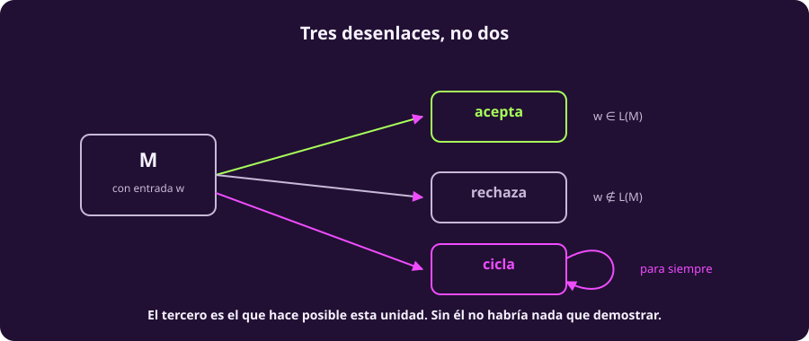
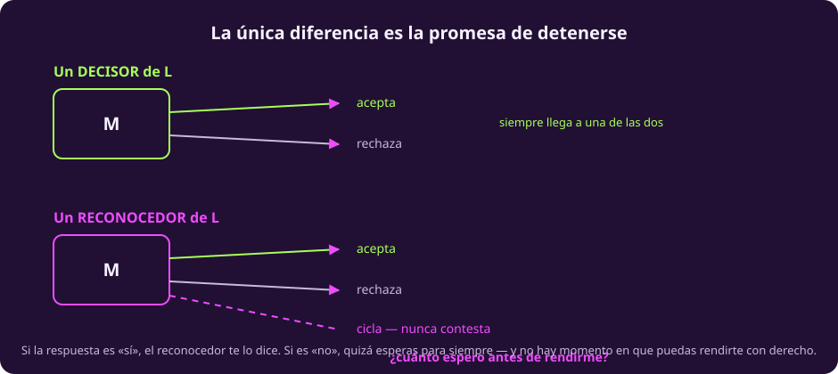
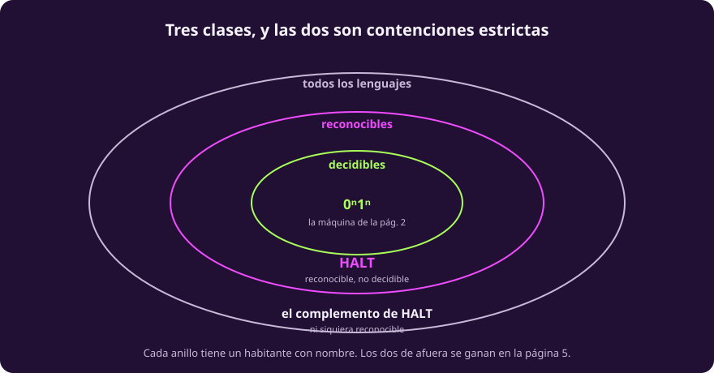

# Computabilidad y decidibilidad

Ya tenemos la máquina. Falta decir con precisión qué significa que **resuelva**
un problema — y resulta que no hay una sola respuesta, sino dos, y la diferencia
entre ellas es lo que hace interesante al resto de la unidad.

Antes de nada, un objeto concreto al que agarrarse, porque las tres definiciones
que siguen se leen mucho mejor contra una máquina que ya conoces que contra una
$M$ genérica:

> [!NOTE]
> **$\{0^n1^n\}$ es decidible, y la máquina de la página anterior es la
> demostración.** Se detiene con toda entrada —lo verificamos sobre medio millón
> de cadenas— y acepta exactamente las que pertenecen al lenguaje. Cada vez que
> abajo diga «existe una máquina tal que…», piensa en ésa.

## Las tres definiciones

::: definition {#comp-funcion-computable title="Función computable"}
Una función $f : \Sigma^* \to \Sigma^*$ es **computable** si existe una máquina
de Turing $M$ tal que, para toda entrada $w$, $M$ **se detiene** y deja en la
cinta **exactamente** $f(w)$, seguida de blancos.

En una frase: *hay un programa que la calcula, y siempre termina.*
:::

Nótese el «exactamente». Sin él la definición no dice nada: cualquier máquina
que deje basura a la derecha «tiene $f(w)$ escrita en la cinta» en algún sentido.

::: definition {#comp-decidible title="Lenguaje decidible"}
Un lenguaje $L \subseteq \Sigma^*$ es **decidible** si existe una máquina $M$ que
**se detiene con toda entrada** y cumple $L(M) = L$.

En una frase: *hay un programa que contesta sí o no, siempre.*
:::

::: definition {#comp-reconocible title="Lenguaje reconocible"}
Un lenguaje $L$ es **reconocible** si existe una máquina $M$ con $L(M) = L$.

Sobre una cadena $w \notin L$, esa máquina puede rechazar **o ciclar para
siempre**. No se le exige detenerse.

En una frase: *si la respuesta es sí, te enteras; si es no, quizá esperas para
siempre.*
:::

> [!WARNING]
> **La única diferencia entre decidible y reconocible es la promesa de
> detenerse.** Las dos definiciones aceptan exactamente las mismas cadenas. Lo
> que cambia es qué pasa con las que *no* están en el lenguaje.

::: figure {#comp-tres-desenlaces title="Tres desenlaces, no dos"}

:::

::: figure {#comp-decidir-vs-reconocer title="Decisor y reconocedor, sobre la misma entrada"}

:::

Y ahí está la pregunta que hace que reconocible **no baste**: si llevas tres
horas esperando, ¿es que la respuesta es «no», o es que todavía no termina? No
hay manera de saberlo, y no hay ningún momento en el que puedas rendirte con
derecho.

### Los nombres que vas a encontrar afuera

La misma cosa tiene varios nombres según el libro. Conviene reconocerlos:

| En esta unidad | También se dice |
|---|---|
| decidible | **recursivo** |
| reconocible | **semidecidible**, **recursivamente enumerable** (r.e.) |

> [!WARNING]
> **«Recursivamente enumerable» no es «numerable» más algo.** Son cosas
> distintas y la coincidencia de palabras confunde a todo el mundo.
>
> **Todo** lenguaje es numerable como conjunto de cadenas — es un subconjunto de
> $\Sigma^*$, que ya vimos que es numerable. Ser r.e. es mucho más fuerte: pide
> que exista una **máquina** que lo reconozca. Casi ningún lenguaje lo cumple, y
> eso lo demostramos en [[problema-de-la-parada|la página del problema de la parada]].

## Cómo se relacionan

Un par de notaciones que hacen falta para enunciarlo:

- $\chi_L$ es la **función característica** de $L$: vale $1$ sobre las cadenas
  que están en $L$ y $0$ sobre las que no. (Codificamos esas salidas como las
  cadenas `0` y `1`.)
- $\overline{L}$ es el **complemento** de $L$: todas las cadenas de $\Sigma^*$
  que **no** están en $L$.
- $\mathcal{P}(\Sigma^*)$ es el conjunto de **todos** los lenguajes posibles
  sobre $\Sigma$.

Con eso:

$$L \text{ es decidible} \iff \chi_L \text{ es computable}$$

$$\text{Decidibles} \subsetneq \text{Reconocibles} \subsetneq \mathcal{P}(\Sigma^*)$$

Las dos contenciones son **estrictas**, y esto no es un detalle: significa que
hay lenguajes que se reconocen y no se deciden, y otros que ni siquiera se
reconocen. Los dos testigos tienen nombre y los vamos a construir en la página
5 — HALT para la primera, $\overline{\text{HALT}}$ para la segunda.

::: figure {#comp-tres-clases title="Tres clases, y las dos son contenciones estrictas"}

:::

::: theorem {#comp-teo-complemento title="Decidible es reconocible por los dos lados"}
$L$ es decidible **si y solo si** $L$ y $\overline{L}$ son ambos reconocibles.
:::

::: proof {#comp-dem-complemento of="comp-teo-complemento"}
**($\Rightarrow$)** Si $L$ es decidible, su decisor ya es un reconocedor. Y
cambiando $q_{\text{acc}}$ por $q_{\text{rej}}$ en ese mismo decisor se obtiene
uno de $\overline{L}$.

**($\Leftarrow$)** Sean $M_1$ un reconocedor de $L$ y $M_2$ uno de
$\overline{L}$. Sobre una entrada $w$, corre las dos **alternando un paso de
cada una**. Toda cadena está en $L$ o en $\overline{L}$, así que una de las dos
va a aceptar en un número finito de pasos. Si acepta $M_1$, contesta «sí»; si
acepta $M_2$, contesta «no». Esa máquina se detiene siempre: es un decisor.
:::

Guárdate esa técnica de correr dos búsquedas alternando pasos. Reaparece en la
página 5 y es el motor de la demostración de Gödel en la página 7.

## La tesis de Church–Turing

Toda la unidad descansa en una afirmación que **no es un teorema**:

> [!NOTE]
> **Tesis de Church–Turing.** Todo lo que se puede calcular por un procedimiento
> mecánico, se puede calcular con una máquina de Turing.

No se puede demostrar, y no porque falte ingenio: iguala una noción **informal**
—«procedimiento mecánico», «algoritmo»— con una **formal**. Una demostración
necesitaría que las dos fueran formales. Lo que se hace con ella es
corroborarla, y lleva noventa años aguantando por tres vías distintas:

1. **Todos los modelos propuestos resultaron equivalentes.** Gente distinta,
   partiendo de intuiciones distintas, llegó al mismo poder de cómputo.
2. **El argumento de Turing.** No razonó sobre máquinas: analizó qué puede hacer
   una persona con lápiz, papel y reglas, y argumentó que eso es todo.
3. Nadie ha exhibido nunca un procedimiento mecánico que la rompa.

| Modelo | Quién, y cuándo |
|---|---|
| Máquina de Turing | Turing, 1936 |
| Cálculo $\lambda$ | Church, 1936 |
| Funciones recursivas | Gödel y Herbrand, años 30 |
| Máquinas de registros, autómatas celulares universales | después |
| Cualquier lenguaje de programación de uso general | hoy |

**Por eso «computable» no depende del lenguaje que uses.** Es la razón por la
que podemos hablar de lo que *ninguna* computadora puede hacer, en vez de lo que
no puede hacer una en particular.

## Ejercicios

::: exercise {#comp-ej-esperar title="El problema de esperar"}
Un compañero propone: «para decidir si un programa termina, lo corro. Si
termina, contesto que sí. Si lleva un año corriendo, contesto que no.»

¿Qué está bien y qué está mal en esa propuesta? Usa el vocabulario de esta
página.
:::

::: answer {#comp-resp-esperar of="comp-ej-esperar"}
Lo que está bien: eso es exactamente un **reconocedor**. Si el programa termina,
el método se entera en un número finito de pasos y contesta correctamente.

Lo que está mal: el corte de un año es arbitrario y **puede equivocarse**. Un
programa que tarda un año y un día existe, y el método contestaría «no termina»
sobre algo que sí termina. Para que fuera un **decisor** haría falta saber, para
cada programa, cuánto es suficiente esperar — y esa cota es justo lo que no
existe.

Reconocible no es decidible, y la diferencia es toda la promesa de detenerse.
:::

::: exercise {#comp-ej-complemento title="Usar el teorema"}
Supón que alguien demuestra que cierto lenguaje $A$ es reconocible pero **no**
decidible. ¿Qué puedes concluir de inmediato sobre $\overline{A}$?
:::

::: answer {#comp-resp-complemento of="comp-ej-complemento"}
Que $\overline{A}$ **no es reconocible**.

Por @comp-teo-complemento, si $\overline{A}$ fuera reconocible, entonces —como
$A$ ya lo es— $A$ sería decidible. Y sabemos que no lo es. Contradicción.

Este razonamiento exacto es el que va a producir el habitante del anillo de
afuera en la página 5.
:::

## A dónde va esto

Falta una pieza antes de las demostraciones: hay que poder **darle una máquina a
otra máquina como entrada**. Suena a tecnicismo y es el truco que habilita todo
lo que viene. Es [[todo-es-un-numero|la página siguiente]], y es corta.
