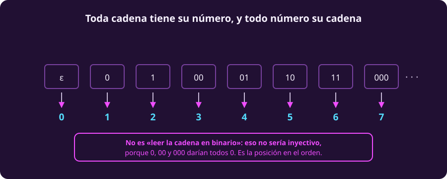
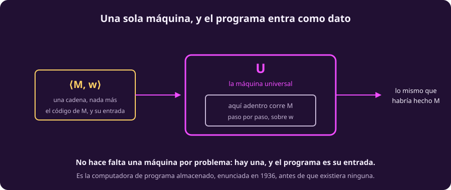

# Todo es un número

Esta página es corta y está sola por una razón: es la bisagra. Las dos
demostraciones grandes de esta unidad —el problema de la parada y el primer
teorema de Gödel— usan el mismo truco, y el truco es éste.

## Toda cadena tiene su número

El alfabeto es finito y las cadenas son finitas. Con eso basta para ponerlas
todas en una lista, sin huecos y sin repetir. La lista se hace en orden
***shortlex***: primero por longitud, y dentro de cada longitud, en orden
alfabético.

::: figure {#comp-shortlex title="Toda cadena tiene su número, y todo número su cadena"}

:::

Y no es un gesto: la correspondencia se puede escribir cerrada. Para
$\Sigma=\{0,1\}$, la cadena $w$ de longitud $k$ ocupa la posición

$$(2^k - 1) + (\text{valor binario de } w)$$

contando desde $0$. Así $\varepsilon \mapsto 0$, $0 \mapsto 1$, $1 \mapsto 2$,
$00 \mapsto 3$, $01 \mapsto 4$, $10 \mapsto 5$, $11 \mapsto 6$,
$000 \mapsto 7$…

> [!WARNING]
> **Esto no es «leer la cadena como número binario».** Esa lectura es la que se
> le ocurre a todo el mundo y **no es inyectiva**: $0$, $00$ y $000$ darían
> todos $0$, y se perderían unas de otras.
>
> Lo que hay aquí es una **biyección**: cada cadena tiene un número propio y
> cada número una cadena propia. Por eso $\varepsilon$ tiene lugar en la lista,
> el $0$.

Es la lista concreta que prometía la definición de numerable en
[[que-es-el-computo|Qué es el cómputo]]: **$\Sigma^*$ es numerable.**

## El código de una máquina

Una máquina de Turing es un objeto finito: unos cuantos estados, un alfabeto
finito, y una tabla de reglas con una cantidad finita de renglones. Todo eso se
puede escribir como texto — de hecho ya lo hicimos en la página 2, cuando
escribimos $\delta$ como una tabla.

Escribe esa descripción como una cadena y llámala $\langle M \rangle$.

No importa qué formato uses. Importan cuatro propiedades:

| La codificación $\langle M\rangle$ debe ser… | Para qué hace falta |
|---|---|
| **finita** | para que sea una cadena, y por tanto una entrada válida |
| **decodificable** | para poder recuperar $M$ a partir de ella |
| de **validez decidible** | para poder rechazar la basura en vez de colgarse con ella |
| **efectivamente enumerable** | para poder listar $M_1, M_2, M_3, \dots$ |

La cuarta es la que menos se menciona y la que más se va a usar: es lo que hace
posible la **tabla de máquinas contra códigos** de la página siguiente. Sin una
lista de todas las máquinas no hay diagonal que trazar.

## La máquina universal

Si una máquina cabe en una cadena, y una cadena es una entrada válida, entonces
se le puede dar **una máquina a otra máquina**. Y eso permite construir la que
las corre a todas.

::: definition {#comp-universal title="Máquina universal"}
Existe una máquina de Turing $U$ que, con entrada $\langle M, w\rangle$, simula
$M$ sobre $w$: acepta si $M$ acepta, rechaza si $M$ rechaza, y cicla si $M$
cicla.
:::

::: figure {#comp-maquina-dato title="Una sola máquina, y el programa entra como dato"}

:::

Detente un segundo en lo que dice eso. **No hace falta una máquina por
problema.** Hay una sola, y el programa es su entrada.

Eso, hoy, se llama computadora: un aparato fijo al que le das el programa como
dato. Turing lo enunció en **1936**, cuando no existía ninguna, y no como
propuesta de ingeniería sino como un paso dentro de una demostración
matemática. La arquitectura de programa almacenado llegó después, a construir
algo que ya se sabía posible.

> [!NOTE]
> **De aquí en adelante ya no escribimos tablas de $\delta$.** Las máquinas se
> van a describir con pseudocódigo, con llamadas a otras máquinas y con ciclos.
>
> El permiso para hacerlo sale de dos cosas: la tesis de Church–Turing —si sabes
> escribir el algoritmo, la máquina existe— y $U$, que hace concreto lo de
> «llamar a otra máquina». No es una licencia de estilo: sin ella, decir «$D$ usa
> $H$ como subrutina» en la página siguiente no significaría nada, porque una
> tupla de siete componentes no tiene llamadas a función.

## Lo mismo, con fórmulas

Guarda esta idea, porque en la página 6 vuelve con otro traje.

Si las máquinas se pueden numerar, también se pueden numerar las **fórmulas** y
las **demostraciones**: son igual de finitas y igual de escribibles. Y cuando
una teoría aritmética puede hablar de números, y sus propias demostraciones
*son* números, empieza a poder hablar **de sí misma**.

Ahí es donde se rompe algo. Pero primero, la parada.

## Ejercicios

::: exercise {#comp-ej-shortlex title="Ida y vuelta"}
Usando la fórmula de arriba con $\Sigma = \{0,1\}$:

1. ¿Qué número le toca a la cadena `101`?
2. ¿Qué cadena ocupa la posición $12$?
:::

::: answer {#comp-resp-shortlex of="comp-ej-shortlex"}
1. `101` tiene longitud $k=3$ y valor binario $5$. Le toca
   $(2^3 - 1) + 5 = 7 + 5 = 12$.
2. Por lo anterior, la posición $12$ es `101`. Para hallarla sin adivinar:
   las de longitud $3$ ocupan de $7$ a $14$, así que $12$ es de longitud $3$ y su
   valor binario es $12 - 7 = 5$, o sea `101`.
:::

::: exercise {#comp-ej-por-que-decidible title="Por qué la tercera propiedad"}
¿Por qué hace falta que sea **decidible** comprobar si una cadena es un código
válido de máquina? ¿Qué saldría mal en $U$ si no lo fuera?
:::

::: answer {#comp-resp-por-que-decidible of="comp-ej-por-que-decidible"}
Porque $U$ recibe cadenas cualesquiera, y la mayoría **no** son códigos de
máquina. Si comprobar la validez no fuera decidible, $U$ no podría rechazar la
basura: se quedaría colgada intentando decidir si lo que le dieron es una
máquina, antes siquiera de empezar a simular.

Con la validez decidible, $U$ revisa primero, rechaza lo que no es un código, y
solo entonces simula. En la página siguiente esto se cobra al demostrar que HALT
es reconocible.
:::

## A dónde va esto

Ya se puede alimentar una máquina con el código de otra — incluso **con el suyo
propio**. Eso es lo único que faltaba para el resultado central de la unidad:
[[problema-de-la-parada|el problema de la parada]].
