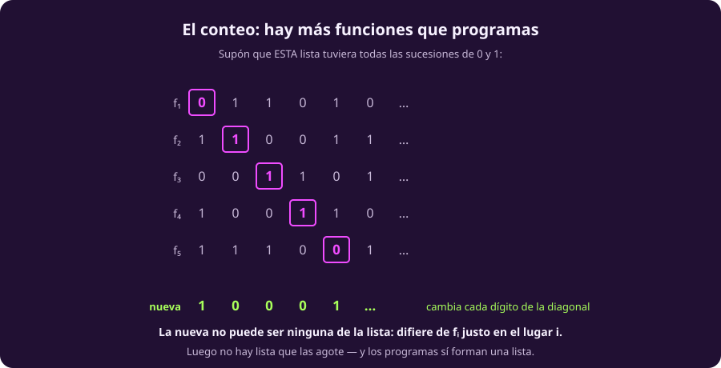
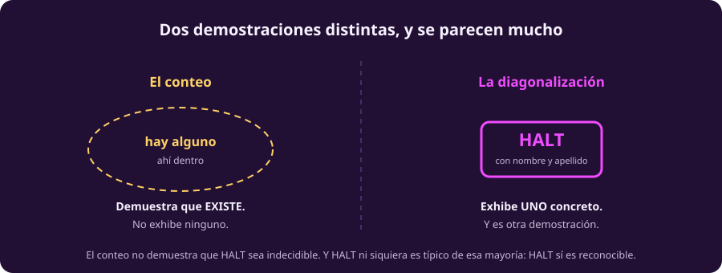
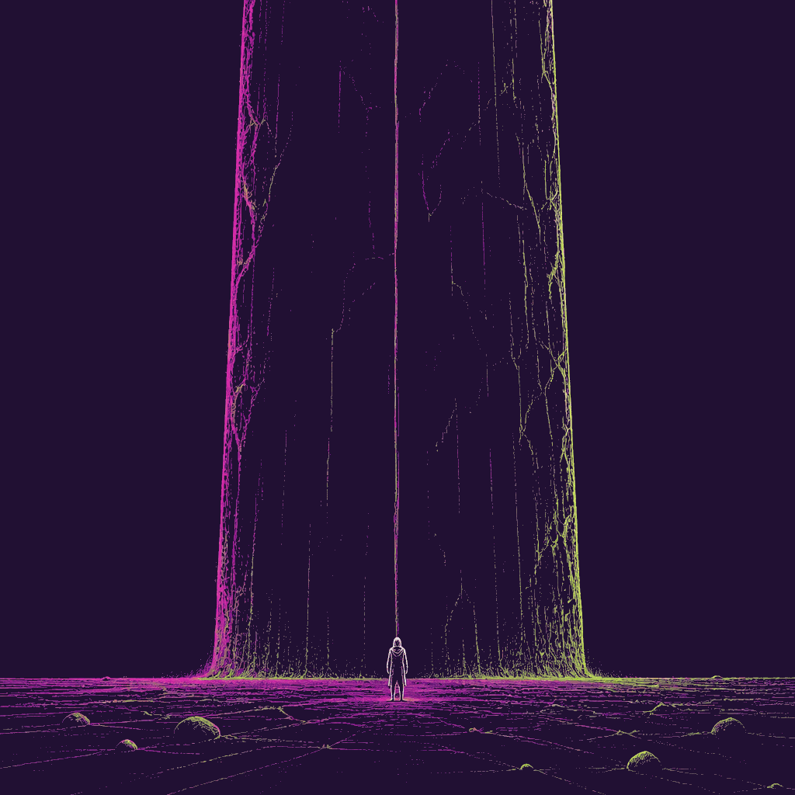
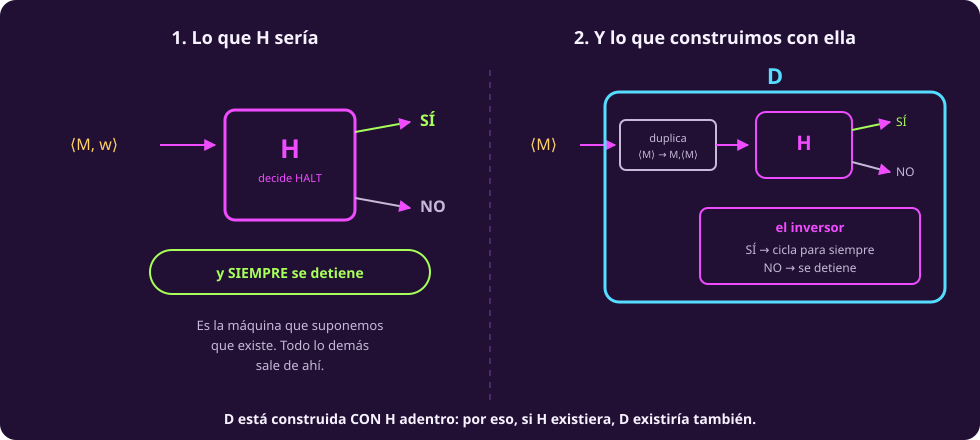
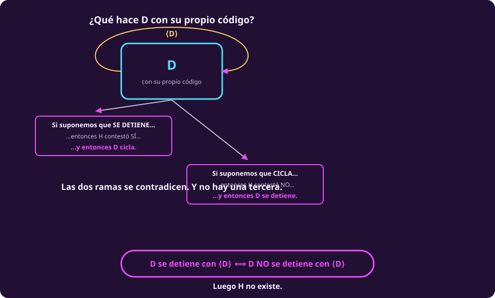
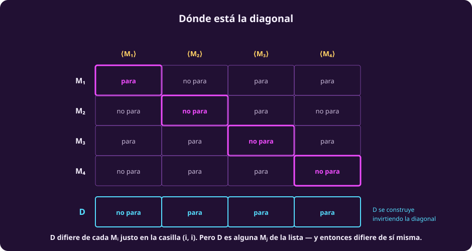

# El problema de la parada

Esta página tiene dos demostraciones. Se parecen mucho y hacen cosas
completamente distintas — conviene saberlo antes de empezar, porque confundirlas
es el error más común de todo el tema.

## Primero: hay muchísimo que no se puede calcular

Antes de exhibir un problema irresoluble, vale la pena saber cuántos hay. La
respuesta se obtiene contando, y es brutal.

**Las máquinas son numerables.** Cada máquina es una cadena finita —su código
$\langle M\rangle$— y las cadenas finitas se pueden listar, como vimos en
[[todo-es-un-numero|Todo es un número]]. Así que hay tantas máquinas de Turing
como números naturales: $M_1, M_2, M_3, \dots$ y ya están todas.

**Los lenguajes no lo son.** Por la biyección de la página anterior, un lenguaje
$L \subseteq \Sigma^*$ es lo mismo que una función $\chi_L : \mathbb{N} \to
\{0,1\}$: para cada posición, dentro o fuera. Y de ésas hay más que naturales.
El argumento es de Cantor, de 1891:

::: figure {#comp-cantor title="El conteo: hay más funciones que programas"}

:::

Supón que tuvieras una lista con **todas** las sucesiones de ceros y unos.
Constrúyete una nueva así: toma el primer dígito de la primera, cámbialo; el
segundo de la segunda, cámbialo; y así. La sucesión que sale **no puede estar en
la lista**, porque difiere de la $i$-ésima justo en el lugar $i$. Luego la lista
no las tenía todas — y como la lista era cualquiera, no hay ninguna que las
tenga todas.

Junta las dos mitades:

> [!NOTE]
> **Casi toda función es incomputable.** Cada máquina reconoce a lo más un
> lenguaje, y las máquinas son numerables; los lenguajes no lo son. Así que los
> lenguajes decidibles forman un conjunto numerable dentro de uno que no lo es.
>
> No es que falten ideas o que nadie haya sido lo bastante listo. **No alcanzan
> los programas.**

### Pero ese argumento no nombra a ninguno

Aquí está la distinción que hay que tener clara, y es la razón de que esta página
tenga dos demostraciones:

::: figure {#comp-existir-exhibir title="Dos demostraciones distintas, y se parecen mucho"}

:::

> [!WARNING]
> **El conteo no demuestra que el problema de la parada sea indecidible.**
> Demuestra que *existe* algún lenguaje indecidible, sin exhibir ninguno. Lo que
> sigue exhibe uno concreto, con nombre, y **es otra demostración**.
>
> Y ojo con la tentación de decir que HALT es «un ejemplo típico» de esa mayoría
> abrumadora: no lo es. HALT **sí** es reconocible, y casi ninguno de los otros
> lo es.

::: figure {#ilus-muro title="Un límite que no se cruza"}

:::

*(Esta imagen es una ilustración generada, no una fotografía ni un dato real.)*

## El problema, formalmente

::: definition {#comp-halt title="El problema de la parada"}
$$\text{HALT} = \{\, \langle M, w\rangle : M \text{ es una máquina de Turing y } M \text{ se detiene con entrada } w \,\}$$
:::

Es un lenguaje como cualquier otro, según [[que-es-el-computo|la primera página]]:
un conjunto de cadenas. La pregunta es si alguna máquina puede separarlo del
resto.

**HALT es reconocible.** Es fácil: dado $\langle M, w\rangle$, usa la máquina
universal para simular $M$ sobre $w$. Si $M$ se detiene, acepta. Si no se
detiene, la simulación tampoco, y nunca contestas — pero eso está permitido para
un reconocedor. (Aquí se cobra la página anterior: comprobar que la entrada es un
código válido es decidible, así que puedes rechazar la basura en vez de colgarte
con ella.)

Y eso mismo explica por qué **«córrelo y espera» no resuelve nada**: si lleva
mucho corriendo, no sabes si va a terminar o no va a terminar nunca. No hay
ningún momento en el que puedas rendirte con derecho.

## HALT no es decidible

::: theorem {#comp-teo-halt title="Indecidibilidad del problema de la parada"}
No existe ninguna máquina de Turing que decida HALT.
:::

::: proof {#comp-dem-halt of="comp-teo-halt"}
Por reducción al absurdo. **Supón que existe una máquina $H$ que decide HALT.**
Es decir: $H$ recibe $\langle M, w\rangle$, **siempre se detiene**, y responde

- **SÍ** si $M$ se detiene con entrada $w$,
- **NO** si $M$ no se detiene con entrada $w$.

Con ella construimos otra máquina, $D$. Con entrada $\langle M\rangle$ hace tres
cosas:

1. Le pregunta a $H$: *¿se detiene $M$ cuando le das su propio código?*
2. Si $H$ dice **SÍ**, $D$ se mete en un **ciclo infinito**.
3. Si $H$ dice **NO**, $D$ **se detiene**.

O sea: **$D$ hace lo contrario de lo que $H$ predice.**

$D$ es una máquina legítima. Duplicar un código es computable, y usar a $H$ como
subrutina se vale porque $H$ siempre contesta — es la licencia que nos dio la
máquina universal.

Ahora la única pregunta que hace falta: **¿qué hace $D$ con su propio código?**

| Si suponemos que… | $H$ contestó… | y entonces $D$… | lo cual |
|---|---|---|---|
| $D$ **se detiene** con $\langle D\rangle$ | SÍ | cicla | contradice lo supuesto |
| $D$ **cicla** con $\langle D\rangle$ | NO | se detiene | contradice lo supuesto |

Las dos ramas se contradicen, y no hay una tercera. En una línea:

$$D \text{ se detiene con } \langle D\rangle \iff D \text{ NO se detiene con } \langle D\rangle$$

Una proposición equivalente a su propia negación. Luego $H$ no existe.
:::

::: figure {#comp-de-h-a-d title="De H a D: la máquina se construye con la que queremos refutar"}

:::

::: figure {#comp-cortocircuito title="¿Qué hace D con su propio código?"}

:::

### Dónde está la diagonal

La demostración se ve como un truco de lógica. No lo es: es el argumento de
Cantor de arriba, con máquinas en lugar de sucesiones.

::: figure {#comp-cuadricula title="Dónde está la diagonal"}

:::

Pon las máquinas en las filas y sus códigos en las columnas. En la casilla
$(i,j)$ anota si $M_i$ se detiene con entrada $\langle M_j\rangle$. La
**diagonal** son las casillas $(i,i)$: cada máquina corriendo sobre sí misma.

$D$ está construida para diferir de cada $M_i$ **justo en la casilla $(i,i)$**.
Pero $D$ es una máquina, así que es alguna $M_j$ de esa lista — y entonces
difiere de sí misma en la casilla $(j,j)$, que es imposible.

## Los dos habitantes de los anillos

Con esto se pagan las dos deudas de
[[computabilidad-y-decidibilidad|Computabilidad y decidibilidad]]:

- **HALT es reconocible y no decidible.** Luego
  $\text{Decidibles} \subsetneq \text{Reconocibles}$.
- **$\overline{\text{HALT}}$ no es ni siquiera reconocible.** Si lo fuera,
  entonces —como HALT sí lo es— por @comp-teo-complemento HALT sería decidible,
  y acabamos de ver que no. Luego
  $\text{Reconocibles} \subsetneq \mathcal{P}(\Sigma^*)$.

## No es un caso aislado: el teorema de Rice

Se podría pensar que la parada es una rareza y que otras preguntas sobre
programas sí se pueden contestar. No.

::: theorem {#comp-teo-rice title="Teorema de Rice"}
Sea $P$ una colección de lenguajes reconocibles. Si $P$ **no es trivial** —hay
al menos un lenguaje reconocible que está en $P$ y al menos uno que no—,
entonces

$$\{\, \langle M\rangle : L(M) \in P \,\}$$

**no es decidible.**
:::

En una frase: **ninguna propiedad de lo que un programa *hace* es decidible,
salvo las dos triviales.**

> [!WARNING]
> **Las dos palabras cargan todo el peso, y sin ellas el teorema es falso.**
>
> - **Semántica** significa: propiedad de $L(M)$, **no del texto de $M$**. «$M$
>   tiene menos de 50 estados» no es trivial y **sí** es decidible. Y ojo: «$M$
>   se detiene con entrada 0 en a lo más 100 pasos» habla del comportamiento y
>   **también** es decidible, porque no es una propiedad de $L(M)$ — basta correr
>   100 pasos y ver.
> - **No trivial** significa: ni la colección vacía ni la de todos. «$L(M)$ es
>   reconocible» la cumplen todos, y decidirla es contestar «sí» siempre.

**Qué significa esto si programas.** No existe —ni existirá— un analizador que
sea a la vez **correcto, completo y terminante** sobre programas arbitrarios.
Los que usas todos los días renuncian a una de las tres: aproximan por el lado
seguro y rechazan programas buenos, o no siempre terminan, o solo miran sistemas
de estados finitos, donde la pregunta **sí** es decidible.

«No hay analizador perfecto» no es «el análisis estático no sirve».

## Un deslinde, para no sobreaplicarlo

> [!WARNING]
> **Indecidible no es lo mismo que intratable**, y es el error más común al
> salir de esta unidad.
>
> | | Qué significa | Ejemplo |
> |---|---|---|
> | **Indecidible** | ninguna máquina lo resuelve, nunca, ni con tiempo infinito | HALT |
> | **Intratable** | se puede resolver, pero tardaría más que la edad del universo | factorizar números enormes |
>
> Lo segundo es **complejidad**, y es otro curso. Un problema intratable tiene
> solución; uno indecidible, no.

## Ejercicios

::: exercise {#comp-ej-donde-falla title="Dónde se rompe si aflojas una hipótesis"}
En la demostración, $H$ tenía que detenerse **siempre**. Supón que solo tenemos
una máquina $H'$ que reconoce HALT —contesta SÍ cuando debe, pero puede ciclar
cuando la respuesta es NO—. ¿En qué paso exacto se cae la demostración?
:::

::: hint {#comp-pista-donde-falla of="comp-ej-donde-falla" title="Pista"}
Fíjate en el paso donde se dice que $D$ es una máquina legítima.
:::

::: answer {#comp-resp-donde-falla of="comp-ej-donde-falla"}
Se cae en la construcción de $D$. Si $H'$ puede ciclar, entonces $D$ —que
la llama como subrutina— también puede quedarse colgada esperando su respuesta,
**antes de llegar al inversor**. Y entonces las dos ramas de la tabla ya no son
exhaustivas: hay una tercera posibilidad, que $D$ cicle sin que $H'$ haya
contestado nada, y de ahí no sale ninguna contradicción.

Por eso la demostración necesita un **decisor** y no basta un reconocedor. Y por
eso mismo el resultado no contradice que HALT sea reconocible.
:::

::: exercise {#comp-ej-rice title="¿Cuáles caen bajo Rice?"}
Para cada pregunta sobre un programa arbitrario $M$, di si es decidible o no, y
por qué:

1. ¿$L(M)$ es vacío?
2. ¿El código de $M$ contiene la letra `q`?
3. ¿$M$ acepta la cadena `0101`?
4. ¿$M$ hace más de 1000 pasos con entrada `0`?
:::

::: answer {#comp-resp-rice of="comp-ej-rice"}
1. **Indecidible.** Es una propiedad de $L(M)$ y no es trivial: hay máquinas con
   lenguaje vacío y máquinas sin él. Cae de lleno bajo Rice.
2. **Decidible.** Es una propiedad del **texto**, no de $L(M)$. Lees el código y
   buscas la letra. Rice no aplica.
3. **Indecidible.** Es una propiedad de $L(M)$ —si `0101` le pertenece o no— y no
   es trivial. Cae bajo Rice.
4. **Decidible.** Corres $M$ sobre `0` exactamente 1000 pasos y ves si seguía.
   Habla del comportamiento pero **no** de $L(M)$, y tiene un límite de tiempo
   fijo. Rice no aplica.

Las dos decidibles son justo las que el aviso de arriba señala como trampas.
:::

## A dónde va esto

Acabamos de demostrar que hay algo que **ninguna máquina** puede decidir.
Faltan dos páginas para lo que quizá sea más incómodo: que hay algo que **ningún
sistema de axiomas** puede demostrar — y que se sigue casi del mismo argumento.
Empieza por [[sistemas-formales|Sistemas formales y aritmetización]].
