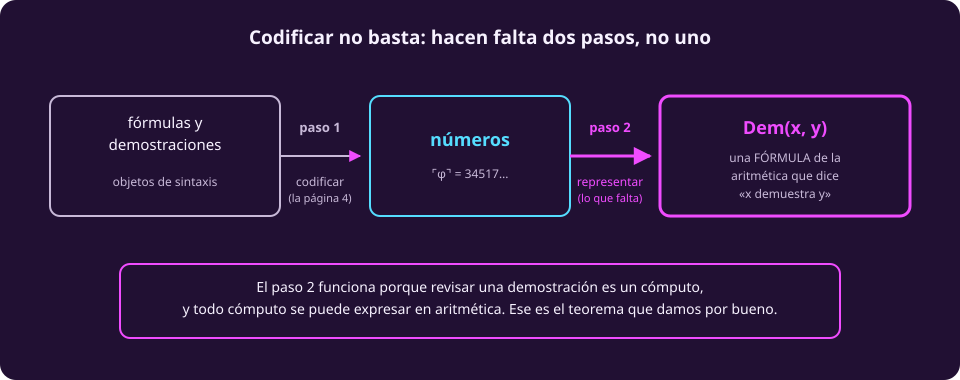

# Sistemas formales y aritmetización

Cambiamos de terreno, pero solo en apariencia. Hasta aquí hablamos de máquinas;
ahora vamos a hablar de **demostraciones** — y la tesis de esta página es que
son la misma clase de objeto.

## Qué es un sistema formal

::: definition {#comp-sistema-formal title="Sistema formal"}
Un **sistema formal** $F$ consta de tres cosas:

- un conjunto de **axiomas**: enunciados que se aceptan sin demostración;
- un conjunto de **reglas de inferencia**: formas permitidas de obtener un
  enunciado nuevo a partir de otros;
- y con eso, la noción de **demostración**: una sucesión **finita** de
  enunciados donde cada uno es un axioma o se sigue de los anteriores por una
  regla.

Un enunciado es un **teorema** de $F$ si existe una demostración suya en $F$.
Se escribe $F \vdash \varphi$.
:::

Lo importante no es la definición sino lo que se cuela por ella:

::: figure {#comp-que-es-demostracion title="Una demostración es un objeto finito que se puede revisar a máquina"}

:::

> [!NOTE]
> **Una demostración es un cómputo.** Revisar si una sucesión de fórmulas es una
> demostración válida es puramente mecánico: para cada renglón, o es un axioma —y
> eso se checa— o se sigue de los de arriba por una regla —y eso también—.
>
> Es **decidible**, y esa palabra ya sabemos exactamente qué significa.

Ésa es la puerta por la que todo lo de la página anterior entra aquí.

## Peano, en versión corta

El sistema formal del que vamos a hablar es **PA**, de *Peano Arithmetic*: la
aritmética de Peano. Describe los números naturales con la suma y la
multiplicación, y sus axiomas dicen lo que uno esperaría:

| | Axioma, en español |
|---|---|
| 1 | $0$ es un número natural |
| 2 | Todo número tiene un **sucesor** |
| 3 | $0$ no es sucesor de nadie |
| 4 | Si dos números tienen el mismo sucesor, son el mismo número |
| 5 | **Inducción**: si algo vale para $0$, y de valer para $n$ se sigue que vale para $n+1$, entonces vale para todos |

Más los axiomas que definen la suma y el producto.

> [!NOTE]
> **Un matiz que no cambia la intuición pero sí la historia.** Los axiomas que
> Peano publicó en 1889 son de *segundo orden*, y su inducción habla de todas las
> propiedades. PA, la que se usa aquí, es de **primer orden**, y su inducción es
> un **esquema**: infinitos axiomas, uno por cada propiedad expresable. Es esta
> versión, no la de 1889, la que los teoremas de la página siguiente tocan.

Qué se le está pidiendo a PA: **que demuestre todas las verdades sobre los
números naturales.** Ésa es la aspiración razonable, y es la que va a fallar.

Dos palabras que hay que tener antes de seguir:

| Propiedad de $F$ | Qué significa |
|---|---|
| **Consistente** | no demuestra un enunciado y su negación |
| **Completo** | para todo enunciado $\varphi$, demuestra $\varphi$ o demuestra $\lnot\varphi$ |
| **Sano** | todo lo que demuestra es **verdadero** |

Sano es más fuerte que consistente: un sistema sano no puede contradecirse,
porque no puede demostrar dos cosas incompatibles si las dos son ciertas.

## La aritmetización

Aquí viene el paso que hace posible el resultado de la página siguiente, y que
tiene **dos mitades** que conviene no confundir.

::: figure {#comp-aritmetizacion title="Codificar no basta: hacen falta dos pasos, no uno"}

:::

**Paso 1: codificar.** Las fórmulas y las demostraciones son objetos finitos
escritos con un alfabeto finito. Así que se pueden numerar, exactamente igual que
numeramos las máquinas en [[todo-es-un-numero|Todo es un número]]. Al número de
una fórmula $\varphi$ se le escribe $\ulcorner\varphi\urcorner$.

**Paso 2: representar.** Y aquí está lo que el paso 1 **no** da.

> [!WARNING]
> **Codificar no es lo mismo que representar, y la diferencia importa.**
>
> Codificar da una correspondencia entre fórmulas y números — eso es la página 4
> otra vez. Pero Gödel necesita algo más: que la relación *«$x$ es una
> demostración de $y$»* sea **expresable por una fórmula de la propia
> aritmética**. Que PA pueda *hablar* de ella, no solo que exista un número.
>
> Funciona, y la razón está a tres párrafos de aquí: **revisar una demostración
> es un cómputo**, y todo cómputo se puede expresar en aritmética. **Ese último
> paso es un teorema que aquí damos por bueno**, y es el único punto de estas dos
> páginas que se pide creer.

Con las dos mitades juntas, existe una fórmula de la aritmética —llamémosla
$\text{Dem}(x, y)$— que es verdadera exactamente cuando $x$ es el número de una
demostración de la fórmula con número $y$.

Y entonces pasa algo raro: **la aritmética empieza a hablar de sí misma.** Un
enunciado sobre números puede estar diciendo, si sabes leerlo, algo sobre qué
demuestra o qué no demuestra PA.

## La oración que la página siguiente necesita

De todo el aparato de arriba solo vamos a usar una cosa, así que la dejamos con
nombre:

::: definition {#comp-nopara title="La oración NoPara"}
$\text{NoPara}(x, y)$ es la oración de $F$ que dice:

> *«el programa con código $x$ no termina cuando se le da la entrada $y$».*

Existe porque los programas se codifican como números (página 4), su ejecución
es un cómputo, y todo cómputo se puede expresar en aritmética (arriba).
:::

Eso es todo lo que hace falta. Con esa oración y con el hecho de que revisar
demostraciones es decidible, la página siguiente demuestra la incompletitud en
seis líneas.

## Ejercicios

::: exercise {#comp-ej-consistente title="Consistente, completo, sano"}
Un sistema formal $F$ demuestra el enunciado «$2+2=5$». ¿Qué puedes concluir
sobre $F$? ¿Es necesariamente inconsistente?
:::

::: answer {#comp-resp-consistente of="comp-ej-consistente"}
Puedes concluir que **no es sano**: demostró algo falso.

**No** puedes concluir que sea inconsistente. Inconsistente significa demostrar
un enunciado *y su negación*. Un sistema puede demostrar «$2+2=5$» y nunca
demostrar «$2+2\ne 5$»: sería consistente y falso a la vez.

Ésta es exactamente la razón por la que la página siguiente enuncia el primer
teorema con **sanidad** y no con consistencia — y lo dice en voz alta en vez de
esconderlo.
:::

::: exercise {#comp-ej-decidible-demo title="Por qué es decidible"}
Explica con tus palabras por qué «¿es esta sucesión de fórmulas una demostración
válida en $F$?» es decidible, pero «¿tiene $\varphi$ alguna demostración en
$F$?» no lo es obviamente.
:::

::: answer {#comp-resp-decidible-demo of="comp-ej-decidible-demo"}
La primera te **dan** el objeto y solo hay que revisarlo: es finito, tiene un
número fijo de renglones, y cada renglón se checa en tiempo finito. Terminas
siempre.

La segunda te pide **buscar** en un conjunto infinito. Si la demostración existe,
la encuentras enumerando; si no existe, la búsqueda no termina nunca y no hay
señal que te avise. Es decir: es **reconocible**, no obviamente decidible — la
misma distinción de la página 3, y ahora aplicada a demostraciones en vez de a
cadenas.

Ese contraste es el motor de la demostración de la página siguiente.
:::

## A dónde va esto

Ya está todo el aparato. Lo que sigue son
[[teoremas-de-godel|los dos teoremas de Gödel]] — y la demostración del primero
cabe en seis líneas, porque todo el trabajo pesado ya está hecho.
