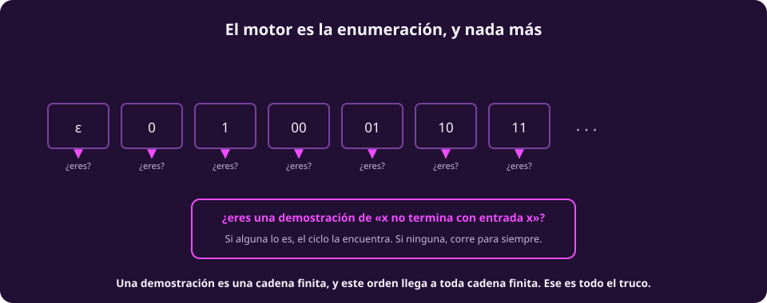
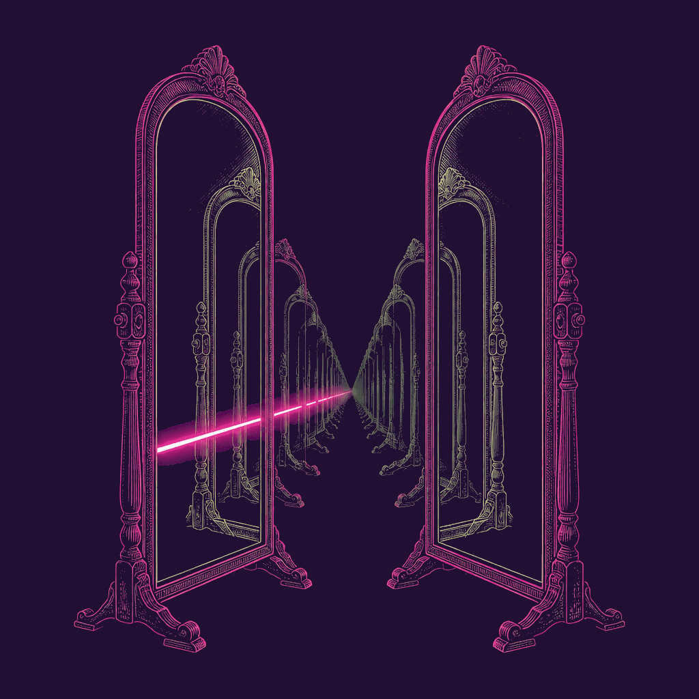
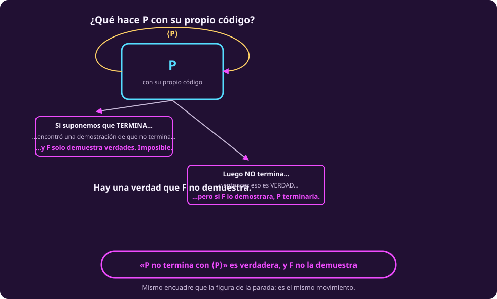

# Los teoremas de Gödel

El video que viste cuenta estos dos resultados por el camino que tomó Gödel en
1931: la numeración, una oración que habla de sí misma, y un argumento largo.

Aquí vamos por otro camino, el que abrió Turing, y por una razón concreta: **con
lo que ya tenemos, la demostración del primer teorema cabe en seis líneas y la
podemos hacer completa**, no en esbozo. Llega al mismo lugar.

## Lo que suponemos de $F$

Tres cosas, y cada una va a tener un lugar identificable en el argumento:

| Hipótesis | Qué pide |
|---|---|
| **Efectivamente axiomatizable** | hay un algoritmo que reconoce sus demostraciones |
| **Sano** | solo demuestra verdades |
| **Expresa la parada** | existe la oración $\text{NoPara}(x,y)$ de la página anterior |

PA las cumple las tres.

## El lema del `for`

Antes del teorema, una observación que hace todo el trabajo.

::: theorem {#comp-lema-for title="Los teoremas de F son reconocibles"}
Si $F$ es efectivamente axiomatizable, existe un programa que, dado un enunciado
$\varphi$, se detiene si $F \vdash \varphi$ — y corre para siempre si no.
:::

::: proof {#comp-dem-lema-for of="comp-lema-for"}
```
para cada cadena p en orden shortlex:      # la lista de la página 4
    si EsDemostracion(p, φ):               # decidible: es un cómputo
        devuelve "F demuestra φ"
```

Si $F$ demuestra $\varphi$, esa demostración **es una cadena finita**, y el
orden shortlex llega a toda cadena finita en un número finito de pasos. Así que
el ciclo la encuentra. Si $F$ no la demuestra, el ciclo no termina nunca.
:::

::: figure {#comp-for-enumera title="El motor es la enumeración, y nada más"}

:::

Reconocible, no decidible: la distinción de
[[computabilidad-y-decidibilidad|la página 3]], cobrada aquí.

::: figure {#ilus-espejo-enfrentado title="Un sistema que habla de sí mismo"}

:::

*(Esta imagen es una ilustración generada, no una fotografía ni un dato real.)*

## Primer teorema de incompletitud

::: theorem {#comp-teo-godel-1 title="Primer teorema de incompletitud"}
Si $F$ es sano, efectivamente axiomatizable y expresa la parada, entonces
**existe un enunciado verdadero que $F$ no demuestra.**

$F$ es **incompleto**.
:::

Considera este programa:

```
P(x):                                        # x es el código de un programa
    for p in shortlex:
        if EsDemostracion(p, NoPara(x, x)):  # ¿demuestra "x no termina con entrada x"?
            halt
```

En español: **$P$ busca una demostración de que no termina, y si la encuentra,
termina.**

::: proof {#comp-dem-godel-1 of="comp-teo-godel-1"}
Le damos a $P$ su propio código y preguntamos qué hace.

1. **Supón que $P(\langle P\rangle)$ termina.** Entonces el ciclo encontró una
   demostración de $\text{NoPara}(\langle P\rangle, \langle P\rangle)$. Como $F$
   es sano, lo que demuestra es verdad: $P$ **no** termina con $\langle
   P\rangle$. Pero supusimos que sí. Contradicción.

   **Luego $P(\langle P\rangle)$ no termina.**

2. **Entonces $\text{NoPara}(\langle P\rangle, \langle P\rangle)$ es
   verdadera** — dice exactamente lo que acabamos de establecer.

3. **¿La demuestra $F$?** No. Si la demostrara, esa demostración sería una cadena
   finita, el `for` la alcanzaría, y $P$ terminaría. Pero por el paso 1 no
   termina.

Hay un enunciado verdadero que $F$ no demuestra.
:::

::: figure {#comp-p-sobre-si title="¿Qué hace P con su propio código?"}

:::

### Dónde se usó cada hipótesis

Esto es lo que quiero que se lleven de aquí, más que la demostración misma: cada
hipótesis tiene **un lugar señalable** en el argumento, y quitarla lo rompe en un
punto concreto.

| Hipótesis | Dónde exactamente se usó |
|---|---|
| Efectivamente axiomatizable | en que `EsDemostracion` sea decidible: sin eso el `for` no puede preguntar nada |
| Sano | en el paso 1, para concluir que lo demostrado es verdad |
| Expresa la parada | en que la oración exista, para empezar |

Y por eso hay sistemas a los que Gödel **no** les aplica. El ejemplo clásico: la
aritmética con **suma pero sin multiplicación** es completa y decidible. Falla la
tercera hipótesis — no puede hablar de programas.

> [!WARNING]
> **No es que la multiplicación sea mágica.** La aritmética con **solo**
> multiplicación también es decidible, y la teoría de los **números reales** con
> suma *y* producto también lo es — y ésa tiene las dos operaciones.
>
> Lo que hace falta para que Gödel muerda es poder **codificar sucesiones
> finitas**, y eso lo dan la suma y el producto **juntos sobre los naturales**.
> Un sistema se escapa cuando no puede hablar de sus propias demostraciones, no
> cuando le falta un símbolo.

> [!NOTE]
> **La honestidad, declarada.** Usamos **sanidad** («$F$ solo demuestra
> verdades») y no **consistencia** («$F$ no se contradice»). Sanidad es más
> fuerte, y es exactamente la razón por la que esto cabe en seis líneas.
>
> Bajar a consistencia pelada se puede, y es lo que le costó a Gödel maquinaria
> considerable en 1931 y a Rosser un ajuste extra en 1936. El resultado es el
> mismo; el camino, mucho más largo. Preferimos decir qué estamos suponiendo a
> esconderlo.

## Segundo teorema de incompletitud

El segundo se vuelve concreto con un truco: darle a la consistencia de $F$ la
forma de un programa.

Sea $M_F$ **el buscador de contradicciones**:

```
M_F:
    for p in shortlex:
        if EsDemostracion(p, «0 = 1»):
            halt
```

Entonces

$$F \text{ es consistente} \iff M_F \text{ nunca se detiene}$$

Es decir: $\text{Con}(F)$ no es una fórmula opaca. **Es la oración de parada de
un programa que cabe en tres renglones.**

::: figure {#comp-con-f title="La consistencia de F es un programa que no termina"}

:::

::: theorem {#comp-teo-godel-2 title="Segundo teorema de incompletitud"}
Si $F$ es consistente, efectivamente axiomatizable y suficientemente fuerte,
entonces **$F$ no demuestra $\text{Con}(F)$.**

Dicho con el programa: **$F$ no puede demostrar que $M_F$ nunca se detiene** —
aunque de hecho no se detenga.
:::

**Esbozo**, y esta vez sí es un esbozo. El argumento del primer teorema es
finito y mecánico, así que $F$ —que es lo bastante fuerte— puede llevarlo a cabo
internamente. Eso da

$$F \vdash \text{Con}(F) \to \text{NoPara}(\langle P\rangle, \langle P\rangle)$$

Y si $F$ demostrara $\text{Con}(F)$, demostraría también la oración de la
derecha — que es justo lo que el primer teorema prohíbe.

> [!NOTE]
> **Por qué el segundo se enuncia con consistencia y no con sanidad.** Porque
> «$F$ es sana» $F$ **ni siquiera lo puede expresar**: la verdad no es definible
> dentro del propio sistema. La consistencia sí, y por eso es la que se
> formaliza.
>
> El paso de «llevarlo a cabo internamente» es el trabajo técnico real del
> segundo teorema, y es lo único de estas dos páginas que se pide creer.

::: figure {#comp-verdadero-demostrable title="Verdadero y demostrable no son lo mismo"}

:::

## Qué NO dicen

Aquí es donde casi todo el mundo se equivoca, y donde más vale la pena ser
preciso.

> [!WARNING]
> **No dicen que las matemáticas estén rotas** ni que no se pueda confiar en
> ellas. PA no se ha contradicho, y nada sugiere que vaya a hacerlo. Lo que dicen
> es sobre los límites de un **método**, no sobre la solidez de lo demostrado.

> [!WARNING]
> **No dicen que haya verdades incognoscibles.** La oración de arriba se conoce,
> y se sabe verdadera — **a condición de que $F$ sea sano** —, y se demuestra sin
> problema en un sistema más fuerte.
>
> Lo que **sí** dicen, y es lo interesante: **ningún sistema efectivo fijo
> demuestra todas las verdades aritméticas.** Sube a un sistema más fuerte y
> traerá su propia oración. No hay una verdad inalcanzable; no hay un **método**
> que las alcance todas.

> [!WARNING]
> **No dicen que la mente humana supere a la máquina.** El argumento de
> Lucas–Penrose dice: *si yo fuera el sistema $F$, yo «veo» que su oración es
> verdadera y $F$ no la demuestra; luego no soy $F$.* Falla en tres sitios
> distintos, y conviene no confundirlos:
>
> 1. Lo único que uno «ve» es el **condicional** $\text{Con}(F) \to G_F$ — **y
>    ese condicional $F$ también lo demuestra**. No hay ninguna ventaja.
> 2. Para pasar del condicional a $G_F$ hace falta **saber que $F$ es
>    consistente**, que es exactamente lo que el segundo teorema le niega a $F$
>    sobre sí misma.
> 3. Y hace falta **tener identificado** ese $F$. Eso no lo prohíbe ningún
>    teorema: simplemente no hay razón para suponerlo. Es una apuesta empírica,
>    no un resultado.

> [!WARNING]
> **No aplican a cualquier sistema formal.** Las tres hipótesis hacen trabajo
> real, y la tabla de arriba dice exactamente cuál.

> [!WARNING]
> **No autorizan ninguna de las extrapolaciones habituales** a la relatividad, al
> posmodernismo, a la economía o a la naturaleza del amor. Son teoremas sobre
> sistemas formales de aritmética.

## Una palabra que significa tres cosas

> [!CAUTION]
> **«Indecidible» se usa con tres sentidos distintos en esta unidad, y ninguno es
> los otros.**
>
> 1. **Un lenguaje indecidible** (página 5): ninguna máquina lo decide. HALT.
> 2. **Una oración indecidible *en $F$*** (esta página): $F$ no demuestra ni la
>    oración ni su negación. Se dice también **independiente de $F$**. La oración
>    de arriba es indecidible **en $F$** — pero es perfectamente decidible si es
>    verdadera: lo es.
> 3. **Indecidible ≠ intratable** (página 5): eso es complejidad, no
>    computabilidad.

## Ejercicios

::: exercise {#comp-ej-mas-fuerte title="Subir de sistema"}
Sea $F' = F + \text{Con}(F)$: el sistema $F$ con su propia consistencia añadida
como axioma. ¿$F'$ demuestra la oración que $F$ no podía? ¿$F'$ es completo?
:::

::: answer {#comp-resp-mas-fuerte of="comp-ej-mas-fuerte"}
**Sí a lo primero.** $F$ ya demostraba el condicional
$\text{Con}(F) \to \text{NoPara}(\langle P\rangle,\langle P\rangle)$; si además
tienes $\text{Con}(F)$ como axioma, el consecuente sale por modus ponens.

**No a lo segundo.** $F'$ sigue siendo sano, efectivamente axiomatizable y capaz
de expresar la parada — las tres hipótesis se cumplen igual. Así que el mismo
teorema aplica a $F'$ y produce **su propia** oración verdadera y no demostrable.

Ésa es la moraleja del segundo aviso de arriba: no hay una verdad inalcanzable,
hay una escalera sin último peldaño.
:::

::: exercise {#comp-ej-comparar title="Los dos programas, lado a lado"}
Compara $D$ de la página 5 con $P$ de ésta. ¿Qué tienen en común exactamente, y
en qué se diferencian?
:::

::: answer {#comp-resp-comparar of="comp-ej-comparar"}
**En común:** los dos reciben un código de programa, los dos se evalúan sobre
**su propio código**, y los dos están construidos para hacer lo contrario de lo
que algo predice sobre ellos. La contradicción sale del mismo lugar.

**En qué difieren:** $D$ hace lo contrario de lo que dice $H$, una máquina que
**suponemos que existe** — y la conclusión es que no existe. $P$ hace lo
contrario de lo que dice $F$, un sistema que **sí existe** — y la conclusión es
que a $F$ le falta algo.

Refutar una hipótesis contra encontrar una carencia real. Es la misma forma con
dos destinos, y de eso trata [[el-mismo-truco|la última página]].
:::

## A dónde va esto

Tres resultados, un solo argumento. La última página los pone lado a lado y
contesta la pregunta que abrió la unidad: qué tiene que ver todo esto con la
inteligencia artificial. Es [[el-mismo-truco|El mismo truco tres veces]].
