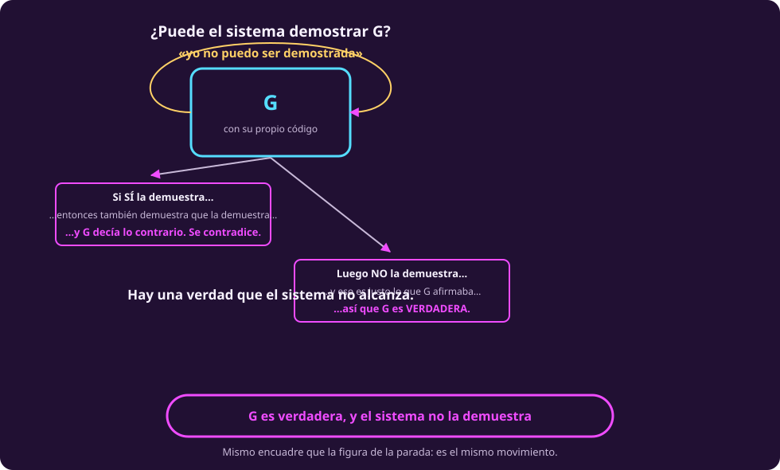
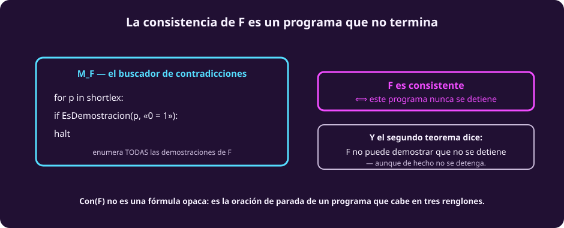
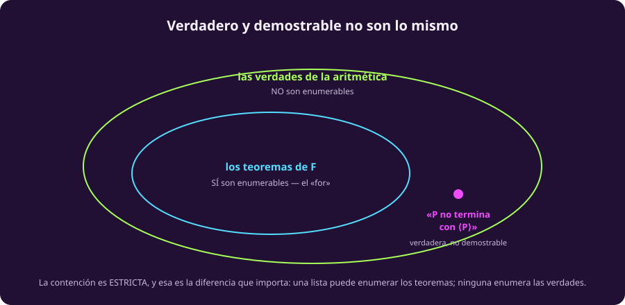

# Los teoremas de Gödel

El video que viste cuenta estos dos resultados por el camino que tomó Gödel en
1931: la numeración, una oración que habla de sí misma, y un argumento largo.

Aquí vamos por otro camino, el que abrió Turing, y por una razón concreta: **con
lo que ya tenemos, la demostración del primer teorema cabe en seis líneas y la
podemos hacer completa**, no en esbozo. Llega al mismo lugar.

## Lo que suponemos del sistema

Todo lo que sigue vale para un sistema formal $F$ que sea:

| Hipótesis | Qué pide | Dónde se usa |
|---|---|---|
| **Consistente** | nunca demuestra un enunciado **y** su negación | en el paso 4 del teorema 1 |
| **Efectivamente describible** | hay un algoritmo que reconoce sus demostraciones | en el paso 2 del teorema 1 |
| **Suficientemente potente** | puede hablar de sus propias demostraciones | en que $G$ exista, y en el paso 2 del teorema 2 |

La aritmética las cumple las tres. Y hay sistemas que no: la aritmética **sin
multiplicación** es completa y decidible, porque no puede hablar de sí misma.

## La oración $G$

Todo el primer teorema cuelga de una sola oración. En pseudocódigo:

```python
def G():
    return not PROVES("G")      # "yo no puedo ser demostrada en este sistema"
```

**Que esa oración exista es el trabajo pesado de Gödel**, y es lo único que aquí
damos por bueno: hace falta que el sistema pueda codificar sus propias fórmulas
como números y hablar de ellas. Eso es la aritmetización de
[[sistemas-formales|la página anterior]]. Con eso, `PROVES(...)` no es un
comentario: es una fórmula aritmética de verdad.

En palabras normales: **$G$ dice «yo no puedo ser demostrada dentro de este
sistema».**

## Teorema 1 — Incompletitud

```python
if PROVES("G"):
    contradiction()             # el sistema se contradice a sí mismo
else:
    G_is_true = True            # G decía justo eso, y acertó
```

### Por qué eso es una contradicción, paso a paso

Supongamos que el sistema **sí** demuestra $G$, y sigamos el hilo:

::: table {#comp-contradiccion-1 title="Qué pasa si el sistema demuestra G"}
| | Paso | Por qué |
|---|---|---|
| 1 | Existe una demostración de $G$ | es lo que acabamos de suponer |
| 2 | El sistema puede **verificar** esa demostración, y demostrar `PROVES("G")` | revisar una demostración es un cómputo, y el sistema es lo bastante potente para expresarlo |
| 3 | Pero $G$ **es** el enunciado `not PROVES("G")` | así se construyó |
| 4 | Entonces el sistema demuestra `PROVES("G")` **y** `not PROVES("G")` | de 2 y 3 |
| 5 | **Eso es exactamente ser inconsistente** | demostrar algo y su negación |
:::

Fíjate en el paso 5, porque ahí está la fuerza del argumento: **no llegamos a
algo raro ni a una paradoja**. Llegamos a que el sistema se contradice, que es la
única cosa que un sistema formal no puede permitirse.

Así que damos la vuelta:

```python
if system_is_consistent:
    not PROVES("G")             # no la puede demostrar
    # ...pero eso es literalmente lo que G afirmaba:
    G_is_true = True
```

> [!NOTE]
> **Conclusión: hay verdades que el sistema no puede demostrar.**
>
> Y nota lo que *no* dijimos: que $G$ sea falsa, ni que sea indecidible, ni que
> las matemáticas fallen. Solo que **es verdadera y el sistema no la alcanza**.

::: figure {#comp-g-autorreferente title="La oración que habla de sí misma"}

:::

## Teorema 2 — El sistema no demuestra su propia consistencia

Ahora escribimos la consistencia como un enunciado más:

```python
CONSISTENT = "este sistema nunca demuestra una contradicción"
```

Y la pregunta es si el sistema puede demostrar **eso** sobre sí mismo.

### Paso a paso

::: table {#comp-contradiccion-2 title="Qué pasa si el sistema demuestra su propia consistencia"}
| | Paso | Por qué |
|---|---|---|
| 1 | Todo el razonamiento del teorema 1 es finito y mecánico | son cinco renglones de tabla |
| 2 | El sistema puede rehacerlo **por dentro**, y demostrar `CONSISTENT → G` | es lo bastante potente; éste es el trabajo técnico real |
| 3 | Supongamos además que demuestra `CONSISTENT` | es lo que queremos refutar |
| 4 | De 2 y 3: demuestra `G` | modus ponens |
| 5 | Pero el teorema 1 dijo: si es consistente, **no** demuestra `G` | ya lo probamos arriba |
| 6 | **Contradicción** | 4 choca con 5 |
:::

```python
if system_is_consistent:
    not PROVES(CONSISTENT)
```

En palabras normales: **un sistema suficientemente potente no puede darse a sí
mismo una prueba definitiva de «yo nunca voy a producir contradicciones».**

Y hay una manera de volverlo tangible. Escribe el buscador de contradicciones:

```python
def M_F():
    for p in todas_las_demostraciones():
        if es_demostracion_de(p, "0 = 1"):
            return "encontré una"      # se detiene
    # si nunca la encuentra, no termina jamás
```

Entonces **el sistema es consistente exactamente cuando ese programa nunca
termina** — y el teorema 2 dice que el sistema no puede demostrar que no
termina, aunque de hecho no termine.

::: figure {#comp-con-f title="La consistencia de F es un programa que no termina"}

:::

## Los dos, juntos

$$\boxed{\;\text{1. No puede demostrar todas las verdades.}\;}$$

$$\boxed{\;\text{2. No puede demostrar su propia consistencia.}\;}$$

Todo esto suponiendo un sistema formal **suficientemente potente y efectivamente
describible**, como la aritmética.

::: figure {#comp-verdadero-demostrable title="Verdadero y demostrable no son lo mismo"}

:::

> [!TIP]
> **El mismo resultado sale por otro camino, sin oración autorreferente.** Si
> existiera un sistema que demostrara toda verdad de la forma «este programa no
> termina», podrías decidir el problema de la parada: enumeras demostraciones
> hasta encontrar una. Y [[problema-de-la-parada|la página 5]] demostró que eso
> es imposible.
>
> Dos rutas, un destino — y no es casualidad. De eso trata
> [[el-mismo-truco|la última página]].

## Qué NO dicen

Aquí es donde casi todo el mundo se equivoca, y donde más vale la pena ser
preciso.

> [!WARNING]
> **No dicen que las matemáticas estén rotas** ni que no se pueda confiar en
> ellas. PA no se ha contradicho, y nada sugiere que vaya a hacerlo. Lo que dicen
> es sobre los límites de un **método**, no sobre la solidez de lo demostrado.

> [!WARNING]
> **No dicen que haya verdades incognoscibles.** La oración de arriba se conoce,
> y se sabe verdadera — **a condición de que $F$ sea sano** —, y se demuestra sin
> problema en un sistema más fuerte.
>
> Lo que **sí** dicen, y es lo interesante: **ningún sistema efectivo fijo
> demuestra todas las verdades aritméticas.** Sube a un sistema más fuerte y
> traerá su propia oración. No hay una verdad inalcanzable; no hay un **método**
> que las alcance todas.

> [!WARNING]
> **No dicen que la mente humana supere a la máquina.** El argumento de
> Lucas–Penrose dice: *si yo fuera el sistema $F$, yo «veo» que su oración es
> verdadera y $F$ no la demuestra; luego no soy $F$.* Falla en tres sitios
> distintos, y conviene no confundirlos:
>
> 1. Lo único que uno «ve» es el **condicional** $\text{Con}(F) \to G_F$ — **y
>    ese condicional $F$ también lo demuestra**. No hay ninguna ventaja.
> 2. Para pasar del condicional a $G_F$ hace falta **saber que $F$ es
>    consistente**, que es exactamente lo que el segundo teorema le niega a $F$
>    sobre sí misma.
> 3. Y hace falta **tener identificado** ese $F$. Eso no lo prohíbe ningún
>    teorema: simplemente no hay razón para suponerlo. Es una apuesta empírica,
>    no un resultado.

> [!WARNING]
> **No aplican a cualquier sistema formal.** Las tres hipótesis hacen trabajo
> real, y la tabla de arriba dice exactamente cuál.

> [!WARNING]
> **No autorizan ninguna de las extrapolaciones habituales** a la relatividad, al
> posmodernismo, a la economía o a la naturaleza del amor. Son teoremas sobre
> sistemas formales de aritmética.

## Una palabra que significa tres cosas

> [!CAUTION]
> **«Indecidible» se usa con tres sentidos distintos en esta unidad, y ninguno es
> los otros.**
>
> 1. **Un lenguaje indecidible** (página 5): ninguna máquina lo decide. HALT.
> 2. **Una oración indecidible *en $F$*** (esta página): $F$ no demuestra ni la
>    oración ni su negación. Se dice también **independiente de $F$**. La oración
>    de arriba es indecidible **en $F$** — pero es perfectamente decidible si es
>    verdadera: lo es.
> 3. **Indecidible ≠ intratable** (página 5): eso es complejidad, no
>    computabilidad.

## Ejercicios

::: exercise {#comp-ej-mas-fuerte title="Subir de sistema"}
Sea $F' = F + \text{Con}(F)$: el sistema $F$ con su propia consistencia añadida
como axioma. ¿$F'$ demuestra la oración que $F$ no podía? ¿$F'$ es completo?
:::

::: answer {#comp-resp-mas-fuerte of="comp-ej-mas-fuerte"}
**Sí a lo primero.** $F$ ya demostraba el condicional
$\text{Con}(F) \to \text{NoPara}(\langle P\rangle,\langle P\rangle)$; si además
tienes $\text{Con}(F)$ como axioma, el consecuente sale por modus ponens.

**No a lo segundo.** $F'$ sigue siendo sano, efectivamente axiomatizable y capaz
de expresar la parada — las tres hipótesis se cumplen igual. Así que el mismo
teorema aplica a $F'$ y produce **su propia** oración verdadera y no demostrable.

Ésa es la moraleja del segundo aviso de arriba: no hay una verdad inalcanzable,
hay una escalera sin último peldaño.
:::

::: exercise {#comp-ej-comparar title="Los dos programas, lado a lado"}
Compara $D$ de la página 5 con $P$ de ésta. ¿Qué tienen en común exactamente, y
en qué se diferencian?
:::

::: answer {#comp-resp-comparar of="comp-ej-comparar"}
**En común:** los dos reciben un código de programa, los dos se evalúan sobre
**su propio código**, y los dos están construidos para hacer lo contrario de lo
que algo predice sobre ellos. La contradicción sale del mismo lugar.

**En qué difieren:** $D$ hace lo contrario de lo que dice $H$, una máquina que
**suponemos que existe** — y la conclusión es que no existe. $P$ hace lo
contrario de lo que dice $F$, un sistema que **sí existe** — y la conclusión es
que a $F$ le falta algo.

Refutar una hipótesis contra encontrar una carencia real. Es la misma forma con
dos destinos, y de eso trata [[el-mismo-truco|la última página]].
:::

## A dónde va esto

Tres resultados, un solo argumento. La última página los pone lado a lado y
contesta la pregunta que abrió la unidad: qué tiene que ver todo esto con la
inteligencia artificial. Es [[el-mismo-truco|El mismo truco tres veces]].
