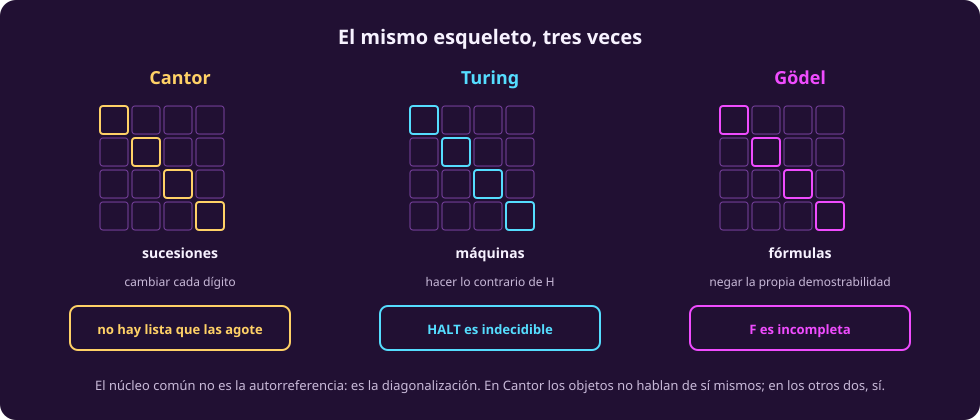
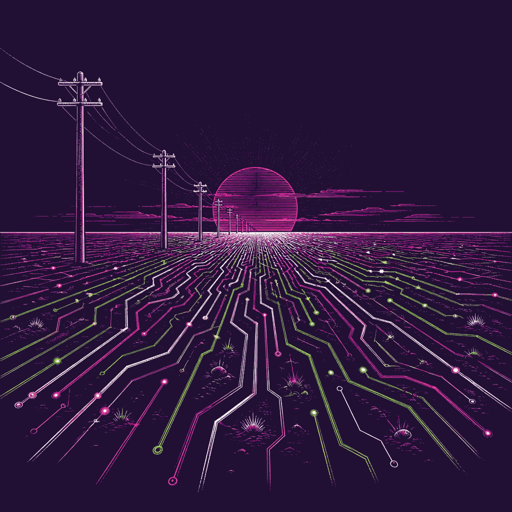

# El mismo truco tres veces

Tres resultados, de tres personas distintas, con cuarenta y cinco años entre el
primero y el último. Y por debajo, el mismo argumento.

::: figure {#comp-mismo-esqueleto title="El mismo esqueleto, tres veces"}

:::

::: table {#comp-tabla-truco title="Los tres argumentos, renglón por renglón"}
| | **Cantor** 1891 | **Turing** 1936 | **Gödel** 1931 |
|---|---|---|---|
| Los objetos | sucesiones de 0 y 1 | máquinas de Turing | programas y demostraciones |
| La lista, que **sí** existe | — | las máquinas, enumerables | las demostraciones, enumerables |
| Lo que se **supone y se refuta** | que una enumeración las **agota** | que existe $H$ que **decide** HALT | que $F$ **demuestra toda verdad** |
| La diagonal | dígito $n$ de la sucesión $n$ | $M_i$ con entrada $\langle M_i\rangle$ | $P$ con entrada $\langle P\rangle$ |
| El giro | cambiar cada dígito | hacer lo contrario de lo que $H$ predice | terminar si se demuestra que no termina |
| La conclusión | los reales no son numerables | HALT es indecidible | $F$, si es sana, es incompleta |
:::

Fíjate en el tercer renglón, porque es donde se confunde todo el mundo: **la
lista no es lo que se refuta**. Que las demostraciones sean enumerables es un
teorema, no una suposición — es el punto de partida. Lo que se supone y cae es
otra cosa en cada columna.

## La moraleja, dicha con cuidado

Es tentador resumir esto como «autorreferencia más negación da contradicción».
Es lo que suele decirse, y **está mal por dos lados**:

- **En Cantor no hay ninguna autorreferencia.** Las sucesiones de ceros y unos no
  hablan de sí mismas. Y sin embargo el argumento es el mismo.
- **En Gödel no hay contradicción**, hay **incompletitud**. La contradicción solo
  aparece si además supones que el sistema es completo — que es precisamente lo
  que se refuta.

> [!NOTE]
> **El núcleo común no es la autorreferencia: es la diagonalización.** Construir
> un objeto que difiere de cada renglón de una lista, cada vez en la casilla que
> le toca.
>
> En Cantor eso es todo, y el resultado es «este objeto falta en la lista».
>
> En Turing y en Gödel la lista es de objetos que **sí** pueden hablar de sí
> mismos — porque se codifican como cadenas y las cadenas son entradas válidas —
> y ahí la diagonal se vuelve autorreferencia. El resultado deja de ser «falta
> uno» y pasa a ser «**este sistema no puede decidir sobre sí mismo**».
>
> **La riqueza es la que te mata:** en cuanto un sistema es lo bastante expresivo
> para codificar sus propios objetos, la diagonal cae dentro de su alcance.

::: figure {#ilus-horizonte-de-red title="El techo del edificio"}

:::

*(Esta imagen es una ilustración generada, no una fotografía ni un dato real.)*

## Qué significa esto para la inteligencia artificial

Ésta es la pregunta con la que abrió la unidad, y ya se puede contestar sin
gesticular.

### Lo que el límite NO prohíbe

**No prohíbe que una máquina sea inteligente.** Ni Gödel ni Turing dan un solo
argumento a favor de que el cerebro escape a estos límites. La posición por
defecto es que no escapa —si el cerebro es un sistema físico que computa,
entonces no computa más que una máquina de Turing—, pero conviene decirlo con su
etiqueta correcta: eso es la **tesis de Church–Turing física**, una conjetura
empírica, **no un corolario** de nada de lo que demostramos aquí.

> [!WARNING]
> Cuidado con un argumento que suena bien y está al revés: *«los humanos somos
> sistemas físicos finitos, así que estamos sujetos exactamente a los mismos
> límites»*. **Un sistema estrictamente finito es un autómata finito, y para
> autómatas finitos la parada sí es decidible.** Si fuéramos finitos en ese
> sentido, estaríamos sujetos a límites *más estrictos*, no a los mismos.

### Lo que el límite sí prohíbe

**El verificador perfecto de programas arbitrarios.** Y ahí muerde directo en lo
que hoy se llama alineación y seguridad de sistemas de IA: la pregunta
*«compruébame que este sistema nunca haga $X$»* es, en general, **indecidible**.
No es que falte técnica: es un teorema.

Por el teorema de Rice, tampoco hay detector perfecto de bugs, ni antivirus
perfecto, ni analizador estático completo.

> [!NOTE]
> **Y sin embargo la verificación funciona todos los días.** No hay
> contradicción: para sistemas de **estados finitos**, o con tiempo y memoria
> **acotados**, estas preguntas **sí** son decidibles. De ahí vive el *model
> checking*, y de ahí viven los verificadores que se usan en la industria.
>
> Lo que no existe es el método que funcione para **todo** programa. Lo que sí
> existe es el método que funciona para los tuyos.

### Y el deslinde final

Sabiendo todo esto, hay que resistir la tentación de aplicarlo donde no toca.

**En la práctica, lo que limita a la inteligencia artificial de hoy casi nunca es
la computabilidad.** Es complejidad, son datos, es energía, es que no sabemos
formular bien el problema. Los sistemas que no funcionan no fallan porque
chocaron con Turing.

> [!NOTE]
> **La computabilidad fija el techo del edificio; casi todo el trabajo ocurre en
> los primeros pisos.**
>
> Saber dónde está el techo es lo que distingue un límite real de uno inventado —
> y esa distinción es la razón por la que esta unidad va antes que los métodos.

## Las ocho preguntas, contestadas

La [[computabilidad|página de la unidad]] te pidió llegar a la sesión pudiendo
explicar ocho cosas. Aquí está dónde quedó cada una:

1. **Máquina de Turing** — [[maquina-de-turing|La máquina de Turing]]
2. **Axioma y teoría aritmética** — [[sistemas-formales|Sistemas formales y aritmetización]]
3. **Computabilidad** — [[computabilidad-y-decidibilidad|Computabilidad y decidibilidad]]
4. **El problema de la parada** — [[problema-de-la-parada|El problema de la parada]]
5. **Diagonalización** — [[problema-de-la-parada|El problema de la parada]], y esta misma página
6. **Primer teorema de Gödel** — [[teoremas-de-godel|Los teoremas de Gödel]]
7. **Segundo teorema de Gödel** — [[teoremas-de-godel|Los teoremas de Gödel]]
8. **Axiomas de Peano** — [[sistemas-formales|Sistemas formales y aritmetización]]

## Si quieres seguir

Las fuentes originales, ahora que ya sabes qué estás leyendo:

- **Turing (1936)**, *On Computable Numbers, with an Application to the
  Entscheidungsproblem*. Las primeras secciones son sorprendentemente legibles;
  la máquina universal está construida a mano.
- **Gödel (1931)**, *Über formal unentscheidbare Sätze*. Difícil, y vale la pena
  al menos ver la forma.
- **Cantor (1891)**, dos páginas. El argumento diagonal completo cabe en una.
