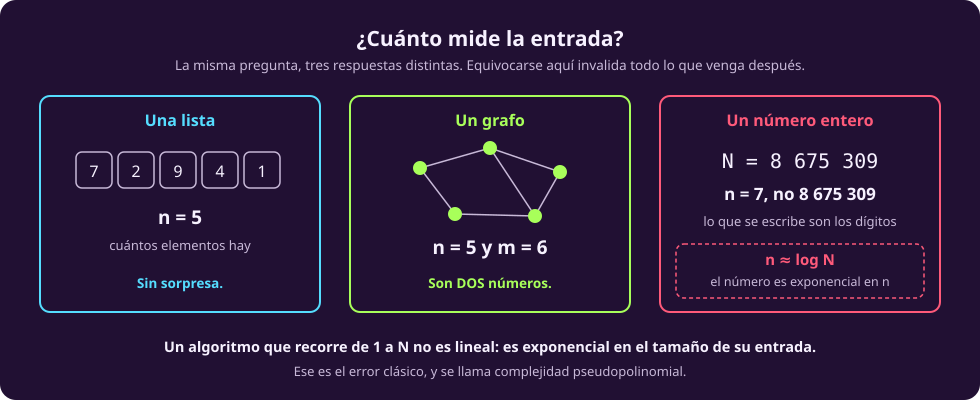
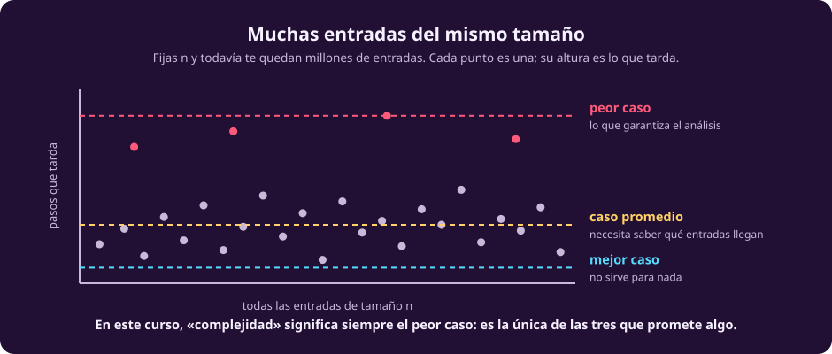

# Cuánto cuesta un algoritmo

Toda esta unidad contesta una pregunta: **¿cuántos pasos tarda?** Pero esa
pregunta no significa nada hasta que se aclaren tres cosas, y las tres se
saltan casi siempre:

1. ¿Pasos **en función de qué**?
2. ¿Qué cuenta como **un paso**?
3. Hay millones de entradas del mismo tamaño. ¿**Cuál** de todas?

Las tres respuestas están en esta página. Sin ellas, «este algoritmo es
$O(n^2)$» es una frase sin contenido.

## 1 · Qué es n

El costo no se mide en segundos. Se mide como una **función del tamaño de la
entrada**, y a ese tamaño lo llamamos $n$.

::: definition {#cx-tamano title="Tamaño de la entrada"}
El **tamaño** de una entrada es la cantidad de símbolos que hacen falta para
escribirla. En términos de [[que-es-el-computo|la unidad anterior]]: si la entrada es la cadena $w$,
su tamaño es $\lvert w \rvert$.
:::

Suena trivial y no lo es. Aquí están los tres casos, en orden de cuánto
sorprenden:

::: figure {#cx-que-es-n title="La misma pregunta, tres respuestas"}

:::

**Una lista de $n$ cosas** mide $n$. Sin sorpresa, y es el caso que uno tiene en
la cabeza cuando dice «$n$».

**Un grafo mide dos números**, no uno: $n$ vértices y $m$ aristas. Y no son
independientes —un grafo simple cumple $m \le n(n-1)/2$— pero tampoco son lo
mismo: un grafo *disperso* tiene $m \approx n$ y uno *denso* tiene
$m \approx n^2$. Por eso las complejidades de grafos se escriben con las dos
letras: Dijkstra es $O(m + n \log n)$, y eso dice cosas muy distintas según cuál
de los dos grafos tengas.

**Un número entero mide sus dígitos.** Aquí es donde se rompe la intuición, y
vale la pena detenerse.

> [!WARNING]
> **El tamaño de $N$ no es $N$: es $\log N$.** Escribir el número $8\,675\,309$
> cuesta siete dígitos, no ocho millones. Así que un algoritmo que hace un ciclo
> de $1$ a $N$ **no es lineal**: hace $N = 10^n$ pasos con una entrada de tamaño
> $n$. Es exponencial.

Ese error tiene nombre: complejidad **pseudopolinomial**. Es un algoritmo que
parece polinomial porque se mide contra el *valor* de un número en vez de contra
su *longitud*. El caso clásico es la criba de primos ingenua: dividir $N$ entre
todo lo menor que $\sqrt{N}$ suena rápido, y es $10^{n/2}$ divisiones —de ahí que
factorizar números de 2048 bits sea seguro y no una cuestión de comprar mejores
computadoras.

## 2 · Qué cuenta como un paso

Un paso es una **operación elemental**: una suma, una comparación, leer una
casilla, escribir una casilla. La cuenta no distingue entre ellas, y ahí hay una
decisión escondida que conviene ver.

Podríamos ser exactos: contar ciclos de reloj, distinguir una multiplicación de
una suma, cobrar los accesos a memoria según el caché. Nadie lo hace, y la razón
no es pereza:

- **Depende de la máquina.** Una multiplicación cuesta distinto en cada
  procesador, y el resultado dejaría de decir algo sobre el *algoritmo*.
- **No cambia la respuesta que importa.** Si una operación cuesta $3$ veces más
  que otra, el total se multiplica a lo más por $3$. Un factor constante no
  convierte un algoritmo lento en uno rápido.

Por eso la unidad entera se permite **ignorar las constantes**. No porque no
existan —si tu programa tarda tres horas y quieres que tarde una, la constante es
exactamente tu problema— sino porque no son la pregunta que estamos haciendo.

> [!NOTE]
> **La constante importa muchísimo en la práctica y nada en esta unidad.** Un
> algoritmo $O(n)$ con constante $1000$ pierde contra uno $O(n^2)$ con constante
> $1$ hasta $n = 1000$. Lo que dice la teoría es que a partir de ahí la pierde
> para siempre, y que ese «a partir de ahí» llega.

## 3 · Cuál de todas las entradas

Fijas $n$ y todavía te quedan millones de entradas distintas. Cada una tarda lo
suyo. Hay tres maneras de resumir esa nube en un solo número:

::: figure {#cx-peor-caso title="Peor caso, caso promedio, mejor caso"}

:::

::: table {#cx-tres-casos title="Las tres maneras de resumir, y qué promete cada una"}
| | Qué mide | Qué promete | Por qué sí o por qué no |
|---|---|---|---|
| **Peor caso** | la entrada más lenta de tamaño $n$ | **nunca tardará más que esto** | Es una garantía. Es la que usamos |
| **Caso promedio** | el promedio sobre las entradas | tardará esto *en promedio* | Exige saber con qué probabilidad llega cada entrada, y casi nunca se sabe |
| **Mejor caso** | la entrada más rápida | nada | Todo algoritmo tiene una entrada afortunada. No informa |
:::

**En este curso, «complejidad» significa siempre peor caso**, salvo que se diga
lo contrario. La razón es que es la única de las tres que promete algo: si el
peor caso es $O(n^2)$, entonces *ninguna* entrada de tamaño $n$ te va a
sorprender.

El caso promedio no es inútil —*quicksort* es $\Theta(n^2)$ en el peor caso y
$\Theta(n \log n)$ en promedio, y en la práctica se usa— pero es una afirmación
más débil y con más letra chica.

## Lo que hay que llevarse

::: table {#cx-resumen-medir title="Las tres decisiones, en una línea cada una"}
| Pregunta | Respuesta de esta unidad |
|---|---|
| ¿En función de qué? | Del **tamaño de la entrada** $n$: cuántos símbolos hacen falta para escribirla |
| ¿Qué es un paso? | Una **operación elemental**, todas al mismo precio, sin constantes |
| ¿Cuál entrada? | La **peor** de tamaño $n$ |
:::

Con eso ya se puede definir la notación que va a cargar el resto de la unidad,
que es lo que hace [[o-grande|la página siguiente]].
