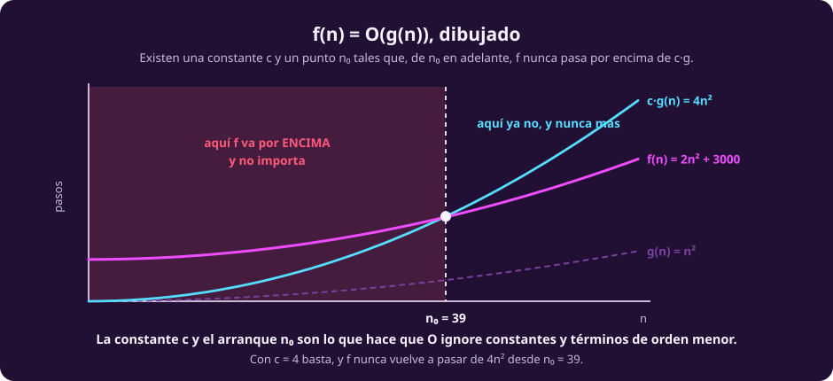
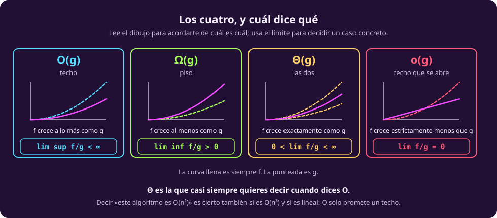

# O grande, y su familia

Ya sabemos qué contar. Falta la notación con la que se escribe el resultado, y
es más chica de lo que parece: son cuatro símbolos y todos dicen lo mismo con
distinta severidad.

La idea de fondo es una sola. Cuando comparas dos funciones de costo,
**solo importa qué pasa cuando $n$ crece**. Los valores chicos no deciden nada
—cualquier algoritmo es rápido con diez datos— y las constantes tampoco, por lo
que vimos en [[cuanto-cuesta|la página anterior]]. Lo que queda después de tirar
esas dos cosas es el **comportamiento asintótico**.

## O grande

::: definition {#cx-def-o title="O grande"}
$f(n) = O(g(n))$ si existen constantes $c > 0$ y $n_0$ tales que

$$f(n) \le c \cdot g(n) \quad \text{para todo } n \ge n_0.$$

En una frase: *a partir de cierto punto, $f$ no pasa de $g$ salvo por un factor
constante.*
:::

Los dos cuantificadores hacen todo el trabajo, y son justo los que se olvidan:

::: figure {#cx-o-grande title="La definición de O, dibujada"}

:::

- La **constante $c$** existe para que $O$ ignore factores. La curva de arriba no
  es $g$: es $g$ escalada tanto como haga falta.
- El **arranque $n_0$** existe para que $O$ ignore lo que pasa al principio.
  Antes de $n_0$, $f$ puede ir por encima todo lo que quiera.

Por eso $3n^2 + 40n + 30 = O(n^2)$: los términos $40n$ y $30$ dejan de importar,
y el $3$ se lo come la constante.

### La lectura que casi todo el mundo hace mal

$O$ es un **techo**, no una descripción. Es una cota superior, y eso tiene una
consecuencia que suena a trampa la primera vez:

> [!WARNING]
> **Un algoritmo lineal también es $O(n^2)$.** Y $O(n^3)$, y $O(2^n)$. Todas esas
> afirmaciones son **verdaderas**, porque un techo alto sigue siendo un techo.
> Decir «este algoritmo es $O(n^2)$» no dice que tarde $n^2$: dice que **no tarda
> más** que $n^2$.

Cuando alguien dice «este algoritmo es $O(n \log n)$» y quiere decir que tarda
exactamente eso, está diciendo $\Theta$ y escribiendo $O$. Es abuso de notación
extendido, y hay que saber leerlo, pero en un examen la diferencia se pregunta.

## Las otras tres

::: definition {#cx-def-omega title="Omega"}
$f(n) = \Omega(g(n))$ si existen $c > 0$ y $n_0$ con $f(n) \ge c \cdot g(n)$ para
todo $n \ge n_0$.

Es el **piso**: *$f$ crece al menos como $g$.*
:::

::: definition {#cx-def-theta title="Theta"}
$f(n) = \Theta(g(n))$ si $f = O(g)$ **y** $f = \Omega(g)$.

Es el **techo y el piso a la vez**: *$f$ crece exactamente como $g$, salvo
constantes.*
:::

::: definition {#cx-def-o-chica title="o pequeña"}
$f(n) = o(g(n))$ si para **toda** constante $c > 0$ existe $n_0$ con
$f(n) < c \cdot g(n)$ para todo $n \ge n_0$.

Es un techo **estricto**: *$f$ crece estrictamente menos que $g$, y la distancia
entre las dos se abre sin límite.*
:::

Nótese el cambio de cuantificador en la última: $O$ pide que **exista** un $c$;
$o$ pide que **sirva cualquier** $c$. Eso es lo que la hace estricta, y es la
única diferencia formal entre las dos.

## Las cuatro con límites

Las definiciones de arriba son las oficiales, pero para decidir un caso concreto
casi nadie las usa. Se usa el límite del cociente, que es equivalente y se
calcula con las herramientas que ya tienes:

::: table {#cx-limites title="Las cuatro notaciones, por el límite de f/g"}
| Se escribe | Se lee | Con límites | Qué promete |
|---|---|---|---|
| $f = O(g)$ | «efe es o grande de ge» | $\limsup\limits_{n\to\infty} \dfrac{f(n)}{g(n)} < \infty$ | techo: $f$ crece **a lo más** como $g$ |
| $f = \Omega(g)$ | «efe es omega de ge» | $\liminf\limits_{n\to\infty} \dfrac{f(n)}{g(n)} > 0$ | piso: $f$ crece **al menos** como $g$ |
| $f = \Theta(g)$ | «efe es theta de ge» | $0 < \lim\limits_{n\to\infty} \dfrac{f(n)}{g(n)} < \infty$ | las dos: crece **exactamente** como $g$ |
| $f = o(g)$ | «efe es o pequeña de ge» | $\lim\limits_{n\to\infty} \dfrac{f(n)}{g(n)} = 0$ | techo estricto: $f$ crece **menos** que $g$ |
:::

::: figure {#cx-familia-asintotica title="Los cuatro, de un golpe de vista"}

:::

> [!NOTE]
> **Por qué aparecen $\limsup$ y $\liminf$ y no el límite a secas.** Porque el
> límite puede no existir. La función $f(n) = n(2 + \sin n)$ oscila entre $n$ y
> $3n$ y su cociente con $n$ no converge, pero está perfectamente acotada arriba
> y abajo: es $\Theta(n)$. Con límites ordinarios esa función se quedaría fuera
> de la teoría sin ninguna razón.

## Tres cosas que conviene saber de memoria

**La jerarquía.** De más lento a más rápido en crecer:

$$1 \;\prec\; \log n \;\prec\; \sqrt{n} \;\prec\; n \;\prec\; n\log n \;\prec\; n^2 \;\prec\; n^3 \;\prec\; 2^n \;\prec\; n!$$

donde $f \prec g$ significa $f = o(g)$. Cada paso es estricto.

**La base del logaritmo da igual.** $\log_2 n$ y $\log_{10} n$ se diferencian por
la constante $\log_2 10$, y las constantes no cuentan: $\log_2 n = \Theta(\log_{10} n)$.
Por eso se escribe $\log n$ sin base y nadie pregunta cuál.

**El signo `=` no es un signo de igual.** Escribir $f = O(g)$ es un abuso de
notación heredado: $O(g)$ es un *conjunto de funciones*, y lo correcto sería
$f \in O(g)$. La consecuencia práctica es que **no se puede leer al revés**:
$n = O(n^2)$ es cierto y $O(n^2) = n$ no significa nada.

Con la notación en la mano, [[contar-un-algoritmo|la página siguiente]] la usa
sobre algoritmos de verdad.
