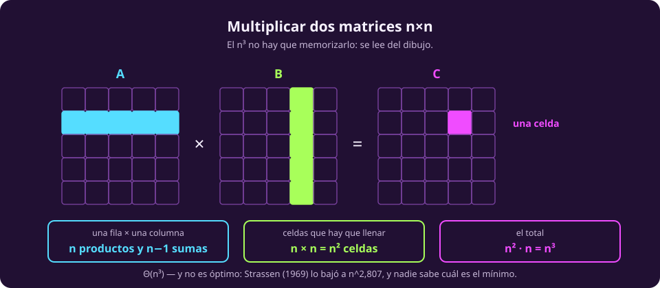
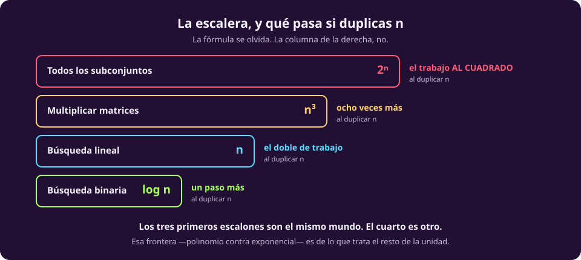
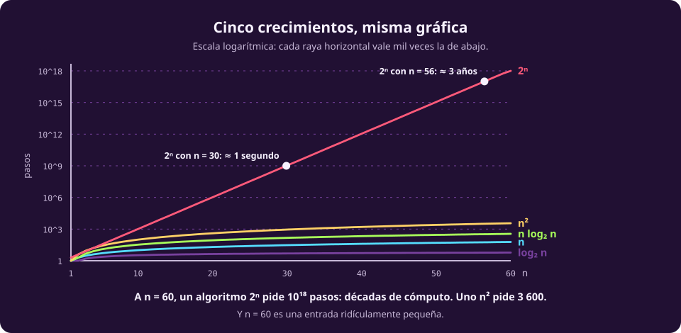

# Contar un algoritmo

La notación ya está. Ahora hay que usarla, y el procedimiento es mecánico:
**mira los ciclos y cuenta cuántas veces se ejecuta lo de adentro**. Nada más.

Van cuatro algoritmos, del más barato al más caro. No están para que los
memorices: están para que veas que la diferencia entre ellos no es de grado.

## 1 · Búsqueda lineal — $\Theta(n)$

```python
def buscar(lista, x):
    for elemento in lista:      # se ejecuta hasta n veces
        if elemento == x:       # 1 comparación cada vez
            return True
    return False
```

Un ciclo, $n$ vueltas, una comparación por vuelta. Total: **$n$ comparaciones en
el peor caso** —cuando $x$ no está—, así que $\Theta(n)$.

El peor caso importa aquí: si $x$ está en la primera posición son $1$
comparaciones. Pero como acordamos en [[cuanto-cuesta|la primera página]], la que
contamos es la peor.

## 2 · Búsqueda binaria — $\Theta(\log n)$

Sobre una lista **ya ordenada**:

```python
def buscar_binaria(lista, x):
    lo, hi = 0, len(lista) - 1
    while lo <= hi:                   # ¿cuántas vueltas?
        medio = (lo + hi) // 2
        if lista[medio] == x: return True
        if lista[medio] < x:  lo = medio + 1
        else:                 hi = medio - 1
    return False
```

Aquí el ciclo no da $n$ vueltas y no es obvio cuántas da. La pregunta correcta
no es «¿cuántas veces?» sino **«¿cuánto queda vivo después de cada vuelta?»**:
la mitad.

Así que la pregunta de verdad es: *¿cuántas veces puedes partir $n$ a la mitad
antes de llegar a 1?* Eso es exactamente $\log_2 n$.

::: table {#cx-binaria-vueltas title="Lo que sobrevive a cada vuelta"}
| Vuelta | Candidatos que quedan |
|---:|---|
| 0 | $n$ |
| 1 | $n/2$ |
| 2 | $n/4$ |
| $k$ | $n/2^k$ |
:::

Se acaba cuando $n/2^k \le 1$, es decir $k \ge \log_2 n$. **$\Theta(\log n)$.**

> [!NOTE]
> **Cada vez que veas «se parte a la mitad», va a salir un logaritmo.** Es el
> patrón más frecuente de toda la materia, y funciona igual si se parte en tres
> o en diez: solo cambia la base, y la base no cuenta.

## 3 · Multiplicar dos matrices — $\Theta(n^3)$

Ésta es la que conecta con matemáticas que ya sabes. Para $C = A \cdot B$ con
matrices $n \times n$:

$$C_{ij} = \sum_{k=1}^{n} A_{ik} B_{kj}$$

```python
def multiplicar(A, B, n):
    C = [[0] * n for _ in range(n)]
    for i in range(n):                 # n veces
        for j in range(n):             #   n veces
            for k in range(n):         #     n veces
                C[i][j] += A[i][k] * B[k][j]
    return C
```

Tres ciclos anidados de $n$ vueltas cada uno: $n \cdot n \cdot n = n^3$
multiplicaciones. **$\Theta(n^3)$**, y no hace falta memorizarlo porque se lee
del dibujo:

::: figure {#cx-matrices title="De dónde sale el n³"}

:::

Cada celda de $C$ cuesta $n$ multiplicaciones. Hay $n^2$ celdas. Producto: $n^3$.

> [!NOTE]
> **Y $n^3$ no es lo mejor posible.** En 1969 Strassen encontró un método que
> multiplica matrices en $O(n^{2{,}807})$, reorganizando el cálculo para hacer
> siete multiplicaciones de bloques en vez de ocho. Desde entonces el exponente
> ha bajado más, y **nadie sabe cuál es el mínimo**: el mejor límite inferior
> conocido es solo $\Omega(n^2)$, que es lo que cuesta escribir el resultado. El
> hueco entre $2$ y $2{,}37$ lleva medio siglo abierto.

Ese recuadro tiene una moraleja que vale para toda la unidad: **la complejidad
que conoces es la de tu algoritmo, no la del problema.** Son cosas distintas, y
distinguirlas es media unidad.

## 4 · Todos los subconjuntos — $\Theta(2^n)$

```python
def mejor_subconjunto(objetos, vale):
    mejor = None
    for s in todos_los_subconjuntos(objetos):   # ¿cuántos hay?
        if vale(s) and es_mejor(s, mejor):
            mejor = s
    return mejor
```

¿Cuántos subconjuntos tiene un conjunto de $n$ elementos? Cada elemento está o
no está: dos opciones, $n$ veces, independientes. **$2^n$.**

Y con eso ya cambiamos de mundo. Esto es lo que hace la fuerza bruta sobre
cualquier problema de elegir un subconjunto —la mochila, la selección de
características, la asignación de recursos—: prueba todo.

::: figure {#ilus-explosion-combinatoria title="Duplicar, y volver a duplicar"}

:::

*(Esta imagen es una ilustración generada, no una fotografía ni un dato real.)*

## Los cuatro, lado a lado

::: figure {#cx-escalera title="La escalera, y qué pasa si duplicas n"}

:::

La columna de la derecha es la que hay que llevarse:

::: table {#cx-duplicar title="Qué le pasa a cada uno cuando n pasa a 2n"}
| Algoritmo | Costo | Al duplicar $n$ |
|---|---|---|
| Búsqueda binaria | $\log n$ | **un paso más** |
| Búsqueda lineal | $n$ | el doble de trabajo |
| Multiplicar matrices | $n^3$ | ocho veces más |
| Todos los subconjuntos | $2^n$ | el trabajo **al cuadrado** |
:::

Esa última fila no es una exageración de estilo. Si con $n$ el algoritmo hacía
un millón de pasos, con $2n$ hace un billón: $2^{2n} = (2^n)^2$.

## Y en números de reloj

Supón una máquina que hace mil millones de operaciones por segundo —un orden de
magnitud razonable para una computadora de hoy:

::: table {#cx-reloj title="Tiempo real, a mil millones de operaciones por segundo"}
| $n$ | $\log_2 n$ | $n$ | $n^2$ | $n^3$ | $2^n$ |
|---:|---|---|---|---|---|
| 10 | instantáneo | instantáneo | instantáneo | instantáneo | instantáneo |
| 100 | instantáneo | instantáneo | instantáneo | 1 ms | $4\times10^{13}$ años |
| 1 000 | instantáneo | instantáneo | 1 ms | 1 s | — |
| 10⁶ | instantáneo | 1 ms | 17 min | 31 700 años | — |
| 10⁹ | instantáneo | 1 s | 31 años | — | — |
:::

::: figure {#cx-crecimiento title="Las cinco curvas, en escala logarítmica"}

:::

Lee esa gráfica con cuidado: **la escala vertical es logarítmica**, así que cada
raya horizontal vale mil veces la anterior. En escala normal, $2^n$ sería una
línea vertical y las otras cuatro serían indistinguibles del eje.

Y fíjate dónde está el corte de $2^n$. Con $n = 30$ ya pide un segundo. Con
$n = 60$ pide $10^{18}$ pasos, décadas de cómputo. **Con sesenta datos.**

> [!NOTE]
> **Pruébalo tú.** Hay una [carrera de crecimiento](_assets/carrera_de_crecimiento.html)
> interactiva: mueves $n$ y ves, en tiempo de reloj, cuánto tardaría cada una de
> las siete complejidades. Vale la pena subir $n$ despacio y mirar el momento en
> que $2^n$ se despega — porque no es gradual.

> [!WARNING]
> **La lección no es que $2^n$ sea grande. Es que la barrera no se mueve.** Si
> tu algoritmo exponencial no alcanza para 60 elementos, no va a alcanzar para
> 61 el año que viene por tener mejor máquina. [[por-que-importa|La página siguiente]]
> explica por qué exactamente.

## Cómo contar, en cuatro reglas

1. **Ciclos anidados se multiplican.** Dos ciclos de $n$ uno dentro del otro dan
   $n^2$.
2. **Ciclos seguidos se suman, y gana el mayor.** $n^2 + n = \Theta(n^2)$.
3. **«Se parte a la mitad» da $\log n$.**
4. **«Cada elemento está o no está» da $2^n$.** «Cada orden posible» da $n!$.
