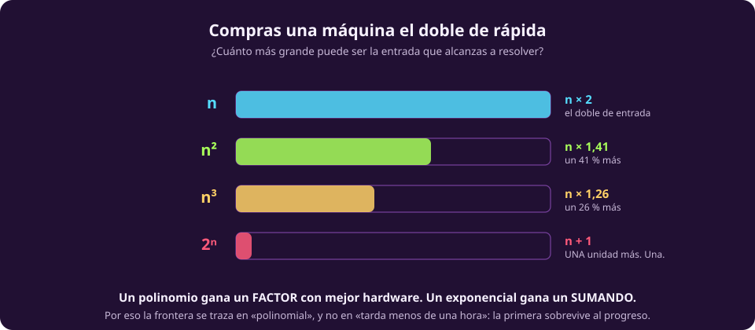
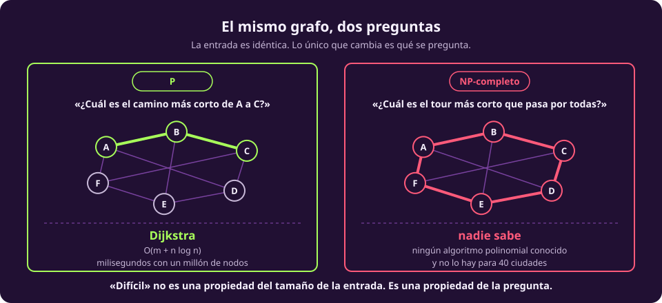

# Por qué esto importa

Ya viste la tabla de tiempos. La pregunta natural es dónde poner la raya: ¿a
partir de qué punto un algoritmo deja de servir?

La respuesta que usa toda la teoría es una sola palabra, **polinomial**, y esta
página explica por qué esa raya y no otra.

## La raya

::: definition {#cx-tratable title="Tratable"}
Un problema es **tratable** si existe un algoritmo que lo resuelve en tiempo
$O(n^k)$ para alguna constante $k$: tiempo **polinomial**.

Es **intratable** si no lo hay.
:::

A primera vista la raya está mal puesta. Un algoritmo $n^{100}$ es polinomial y
completamente inútil; uno $1{,}0001^n$ es exponencial y corre bien hasta entradas
enormes. ¿Por qué entonces «polinomial»?

Hay tres razones, y la primera es decisiva.

## Razón 1 · Es la única raya que sobrevive al progreso

Compra una máquina el doble de rápida. ¿Cuánto más grande es la entrada que
alcanzas a resolver?

::: figure {#cx-frontera title="Qué compras al duplicar la velocidad"}

:::

::: table {#cx-doble-maquina title="Duplicar la velocidad, por tipo de crecimiento"}
| Si tu algoritmo es | El tamaño alcanzable pasa a | Es decir |
|---|---|---|
| $n$ | $2n$ | **el doble** |
| $n^2$ | $1{,}41\,n$ | un 41 % más |
| $n^3$ | $1{,}26\,n$ | un 26 % más |
| $2^n$ | $n + 1$ | **una unidad más. Una.** |
:::

Ahí está todo. Con mejor hardware, **un polinomio gana un factor y un
exponencial gana un sumando.** Si tu algoritmo $2^n$ hoy llega a 50 elementos,
con una máquina mil veces más rápida llegará a 60. Con una máquina un millón de
veces más rápida, a 70.

Una raya trazada en segundos («debe correr en menos de una hora») caduca con
cada generación de procesadores. La raya en «polinomial» no caduca: es una
propiedad del algoritmo, no de la máquina.

## Razón 2 · La clase polinomial es robusta

$P$ no cambia si cambias el modelo de cómputo. Una máquina de Turing de una
cinta, una de varias cintas, una computadora normal, un lenguaje de
programación distinto: todos se simulan entre sí con un costo **polinomial**, así
que lo que es polinomial en uno lo es en todos.

Esto es la versión de complejidad de la tesis de Church-Turing que viste en
[[maquina-de-turing|la unidad anterior]], y es lo que hace que valga la pena
hablar de $P$ como algo objetivo y no como algo relativo a tu computadora.

Ninguna otra raya tiene esa propiedad. «Menos de $n^2$ pasos» sí depende del
modelo.

## Razón 3 · En la práctica, funciona

El argumento teórico sería aire si los exponentes reales fueran $n^{100}$. No lo
son. La inmensa mayoría de los algoritmos polinomiales que la gente encuentra
resultan ser $n$, $n\log n$, $n^2$ o $n^3$, y la inmensa mayoría de los
problemas para los que no se encuentra ninguno resultan ser genuinamente duros.

No es un teorema. Es una observación empírica de sesenta años, y es lo bastante
firme para que la raya se siga usando.

> [!WARNING]
> **«Polinomial» y «rápido» no son sinónimos**, aunque en la práctica casi
> coincidan. Un algoritmo $n^{100}$ es polinomial e inservible. Y al revés: hay
> algoritmos exponenciales que se usan todos los días —los *solvers* de SAT
> resuelven instancias industriales con millones de variables— porque el peor
> caso no es el caso que aparece.

## El ejemplo que hay que tener en la cabeza

::: figure {#cx-dijkstra-vs-tsp title="El mismo grafo, dos preguntas"}

:::

El mismo grafo. La misma entrada, byte por byte. Dos preguntas:

**«¿Cuál es el camino más corto de A a C?»** Es el problema de caminos mínimos.
Dijkstra lo resuelve en $O(m + n\log n)$, y en la práctica eso significa
milisegundos sobre grafos de millones de nodos. Es lo que corre cada vez que
pides indicaciones en un mapa.

**«¿Cuál es el tour más corto que pasa por todas y vuelve al inicio?»** Es el
problema del agente viajero, TSP. Es NP-completo. No se conoce ningún algoritmo
polinomial, y la fuerza bruta sobre 40 ciudades pide $39!$ recorridos, un número
de 47 cifras.

> [!NOTE]
> **«Difícil» no es una propiedad del tamaño de la entrada: es una propiedad de
> la pregunta.** Ese par —Dijkstra contra TSP sobre el mismo grafo— es la mejor
> intuición de toda la unidad, y conviene tenerla a mano cuando lleguen las
> definiciones formales.

::: figure {#ilus-dos-caminos title="La misma entrada, dos destinos"}

:::

*(Esta imagen es una ilustración generada, no una fotografía ni un dato real.)*

## Qué hace la IA cuando cae del lado malo

Casi todo lo que un curso de inteligencia artificial te va a enseñar después es
una respuesta a esta página. Cuando el cálculo exacto es intratable —y lo es casi
siempre— quedan cuatro salidas, y **todas renuncian a algo**:

::: table {#cx-cuatro-salidas title="Las cuatro salidas, y a qué renuncia cada una"}
| Salida | Qué hace | A qué renuncia | Dónde la vas a ver |
|---|---|---|---|
| **Heurística** | busca guiado por una estimación en vez de exhaustivamente | a la garantía de encontrar el óptimo | A\*, búsqueda local, poda alfa-beta |
| **Aproximación** | acepta una solución peor, pero acotada | al óptimo, con un factor conocido | 2-aproximación para TSP métrico |
| **Aleatorización** | tira monedas y acierta con probabilidad alta | a la certeza | Monte Carlo, muestreo, [[azar-y-bpp|BPP]] |
| **Restringir el problema** | resuelve solo los casos que sí aparecen | a la generalidad | 2-SAT, grafos planares, árboles |
:::

Esas cuatro filas son, sin exagerar, el índice de la mitad del curso. La
diferencia entre alguien que sabe complejidad y alguien que no es que el primero
sabe **por qué** está aproximando, y el segundo cree que es la única manera de
programarlo.

Hasta aquí se contó tiempo. [[complejidad-de-espacio|La página siguiente]]
cuenta memoria, que se comporta distinto de una manera que sorprende.
