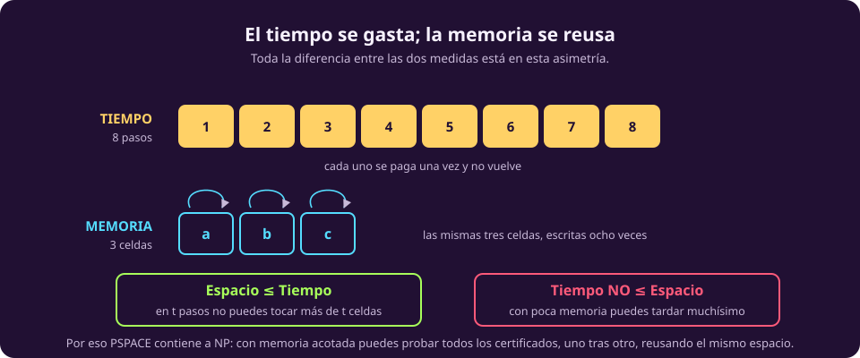
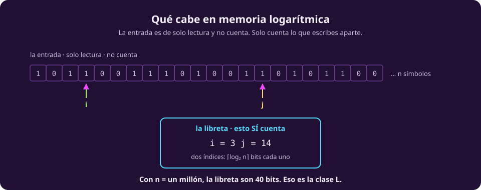

# Contar memoria

Todo lo anterior contó **pasos**. Se puede contar otra cosa: **casillas de
memoria**. Y la teoría que sale es la misma en su forma y muy distinta en sus
consecuencias, por una razón que cabe en una frase.

## La asimetría

::: figure {#cx-espacio-se-reusa title="El tiempo se gasta; la memoria se reusa"}

:::

**Un paso de tiempo se gasta y no vuelve. Una celda de memoria se sobrescribe y
vuelve a servir.**

De ahí salen las dos consecuencias que organizan toda la página:

::: definition {#cx-espacio title="Complejidad de espacio"}
El **espacio** que usa una máquina con entrada $w$ es la cantidad de casillas
**distintas** que escribe antes de detenerse.

La entrada **no cuenta**: se considera de solo lectura. Solo cuenta lo que la
máquina escribe aparte.
:::

Esa última frase parece un tecnicismo y es lo que hace interesante la medida. Si
la entrada contara, ningún algoritmo podría usar menos de $n$ de espacio y la
teoría no tendría nada abajo de $n$ que estudiar.

## Espacio ≤ Tiempo, y no al revés

**En $t$ pasos no puedes tocar más de $t$ casillas**, porque cada paso escribe a
lo más una. Así que el espacio que usa un algoritmo nunca es mayor que su
tiempo:

$$\text{espacio}(n) \;\le\; \text{tiempo}(n)$$

Al revés no vale, y esa es la asimetría entera: **con poquísima memoria puedes
tardar una eternidad**, reusando las mismas celdas una y otra vez. Un contador de
$n$ bits ocupa $n$ casillas y puede llevarte por $2^n$ estados distintos.

De ahí la conclusión que hay que recordar:

> [!NOTE]
> **La memoria rinde muchísimo más que el tiempo.** Una cantidad polinomial de
> memoria alcanza para muchísimo más que una cantidad polinomial de tiempo,
> porque cada celda se reusa un número exponencial de veces.

## Memoria logarítmica: la clase L

::: definition {#cx-clase-l title="L"}
$L$ (de *logarithmic space*) es la clase de problemas que se deciden usando
$O(\log n)$ casillas de memoria de trabajo, con la entrada de solo lectura.
:::

$\log n$ es poquísimo. Con $n = 10^6$, son unos 20 bits. ¿Qué se puede hacer con
eso? La respuesta es la clave para entender la clase:

::: figure {#cx-memoria-logaritmica title="Qué cabe en memoria logarítmica"}

:::

Con $O(\log n)$ bits te caben **un puñado de índices** que apuntan a posiciones
de la entrada —un índice necesita $\lceil \log_2 n \rceil$ bits— y contadores que
llegan hasta $n$. No te cabe una copia de la entrada, ni una lista de lo ya
visitado, ni nada que crezca con $n$.

Y aun así alcanza para bastante: sumar dos números, ver si una cadena es
palíndroma, contar apariciones. La regla mental es *«¿me basta con unos cuantos
punteros que se muevan sobre la entrada?»*.

> [!WARNING]
> **Con memoria logarítmica no puedes marcar los nodos ya visitados.** Eso mata
> el recorrido en profundidad tal como lo conoces, y por eso «¿hay camino de $s$
> a $t$ en un grafo no dirigido?» resistió décadas antes de que se demostrara
> que sí está en $L$ (Reingold, 2004), con un algoritmo nada obvio.

## Memoria polinomial: la clase PSPACE

::: definition {#cx-pspace title="PSPACE"}
$PSPACE$ es la clase de problemas que se deciden usando $O(n^k)$ casillas de
memoria, para alguna constante $k$. Sin límite de tiempo.
:::

Aquí es donde la asimetría cobra. Con memoria polinomial y tiempo libre puedes
**enumerar todas las posibilidades una tras otra, reusando el mismo espacio**:
generas una, la pruebas, la borras, generas la siguiente. Nunca guardas más de
una a la vez.

Eso significa que $PSPACE$ contiene a $NP$ —basta con probar todos los
certificados en serie— y que contiene cosas que $NP$ ni de lejos alcanza, como
decidir quién gana un juego de dos jugadores con jugadas alternadas: el árbol de
la partida es exponencial, pero se recorre con una pila de profundidad
polinomial.

**Ejemplos de PSPACE-completos:** el canónico es decidir si una fórmula
booleana **cuantificada** es cierta ($\forall x \exists y \dots$); también lo son
el Hex y el Reversi generalizados a un tablero $n \times n$.

> [!WARNING]
> **El Go generalizado no es PSPACE-completo: es EXPTIME-completo** (Robson,
> 1983), igual que el ajedrez. Es un error frecuente, y la razón es que una
> partida de Go puede durar exponencialmente muchas jugadas — si se le impone
> un tope polinomial de jugadas, entonces sí cae a PSPACE-completo.

## Dos resultados que conviene conocer

No se demuestran aquí; se enuncian porque salen todo el tiempo.

::: theorem {#cx-savitch title="Teorema de Savitch (1970)"}
El no determinismo **casi no ayuda** cuando la medida es el espacio: una máquina
no determinista que usa $f(n)$ de espacio se simula con una determinista que usa
$O(f(n)^2)$.

En particular, $NPSPACE = PSPACE$: la versión no determinista de $PSPACE$ es
$PSPACE$ mismo.
:::

Compara eso con el tiempo, donde la pregunta análoga —¿$P = NP$?— lleva medio
siglo abierta. **Con espacio, la pregunta está contestada; con tiempo, no.** Y la
razón intuitiva es la de arriba: el espacio se reusa, así que simular todas las
ramas de golpe no cuesta tanto.

::: theorem {#cx-jerarquia-espacio title="Jerarquía de espacio"}
Más memoria compra estrictamente más problemas: si $f$ crece asintóticamente más
que $g$ (con condiciones técnicas menores), hay problemas que se resuelven con
espacio $f(n)$ y no con espacio $g(n)$.

Consecuencia inmediata: $L \subsetneq PSPACE$.
:::

## Dónde encaja todo esto

Con las dos clases de espacio, la cadena de contenciones ya se puede escribir
entera:

$$L \;\subseteq\; P \;\subseteq\; NP \;\subseteq\; PSPACE \;\subseteq\; EXP$$

Cada una de esas contenciones tiene una razón corta:

::: table {#cx-por-que-cadena title="Por qué vale cada eslabón"}
| Eslabón | Por qué |
|---|---|
| $L \subseteq P$ | Con $O(\log n)$ celdas hay $n^{O(1)}$ configuraciones distintas; si no se repite ninguna, el cómputo es polinomial |
| $P \subseteq NP$ | Resolverlo es un caso particular de verificarlo: ignora el certificado |
| $NP \subseteq PSPACE$ | Prueba los certificados uno a uno, reusando el espacio |
| $PSPACE \subseteq EXP$ | Con espacio $n^k$ hay a lo más $2^{O(n^k)}$ configuraciones; más pasos que ésos significa un ciclo |
:::

Las clases $P$, $NP$ y $EXP$ que aparecen ahí son de la página siguiente, así que
esa cadena queda anotada aquí y se retoma completa en
[[el-mapa-de-las-clases|el mapa]]. Lo que sí se puede decir ya: **de esas cuatro
contenciones, no se sabe si alguna es estricta.** Ni una.
