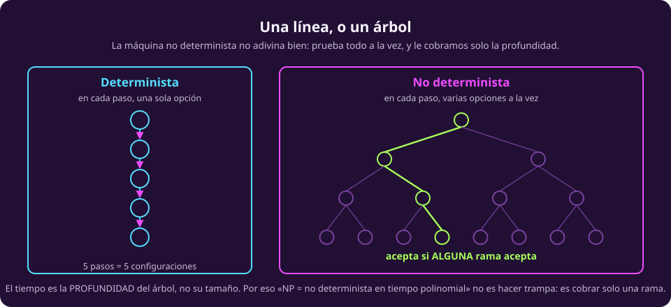
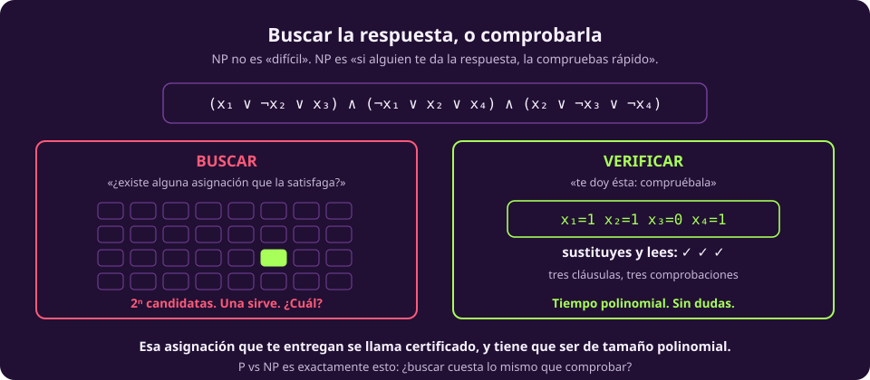
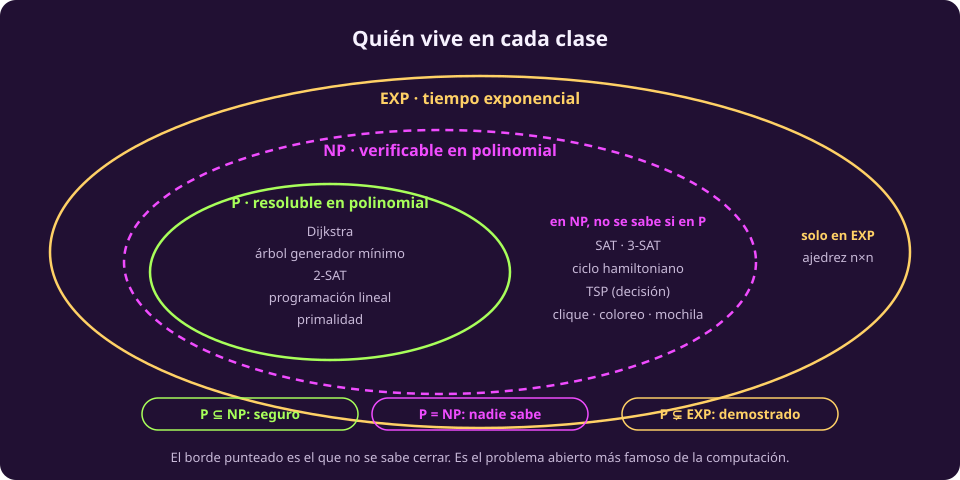

# P, NP y EXP

Aquí se juntan las dos mitades de la unidad. Ya sabemos medir el costo de un
algoritmo; ahora vamos a agrupar **problemas** según cuánto cuesta resolverlos, y
las agrupaciones que salen tienen nombre propio.

Recuerda de [[que-es-el-computo|la unidad anterior]] que un problema de decisión
**es** un conjunto de cadenas: las que tienen respuesta «sí». Así que una clase
de complejidad es, literalmente, un conjunto de conjuntos de cadenas.

## P: lo que se puede resolver

::: definition {#cx-clase-p title="P"}
$P$ es la clase de los problemas de decisión que una máquina de Turing
**determinista** resuelve en tiempo $O(n^k)$ para alguna constante $k$.

Informalmente: *los problemas que se pueden resolver de verdad.*
:::

Ésta es la clase de [[por-que-importa|la página anterior]]: lo tratable. Sus
habitantes son los algoritmos que ya conoces o vas a conocer:

::: table {#cx-inquilinos-p title="Problemas en P, y con qué se resuelven"}
| Problema | La pregunta | Costo |
|---|---|---|
| **Caminos mínimos** | ¿cuál es el camino más barato de $s$ a $t$? | Dijkstra, $O(m + n\log n)$ |
| **Árbol generador mínimo** | ¿cómo conecto todo al menor costo? | Kruskal o Prim, $O(m \log n)$ |
| **Emparejamiento bipartito** | ¿puedo asignar todas las tareas? | Hopcroft-Karp, $O(m\sqrt{n})$ |
| **Flujo máximo** | ¿cuánto puede pasar por la red? | Edmonds-Karp, $O(n m^2)$ |
| **Ordenar** | — | *mergesort*, $\Theta(n \log n)$ |
| **2-SAT** | ¿satisfacible, con 2 literales por cláusula? | $O(n + m)$ por componentes fuertemente conexas |
| **Programación lineal** | optimizar lineal con restricciones lineales | elipsoide (Khachiyan, 1979) |
| **Primalidad** | ¿es $N$ primo? | AKS, 2002 |
:::

Dos de esas filas merecen una nota, porque las dos enseñan algo que se repite.

> [!WARNING]
> **Programación lineal está en $P$, pero el simplex no es polinomial.** El
> método simplex, que es el que se usa en la práctica y el que probablemente te
> enseñaron, es **exponencial en el peor caso** (Klee-Minty, 1972: hay poliedros
> donde visita los $2^n$ vértices). Lo que puso a la programación lineal en $P$
> fue otro algoritmo, el de elipsoide, que en la práctica es más lento.
>
> Moraleja, y es la de toda la unidad: **la clase es del problema, no de tu
> algoritmo.** Que tu método sea exponencial no dice nada sobre el problema.

> [!NOTE]
> **Primalidad se mudó de clase en 2002.** Durante décadas solo se sabía
> resolverla rápido con azar —eso es [[azar-y-bpp|la página siguiente]]— hasta
> que Agrawal, Kayal y Saxena dieron un algoritmo determinista polinomial. Es la
> prueba viva de que estas clasificaciones son sobre lo que *sabemos*, no
> necesariamente sobre lo que *es*.

## La máquina no determinista

Antes de $NP$ hace falta una máquina que no existe. No es un truco de
divulgación: es un objeto matemático perfectamente definido, y solo hay que
tener claro qué se le cobra.

::: definition {#cx-def-no-determinista title="Máquina de Turing no determinista"}
Igual que la máquina de [[maquina-de-turing|la unidad anterior]], salvo que su
función de transición puede devolver **varias** opciones para la misma
configuración, en vez de una.

La máquina **acepta** $w$ si **alguna** de sus ramas de ejecución acepta.
:::

::: figure {#cx-no-determinista title="Una línea, o un árbol"}

:::

La palabra que confunde es «no determinista». **No significa aleatorio** —eso es
otra cosa y es la página siguiente— y no significa que la máquina adivine bien.
Significa que explora todas las opciones a la vez, y que le cobramos:

> [!WARNING]
> **El tiempo de una máquina no determinista es la PROFUNDIDAD del árbol, no su
> tamaño.** Un árbol de profundidad $n$ tiene $2^n$ nodos, y aun así decimos que
> la máquina tardó $n$ pasos. Ahí está toda la magia, y por eso la máquina no es
> construible: exploraría exponencialmente muchas ramas en tiempo polinomial.

::: figure {#ilus-el-arbol-que-se-abre title="Todas las ramas a la vez"}

:::

*(Esta imagen es una ilustración generada, no una fotografía ni un dato real.)*

## NP: lo que se puede verificar

::: definition {#cx-clase-np title="NP"}
$NP$ es la clase de los problemas que una máquina de Turing **no determinista**
resuelve en tiempo polinomial.
:::

Ésa es la definición histórica —de ahí la N de *nondeterministic*, que **no** es
la N de *no polinomial*— y hay una equivalente que es la que se usa siempre:

::: definition {#cx-np-certificado title="NP, por certificados"}
$L \in NP$ si existe un verificador $V$ de tiempo polinomial tal que

$$w \in L \iff \text{existe un certificado } c, \text{ de tamaño polinomial en } |w|, \text{ con } V(w, c) = \text{acepta}.$$

Informalmente: *si la respuesta es sí, hay una prueba corta que lo demuestra y
que puedes revisar rápido.*
:::

::: figure {#cx-verificar-vs-buscar title="Buscar la respuesta, o comprobarla"}

:::

Las dos definiciones son equivalentes, y la razón es corta: el certificado es
exactamente **el camino por el árbol** que lleva a la rama que acepta.

La segunda definición es la que sirve para reconocer un problema de $NP$ en
segundos. Pregúntate: *si alguien me da la respuesta, ¿puedo revisarla rápido?*

::: table {#cx-inquilinos-np title="Problemas en NP: cuál es el certificado, y cómo se revisa"}
| Problema | La pregunta | El certificado | Revisarlo cuesta |
|---|---|---|---|
| **SAT** | ¿es satisfacible esta fórmula booleana? | una asignación de valores | sustituir y evaluar |
| **3-SAT** | lo mismo, con 3 literales por cláusula | una asignación | igual |
| **Ciclo hamiltoniano** | ¿hay un ciclo que pase por cada vértice exactamente una vez? | el ciclo | recorrerlo y ver que no repite |
| **TSP (decisión)** | ¿hay un tour de costo $\le k$? | el tour | sumar sus aristas |
| **Clique** | ¿hay $k$ vértices todos conectados entre sí? | los $k$ vértices | revisar los $\binom{k}{2}$ pares |
| **Coloreo** | ¿se puede colorear con 3 colores sin vecinos iguales? | el coloreo | revisar cada arista |
| **Mochila** | ¿hay un subconjunto de valor $\ge V$ y peso $\le W$? | el subconjunto | sumar dos veces |
| **Factorización** | ¿tiene $N$ un factor menor que $k$? | el factor | una división |
:::

Fíjate que **todos** tienen la misma forma: hay una cosa que buscar, encontrarla
parece caro, y comprobarla es trivial.

> [!NOTE]
> **$P \subseteq NP$, y es inmediato.** Si puedes resolverlo tú solo, puedes
> verificarlo: ignora el certificado que te dan y resuélvelo. La pregunta abierta
> es la otra dirección.

::: figure {#ilus-la-llave-y-los-cerrojos title="Comprobar es fácil; buscar, no"}

:::

*(Esta imagen es una ilustración generada, no una fotografía ni un dato real.)*

### El error de nombre más común

> [!WARNING]
> **NP no significa «no polinomial».** Significa *nondeterministic polynomial*, y
> $P \subseteq NP$: todos los problemas fáciles están en NP. Decir «este problema
> es NP» de un problema difícil es, técnicamente, decir muy poco: ordenar una
> lista también es NP.

## EXP: lo que se puede resolver, aunque tarde

::: definition {#cx-clase-exp title="EXP"}
$EXP$ es la clase de los problemas que una máquina determinista resuelve en
tiempo $O(2^{n^k})$ para alguna constante $k$.
:::

$EXP$ es enorme, y contiene a $NP$: dado un problema de $NP$, **prueba todos los
certificados**. Hay a lo más $2^{\text{polinomio}}$ de ellos y cada uno se revisa
en tiempo polinomial, así que el total es exponencial. Bruto, pero suficiente.

Sus habitantes propios —problemas que están en $EXP$ y **se demostró** que no
están en $P$— son sobre todo juegos generalizados: el ajedrez sobre un tablero
$n \times n$, sin la regla de las 50 jugadas, es $EXP$-completo, y por lo tanto
**demostradamente intratable**. No es que no sepamos: es que se sabe que no se
puede.

## Las tres, juntas

::: figure {#cx-tres-clases title="Quién vive en cada clase"}

:::

$$P \;\subseteq\; NP \;\subseteq\; EXP$$

Y aquí está lo raro, que es lo que hay que llevarse de la página:

::: table {#cx-que-se-sabe-tiempo title="Qué se sabe de esas dos contenciones"}
| Afirmación | Estado |
|---|---|
| $P \subseteq NP$ | **demostrado** (es inmediato) |
| $NP \subseteq EXP$ | **demostrado** (prueba todos los certificados) |
| $P \subsetneq EXP$ | **demostrado** (teorema de jerarquía de tiempo) |
| $P \subsetneq NP$ | **abierto**. El problema del millón de dólares |
| $NP \subsetneq EXP$ | **abierto** |
:::

Sabemos que los dos extremos de la cadena son distintos. **No sabemos dónde, en
medio, está el corte** — ni siquiera si hay uno.

La página siguiente mete una máquina más al cuadro: una que
[[azar-y-bpp|tira monedas]].
