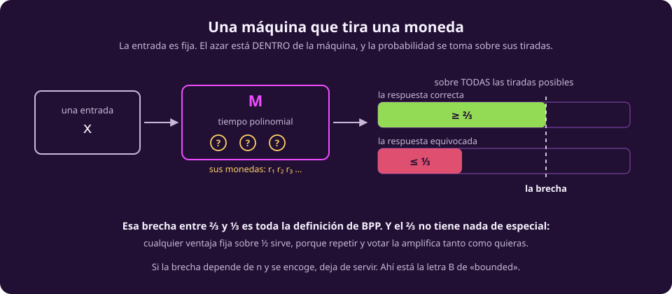
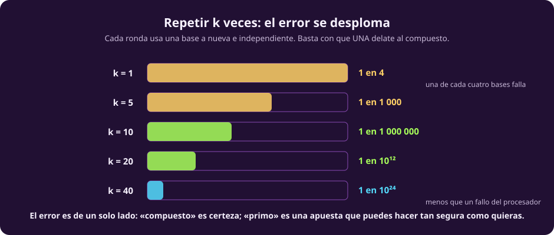
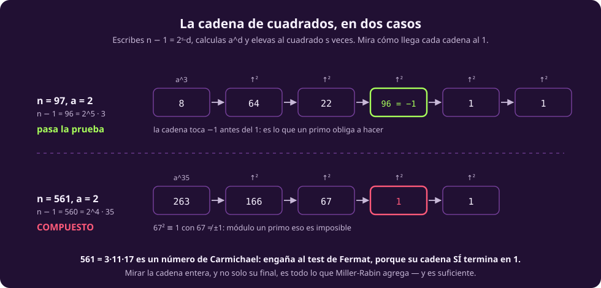

# Máquinas que tiran monedas

Le damos una capacidad más a la máquina: **puede tirar una moneda**. No adivina,
no explora todas las ramas a la vez; simplemente, en algunos pasos, decide al
azar.

Suena a poco. Resulta que a veces convierte un problema que no sabíamos resolver
rápido en uno que sí, y la pregunta de **cuánto** ayuda el azar sigue abierta.

## La máquina probabilista

::: definition {#cx-maquina-probabilista title="Máquina de Turing probabilista"}
Una máquina de Turing que, además de su entrada, recibe una cadena de **bits
aleatorios** y puede leerlos.

Para una entrada **fija**, la máquina puede dar respuestas distintas según qué
bits le tocaron.
:::

::: figure {#cx-monte-carlo title="Una máquina que tira una moneda"}

:::

> [!WARNING]
> **El azar está en la máquina, no en la entrada.** Esto no es «complejidad en
> promedio sobre entradas típicas». La entrada es la peor posible, fija, elegida
> por un adversario; lo único aleatorio son las monedas. Por eso la garantía
> vale **para toda entrada**, y por eso sirve.

## Monte Carlo y Las Vegas

Hay dos maneras de gastar el azar, y conviene no confundirlas:

::: table {#cx-monte-vs-vegas title="Los dos tipos de algoritmo aleatorizado"}
| | **Monte Carlo** | **Las Vegas** |
|---|---|---|
| El tiempo | siempre acotado | **variable**, al azar |
| La respuesta | puede estar mal, con probabilidad chica | **siempre correcta** |
| Qué arriesgas | la corrección | el tiempo |
| Ejemplo | Miller-Rabin, corte mínimo de Karger | *quicksort* con pivote al azar |
:::

El nombre viene de los casinos, y la regla mnemotécnica es directa: en Monte
Carlo apuestas la respuesta; en Las Vegas apuestas el reloj. **BPP es la clase de
los Monte Carlo.**

## BPP

::: definition {#cx-bpp title="BPP"}
$BPP$ (*bounded-error probabilistic polynomial time*) es la clase de los
problemas para los que existe una máquina probabilista de tiempo polinomial tal
que, **para toda** entrada $w$:

- si $w \in L$, acepta con probabilidad $\ge 2/3$;
- si $w \notin L$, acepta con probabilidad $\le 1/3$.

La probabilidad se toma sobre las monedas de la máquina.
:::

Las dos preguntas que esa definición provoca, contestadas:

**¿Por qué $2/3$?** Por nada. Cualquier constante $> 1/2$ sirve, y da la misma
clase. La razón es la **amplificación**: corre el algoritmo $k$ veces
independientes y quédate con la respuesta que salió más veces. Con una ventaja
fija sobre la moneda justa, la probabilidad de que la mayoría se equivoque cae
**exponencialmente** en $k$. Así que $0{,}51$ se convierte en $0{,}9999$
pagando un factor constante.

**¿Por qué «acotado»?** Porque la brecha entre $2/3$ y $1/3$ no puede
encogerse con $n$. Si la ventaja sobre $1/2$ se desvanece —digamos, $1/2 + 2^{-n}$—
la amplificación necesitaría exponencialmente muchas repeticiones y la clase
deja de significar algo. Esa es la letra B de *bounded*.

::: figure {#cx-error-se-desploma title="Repetir k veces: el error se desploma"}

:::

::: figure {#ilus-la-moneda title="La máquina decide con una moneda"}

:::

*(Esta imagen es una ilustración generada, no una fotografía ni un dato real.)*

## Miller-Rabin, desde el principio

El ejemplo canónico de la clase, y vale la pena construirlo entero porque cada
paso enseña algo. El problema es:

> Dado un entero $N$, ¿es primo?

Recuerda de [[cuanto-cuesta|la primera página]] que el tamaño de la entrada es
$n = \log N$, no $N$. Probar todos los divisores hasta $\sqrt{N}$ cuesta
$10^{n/2}$ operaciones: **exponencial**. Hace falta otra idea.

### Paso 1 · El pequeño teorema de Fermat

::: theorem {#cx-fermat title="Pequeño teorema de Fermat"}
Si $p$ es primo y $a$ no es múltiplo de $p$, entonces

$$a^{\,p-1} \equiv 1 \pmod p.$$
:::

Ésa es la puerta de entrada, y la idea es usarla **al revés**: si encuentro una
$a$ con $a^{N-1} \not\equiv 1 \pmod N$, entonces $N$ **no** es primo. Sin dudas,
sin margen de error.

Y calcular $a^{N-1} \bmod N$ es barato: la exponenciación binaria lo hace con
$O(\log N) = O(n)$ multiplicaciones, elevando al cuadrado repetidamente. **La
prueba cuesta polinomial.**

Esa es la parte bonita: hemos convertido «buscar un divisor» en «evaluar una
potencia», y la segunda es exponencialmente más barata.

### Paso 2 · Por qué el test de Fermat no basta

El test ingenuo sería: elige varias $a$, calcula $a^{N-1} \bmod N$, y si todas
dan $1$, declara primo. Casi funciona. Falla por unos números específicos:

::: definition {#cx-carmichael title="Número de Carmichael"}
Un compuesto $N$ tal que $a^{N-1} \equiv 1 \pmod N$ para **toda** $a$ coprima con
$N$.

El más chico es $561 = 3 \cdot 11 \cdot 17$. Hay infinitos.
:::

Un número de Carmichael pasa el test de Fermat con **todas** las bases. No es que
tengas mala suerte con la $a$: es que ninguna $a$ lo delata. Repetir no ayuda, y
un algoritmo que se puede engañar siempre no es un algoritmo probabilista, es un
algoritmo malo.

### Paso 3 · El arreglo

La idea de Miller y Rabin es **mirar cómo se llega al $1$, y no solo que se
llegue**. Usa un hecho de aritmética modular:

::: theorem {#cx-raices-de-uno title="Raíces cuadradas de 1 módulo un primo"}
Si $p$ es primo y $x^2 \equiv 1 \pmod p$, entonces $x \equiv 1$ o
$x \equiv -1 \pmod p$.

*Por qué:* $x^2 - 1 = (x-1)(x+1) \equiv 0$, y módulo un primo un producto es cero
solo si alguno de los factores lo es.
:::

Módulo un **compuesto** eso puede fallar, y ahí está la grieta por donde entra el
test. Concretamente:

Escribe $N - 1 = 2^s \cdot d$ con $d$ **impar** —siempre se puede: saca todos los
factores $2$. Entonces

$$a^{N-1} = a^{2^s d} = \Big(\big((a^{d})^2\big)^2 \cdots\Big)^2$$

es el resultado de elevar $a^d$ al cuadrado $s$ veces. Si $N$ es primo, esa
cadena **tiene que** terminar en $1$ (por Fermat), y por el teorema de arriba solo
puede llegar al $1$ desde $1$ o desde $-1$.

::: definition {#cx-testigo title="Testigo de Miller-Rabin"}
$N$ **pasa la prueba en base $a$** si

- $a^d \equiv 1 \pmod N$, **o**
- $a^{2^r d} \equiv -1 \pmod N$ para algún $r$ con $0 \le r < s$.

Si no pasa, $a$ es un **testigo** de que $N$ es compuesto.
:::

### Paso 4 · Las dos cadenas, lado a lado

::: figure {#cx-miller-rabin title="La cadena de cuadrados, en dos casos"}

:::

**$N = 97$ (primo), $a = 2$.** Aquí $96 = 2^5 \cdot 3$, así que $s = 5$, $d = 3$.
La cadena es

$$8 \to 64 \to 22 \to 96 \to 1 \to 1$$

y $96 \equiv -1 \pmod{97}$. La cadena **toca $-1$** antes de llegar al $1$, que es
justo lo que un primo obliga a hacer. Pasa la prueba.

**$N = 561$ (el Carmichael más chico), $a = 2$.** Aquí $560 = 2^4 \cdot 35$, así
que $s = 4$, $d = 35$. La cadena es

$$263 \to 166 \to 67 \to 1 \to 1$$

Fíjate qué pasó. **El test de Fermat lo deja pasar**: la cadena termina en $1$,
que es todo lo que Fermat mira. Pero Miller-Rabin ve la penúltima entrada: $67$,
y $67^2 \equiv 1 \pmod{561}$ con $67 \ne \pm 1$. Módulo un primo eso es imposible.
**$561$ es compuesto**, y $2$ lo demostró.

> [!NOTE]
> **Todo el algoritmo cabe en una frase:** mirar la cadena entera de cuadrados en
> vez de solo su final. Eso es lo único que Miller-Rabin agrega a Fermat, y es
> suficiente para que ningún número —Carmichael incluidos— se le escape siempre.

### Paso 5 · La cuenta del error

::: theorem {#cx-tres-cuartos title="Densidad de testigos (Rabin, 1980)"}
Si $N$ es compuesto, **al menos $3/4$** de las bases $a \in \{1, \dots, N-1\}$
son testigos de que lo es.
:::

Ése es el teorema que hace que el algoritmo funcione, y es la parte difícil. Con
él, el resto es aritmética:

- Eliges una $a$ al azar. Si $N$ es compuesto, la delatas con probabilidad
  $\ge 3/4$; te equivocas con probabilidad $\le 1/4$.
- Repites con $k$ bases independientes. Fallar significa fallar las $k$ veces:
  probabilidad $\le (1/4)^k = 4^{-k}$.

::: table {#cx-rondas title="El error, por número de rondas"}
| Rondas $k$ | Probabilidad de equivocarse |
|---:|---|
| 1 | 1 en 4 |
| 5 | 1 en 1 000 |
| 10 | 1 en 1 000 000 |
| 20 | 1 en $10^{12}$ |
| 40 | 1 en $10^{24}$ |
:::

Con $k = 40$ la probabilidad de error es menor que la de que el procesador se
equivoque por un rayo cósmico. **Seguir pidiendo certeza deja de tener sentido
físico**, y por eso ésta es la prueba de primalidad que corre de verdad en
cualquier biblioteca de criptografía.

### Paso 6 · El error es de un solo lado

Un detalle que vale doble en el examen:

> [!NOTE]
> **«Compuesto» es certeza; «primo» es una apuesta.** Si el algoritmo encuentra
> un testigo, $N$ es compuesto y punto: el testigo es una demostración. Solo
> puede equivocarse en la otra dirección, diciendo «probablemente primo» de un
> compuesto afortunado.

Esa asimetría tiene nombre: es la clase $RP$ (error de un solo lado), y
$RP \subseteq BPP$. En estos términos, primalidad está en $coRP$.

### Y el remate: en 2002 se mudó de clase

En 2002, Agrawal, Kayal y Saxena dieron un algoritmo **determinista** de tiempo
polinomial para primalidad. Es decir: **PRIMES está en $P$.**

Ese resultado es la mejor evidencia empírica de la sospecha que cierra esta
página. Un problema vivió treinta años como ejemplo estrella de «esto solo lo sé
hacer con azar», y luego resultó que el azar no hacía falta. (En la práctica AKS
es más lento que Miller-Rabin, así que la biblioteca de tu computadora sigue
usando el aleatorio — pero eso es una cuestión de constantes, no de clase.)

## Otro ejemplo, más corto

**Identidad de polinomios.** Dados dos polinomios de muchas variables escritos
como circuitos, ¿son el mismo polinomio? Expandirlos es exponencial. Pero hay un
truco: **evalúalos en un punto al azar**. Si son distintos, su diferencia es un
polinomio no nulo, y un polinomio no nulo tiene pocas raíces —eso es el lema de
Schwartz-Zippel— así que casi cualquier punto los separa.

Error de un solo lado otra vez: si dan distinto, son distintos, seguro. Y a
diferencia de primalidad, **para éste no se conoce ningún algoritmo determinista
polinomial**. Es el problema abierto insignia de la derandomización.

## Dónde queda BPP

$$P \;\subseteq\; BPP \;\subseteq\; PSPACE$$

La primera contención es trivial: no tires las monedas. La segunda también:
recorre todas las cadenas de monedas posibles, una tras otra, reusando el mismo
espacio —el argumento de [[complejidad-de-espacio|la página de memoria]]— y cuenta
cuántas aceptan.

Y ahora las dos cosas raras:

> [!WARNING]
> **No se sabe si $BPP \subseteq NP$.** Suena increíble, y lo es: nadie ha
> demostrado que un problema resoluble con azar en tiempo polinomial tenga
> siquiera un certificado corto. Lo que sí se sabe es que $BPP$ cabe en el
> segundo nivel de una jerarquía por encima de $NP$.

Y sin embargo, **la mayoría de los expertos cree que $P = BPP$**: que el azar no
compra nada. La evidencia es de dos tipos. Empírica —el caso de primalidad, que
acabas de ver— y teórica: si existen ciertos problemas difíciles, entonces se
puede *derandomizar* cualquier algoritmo aleatorio a costa de un factor
polinomial (Impagliazzo-Wigderson, 1997).

Es una situación curiosa y vale la pena saborearla: **se sospecha que el azar es
inútil, y no se sabe demostrar; se sospecha que el no determinismo es
poderosísimo, y tampoco.** Las dos sospechas son de lo más firme que hay en el
campo, y las dos siguen abiertas.

La página siguiente vuelve a $NP$ y contesta la pregunta que quedó colgando:
[[completos-y-duros|cuáles son sus problemas más difíciles]], y por qué son
todos el mismo.
