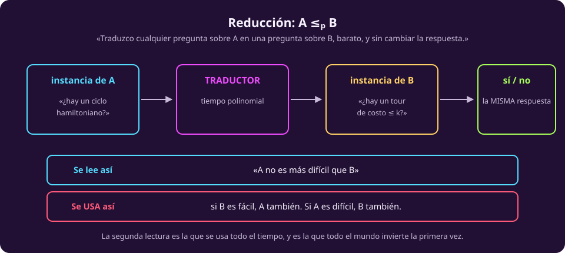
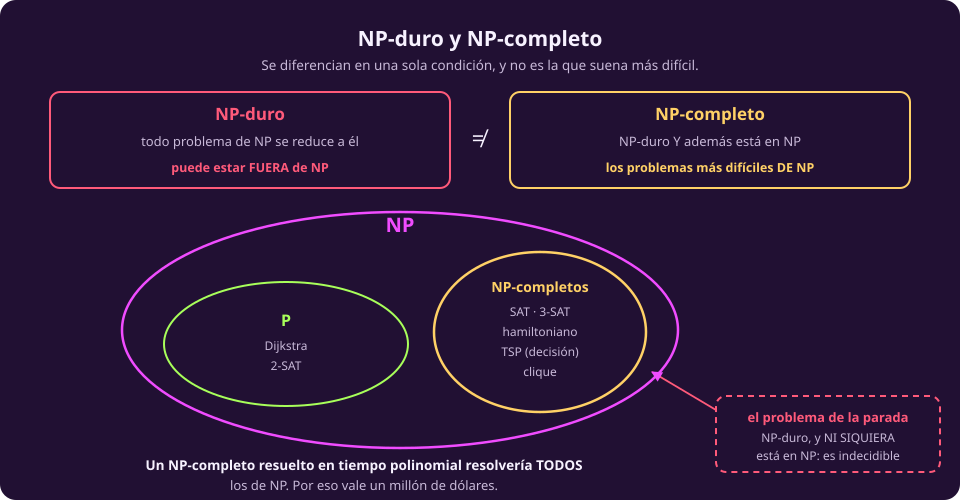
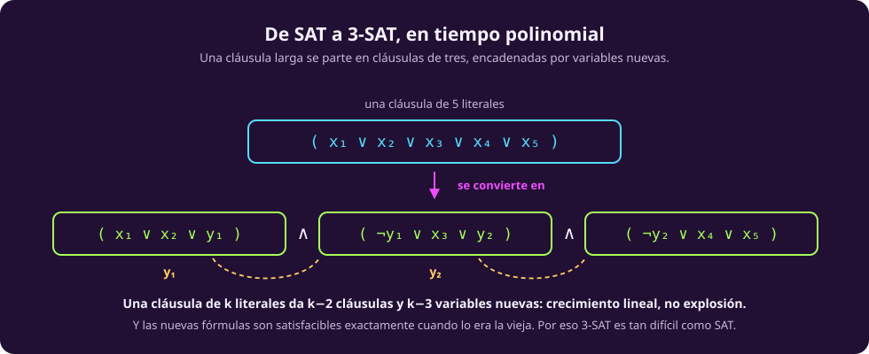
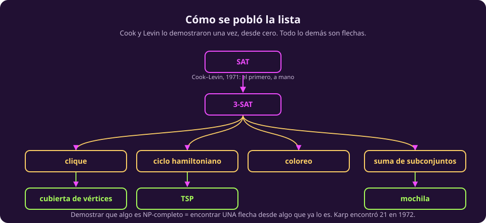

# Reducciones, duros y completos

Aquí llega la idea que organiza todo lo demás. Hasta ahora clasificamos
problemas por lo que cuesta resolverlos; ahora vamos a **compararlos entre sí**,
y va a resultar que cientos de problemas que no se parecen en nada son, en un
sentido preciso, el mismo problema.

## Una reducción es un traductor barato

::: definition {#cx-def-reduccion title="Reducción polinomial"}
$A \le_p B$ («$A$ se reduce a $B$») si existe una función $f$ computable en
tiempo polinomial tal que, para toda entrada $w$,

$$w \in A \iff f(w) \in B.$$

Es decir: $f$ traduce preguntas sobre $A$ en preguntas sobre $B$, barato, sin
cambiar la respuesta.
:::

::: figure {#cx-reduccion title="Reducción: A ≤ₚ B"}

:::

Lo importante no es la definición sino **cómo se usa**, y ahí es donde todo el
mundo se confunde la primera vez. Hay dos lecturas y hay que tener las dos:

::: table {#cx-dos-lecturas title="Qué significa A ≤ₚ B, en las dos direcciones"}
| | Dice |
|---|---|
| **Hacia arriba** | Si $B$ es fácil, $A$ también: resuelve $A$ traduciendo y llamando a $B$ |
| **Hacia abajo** | Si $A$ es difícil, $B$ **también**: si $B$ fuera fácil, $A$ lo sería |
:::

En una frase: **$A \le_p B$ significa que $B$ es al menos tan difícil como $A$.**
La flecha apunta hacia el problema más difícil, aunque se lea al revés.

> [!WARNING]
> **La dirección es contraintuitiva y se pregunta.** «$A$ se reduce a $B$» suena
> a que $A$ es el difícil, y es al contrario: $A$ es el que se resuelve con la
> ayuda de $B$, así que $B$ carga con el trabajo.

La segunda lectura es la que se usa: para demostrar que un problema nuevo es
difícil, se reduce a él un problema que ya se sabe difícil.

## Duro y completo

::: definition {#cx-np-duro title="NP-duro"}
$B$ es **NP-duro** si $A \le_p B$ para **todo** $A \in NP$.

Es decir: $B$ es al menos tan difícil como cualquier cosa en $NP$.
:::

::: definition {#cx-np-completo title="NP-completo"}
$B$ es **NP-completo** si es NP-duro **y además** $B \in NP$.

Es decir: es de los más difíciles de $NP$, y está en $NP$.
:::

::: figure {#cx-duro-vs-completo title="NP-duro y NP-completo"}

:::

La diferencia es **una sola condición**, y no es la que suena más severa: un
NP-duro puede estar **fuera** de $NP$, y ser mucho peor que cualquier cosa de
ahí dentro.

El ejemplo que ata esta unidad con la anterior:

> [!NOTE]
> **El problema de la parada es NP-duro y no es NP-completo.** Es NP-duro porque
> todo problema de $NP$ se le reduce —le puedes preguntar cualquier cosa. Y no es
> NP-completo porque **no está en $NP$**: [[problema-de-la-parada|es indecidible]],
> no tiene ni certificado ni verificador ni algoritmo de ninguna clase.
>
> Ahí se ve por qué la segunda condición no sobra: sin ella, «NP-duro» incluye
> cosas que no se pueden resolver en absoluto.

Y la propiedad que hace que la definición valga la pena:

::: theorem {#cx-uno-cae-caen-todos title="Si cae uno, caen todos"}
Si algún problema NP-completo está en $P$, entonces $P = NP$.

*Por qué:* sea $B$ NP-completo y en $P$. Todo $A \in NP$ cumple $A \le_p B$, así
que $A$ se resuelve traduciendo (polinomial) y llamando a $B$ (polinomial). Un
polinomio compuesto con otro polinomio es un polinomio.
:::

Por eso resolver **uno solo** de los problemas de la lista vale un millón de
dólares. Los cientos de problemas NP-completos conocidos son, en realidad, un
solo problema con cientos de disfraces.

## SAT, el primero de todos

::: definition {#cx-sat title="SAT"}
Dada una fórmula booleana en forma normal conjuntiva —una conjunción de
cláusulas, cada cláusula una disyunción de literales— ¿existe una asignación de
verdadero y falso a las variables que la haga verdadera?

$$(x_1 \vee \neg x_2 \vee x_3) \wedge (\neg x_1 \vee x_2 \vee x_4) \wedge (x_2 \vee \neg x_3 \vee \neg x_4)$$
:::

Está en $NP$: el certificado es la asignación, y revisarla es sustituir y
evaluar. Lo que no es obvio, en absoluto, es lo otro:

::: theorem {#cx-cook-levin title="Teorema de Cook-Levin (1971)"}
**SAT es NP-completo.**
:::

Esto lo demostraron Stephen Cook en 1971 y, de manera independiente, Leonid Levin
en la Unión Soviética. Es el resultado que arranca toda la teoría, y la idea de
la demostración se puede contar en una frase, aunque los detalles no.

**La idea.** Sea $A$ cualquier problema de $NP$, con su máquina no determinista
$M$ que corre en tiempo $n^k$. La demostración construye una fórmula booleana que
describe **el cómputo entero de $M$**: variables que dicen «en el paso $t$, la
casilla $i$ contiene el símbolo $\sigma$», y cláusulas que dicen «el paso $t+1$
sigue del paso $t$ según las reglas», «el primer paso es la configuración
inicial», «algún paso acepta».

La fórmula es satisfacible **exactamente cuando** existe un cómputo que acepta.
Y como $M$ corre en tiempo $n^k$, la tabla del cómputo tiene $n^k \times n^k$
casillas y la fórmula sale de tamaño polinomial.

> [!NOTE]
> **Lo que hace Cook-Levin es traducir «existe un cómputo que acepta» a «existe
> una asignación que satisface».** Por eso SAT es especial: la satisfacibilidad
> booleana es lo bastante expresiva para hablar de cualquier cómputo, y por eso
> el trabajo duro se hizo **una vez** y para siempre.

## 3-SAT: el mismo problema, más limpio

::: definition {#cx-3sat title="3-SAT"}
SAT restringido a fórmulas donde **cada cláusula tiene exactamente tres
literales**.
:::

Es un caso particular de SAT, así que a primera vista debería ser más fácil. No
lo es: **3-SAT también es NP-completo**, y la razón es que SAT se traduce a
3-SAT en tiempo polinomial.

::: figure {#cx-sat-a-3sat title="De SAT a 3-SAT, en tiempo polinomial"}

:::

La traducción parte cada cláusula larga, encadenándola con **variables nuevas**.
Una cláusula de cinco literales

$$(x_1 \vee x_2 \vee x_3 \vee x_4 \vee x_5)$$

se convierte en tres cláusulas de tres:

$$(x_1 \vee x_2 \vee y_1) \wedge (\neg y_1 \vee x_3 \vee y_2) \wedge (\neg y_2 \vee x_4 \vee x_5)$$

**Por qué funciona.** Si la original era verdadera, algún $x_i$ es verdadero, y se
pueden elegir los valores de $y_1, y_2$ para que las tres cláusulas nuevas se
satisfagan. Y al revés: si algún $y$ obligara a que las tres se satisfagan sin
que ningún $x_i$ sea verdadero, la cadena de implicaciones te fuerza a
$\neg y_1$ y $y_1$ a la vez. Las dos fórmulas son satisfacibles exactamente en
los mismos casos.

**Y es polinomial.** Una cláusula de $k$ literales da $k-2$ cláusulas y $k-3$
variables nuevas: crecimiento lineal, no explosión. Aplicado a toda la fórmula,
la traducción es lineal en su tamaño.

> [!NOTE]
> **Por qué 3 y no 2.** Porque **2-SAT sí está en $P$**: se resuelve en tiempo
> lineal viendo la fórmula como un grafo de implicaciones y buscando sus
> componentes fuertemente conexas. La frontera entre lo fácil y lo NP-completo
> pasa exactamente entre 2 y 3 literales por cláusula, y no hay nada en medio.

3-SAT es el problema desde el que se hacen casi todas las demás reducciones,
porque su estructura rígida —siempre tres— hace las construcciones más fáciles de
diseñar.

## Cómo se pobló la lista

::: figure {#cx-arbol-de-karp title="Cómo se pobló la lista"}

:::

Con Cook-Levin en la mano, demostrar que un problema nuevo es NP-completo se
vuelve mecánico. Son dos pasos:

1. Enseña que está **en $NP$** (da el certificado).
2. Reduce a él **un problema que ya sabes NP-completo**.

En 1972, Richard Karp hizo esto veintiuna veces en un solo artículo, y ahí quedó
claro que la lista no era una curiosidad: eran los problemas que la gente venía
intentando resolver desde hacía décadas, todos, y todos el mismo.

::: table {#cx-catalogo-npc title="Un catálogo mínimo de NP-completos"}
| Problema | La pregunta | Se reduce desde |
|---|---|---|
| **SAT** | ¿es satisfacible? | — (Cook-Levin, a mano) |
| **3-SAT** | ídem, tres literales por cláusula | SAT |
| **Clique** | ¿hay $k$ vértices todos conectados entre sí? | 3-SAT |
| **Cubierta de vértices** | ¿hay $k$ vértices que tocan todas las aristas? | Clique |
| **Coloreo con 3 colores** | ¿se puede colorear sin vecinos iguales? | 3-SAT |
| **Ciclo hamiltoniano** | ¿hay un ciclo que pase por cada vértice una vez? | 3-SAT |
| **TSP (decisión)** | ¿hay un tour de costo $\le k$? | Ciclo hamiltoniano |
| **Suma de subconjuntos** | ¿hay un subconjunto que sume exactamente $S$? | 3-SAT |
| **Mochila** | ¿hay un subconjunto de valor $\ge V$ y peso $\le W$? | Suma de subconjuntos |
:::

Fíjate en el par del final de la tabla. **Hamiltoniano a TSP** es una reducción de
tres líneas: dado un grafo, construye una instancia de TSP con costo $1$ en las
aristas que existen y $2$ en las que no, y pregunta si hay tour de costo $\le n$.
Hay tour barato exactamente cuando hay ciclo hamiltoniano.

## Decisión contra optimización

Una distinción que se pregunta y que la tabla de arriba insinúa:

::: table {#cx-decision-optimizacion title="Las dos versiones del mismo problema"}
| | Versión de decisión | Versión de optimización |
|---|---|---|
| La pregunta | ¿hay un tour de costo $\le k$? | ¿cuál es el tour más barato? |
| La respuesta | sí / no | un tour |
| Está en $NP$ | **sí** | no aplica: $NP$ es de problemas de decisión |
| Su dureza | **NP-completo** | **NP-duro** |
:::

Toda la teoría de $NP$ está escrita sobre problemas de **decisión**, porque un
problema de decisión es un conjunto de cadenas y eso es lo que la máquina acepta
o rechaza. Por eso «TSP es NP-completo» siempre se refiere a la versión de
decisión, y la de optimización es NP-**dura**: al menos tan difícil, pero fuera
de la clase.

En la práctica las dos versiones son igual de fáciles o de difíciles —con un
oráculo de decisión encuentras el óptimo por búsqueda binaria sobre $k$— pero la
distinción de vocabulario importa y se pregunta.

## Lo que hay que llevarse

::: table {#cx-resumen-completos title="Los cuatro términos, en una línea cada uno"}
| Término | Significa |
|---|---|
| $A \le_p B$ | $B$ es al menos tan difícil como $A$ |
| **NP-duro** | todo lo de $NP$ se le reduce; puede estar fuera de $NP$ |
| **NP-completo** | NP-duro **y** en $NP$ |
| Si un NP-completo cae | $P = NP$, y caen todos |
:::

Solo falta el mapa completo, con lo que se sabe y lo que no:
[[el-mapa-de-las-clases|la última página]].
