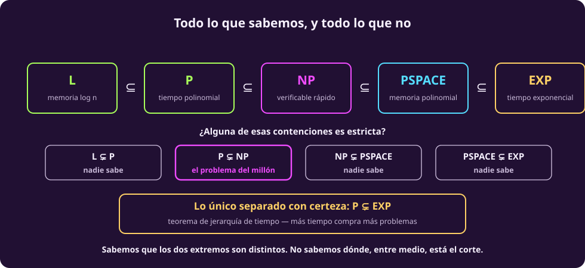
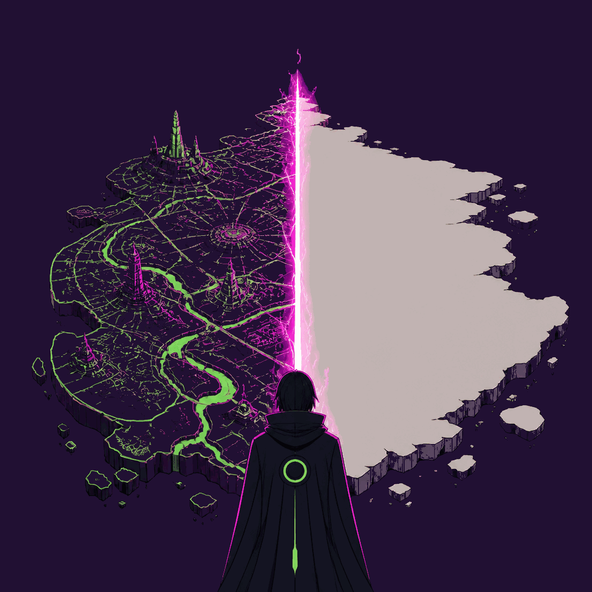
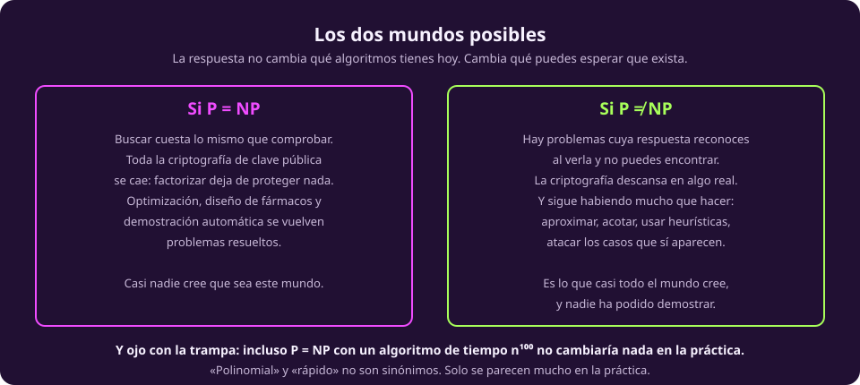

# El mapa completo

Ya están todas las piezas. Esta página las pone juntas y separa dos cosas que
conviene no mezclar nunca: **lo que está demostrado** y **lo que se cree**.

## La cadena

$$L \;\subseteq\; P \;\subseteq\; BPP \;\subseteq\; PSPACE \;\subseteq\; EXP$$
$$P \;\subseteq\; NP \;\subseteq\; PSPACE$$

::: figure {#cx-mapa title="Todo lo que sabemos, y todo lo que no"}

:::

::: table {#cx-clases-resumen title="Las seis clases, en una línea cada una"}
| Clase | Qué máquina | Qué recurso | Habitante típico |
|---|---|---|---|
| $L$ | determinista | memoria $O(\log n)$ | conectividad en grafos |
| $P$ | determinista | tiempo $n^k$ | Dijkstra, 2-SAT, primalidad |
| $BPP$ | probabilista | tiempo $n^k$, error $\le 1/3$ | identidad de polinomios |
| $NP$ | no determinista | tiempo $n^k$ | SAT, hamiltoniano, TSP |
| $PSPACE$ | determinista | memoria $n^k$ | fórmulas cuantificadas, Hex |
| $EXP$ | determinista | tiempo $2^{n^k}$ | ajedrez $n \times n$ |
:::

## Lo que está demostrado

Poco, y conviene saber exactamente cuánto.

::: theorem {#cx-jerarquia-tiempo title="Teorema de jerarquía de tiempo (Hartmanis-Stearns, 1965)"}
Más tiempo compra estrictamente más problemas: si $f$ crece suficientemente más
que $g$, hay problemas que se resuelven en tiempo $f(n)$ y no en tiempo $g(n)$.

Consecuencia inmediata: $$P \subsetneq EXP.$$
:::

Ése es **el** resultado de separación de la unidad, y su idea es vieja
conocida: es diagonalización, el mismo argumento que en
[[el-mismo-truco|la unidad anterior]] aparecía tres veces. Se construye un
problema que, por diseño, difiere de todo lo que se puede resolver en tiempo
$g(n)$, simulando cada máquina rápida y contestando lo contrario.

Con él, y con su gemelo de espacio, se obtiene lo siguiente:

::: table {#cx-lo-demostrado title="Lo que está demostrado"}
| Afirmación | Cómo |
|---|---|
| $P \subsetneq EXP$ | jerarquía de tiempo |
| $L \subsetneq PSPACE$ | jerarquía de espacio |
| $NPSPACE = PSPACE$ | teorema de Savitch |
| SAT es NP-completo | Cook-Levin |
| Si un NP-completo está en $P$, entonces $P = NP$ | definición de completo |
:::

## Lo que está abierto

::: table {#cx-lo-abierto title="Lo que nadie sabe"}
| Pregunta | Estado | Lo que se cree |
|---|---|---|
| ¿$P = NP$? | **abierto** | que no, casi unánimemente |
| ¿$P = BPP$? | **abierto** | que **sí**: el azar no compra nada |
| ¿$L = P$? | abierto | que no |
| ¿$NP = PSPACE$? | abierto | que no |
| ¿$BPP \subseteq NP$? | abierto | que sí, si $P = BPP$ |
:::

Detente un segundo en la lista. **Nadie ha logrado separar dos clases
consecutivas de la cadena.** Sabemos que $P \ne EXP$, que están en los dos
extremos; de los cuatro eslabones que hay entre medio, no sabemos si alguno es
estricto. Es perfectamente concebible —aunque nadie lo cree— que
$P = NP = PSPACE$.

> [!NOTE]
> **Que $P \ne NP$ se crea casi unánimemente no lo hace un teorema.** Se han
> intentado demostraciones durante cincuenta años, y en el camino se demostró que
> **las técnicas obvias no pueden funcionar**: la diagonalización que sirvió para
> la jerarquía de tiempo se sabe insuficiente para $P$ contra $NP$. Ése es el
> resultado de relativización de Baker, Gill y Solovay (1975), y es parte de por
> qué el problema es tan difícil: no solo no se ha resuelto, sino que se sabe con
> qué herramientas *no* se va a resolver.

::: figure {#ilus-la-frontera title="La frontera que nadie ha cruzado"}

:::

*(Esta imagen es una ilustración generada, no una fotografía ni un dato real.)*

## Qué cambiaría si P = NP

::: figure {#cx-dos-mundos title="Los dos mundos posibles"}

:::

**Si $P = NP$** —con algoritmos de exponente razonable, que es una condición
importante— buscar costaría lo mismo que comprobar. Toda la criptografía de
clave pública se caería, porque descansa en que factorizar es caro y verificar un
factor es barato. La optimización dejaría de ser un arte de heurísticas. Y algo
más raro: encontrar una demostración matemática de longitud acotada sería tan
fácil como verificarla, que es decir que buena parte de la creatividad
matemática sería mecanizable.

**Si $P \ne NP$**, que es el mundo en el que casi todos creemos que ya vivimos,
hay problemas cuya respuesta reconoces al verla y no puedes encontrar. La
criptografía descansa en algo real. Y queda mucho por hacer: aproximar, acotar,
usar heurísticas, atacar los casos que sí aparecen.

> [!WARNING]
> **La trampa del exponente.** Incluso $P = NP$ con un algoritmo de tiempo
> $n^{100}$ no cambiaría absolutamente nada en la práctica. «Polinomial» y
> «rápido» no son sinónimos —lo vimos en [[por-que-importa|la página 4]]— y solo
> se parecen mucho porque los polinomios que aparecen en la vida real son de
> grado bajo.

## Un caso raro que vale la pena conocer

Si $P \ne NP$, ¿todo problema de $NP$ está o en $P$ o en NP-completo? La
respuesta es **no**:

::: theorem {#cx-ladner title="Teorema de Ladner (1975)"}
Si $P \ne NP$, entonces existen problemas en $NP$ que **no** están en $P$ y
**tampoco** son NP-completos.
:::

El candidato natural es el **isomorfismo de grafos**: ¿son estos dos grafos el
mismo, con los vértices renombrados? Está en $NP$ —el certificado es el
renombramiento— y no se conoce algoritmo polinomial ni demostración de que sea
NP-completo. En 2015 László Babai dio un algoritmo *casi polinomial*, que es una
posición muy incómoda: demasiado rápido para parecer NP-completo, demasiado lento
para estar en $P$.

## Lo que hay que llevarse de la unidad

1. **La complejidad es del problema, no de tu algoritmo.** Que tu método sea
   exponencial no dice nada sobre el problema; el simplex y la programación
   lineal son el ejemplo.
2. **Indecidible e intratable son cosas distintas.** Lo primero es que no existe
   algoritmo; lo segundo es que existe y no cabe en tu vida.
3. **NP es «verificable rápido», no «no polinomial».** Y $P \subseteq NP$.
4. **NP-completo significa que todos son el mismo problema.** Resolver uno los
   resuelve todos.
5. **Casi nada está demostrado.** Sabemos que $P \ne EXP$. De ahí en medio, nada.

Y una última, que es la razón por la que esta unidad va antes que todo lo demás
del curso: **casi cada método que veas de aquí en adelante es una respuesta a
una intratabilidad.** Cuando alguien te enseñe una heurística, una aproximación o
un muestreo, la pregunta correcta ya no es «¿por qué no lo hace bien?», sino
«¿de qué clase se está escapando?».
