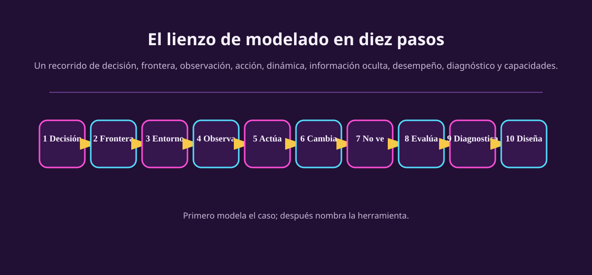

# Agentes, ambientes y modelado de decisiones

Hasta aquí el curso preguntó qué puede calcular una máquina y cuánto cuesta
hacerlo. Ahora cambia de pregunta: **si un sistema puede observar y actuar,
¿cómo decidimos qué debe hacer?**

No vamos a empezar con un algoritmo. Primero vamos a aprender a tomar una
situación concreta —un portero, un juego, una carrera, una cartera ficticia— y
dibujar el problema que realmente tenemos enfrente.

::: figure {#aa-lienzo title="El orden para modelar antes de elegir una herramienta"}

:::

## Lo que vas a poder hacer

- Distinguir una predicción de una decisión que cambia el futuro.
- Trazar la frontera entre agente, cuerpo, controlador y entorno.
- Separar mundo, observación, estado interno y acción.
- Especificar una tarea con PEAS y no confundir desempeño, objetivo, utilidad y recompensa.
- Diagnosticar un entorno con evidencia, no con etiquetas memorizadas.
- Elegir la capacidad mínima que un agente necesita antes de pensar en algoritmos.

## Recorrido

| | Página | Qué resuelve | |
|---|---|---|---:|
| 1 | [[de-prediccion-a-decision|De predicción a decisión]] | Qué añade actuar a estimar algo | 15m |
| 2 | [[dibujar-el-bucle|Dibujar el bucle]] | Frontera, observación, creencia y acción | 20m |
| 3 | [[especificar-la-tarea|Especificar la tarea]] | PEAS y desempeño | 20m |
| 4 | [[diagnosticar-el-entorno|Diagnosticar el entorno]] | Qué propiedades cambian el diseño | 25m |
| 5 | [[disenar-el-agente|Diseñar el agente]] | Arquitecturas como capacidades de decisión | 25m |
| 6 | [[de-consecuencias-a-refuerzo|De consecuencias a refuerzo]] | Recompensa, retorno y política | 20m |

Y una hoja para usar frente a un caso nuevo:

- [[lienzo-de-modelado|El lienzo de modelado]] — los diez pasos, tarjetas de caso y supuestos permitidos.

**Si vas con poco tiempo**, lee 1, 2, 3 y 4. Con eso ya puedes construir un
problema de decisión; las dos últimas páginas explican cómo decidir y aprender
dentro de ese marco.

## El principio de esta unidad

> No me des una etiqueta. Dame la evidencia del caso que justifica esa
> etiqueta.

Decir que un mundo es «parcialmente observable» sólo sirve si puedes señalar
qué información relevante no llega al agente. Decir que un agente necesita un
modelo sólo sirve si puedes explicar qué recuerda o infiere que no estaba
visible.
