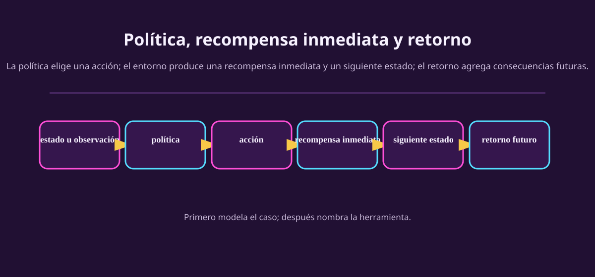

# De consecuencias a refuerzo

El modelado que hicimos ya tenía la estructura básica de aprendizaje por
refuerzo. Un agente observa una situación, toma una acción, recibe una
consecuencia y vuelve a decidir. Ahora le ponemos nombres formales sin borrar
las distinciones que importan.

::: figure {#aa-trayectoria-figura title="Una política genera una trayectoria; el retorno la evalúa"}

:::

## Cinco palabras, cinco trabajos

| Palabra | Notación frecuente | Qué hace |
|---|---|---|
| Estado del mundo | $s_t$ | Describe la situación relevante que el modelo usa en el instante $t$. |
| Observación | $o_t$ | Lo que el agente recibe; puede no revelar $s_t$ por completo. |
| Acción | $a_t$ | Opción elegida entre las que permite la interfaz. |
| Política | $\pi(a\mid o)$ o $\pi(a\mid s)$ | Regla que asigna una acción, o probabilidades de acción, a la información disponible. |
| Recompensa | $r_{t+1}$ | Señal numérica recibida por una transición concreta. |

El **retorno** reúne recompensas futuras. Una forma común es

$$
G_t = r_{t+1} + \gamma r_{t+2} + \gamma^2 r_{t+3} + \cdots,
$$

donde $0 \leq \gamma \leq 1$ expresa cuánto pesan recompensas más lejanas. No
necesitas calcularlo hoy. La idea es sencilla: una decisión se evalúa por su
trayectoria, no solo por el premio del siguiente segundo.

## La forma MDP, y su frontera

Un proceso de decisión de Markov suele escribirse como $\langle S,A,P,R,\gamma\rangle$:
estados, acciones, dinámica de transición, recompensa y descuento. Es una forma
compacta de declarar qué cambia tras una acción y qué señal se recibe.

Pero un MDP no es una licencia para fingir que el agente observa $S$. Si el
agente solo recibe una cámara parcial o señales ruidosas, debes modelar la
observación y una creencia/estado interno. Un POMDP extiende la descripción con
esa capa de observación parcial. Por ahora basta saber qué pregunta añade: «¿qué
ve el agente de ese estado?».

## Recompensa no es intención

Vuelve a la carrera simulada. Si entregas $+1$ por cada vuelta rápida y nada más,
el agente podría maltratar el vehículo, ignorar una regla o maximizar vueltas
rápidas aunque empeore el tiempo final. La señal era numérica y fácil de medir;
no por eso representaba el desempeño que queríamos.

| Capa | Pregunta para revisarla |
|---|---|
| Objetivo | ¿Qué dirección humana o de tarea queremos? |
| Desempeño | ¿Cómo juzgaremos la trayectoria completa? |
| Utilidad | ¿Cómo equilibramos intercambios si los hay? |
| Recompensa | ¿Qué señal local o por transición empuja al agente? |
| Retorno | ¿Qué suma de señales acabará optimizando la política? |

La diferencia es práctica: reparar una recompensa puede requerir añadir
penalizaciones, terminar episodios, cambiar medición o volver a la medida de
desempeño. No se arregla diciendo «el agente fue malo».

## Ejercicios

::: exercise {#aa-ej-recompensa-rota title="Repara una recompensa rota"}
En un juego de plataformas, la recompensa es $+1$ por cada objeto brillante
recogido. El agente se queda dando vueltas cerca de objetos que reaparecen y no
llega a la salida. Escribe:

1. la conducta incentivada;
2. una medida de desempeño más amplia;
3. un cambio posible a la señal de recompensa;
4. una prueba que comprobaría que la reparación no introdujo otra trampa.
:::

::: answer {#aa-resp-recompensa-rota of="aa-ej-recompensa-rota"}
1. Recolectar indefinidamente, no terminar. 2. Completar el nivel con seguridad,
en tiempo razonable, y con objetos como beneficio secundario. 3. Dar un premio
grande al terminar, costo por tiempo y/o hacer que cada objeto solo cuente una
vez. 4. Probar niveles donde la ruta segura pero larga y la corta pero peligrosa
compiten, y revisar trayectorias, no solo la suma final. Varias señales pueden
ser válidas si corresponden al desempeño declarado.
:::

::: exercise {#aa-ej-politica title="Lee una trayectoria"}
Un bot observa lluvia débil, elige «seguir», recibe desgaste alto; después
observa lluvia fuerte, elige «entrar a pits», recibe una pérdida corta de tiempo
pero evita dos vueltas lentas. Identifica una observación, dos acciones, dos
recompensas posibles y explica por qué evaluar solo la segunda recompensa podría
ser engañoso.
:::

::: answer {#aa-resp-politica of="aa-ej-politica"}
Las observaciones son los reportes de lluvia; las acciones son seguir y entrar.
Una primera recompensa podría penalizar desgaste alto; la segunda, penalizar el
tiempo de pits y premiar evitar un daño mayor. Ver solo el costo inmediato de
entrar haría parecer mala la acción; el retorno incorpora las vueltas que esa
acción hizo posibles. Los signos y números exactos deben declararse, no se
deducen de la historia.
:::

## Cierre

Ya tienes el orden correcto para empezar un problema: decisión, frontera,
entorno, observaciones, acciones, consecuencias y criterio; luego diagnóstico y
capacidad mínima. No es todavía una receta de algoritmo. Es la forma de evitar
escoger uno para el problema equivocado. Guarda [[lienzo-de-modelado|el lienzo]]
para aplicarlo al próximo caso.
