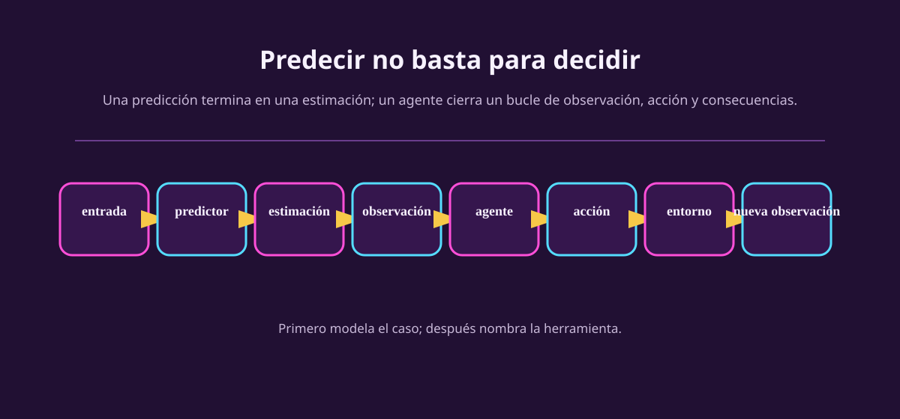

# De predicción a decisión

Imagina que una portera ve a una cobradora acomodar el balón. Un modelo puede
predecir: «hay 70% de probabilidad de tiro a la izquierda». Es útil, pero aún
no ha resuelto el problema. La portera tiene que **elegir** entre izquierda,
centro y derecha. Su salto cambia cuál de los futuros posibles ocurrirá.

::: figure {#aa-prediccion-decision title="Una predicción es una pieza; un agente cierra un bucle"}

:::

La pregunta de predicción es «¿qué creo que pasará?». La pregunta de decisión
es «¿qué hago ahora, sabiendo que mi acción importa?». La segunda contiene a la
primera a veces, pero añade tres cosas: acciones disponibles, consecuencias y
una manera de comparar consecuencias.

::: figure {#aa-ilus-penal title="Antes del salto"}

:::

*(Esta imagen es una ilustración generada, no una fotografía ni un dato real.)*

## El cambio de pregunta

| Si solo predices | Si modelas una decisión |
|---|---|
| ¿Lloverá mañana? | ¿Llevo paraguas o cambio el plan? |
| ¿Qué tiro hará la rival? | ¿A dónde se mueve la portera? |
| ¿Subirá un precio? | ¿Compro, vendo, espero o no hago nada? |
| ¿Cuál carta tiene mi rival? | ¿Apuesto, igualo o me retiro? |

No todo problema interesante es un agente. Una hoja de cálculo que resume
ventas puede ser excelente sin actuar sobre el mundo. Llamamos **agente** a un
sistema que recibe perceptos y selecciona acciones en un entorno. Su conducta
produce una trayectoria: no una respuesta aislada, sino una secuencia de
observar, actuar y vivir con el resultado.

> [!WARNING]
> «Actuar» no significa tener un robot con brazos. Una orden de reabasto, una
> apuesta en un juego simulado, cambiar de carril o recomendar *no comprar* son
> acciones. La frontera se define por qué puede alterar el sistema, no por si
> tiene cuerpo humanoide.

## El primer paso: nombra la decisión

Antes de usar una palabra técnica, completa esta frase: **«En este instante, el
sistema debe elegir ___».** Si no puedes completar el espacio, todavía no has
encontrado el problema de decisión.

Después pregunta cuatro cosas, en este orden:

1. ¿Quién o qué recibe información y elige?
2. ¿Qué puede elegir ahora mismo?
3. ¿Qué parte de la situación cambia por esa elección?
4. ¿Cómo sabremos después si fue una buena elección?

La última pregunta no se responde con «que gane». Ganar puede ser demasiado
grueso para orientar decisiones intermedias. En el penal podrías contar goles
evitados, pero también penalizar lesionarse o abandonar el arco antes de tiempo.
El criterio todavía es provisional: aquí solo lo hacemos visible.

## Un ejemplo que parece financiero, pero no da consejos

Supón una **cartera simulada** de tres activos ficticios. Cada día el programa
observa precios retrasados y una estimación de volatilidad; puede comprar una
unidad, vender una unidad o no hacer nada. Su saldo y los precios del día
siguiente cambian después de la acción. Eso es un problema de decisión, aunque
el programa prediga rendimientos como parte de su información.

No necesitamos decidir qué acción es buena para modelarlo. Solo necesitamos
declarar que esta es una simulación didáctica, que los precios futuros no se
observan, que hay costos ficticios de transacción y que «no hacer nada» también
es una acción. Ésa es la disciplina que evita esconder supuestos dentro de una
palabra como «agente financiero».

## Ejercicios

::: exercise {#aa-ej-prediccion-agente title="¿Predicción, agente o componente?"}
Clasifica cada caso. Escribe una frase que justifique tu respuesta.

1. Un modelo estima la probabilidad de lluvia a las 17:00.
2. Un sistema usa esa probabilidad para enviar una alerta o no enviarla, y se
   evalúa por alertas útiles frente a falsas alarmas.
3. En un videojuego, una red estima dónde estará el personaje en medio segundo;
   otro módulo decide si saltar.
:::

::: answer {#aa-resp-prediccion-agente of="aa-ej-prediccion-agente"}
1. **Predicción.** Entrega una estimación; el enunciado no le da una acción.
2. **Agente sencillo.** Observa, selecciona una acción y sus consecuencias se
   evalúan. La predicción puede ser una parte interna, pero no agota el sistema.
3. La red es un **componente predictivo**; el sistema completo puede ser un
   agente si el módulo de salto actúa en el mundo del juego y se juzga por las
   consecuencias. No etiquetes la pieza por el nombre de todo el sistema.
:::

::: exercise {#aa-ej-nombra-decision title="Encuentra el verbo"}
Para un bot de ajedrez, un controlador de riego y una carrera simulada con
paradas en pits, completa: «en este instante debe elegir ___». Luego escribe
una consecuencia que ocurra después de esa elección.
:::

::: answer {#aa-resp-nombra-decision of="aa-ej-nombra-decision"}
Hay muchas respuestas válidas si respetan el caso. Por ejemplo: el bot elige un
movimiento legal y cambia el tablero; el riego elige abrir, cerrar o mantener
una válvula y cambia la humedad futura; la estrategia de carrera elige entrar o
seguir y cambia tiempo, desgaste y posición después. La comprobación es que el
verbo sea una **acción disponible**, no una meta vaga como «ganar».
:::

## A dónde va esto

Ya encontramos la diferencia. Ahora hay que dibujar el circuito completo y
separar lo que ocurre en el mundo de lo que el agente alcanza a ver:
[[dibujar-el-bucle|Dibujar el bucle]].
