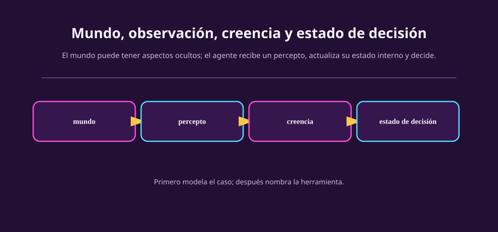

# Dibujar el bucle

Ahora no elegiremos un algoritmo. Vamos a dibujar cinco cajas que evitan la
confusión más común: escribir como si el agente pudiera ver directamente todo
lo que existe.

::: figure {#aa-mundo-percepto-creencia title="El mundo no entra entero al agente"}

:::

## Primero: marca la frontera

El **entorno** es todo lo que queda fuera de la frontera del agente y puede
afectar su tarea: tablero, rival, reloj, reglas, pista, precios simulados,
sensores ruidosos. El **agente** es lo que queda dentro de la frontera y usa
perceptos para escoger una acción. Si importa distinguirlos, separa también:

| Pieza | Pregunta que la reconoce |
|---|---|
| Cuerpo / interfaz | ¿Qué mide y qué puede ejecutar físicamente o mediante software? |
| Controlador | ¿Qué transforma la información disponible en una acción? |
| Entorno | ¿Qué evoluciona fuera del agente y responde a la acción? |

Un dron puede tener cámara y hélices como cuerpo, un programa de navegación
como controlador, y viento, edificios y personas como entorno. Un bot de
ajedrez tiene interfaz que lee/escribe posiciones, controlador que elige
movimientos y tablero, reloj y rival como entorno. La separación no es
metafísica: sirve para saber qué información está disponible y qué puede fallar.

## Mundo, observación y creencia no son sinónimos

Usaremos tres palabras con cuidado:

- **Mundo o estado del entorno:** lo que describe la situación relevante fuera
  del agente. Puede contener variables que el agente no observa.
- **Observación o percepto:** lo que llega por sensores, interfaz o historial
  disponible en este instante.
- **Creencia / estado interno:** el resumen que el agente conserva o infiere
  para decidir. Puede ser memoria, un mapa, una distribución de posibilidades o
  nada si no hace falta recordar.

Un mundo **puede** tener información relevante oculta; no es una obligación.
En ajedrez, tablero y piezas son visibles, aunque el plan del rival no lo sea.
En póker, las cartas privadas relevantes no son visibles. En ambos casos el
agente puede mantener creencias, pero no por la misma razón.

> [!WARNING]
> No escribas $S$ como si siempre fuera «lo que ve el agente». En modelos de
> refuerzo, el estado del mundo puede ser distinto de la observación $O$. Un
> MDP asume que el estado usado por el modelo resume lo necesario; una observación
> parcial requiere representar qué llega al agente y qué debe inferir.

## El caso plataforma, paso a paso

Un personaje explora un mundo de plataformas original. En una pantalla ve un
hueco, una rueda con picos que se mueve y una entrada oscura. Puede caminar,
saltar, esperar o retroceder. Cada acción consume tiempo y deja al personaje en
otro lugar; quizá la siguiente zona no estaba visible antes.

::: figure {#aa-ilus-plataformas title="Una acción abre y cierra futuros"}

:::

*(Esta imagen es una ilustración generada, no una captura de un videojuego.)*

Modelémoslo sin adornarlo:

| Caja | Una primera versión honesta |
|---|---|
| Frontera | El agente controla al explorador; el nivel, mecanismos y cámara quedan fuera. |
| Observación | Imagen local, velocidad aproximada, posición mostrada y tiempo. |
| Acciones | Izquierda, derecha, saltar, esperar; quizá combinaciones si el juego las permite. |
| Consecuencia | Cambia posición, velocidad, tiempo, riesgos y qué parte del nivel se revela. |
| Estado interno | Última velocidad, mapa parcial y recuerdo de un mecanismo que estaba fuera de pantalla. |

No supongas que conocemos la física exacta. Puedes declararla como desconocida y
aprenderla o estimarla después. Un modelo útil dice qué sabe y qué no sabe.

## La pregunta de la frontera

Prueba esta regla: si una variable se actualiza aunque tu controlador se
detenga, probablemente pertenece al entorno. Si una variable se conserva para
que el controlador elija, probablemente pertenece al agente. Si no está claro,
anota una **suposición de modelado**. No necesitas resolver la ambigüedad por
intuición; necesitas hacerla revisable.

## Ejercicios

::: exercise {#aa-ej-bucle-plataformas title="Completa el bucle de plataformas"}
Usa el caso anterior. Escribe una cosa que el mundo tenga y la pantalla no
muestre; una observación concreta; una acción concreta; y una pieza de memoria
que ayudaría a decidir el siguiente salto. Termina con una suposición explícita
sobre la física o la cámara.
:::

::: answer {#aa-resp-bucle-plataformas of="aa-ej-bucle-plataformas"}
Una respuesta posible: detrás de la entrada puede haber una plataforma que la
pantalla no muestra; la observación es «la rueda está subiendo»; la acción es
«esperar 0.3 s»; la memoria guarda que la rueda tarda aproximadamente un ciclo
en volver; suponemos que la cámara solo revela una zona cercana. También es
válido poner que no hay información oculta si declaras una cámara que muestra
todo el nivel. El punto es justificarlo.
:::

::: exercise {#aa-ej-frontera-ajedrez title="¿De qué lado de la línea?"}
Para un bot de ajedrez en línea, coloca de un lado u otro de la frontera:
reloj, tablero, generador de movimientos legales, plan interno para la apertura,
rival, conexión de red. Justifica una elección que pueda depender del diseño.
:::

::: answer {#aa-resp-frontera-ajedrez of="aa-ej-frontera-ajedrez"}
Tablero, reloj y rival son entorno; el plan interno y el generador usado por el
bot son parte del agente. La conexión puede ser interfaz/cuerpo si el bot la
usa para recibir el tablero y enviar jugadas; sus demoras pasan a ser parte del
entorno relevante. La elección depende de dónde trazaste la frontera, por eso
hay que dibujarla antes de discutirla.
:::

## A dónde va esto

El bucle nos dice qué existe. Falta decidir qué cuenta como hacerlo bien.
[[desempeno-en-peas|P — desempeño]] convierte una historia en una
especificación que alguien más puede revisar.
