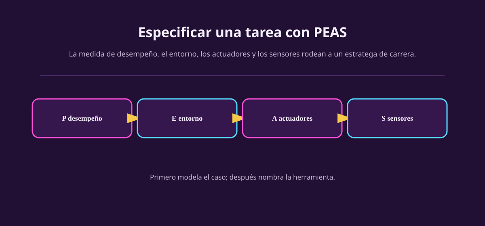

# E — ¿qué mundo rodea la tarea?

Después de decidir cómo se juzga una trayectoria, pregunta **dónde ocurre**. La
E de PEAS no es una lista de objetos que se ve bonita: es la parte del mundo que
puede afectar el desempeño y queda fuera de la frontera del agente.

## La pregunta que abre E

Completa: **«Para decidir, el agente está situado entre ___, bajo las reglas
___, mientras ___ puede cambiar.»** Si una cosa puede cambiar el resultado pero
no aparece en tu E, quizá el modelo está dejando fuera el problema importante.

En la carrera simulada, E incluye pista, clima, rivales, reglamento, pits,
combustible, desgaste y el simulador que actualiza todo. No incluye el
planificador interno ni la tabla donde el agente guarda su estimación: esas
cosas están dentro de la frontera.

::: figure {#aa-peas-e title="E no es la interfaz: es lo que existe fuera de ella"}

:::

## E se construye en cuatro capas

| Capa | Pregunta | Carrera de pits |
|---|---|---|
| Entidades | ¿Qué cosas o personas pueden importar? | Auto, rivales, pista, equipo de pits, clima. |
| Recursos y límites | ¿Qué se gasta, se bloquea o escasea? | Combustible, llantas, tiempo, ventana de pits. |
| Reglas | ¿Qué acciones o estados no están permitidos? | Compuestos permitidos, velocidad en pits, penalizaciones. |
| Dinámica | ¿Qué puede cambiar sin pedirle permiso al agente? | Lluvia, posición de rivales, degradación, reloj. |

La E no tiene que ser una simulación perfecta. Puede decir «la degradación de
llanta está representada por tres niveles» si ésa es la resolución elegida. Lo
que no puede hacer es fingir que la degradación no existe cuando P la evalúa.

## La frontera es una decisión de modelado

Considera un robot de museo. Si su mapa está guardado en la memoria del
controlador, el mapa es parte del agente. Las salas reales, puertas, visitantes
y fichas son entorno. Si en cambio el «mapa» es una pantalla remota que el robot
solo consulta, esa pantalla y sus demoras pasan a ser parte del entorno o de la
interfaz. La respuesta depende del diseño; por eso se declara.

> [!TIP]
> Haz esta prueba: si el controlador se detuviera por un segundo, ¿la variable
> seguiría cambiando? Si sí, probablemente está en E. Si la variable existe
> para resumir lo que el controlador ya aprendió, probablemente está dentro.

## Lo que E todavía no hace

E no dice qué ve el agente. Que haya lluvia en el entorno no significa que el
sensor entregue lluvia perfecta y sin retraso. Esa diferencia es S, la última
letra de PEAS. Tampoco E dice qué puede alterar: eso es A. Separarlas evita
frases imposibles como «sensor: pista» o «actuador: rival».

## Ejercicios

::: exercise {#aa-ej-peas-e-museo title="Construye la E de un museo simulado"}
Robot de museo: hay tres salas, visitantes que se mueven, puertas con horario,
fichas extraviadas y batería limitada. Divide tu E en entidades, recursos,
reglas y dinámica. Marca una suposición sobre las puertas.
:::

::: answer {#aa-resp-peas-e-museo of="aa-ej-peas-e-museo"}
Entidades: robot, salas, visitantes, puertas y fichas. Recurso: batería y
tiempo. Reglas: no chocar, no cruzar una puerta cerrada. Dinámica: visitantes y
puertas cambian, la batería baja al moverse. Una suposición válida es «el
horario de puertas es público»; si no lo fuera, seguiría en E pero cambiaría lo
que el agente puede saber mediante S.
:::

::: exercise {#aa-ej-peas-e-frontera title="Corrige una frontera"}
Un equipo pone «memoria de los últimos tres cruces» en E para un bot que conduce
en una cuadrícula. Explica por qué puede estar mal y reubica esa información.
Da un caso alternativo en el que sí estaría fuera del agente.
:::

::: answer {#aa-resp-peas-e-frontera of="aa-ej-peas-e-frontera"}
Si la memoria se conserva dentro del controlador, pertenece al agente: es su
estado interno. Podría estar fuera si los cruces pasados viven solo en una base
remota que el bot consulta por red; entonces la base y su latencia son parte de
su entorno/interfaz. No hay magia en la palabra «memoria»: importa dónde vive.
:::

## Siguiente pregunta

Ya sabemos qué nos rodea. Ahora hay que limitar con honestidad qué palancas
tenemos: [[actuadores-en-peas|A — los actuadores]].
