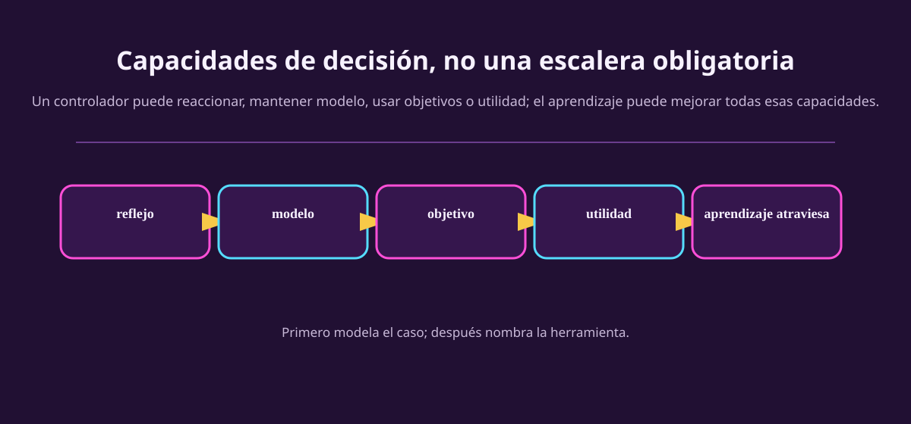

# Diseñar el agente

El diagnóstico anterior fue sobre el **entorno**. Ahora cambiamos de lado de la
frontera: ¿qué puede hacer el controlador del agente con sus observaciones? No
hay una escalera inevitable donde cada tipo «supera» al anterior. Son capacidades
que resuelven faltas distintas.

::: figure {#aa-capacidades title="Capacidades del controlador, no etiquetas del entorno"}

:::

## Cinco capacidades que se pueden combinar

| Capacidad | Pregunta que responde | Cuándo se queda corta |
|---|---|---|
| Reglas reactivas | «¿Qué acción sigue a este percepto?» | Cuando el percepto actual no basta. |
| Estado interno / modelo | «¿Qué pudo cambiar aunque no lo vea ahora?» | Cuando hay varias consecuencias aceptables y falta compararlas. |
| Objetivos | «¿Qué estados quiero alcanzar?» | Cuando dos rutas alcanzan la meta con riesgos o costos distintos. |
| Utilidad | «¿Cuál de estos resultados incomparables prefiero?» | Cuando la preferencia o modelo debe aprenderse. |
| Aprendizaje | «¿Qué debo mejorar a partir de datos y consecuencias?» | Cuando no se definió qué aprender ni con qué señal. |

La presentación clásica de Russell y Norvig enumera agentes de reflejo simple,
basados en modelo, basados en objetivos, basados en utilidad y con aprendizaje.
Es un vocabulario útil si lo lees como aumento de **capacidad disponible**, no
como una afirmación de que todo agente real ocupa una sola casilla. Un agente
puede usar reglas de seguridad, un modelo de mapa y aprendizaje a la vez.

## Arquitectura: controlador, cuerpo y ambiente

Poole y Mackworth insisten en una separación que hace los diseños discutibles:
un **agente** se entiende mediante un controlador y un cuerpo/interfaz, situado
en un ambiente. El controlador no «ve el mundo»: recibe señales de la interfaz;
la interfaz no «decide»: mide y actúa. Esta separación sirve para localizar un
problema.

| Si falla... | Pregunta antes de culpar al algoritmo |
|---|---|
| La cámara no detecta un obstáculo | ¿Falta información en la interfaz/sensor? |
| El bot repite una ruta ya fallida | ¿El controlador necesita memoria o modelo? |
| Llega a la meta pero con daño excesivo | ¿La medida de desempeño o utilidad omitió un intercambio? |
| Aprende una mala costumbre | ¿La recompensa o los datos empujan esa conducta? |

## Del diagnóstico a una capacidad mínima

No elijas «aprendizaje por refuerzo» porque un caso suena moderno. Recorre este
puente:

1. Señala un hecho del entorno.
2. Di qué información o consecuencia falta al percepto inmediato.
3. Nombra la capacidad mínima que compensa esa falta.
4. Solo entonces considera familias de algoritmos.

Ejemplo: «el mecanismo de plataformas sigue moviéndose fuera de cámara» → el
percepto actual no dice dónde estará cuando salte → hace falta memoria/modelo
de su ciclo → después podríamos construirlo con reglas temporizadas, estimación
o aprendizaje. La última palabra no era el primer paso.

> [!TIP]
> **Mínima** no significa «la más simple que puedas nombrar». Significa la menor
> capacidad que puede justificar la evidencia que ya escribiste. Si el entorno
> es completamente visible y una decisión es aislada, memoria puede sobrar. Si
> hay información oculta relevante, fingir que una regla reactiva basta no es
> simplicidad: es borrar el problema.

## Ejercicios

::: exercise {#aa-ej-capacidad-minima title="Elige una capacidad, con evidencia"}
Para cada caso, nombra una capacidad mínima y usa el patrón hecho → falta →
capacidad.

1. Termostato con sensor confiable; abre o cierra calefacción según una banda de
   temperatura y no hay consecuencias futuras relevantes fuera del confort.
2. Bot de plataformas con cámara local y mecanismo que desaparece de la pantalla.
3. Planificador de ruta que puede llegar por dos caminos: uno rápido pero con
   riesgo alto, otro lento pero seguro.
:::

::: answer {#aa-resp-capacidad-minima of="aa-ej-capacidad-minima"}
1. Sensor actual suficiente → no falta información histórica → una regla reactiva
puede bastar. 2. El mecanismo queda oculto → el percepto no contiene su fase
actual → memoria o un modelo del ciclo. 3. Ambos caminos llegan a la meta → el
objetivo por sí solo no ordena el intercambio → una preferencia/utilidad que
compare rapidez y riesgo. Cambian las conclusiones si cambian los supuestos.
:::

::: exercise {#aa-ej-no-escalera title="Rompe la escalera"}
Da un ejemplo donde añadir aprendizaje no sea el siguiente arreglo sensato. Di
qué está mal definido antes: observación, actuadores, desempeño o modelo de
consecuencias. Después propone una capacidad o una corrección más directa.
:::

::: answer {#aa-resp-no-escalera of="aa-ej-no-escalera"}
Si un robot atropella objetos porque la cámara no detecta vidrio, entrenar más
con las mismas observaciones no recupera la información ausente. Primero habría
que mejorar el sensor/interfaz o declarar esa limitación. Si un repartidor toma
rutas peligrosas porque «más rápido» era toda la recompensa, primero hay que
reparar desempeño y señal. Aprender no sustituye una especificación rota.
:::

## A dónde va esto

Queda una pieza para conectar este lenguaje con refuerzo: cómo una política
produce trayectorias, recibe recompensas y se compara por retorno. Sigue con
[[de-consecuencias-a-refuerzo|consecuencias y refuerzo]].
