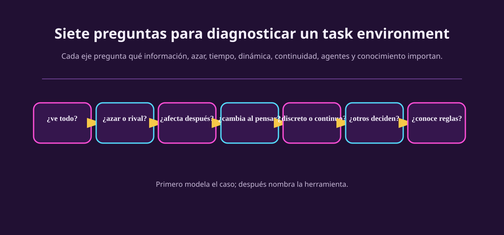

# Diagnosticar el entorno

Aquí aparece una taxonomía, pero la usaremos como una caja de herramientas, no
como una lista para memorizar. Cada propiedad responde una pregunta que cambia
qué debe poder hacer el agente. Esta es la taxonomía del **entorno**; no describe
tipos de agentes.

::: figure {#aa-perillas-entorno title="Cada perilla nace de una pregunta sobre el caso"}

:::

## Tres palabras que se repiten en las siete preguntas

Si estas tres se confunden, el resto de la página se vuelve un crucigrama.

| Palabra | Qué quiere decir aquí | En ajedrez |
|---|---|---|
| **Estado** | La descripción del mundo que basta para decidir bien. | Dónde está cada pieza, de quién es el turno, qué enroques siguen disponibles. |
| **Observación** (o percepción) | Lo que los sensores del agente entregan en un instante. Puede ser menos que el estado. | La vista del tablero. Aquí coincide con el estado; casi nunca es así. |
| **Transición** | La regla que dice a qué estado se llega al ejecutar una acción desde el estado actual. | «Si muevo la torre a e5, el tablero queda así». |

Y una advertencia que vale para las siete perillas: **no describen al mundo,
describen al mundo *para este agente***, con la frontera y la resolución que
elegiste en la ficha PEAS. La misma partida es totalmente observable para quien
mira el tablero desde arriba y parcialmente observable para un robot cuya cámara
solo alcanza a ver media mesa.

## Las siete perillas, una por una

Cada perilla tiene dos o tres posiciones —no siempre dos— y todas terminan en la
misma columna: *qué le exige al agente*. Si una posición no cambia nada del
diseño, la clasificaste por costumbre y no por diagnóstico.

### 1. Observabilidad — ¿le llega toda la información que importa?

| **Totalmente observable** | **Parcialmente observable** | **No observable** |
|---|---|---|
| La observación de cada instante ya contiene todo el estado relevante para el desempeño. | Falta algo relevante: está oculto, llega con ruido o llega tarde. | El caso extremo: no hay sensores útiles y el agente actúa a ciegas. |
| *Ejemplo:* ajedrez sobre un tablero a la vista, donde no hay información escondida. | *Ejemplo:* póker, donde las cartas del rival están boca abajo. O un auto autónomo al que el camión de adelante le tapa el carril. | *Ejemplo:* un aspersor con temporizador, que riega sin medir humedad. |
| *Le exige al agente:* nada extra. Puede decidir mirando lo que ve ahora, sin recordar. | *Le exige al agente:* **memoria** de lo que ya vio y un **estado de creencia**, una estimación de lo que no ve («el rival probablemente trae par»). | *Le exige al agente:* un plan que funcione pase lo que pase, porque nadie lo va a corregir a medio camino. |

*Pista en el enunciado:* «cartas privadas», «la cámara solo muestra alrededor del
personaje», «el reporte llega cada dos vueltas», «el sensor tiene error».

### 2. Determinismo — ¿una acción fija el siguiente estado?

| **Determinista** | **Estocástico** | **Estratégico** |
|---|---|---|
| El estado actual y la acción fijan por completo el siguiente estado. | El resultado depende además del azar, y ese azar tiene probabilidades. | Las reglas no tienen azar, pero el siguiente estado depende de lo que decida **otro agente**. |
| *Ejemplo:* un crucigrama, donde escribir una letra deja el tablero exactamente como lo esperabas. | *Ejemplo:* repartir cartas. O un auto que puede pinchar una llanta. | *Ejemplo:* ajedrez, donde tu jugada es determinista pero la respuesta del rival no la controlas. |
| *Le exige al agente:* puede planear una secuencia larga y confiar en ella. | *Le exige al agente:* razonar con probabilidades y tener **planes de contingencia**. | *Le exige al agente:* **modelar al rival**, anticipando sus respuestas en vez de promediarlas como si fueran una moneda. |

«Estratégico» merece una pausa: en AIMA es el caso donde el resultado depende de
las acciones de otros agentes, no solo del azar. Un rival inteligente puede hacer
que el ajedrez sea determinista en sus reglas y aun así estratégico para nuestro
jugador.

*No lo confundas con la perilla 7:* que haya **azar** (estocástico) no es lo
mismo que **no saber las reglas** (desconocido). Los dados de un juego de mesa
son azar con reglas publicadas.

### 3. Episodicidad — ¿cada decisión se sostiene sola?

| **Episódico** | **Secuencial** |
|---|---|
| Cada decisión es un caso cerrado: lo que elijas ahora no cambia el estado ni las opciones de la siguiente. | La decisión actual cambia lo que podrás hacer después. |
| *Ejemplo:* un clasificador que revisa piezas en una banda. Marcar una como defectuosa no altera la que viene. | *Ejemplo:* ajedrez, donde un peón movido no regresa. O la estrategia de pits: entrar ahora cambia el resto de la carrera. |
| *Le exige al agente:* nada. Puede resolver caso por caso, sin mirar hacia adelante. | *Le exige al agente:* **mirar hacia adelante** —búsqueda, planeación— y pensar en el retorno y no solo en la recompensa inmediata. |

*Cuidado:* episódico no quiere decir «corto». Una tarea puede durar horas y
seguir siendo episódica si sus decisiones no se estorban entre sí.

### 4. Dinámica — ¿el mundo cambia mientras deliberas?

| **Estático** | **Semidinámico** | **Dinámico** |
|---|---|---|
| El mundo espera. Mientras el agente piensa, nada cambia. | El estado no cambia, pero **el marcador sí**: pensar de más cuesta. | El mundo cambia mientras el agente piensa, y no decidir ya es una decisión. |
| *Ejemplo:* un crucigrama sobre papel. | *Ejemplo:* ajedrez con reloj, donde el tablero está quieto pero el tiempo corre. | *Ejemplo:* conducir, donde el tráfico avanza aunque tú dudes. O la carrera bajo lluvia. |
| *Le exige al agente:* puede tomarse el tiempo que quiera. | *Le exige al agente:* decidir dentro de un presupuesto, con algoritmos que entregan la mejor respuesta disponible al agotarse el tiempo. | *Le exige al agente:* **replanear en línea**, percibiendo y actualizando mientras actúa. |

*Pista en el enunciado:* un reloj que avanza, rivales que se mueven, clima que
cambia. Si el enunciado dice «el tablero se queda igual pero el reloj corre», eso
es exactamente semidinámico.

### 5. Granularidad — ¿las variables son contables o graduadas?

| **Discreto** | **Continuo** |
|---|---|
| Los valores se pueden contar y enumerar: hay un «siguiente». | Los valores son graduados y no tienen un «siguiente». |
| *Ejemplo:* ajedrez, con casillas contables, jugadas legales enumerables y turnos separados. | *Ejemplo:* conducir, con posición, velocidad y ángulo del volante. |
| *Le exige al agente:* representaciones enumerables —tablas, grafos, búsqueda—. | *Le exige al agente:* funciones y optimización sobre números reales. Discretizar se vale, pero es una decisión con costo. |

*Cuidado:* esta perilla se gira **por separado** para el estado, el tiempo, las
percepciones y las acciones. Una carrera simulada puede ser continua en posición
y en tiempo, y discreta en la única acción que importa: entrar o no a pits.

### 6. Número de agentes — ¿hay una sola voluntad decisora?

| **Un agente** | **Multiagente competitivo** | **Multiagente cooperativo** |
|---|---|---|
| Nadie más persigue un objetivo que dependa de lo que tú hagas. | Otro agente mejora su desempeño cuando el tuyo empeora. | El desempeño de ambos mejora con lo mismo. |
| *Ejemplo:* un crucigrama. O una aspiradora en una casa vacía. | *Ejemplo:* ajedrez, póker. | *Ejemplo:* dos autos que evitan chocar entre sí. |
| *Le exige al agente:* solo optimizar. | *Le exige al agente:* anticipar al rival, y a veces ser impredecible a propósito. | *Le exige al agente:* coordinarse, comunicar, sostener convenciones. |

*¿Cuándo cuenta como agente?* Cuando conviene describir su comportamiento como
«está tratando de maximizar algo que depende de lo que yo haga». La lluvia no es
un agente aunque te arruine la carrera —eso es azar—; un rival sí.

*Casi siempre es mixto:* al conducir, evitar el choque es cooperativo y el único
lugar de estacionamiento es competitivo.

### 7. Conocimiento del modelo — ¿conoces la mecánica?

| **Conocido** | **Desconocido** |
|---|---|
| Ya se sabe cómo funciona el mundo: las reglas y el resultado de cada acción están dados. | Hay que averiguar la mecánica: qué hace cada acción, cuánto cuesta, qué la rompe. |
| *Ejemplo:* solitario, cuyas reglas están escritas. | *Ejemplo:* un videojuego nuevo sin manual. O el desgaste de llanta de un simulador que no publica su física. |
| *Le exige al agente:* puede planear directo. | *Le exige al agente:* **explorar y aprender**, y experimentar con cuidado si equivocarse es caro. |

Esta es la perilla que más se confunde con la primera, así que conviene verlas
juntas: **son independientes**, y las cuatro combinaciones existen.

| Totalmente observable | Parcialmente observable |
|---|---|
| **Conocido** — ajedrez: ves todo el tablero y sabes las reglas. | **Conocido** — solitario: sabes las reglas, pero hay cartas boca abajo. |
| **Desconocido** — un videojuego nuevo: la pantalla te muestra todo, pero no sabes qué hace cada botón. | **Desconocido** — una máquina ajena en una fábrica: ni ves su estado interno ni conoces su mecánica. |

## Tarjeta de repaso

Esta tabla no enseña nada por sí sola: es para volver a ella **después** de haber
leído las siete secciones de arriba.

| Perilla y sus posiciones | Pista en el enunciado | Qué cambia en el agente |
|---|---|---|
| **Observabilidad** — totalmente / parcialmente / no observable | cartas privadas, cámara recortada, sensor con ruido, reporte con retraso | memoria y creencias sobre lo que no ve |
| **Determinismo** — determinista / estocástico / estratégico | azar físico; o las decisiones de otro agente | probabilidades y contingencias, o modelar al rival |
| **Episodicidad** — episódico / secuencial | ¿la decisión de ahora cambia las opciones de después? | mirar consecuencias futuras |
| **Dinámica** — estático / semidinámico / dinámico | reloj que avanza; estado quieto pero marcador corriendo | decidir con presupuesto de tiempo, o replanear en línea |
| **Granularidad** — discreto / continuo | casillas y jugadas; posición, tiempo y aceleración | qué representación y qué acciones son adecuadas |
| **Número de agentes** — uno / multiagente competitivo / multiagente cooperativo | rival que compite, compañero que coopera | coordinación, competencia o negociación |
| **Conocimiento del modelo** — conocido / desconocido | reglas o física dadas, frente a tener que estimarlas | explorar, aprender, experimentar con cuidado |

> [!WARNING]
> No conviertas esta tabla en etiquetas automáticas. «Ajedrez = observable,
> determinista...» no es una explicación. Escribe primero el hecho: «el tablero
> completo está visible»; entonces puedes justificar «totalmente observable».
> Además, cada clasificación depende de la frontera y de la resolución elegida.

## Un diagnóstico completo: ajedrez y póker

Las siete perillas giradas sobre dos casos que se parecen —dos juegos de mesa,
por turnos, con rivales— y aun así piden agentes distintos.

| Perilla | Ajedrez con reloj | Póker de cartas privadas |
|---|---|---|
| Observabilidad | Totalmente observable: el tablero está a la vista. | **Parcialmente observable:** las manos de los rivales no lo están. |
| Determinismo | Estratégico: las reglas no tienen azar, pero el rival decide. | **Estocástico y estratégico:** reparto al azar más rivales que deciden. |
| Episodicidad | Secuencial. | Secuencial dentro de la mano, y las fichas ganadas cambian las manos siguientes. |
| Dinámica | Semidinámico: el tablero espera, el reloj no. | Semidinámico si la mesa tiene reloj; estático si no. |
| Granularidad | Discreto en estado y en acciones. | Discreto en cartas; las apuestas pueden tratarse como continuas. |
| Número de agentes | Multiagente competitivo, dos jugadores. | Multiagente competitivo, con más de dos rivales a la vez. |
| Conocimiento del modelo | Conocido: las reglas están publicadas. | Reglas conocidas; **el estilo de cada rival, desconocido**. |

La fila que más pesa es la primera. El agente de ajedrez puede planear desde la
posición visible, anticipando respuestas. El de póker necesita además mantener
creencias sobre las manos posibles y actualizarlas con cada apuesta. Esa
capacidad extra no sale de que el póker «tenga azar»: sale de que hay
información escondida. Por eso no basta decir «póker tiene azar» —también hay
adversarios— ni «ajedrez es determinista» —esa propiedad de la transición no
elimina la estrategia—.

## Un diagnóstico es una cadena de tres frases

Practica este patrón:

1. **Hecho:** «La cámara muestra solo alrededor del personaje».
2. **Propiedad:** «Por eso el entorno es parcialmente observable para este
   agente».
3. **Implicación:** «Conviene conservar un mapa parcial o creencias sobre lo que
   quedó fuera de pantalla».

No todas las perillas deben llegar al mismo extremo. Una carrera simulada puede
ser continua en posición y tiempo, discreta en la elección de entrar/no entrar
a pits, dinámica porque el reloj y rivales avanzan, y conocida solo si el
simulador publica su física. Los modelos reales suelen mezclar tipos.

## Ejercicios

::: exercise {#aa-ej-ajedrez-poker title="Dos diagnósticos, no dos etiquetas"}
Para ajedrez y póker, justifica con una evidencia cada una de estas dos
distinciones: información disponible y fuente de incertidumbre. Después escribe
una capacidad que el agente de póker necesita y el de ajedrez no necesariamente.
:::

::: answer {#aa-resp-ajedrez-poker of="aa-ej-ajedrez-poker"}
En ajedrez se ve la posición de las piezas; en póker no se ven las cartas
privadas. El ajedrez tiene transiciones deterministas dadas dos jugadas, pero la
elección del rival lo vuelve estratégico. El póker añade reparto aleatorio y
cartas ocultas. Por eso un agente de póker necesita mantener creencias sobre
manos plausibles; un bot de ajedrez no necesita esa creencia para saber qué
piezas hay en el tablero.
:::

::: exercise {#aa-ej-observable-conocido title="Las cuatro combinaciones"}
Observabilidad y conocimiento del modelo son perillas independientes. Da un caso
propio —que no sea ninguno de los de la tabla— para cada una de estas dos
casillas: totalmente observable pero desconocido, y parcialmente observable pero
conocido. En cada uno escribe qué evidencia del caso te hizo girar cada perilla.
:::

::: answer {#aa-resp-observable-conocido of="aa-ej-observable-conocido"}
Ejemplos posibles: una máquina expendedora nueva es totalmente observable —ves
la pantalla, los botones y el producto que cae— pero desconocida hasta que
descubres qué hace cada combinación de teclas. Buscar tu coche en un
estacionamiento de varios pisos es conocido —las reglas del espacio son
triviales— y parcialmente observable, porque solo ves el piso en el que estás.
Lo que se califica no es el ejemplo sino la evidencia: «ves la pantalla completa»
justifica la primera perilla, «no sabes qué hace cada botón» justifica la
segunda, y son hechos distintos.
:::

::: exercise {#aa-ej-diagnostico-carrera title="Diagnostica una carrera bajo lluvia"}
Caso: en una carrera simulada el clima puede cambiar, el reporte llega cada dos
vueltas, los rivales eligen su propia estrategia y el simulador no publica su
modelo de desgaste. Escribe cuatro cadenas hecho → propiedad → implicación.
Incluye al menos una que no sea sobre observabilidad.
:::

::: answer {#aa-resp-diagnostico-carrera of="aa-ej-diagnostico-carrera"}
Ejemplos: reporte cada dos vueltas → información parcialmente observable o
retrasada → mantener una estimación de lluvia actual; rivales eligen →
multiagente/estratégico → anticipar respuestas, no solo clima; clima y posiciones
cambian mientras se decide → dinámico → actualizar en línea; desgaste no publicado
→ modelo desconocido → estimarlo con experiencia o tratarlo como incertidumbre.
También podrías distinguir acciones discretas de variables continuas: depende de
cómo se haya definido el simulador.
:::

## A dónde va esto

Ahora sí podemos hablar del agente, pero sin mezclarlo con esta taxonomía del
entorno. La siguiente página pregunta qué **capacidad** mínima requiere el
diagnóstico: [[disenar-el-agente|Diseñar el agente]].
