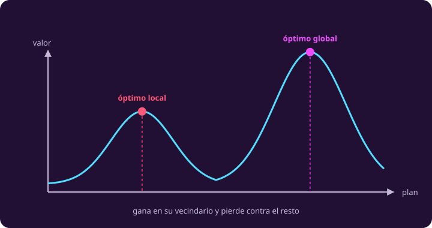

# Qué es una respuesta

**¿Qué clase de cosa te entrega un método, y cómo sé que es la mejor?**

Ya tienes la respuesta del fabricador: $(8,2)$, con 38 créditos. Esta página dice
qué es exactamente eso, qué otras cosas te puede entregar un método, y cómo se
convence a alguien más sin rehacer el dibujo.

## 1 · Óptimo global y óptimo local

::: definition {#opt-global-local title="Óptimo global y óptimo local"}
Un punto factible es **óptimo global** si ningún otro punto factible da un valor
mejor.

Es **óptimo local** si ningún punto factible **cercano a él** da un valor mejor:
gana en su vecindario, y eso no dice nada del resto del conjunto.

Todo óptimo global es también local. Lo contrario es lo que puede fallar, y
cuando falla, un método que solo mira alrededor se queda atorado creyendo que
terminó.
:::

::: figure {#opt-fig-dos-cimas title="Una cima que no es la más alta"}

:::

*La cima baja es un óptimo local que no es global. En el polígono del fabricador
esto no puede pasar, y más adelante en la unidad se ve por qué.*

> [!WARNING]
> Lo que **no** vas a ver en el dibujo del fabricador es un óptimo local que no
> sea global. Óptimos locales sí hay: $(8,2)$ es uno, porque todo global también
> es local.
>
> La razón por la que ahí no puede haber uno espurio son **dos** cosas juntas: el
> conjunto factible es **convexo** —no tiene huecos ni entrantes— y el objetivo
> es lineal. Con restricciones lineales y variables continuas las dos se cumplen
> solas.
>
> Cuidado con la explicación fácil: no es que «ser lineal» baste por sí solo. Si
> las variables tuvieran que ser enteras, el conjunto factible se volvería un
> puñado de puntos sueltos, que **no** es convexo, y la propiedad se caería. No
> es un modo de fallo aparte: es la convexidad fallando.

## 2 · Los ocho nombres

::: definition {#opt-respuestas title="Los ocho tipos de respuesta"}
| Respuesta | Qué es |
|---|---|
| **Solución factible** | Un punto que está en el dominio y cumple todas las restricciones. No dice nada de ser buena |
| **Óptimo global** | Un punto factible que ningún otro supera. Puede no ser único: si empatan, todos lo son |
| **Valor óptimo** | El **número** que da el objetivo en un óptimo. Ése sí es único |
| **Problema infactible** | No hay ni un punto factible: el conjunto es vacío y no hay nada que elegir |
| **Problema no acotado** | Hay puntos factibles y se puede mejorar para siempre: no existe un mejor |
| **Cota superior** | Un número que el objetivo no supera en ningún punto factible: un techo. Vale más cuanto **más cerca del óptimo** esté; 40 dice algo, un millón no. En un mínimo la que sirve es la inferior |
| **Certificado** | Un objeto que se revisa con aritmética y **demuestra** que la respuesta es óptima, sin volver a resolver |
| **Solución aproximada** | Un punto factible que un método entrega **sin demostrar que sea óptimo**. Qué tan buena es solo se sabe comparándola contra una cota |
:::

Del fabricador tienes los tres primeros: cinco soluciones factibles en las
esquinas —y muchas más en medio, como $(5,5)$—, un óptimo global y un valor
óptimo. Los demás llegan con los métodos que los producen.

> [!WARNING]
> **Que una región sea abierta no quiere decir que el problema sea no acotado**,
> y las dos cosas se confunden casi siempre.
>
> Quítale al fabricador las dos restricciones de no negatividad. La región deja
> de estar encerrada: le quedan dos esquinas, $(2,8)$ y $(8,2)$, y dos semirrectas
> que se van al infinito. Y sin embargo **el máximo sigue siendo 38**, porque en
> las dos direcciones por las que la región se escapa el objetivo **baja**, dos y
> cinco créditos por unidad.
>
> Una región abierta puede tener máximo. Lo que hace no acotado a un problema es
> que exista una dirección de escape en la que el objetivo **sube**.

## 3 · Un certificado, completo

El método gráfico te da la respuesta, pero no te da manera de **convencer a
alguien más** sin rehacer el dibujo. Eso es lo que hace un certificado. Para el
fabricador son tres números, uno por recurso: $y = (2,\, 1,\, 0)$.

::: table {#opt-certificado title="Las tres condiciones, y ninguna sobra"}
| Condición | En el fabricador |
|---|---|
| Los tres números son $\ge 0$ | $2\ge0$, $1\ge0$, $0\ge0$ |
| Cubren el precio de cada pieza | filtro: $2\cdot1+1\cdot2+0\cdot1 = 4 \ge 4$ · celda: $2\cdot1+1\cdot1+0\cdot2 = 3 \ge 3$ |
| Su cuenta con lo disponible da el valor del plan | $2\cdot10 + 1\cdot18 + 0\cdot18 = 38$ |
:::

**Por qué con eso basta, en dos renglones.** Toma cualquier plan factible. Como
los tres números cubren el precio de cada pieza, lo que ese plan vale es a lo más
lo que costaría pagándolo con esos tres números. Y como los tres números son
positivos y el plan no gasta más de lo que hay, esa cuenta es a lo más
$2\cdot10+1\cdot18+0\cdot18 = 38$. **Ningún plan pasa de 38.** Y $(8,2)$ vale
exactamente 38, así que es el mejor.

Es la misma idea que la fila «cota superior» de arriba: **un certificado es una
cota que además se alcanza**.

## 4 · Tu turno

::: exercise {#opt-ej-certificado title="¿Certifica o no?"}
Alguien te entrega tres juegos de números y afirma que los tres demuestran que
ningún plan del fabricador pasa de 38. Revisa cada uno con las tres condiciones y
di cuál sirve y por qué los otros no.

1. $y = (2,\, 1,\, 0)$
2. $y = (19/5,\, 0,\, 0)$
3. $y = (5,\, 0,\, -1)$

Recuerda que lo disponible es $(10,\, 18,\, 18)$, que el filtro gasta
$(1,\, 2,\, 1)$ de cada recurso y vale 4, y que la celda gasta $(1,\, 1,\, 2)$ y
vale 3.
:::

::: hint {#opt-pista-certificado of="opt-ej-certificado" title="Por dónde empezar"}
Haz las tres cuentas por separado, en este orden: primero mira los signos, que se
ve de un vistazo; luego el precio de cada pieza; y al final la cuenta con lo
disponible.

En cuanto una condición falle, ya no hace falta seguir con ese juego, pero sí
conviene saber **cuál** falló.
:::

::: answer {#opt-resp-certificado of="opt-ej-certificado"}
**El primero sí certifica.** Los tres son $\ge 0$; cubre el filtro con
$2+2+0=4\ge4$ y la celda con $2+1+0=3\ge3$; y su cuenta da
$20+18+0=38$. Las tres pasan.

**El segundo no.** Los signos están bien y su cuenta da
$\tfrac{19}{5}\cdot10 = 38$, pero falla la del medio: para el filtro da
$\tfrac{19}{5}\cdot1 = 3.8$, y el filtro vale 4. Como no cubre el precio, el
argumento se cae en el primer paso y el 38 es una coincidencia.

**El tercero tampoco, y es el interesante.** Cubre el filtro con $5+0-1=4\ge4$ y
la celda con $5+0-2=3\ge3$, así que la condición del medio pasa. Pero uno de los
números es **negativo**, y su cuenta da $50+0-18 = 32$. O sea que «demostraría»
que ningún plan pasa de 32, y tú ya sabes un plan que vale 38. La conclusión es
falsa.

Ahí se ve para qué está la primera condición: con un número negativo, el paso «el
plan no gasta más de lo que hay» cambia de sentido y la cadena se rompe, aunque
las cuentas se vean bien.
:::

## Lo que hay que llevarse

- «La solución» no es una sola cosa: un punto factible, un óptimo, una cota y una
  aproximación son cuatro objetos distintos con cuatro garantías distintas.
- Un **certificado** convierte una respuesta en algo que otro puede revisar con
  aritmética, sin repetir tu trabajo.
- Una cota vale por lo **estrecha** que es. Un techo enorme es cierto y no sirve.

Ya sabes leer un modelo, escribirlo, dibujarlo y decir qué clase de respuesta
tienes. Falta traducir las frases que aparecen en cualquier otro problema, que es
lo que hace [[patrones-lineales|la página siguiente]].
