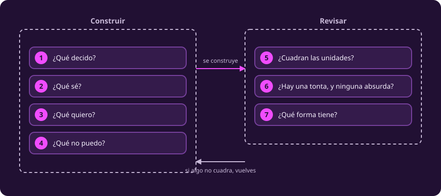

# Modelado y optimización

**Optimizar es elegir la mejor opción entre las que se pueden.** Las dos mitades
de esa frase pesan lo mismo: hay que saber **cuáles se pueden**, y hay que saber
**qué significa mejor**. Escribir esas dos cosas con precisión es modelar, y es
lo más difícil del asunto.

[[agentes-ambientes|La unidad anterior]] enseñó a dibujar una decisión: quién
decide, qué observa, qué puede hacer y cómo se juzgan las consecuencias. Y cerró
con siete propiedades para diagnosticar el entorno. Ésta empieza cuando esas
siete salen en su combinación más simple —lo ves todo, no hay azar, nada se mueve
mientras piensas— porque entonces la decisión deja de ser un problema de agentes
y se vuelve uno de **cuentas**.

Cuentas que no se pueden hacer probando todas las opciones: eso lo cerró
[[complejidad|la unidad de complejidad]]. Si no puedes enumerar, tienes que
**describir** —el conjunto de opciones y el criterio— y dejar que un método
recorra esa descripción por ti. La descripción es el modelo.

::: figure {#opt-lienzo title="Las siete preguntas, en dos bloques"}

:::

## Por qué esto está en un curso de inteligencia artificial

Porque es el paso que casi nadie enseña y todos necesitan. Un agente que decide
qué hacer está resolviendo un problema de optimización, lo diga o no: el espacio
de acciones de su [[entorno-en-peas|especificación PEAS]] es el conjunto
factible, y su medida de desempeño es la función objetivo. Esta unidad les pone
nombre y método.

La parte que se estudia normalmente es el método —cómo buscar rápido—. La parte
que decide si el resultado sirve es la otra: **si el modelo dice lo que creías
que decía**. Un modelo mal planteado se resuelve perfectamente y da una respuesta
que nadie firmaría. Esta unidad pasa la mayor parte del tiempo ahí.

## La nave

Todo pasa en la misma nave, en un viaje largo, y cada clase es un episodio. La
tripulación decide qué fabricar, cómo repartir la potencia del reactor y qué
subir al módulo de descenso. Son tres problemas distintos y el mismo método:
leer, escribir, resolver, dudar de la respuesta.

## Qué vas a poder hacer al terminar la primera clase

- Sacar una tabla de datos limpia de un texto con ruido, huecos y frases
  ambiguas, y **decir cuál es cuál**.
- Escribir un problema de optimización completo: variables con su dominio,
  función objetivo, restricciones.
- Dibujar la región factible de un problema de dos variables y encontrar la
  respuesta empujando una recta.
- Explicar **por qué** la respuesta está en una esquina, en vez de repetirlo.
- Distinguir un óptimo de una solución factible, de una cota y de un
  certificado.
- Traducir «al menos», «a lo más» y «por cada» sin equivocarte de signo.

## Recorrido

Cinco páginas, en orden. Cada una se sostiene sola y declara cuánto toma leerla;
el total de la primera clase ronda los **77 minutos**.

::: table {#opt-ruta title="Las cinco páginas de la primera clase"}
| | Página | Qué resuelve | |
|---|---|---|---:|
| 1 | Leer la bitácora | Qué dice de verdad este problema | 15m |
| 2 | Escribir el modelo | Cómo se convierte una tabla en matemáticas | 18m |
| 3 | El dibujo | Dónde está la respuesta, y por qué en una esquina | 15m |
| 4 | Qué es una respuesta | Qué clase de cosa te entrega un método | 14m |
| 5 | Patrones lineales | Cómo se traduce una frase que no habla de un recurso | 15m |
:::

- [[leer-la-bitacora|1 · Leer la bitácora]]
- [[escribir-el-modelo|2 · Escribir el modelo]]
- [[el-dibujo|3 · El dibujo]]
- [[que-es-una-respuesta|4 · Qué es una respuesta]]
- [[patrones-lineales|5 · Patrones lineales]]

## El notebook de la clase 1

Las páginas se leen; el notebook se corre. Trae el problema de la impresora resuelto con
código, el mismo dibujo hecho por la computadora, y **al final una historia nueva
para que la modeles tú**. No hay nada que entregar.

*Se abre en Google Colab, en otra pestaña.*

**Dónde vive.** El archivo está en este repositorio, en
`course/6_optimizacion/_assets/01_impresora_lineal.ipynb`. El botón de arriba lo
abre en Google Colab, que lo ejecuta en el navegador sin instalar nada. Si
prefieres correrlo en tu máquina, necesitas `numpy`, `scipy` y `matplotlib`.

**Cuándo.** Después de leer las cinco páginas. La última celda da por sabidas
todas.

## Qué no cubre esta clase

Nada de esta clase resuelve un problema **sin dibujarlo**, y el dibujo solo
funciona con dos variables. Tampoco aparecen aquí los problemas donde las
variables no se pueden partir, ni aquéllos donde el objetivo deja de ser una
recta. Los tres casos llegan después, y los tres se apoyan en lo que se plantea
aquí.

Empieza por [[leer-la-bitacora|leer la bitácora]].
