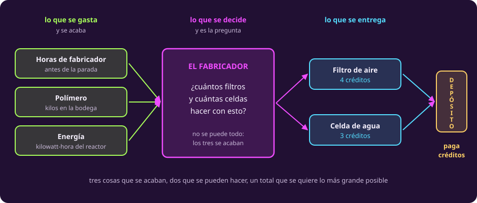

# Leer la bitácora

**¿Qué dice de verdad este problema?**

Primera página de la unidad. Aquí no se resuelve nada: se lee y se ordena.

## La nave, el fabricador y el depósito

Vas a bordo de un carguero en un viaje largo. La próxima parada es un
**depósito**: una estación donde se descarga lo que llevas y te lo pagan en
**créditos**.

En la bodega hay un **fabricador**, una máquina que convierte materia prima en
piezas. Sabe hacer dos cosas, y solo dos:

- **Filtros de aire**, que el depósito paga a **cuatro créditos**.
- **Celdas de agua**, que paga a **tres**.

Hoy el fabricador quedó libre. Podrías llenarlo de filtros, que se pagan mejor.
No puedes, y ésa es toda la gracia del problema: **tres cosas se acaban**.

- Las **horas** de fabricador que quedan antes de llegar. Cada pieza toma su
  tiempo.
- El **polímero** de la bodega. Cada pieza se lleva su parte.
- La **energía** que el reactor deja para la máquina. Cada pieza gasta la suya.

Y las dos piezas **no gastan lo mismo**: una es barata en material y cara en
corriente, la otra al revés. Por eso hacer más de una significa hacer menos de la
otra, y casi nunca en la proporción que uno esperaría.

::: figure {#opt-el-fabricador title="Qué decide la tripulación"}

:::

La pregunta, entonces, es una sola: **¿cuántos filtros y cuántas celdas conviene
hacer?**

## Pero el problema no llega así

Ese resumen limpio te lo acabo de dar yo. **En la vida real nadie te lo da.**

Lo que llega es esto: la bitácora que dictó anoche quien estaba de guardia,
medio dormido, sin pensar en que alguien iba a modelar nada con ella.

> **Bitácora del fabricador.** Quedó libre esta mañana y hay que decidir qué
> hacer con él antes de llegar al depósito. Ahí nos abonan por lo que llevemos:
> cuatro créditos por cada filtro de aire, tres por cada celda de agua.
>
> El problema es el tiempo. Nos quedan diez horas de fabricador antes de la
> parada, y cualquiera de las dos piezas se lleva una hora.
>
> De polímero andamos bien: quedan dieciocho kilos en la bodega y el filtro se
> lleva dos, así que por ahí no nos vamos a quedar cortos.
>
> De energía, el reactor nos deja lo de siempre. El filtro gasta un
> kilowatt-hora.
>
> La bodega sigue a cuatro grados bajo cero, como siempre.
>
> Se me olvidaba la celda: de polímero se lleva uno, pero de energía gasta dos.
> Es la barata en material y la cara en corriente.
>
> Y me dijo la ingeniera antes de irse a dormir que no conviene hacer más celdas
> que filtros.

Léela otra vez y fíjate en tres cosas. **Los datos no vienen en orden.** **La
celda llega tarde y a medias**, en el penúltimo párrafo, como si el tripulante se
hubiera acordado de golpe. Y **no todo lo que dice es un dato**.

::: table {#opt-el-caso title="La historia, en cinco renglones"}
| | En esta historia |
|---|---|
| **Quién decide** | La tripulación, hoy, antes de llegar al depósito |
| **Qué decide** | Cuántos filtros de aire y cuántas celdas de agua fabricar |
| **Qué lo limita** | Tres cosas que se acaban: horas, polímero y energía |
| **Qué se quiere** | Que el total de créditos sea lo más grande posible |
| **Qué estorba** | La bitácora trae frases que no son ninguna de las cuatro anteriores |
:::

Ese último renglón es el trabajo de hoy: **separar lo que es dato de lo que no**.

## 1 · Las tres preguntas que deciden si un número entra

Un problema real trae más números de los que el modelo usa. La criba es corta:
**un número entra solo si contesta una de estas tres preguntas.**

1. ¿Cuánto **consume** una pieza de algún recurso?
2. ¿Cuánto **hay** disponible de ese recurso?
3. ¿Cuánto **vale** una pieza?

Las dos primeras alimentan restricciones. La tercera, el objetivo. Y esas dos
palabras son las primeras que hay que fijar.

::: definition {#opt-objetivo title="Función objetivo"}
La **función objetivo** es la cantidad que se quiere llevar lo más arriba o lo
más abajo posible, escrita como una fórmula en las cosas que decidimos.

Un problema tiene **una sola**, y siempre viene acompañada de la palabra que
dice hacia dónde: **maximizar** o **minimizar**. Aquí es el total de créditos
que abona el depósito, y se maximiza.
:::

::: definition {#opt-restriccion title="Restricción"}
Una **restricción** es una condición que la respuesta está obligada a cumplir,
escrita como una comparación entre dos cantidades: $\le$, $\ge$ o $=$.

Cada restricción recorta las opciones; ninguna dice cuál es la mejor, que es
trabajo del objetivo. En el fabricador hay **una por recurso** —no se pueden
gastar más horas, más polímero ni más energía de los que hay— **y dos más que
nadie dice en voz alta**: no se fabrican menos de cero filtros ni menos de cero
celdas. Son cinco.
:::

La temperatura de la bodega no contesta ninguna de las tres preguntas. No dice
cuánto consume una pieza, ni cuánto hay de un recurso, ni cuánto vale algo.

## 2 · Las tres trampas

Están puestas a propósito, y conviene nombrarlas antes de buscarlas.

::: table {#opt-trampas title="Lo que un texto real le hace a quien lo lee"}
| Trampa | Dónde está | Qué hay que hacer |
|---|---|---|
| **Irrelevante** | «La bodega sigue a cuatro grados bajo cero» | Descartarlo, y **decir por qué** |
| **Falta** | «De energía, el reactor nos deja lo de siempre» | Suponer, **y anotar el supuesto con su condición** |
| **Ambigua** | «No conviene hacer más celdas que filtros» | Decidir entre regla y preferencia, **y justificarlo** |
:::

La segunda es la que tiene nombre propio.

::: definition {#opt-supuesto title="Supuesto de modelado"}
Un **supuesto de modelado** es una decisión que la historia no fija y que tú
tomas para poder seguir: puede ser un número que falta, o la lectura que le das
a una frase ambigua.

Se escribe **al lado de los datos, nunca en la cabeza**, y con la **condición**
que habrá que comprobar: hasta dónde sigue valiendo. Un supuesto sin condición
es una adivinanza con buena letra.

Hoy los datos son la tabla que vas a escribir; a partir de la página siguiente
será el modelo.
:::

## 3 · Tu turno

::: exercise {#opt-ej-bitacora title="Saca la tabla"}
Escribe la tabla de recursos del fabricador: una fila por recurso, una columna
por pieza, y una columna con lo disponible.

Después marca tres cosas:

1. **Qué número sobra.**
2. **Cuál falta.**
3. **Qué frase es ambigua.**
:::

::: hint {#opt-pista-bitacora of="opt-ej-bitacora" title="Un método por parte"}
Son tres preguntas distintas y cada una se contesta de una manera.

**Para el que sobra:** recorre los números uno por uno y pregúntate si dice
cuánto consume una pieza, cuánto hay, o cuánto vale.

**Para el que falta:** recorre los tres recursos y mira cuál se quedó sin su
columna de «disponible».

**Para la ambigua:** busca la frase que dos personas podrían cumplir de maneras
distintas y las dos tener razón.
:::

::: answer {#opt-resp-bitacora of="opt-ej-bitacora"}
La tabla queda así:

| Recurso | Por filtro | Por celda | Disponible |
|---|---:|---:|---:|
| Horas de fabricador | 1 | 1 | 10 |
| Polímero (kg) | 2 | 1 | 18 |
| Energía (kWh) | 1 | 2 | 18 |
| **Créditos que abona el depósito** | **4** | **3** | maximizar |

*El 18 de la energía es un supuesto; falta comprobar hasta dónde aguanta.*

Son **once números**, que son los once parámetros del problema: seis de consumo,
tres de disponibilidad y dos de precio. La última celda de la fila del objetivo
es la palabra «maximizar», no un número.

**Sobra** la temperatura de la bodega. No dice cuánto consume una pieza, ni
cuánto hay de un recurso, ni cuánto vale algo.

**Falta** la energía disponible. Supón un número, escríbelo en la tabla marcado
como supuesto, y **debajo de la tabla, en una línea aparte**, anota que falta
comprobar hasta dónde aguanta. Ese límite todavía no se puede calcular: sale de
conocer la respuesta, y aquí no hay respuesta. Nosotros usamos 18.

**Ambigua** es «no conviene hacer más celdas que filtros». «No conviene» no es
«no se puede». La tomamos como **preferencia** y no como regla dura, por una
razón que se puede decir: una regla dura recorta el conjunto de planes, y
ninguna frase de la bitácora la respalda como obligación. Se anota como
supuesto, y más adelante se comprueba si la elección importó.
:::

> [!WARNING]
> Lo que sobra no sobra por ser un número fijo. Las diez horas y los dieciocho
> kilos también son números fijos, y son el centro del problema. La temperatura
> sobra porque no contesta ninguna de las tres preguntas.

## Lo que hay que llevarse

- Un problema real llega con ruido, con huecos y con frases ambiguas. Esa es la
  situación normal, no un accidente.
- Suponer está permitido; **suponer en silencio, no**.
- Un número entra al modelo solo si dice cuánto se consume, cuánto hay, o cuánto
  vale.

Ya tienes los datos ordenados. Falta escribirlos como matemáticas, que es lo que
hace [[escribir-el-modelo|la página siguiente]].
