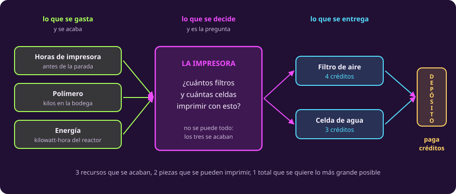

# Leer la bitácora

**¿Qué dice de verdad este problema?**

Primera página de la unidad. Aquí no se resuelve nada: se lee y se ordena.

## La nave, la impresora y el depósito

Vas a bordo de un carguero, en mitad de un viaje de meses. La próxima parada es
un **depósito**: una estación que compra repuestos y los paga en **créditos**.

Abajo, en la bodega, hay una **impresora industrial**. No guarda piezas hechas:
las **fabrica una por una**, fundiendo polímero en bruto capa sobre capa. Tiene
dos moldes cargados, y por eso puede hacer dos cosas y nada más:

- **Filtros de aire.** El depósito los paga a **4 créditos** cada uno.
- **Celdas de agua**, a **3 créditos**.

Hoy nadie tiene la impresora reservada, así que es tuya hasta llegar. Y aquí
empieza el problema.

### Por qué no basta con imprimir puros filtros

El filtro se paga mejor, así que lo obvio sería dedicarle todo el turno. **No se
puede**, porque imprimir no es gratis: cada pieza que sale de la máquina consume
tres cosas, y de las tres hay una cantidad fija.

| Se consume | De dónde sale | Se acaba cuando |
|---|---|---|
| **Tiempo de impresora** | Las horas que faltan para llegar al depósito | Se acaba el turno |
| **Polímero** | Los kilos que quedan en la bodega | Se vacía el contenedor |
| **Energía** | Los kilowatt-hora que el reactor le presta a la bodega | El reactor corta el suministro |

Y los dos moldes **no consumen lo mismo**. Uno gasta más polímero y menos
corriente; el otro, al revés. Así que cada filtro que imprimes no solo ocupa un
lugar que podía ser de una celda: **te deja distinta cantidad de cada recurso
para lo que sigue**.

::: figure {#opt-la-impresora title="Qué tiene que decidir la tripulación"}

:::

Toda la decisión cabe en una pregunta: **¿cuántos filtros y cuántas celdas
conviene imprimir antes de llegar?**

## Pero el problema no te llega así

Ese resumen ordenado te lo acabo de dar yo. **Nadie te lo va a dar en la vida
real.**

Lo que llega es esto: la bitácora que dictó anoche quien estaba de guardia, medio
dormido, sin pensar en que alguien iba a sacar cuentas de ella.

> **Bitácora de la impresora.** Quedó libre esta mañana y hay que decidir qué
> imprimir antes de llegar al depósito. Ahí nos abonan por lo que llevemos: 4
> créditos por cada filtro de aire, 3 por cada celda de agua.
>
> El problema es el tiempo. Nos quedan 10 horas de impresora antes de la parada,
> y cualquiera de las dos piezas se lleva 1 hora.
>
> De polímero andamos bien: quedan 18 kilos en la bodega y el filtro se lleva 2,
> así que por ahí no nos vamos a quedar cortos.
>
> De energía, el reactor nos deja lo de siempre. El filtro gasta 1 kilowatt-hora.
>
> La bodega sigue a 4 grados bajo cero, como siempre.
>
> Se me olvidaba la celda: de polímero se lleva 1, pero de energía gasta 2. Es la
> barata en material y la cara en corriente.
>
> Y me dijo la ingeniera antes de irse a dormir que no conviene hacer más celdas
> que filtros.

Léela otra vez y fíjate en tres cosas.

- **Los datos no vienen en orden.** Los precios abren la bitácora; en cualquier
  tabla irían al final.
- **La celda llega tarde y a medias.** Sus kilos y sus kilowatt-hora aparecen en
  el penúltimo párrafo, como si el tripulante se hubiera acordado de golpe.
- **No todo lo que dice es un dato.** Hay al menos una frase que no sirve para
  nada, y hay algo que hace falta y no está.

::: table {#opt-el-caso title="La historia, en cinco renglones"}
| | En esta historia |
|---|---|
| **Quién decide** | La tripulación, hoy, antes de llegar al depósito |
| **Qué decide** | Cuántos filtros de aire y cuántas celdas de agua imprimir |
| **Qué lo limita** | Tres cosas que se acaban: horas de impresora, polímero y energía |
| **Qué se quiere** | Que el total de créditos sea lo más grande posible |
| **Qué estorba** | La bitácora trae frases que no son ninguna de las cuatro anteriores |
:::

Ese último renglón es el trabajo de hoy: **separar lo que es dato de lo que no**.

## 1 · Las tres preguntas que deciden si un número entra

Un problema real trae más números de los que el modelo usa. La criba es corta:
**un número entra solo si contesta una de estas tres preguntas.**

1. ¿Cuánto **consume** una pieza de algún recurso?
2. ¿Cuánto **hay** disponible de ese recurso?
3. ¿Cuánto **vale** una pieza?

Las dos primeras alimentan restricciones. La tercera, el objetivo. Y esas dos
palabras son las primeras que hay que fijar.

::: definition {#opt-objetivo title="Función objetivo"}
La **función objetivo** es la cantidad que se quiere llevar lo más arriba o lo
más abajo posible, escrita como una fórmula en las cosas que decidimos.

Un problema tiene **una sola**, y siempre viene acompañada de la palabra que
dice hacia dónde: **maximizar** o **minimizar**. Aquí es el total de créditos
que abona el depósito, y se maximiza.
:::

::: definition {#opt-restriccion title="Restricción"}
Una **restricción** es una condición que la respuesta está obligada a cumplir,
escrita como una comparación entre dos cantidades: $\le$, $\ge$ o $=$.

Cada restricción recorta las opciones; ninguna dice cuál es la mejor, que es
trabajo del objetivo. Aquí hay **una por recurso** —no se pueden
gastar más horas, más polímero ni más energía de los que hay— **y dos más que
nadie dice en voz alta**: no se fabrican menos de cero filtros ni menos de cero
celdas. Son cinco.
:::

La temperatura de la bodega no contesta ninguna de las tres preguntas. No dice
cuánto consume una pieza, ni cuánto hay de un recurso, ni cuánto vale algo.

## 2 · Las tres trampas

Están puestas a propósito, y conviene nombrarlas antes de buscarlas.

::: table {#opt-trampas title="Lo que un texto real le hace a quien lo lee"}
| Trampa | Dónde está | Qué hay que hacer |
|---|---|---|
| **Irrelevante** | «La bodega sigue a 4 grados bajo cero» | Descartarlo, y **decir por qué** |
| **Falta** | «De energía, el reactor nos deja lo de siempre» | Suponer, **y anotar el supuesto con su condición** |
| **Ambigua** | «No conviene hacer más celdas que filtros» | Decidir entre regla y preferencia, **y justificarlo** |
:::

La segunda es la que tiene nombre propio.

::: definition {#opt-supuesto title="Supuesto de modelado"}
Un **supuesto de modelado** es una decisión que la historia no fija y que tú
tomas para poder seguir: puede ser un número que falta, o la lectura que le das
a una frase ambigua.

Se escribe **al lado de los datos, nunca en la cabeza**, y con la **condición**
que habrá que comprobar: hasta dónde sigue valiendo. Un supuesto sin condición
es una adivinanza con buena letra.

Hoy los datos son la tabla que vas a escribir; a partir de la página siguiente
será el modelo.
:::

## 3 · Tu turno

::: exercise {#opt-ej-bitacora title="Saca la tabla"}
Escribe la tabla de recursos: una fila por recurso, una columna
por pieza, y una columna con lo disponible.

Después marca tres cosas:

1. **Qué número sobra.**
2. **Cuál falta.**
3. **Qué frase es ambigua.**
:::

::: hint {#opt-pista-bitacora of="opt-ej-bitacora" title="Un método por parte"}
Son tres preguntas distintas y cada una se contesta de una manera.

**Para el que sobra:** recorre los números uno por uno y pregúntate si dice
cuánto consume una pieza, cuánto hay, o cuánto vale.

**Para el que falta:** recorre los tres recursos y mira cuál se quedó sin su
columna de «disponible».

**Para la ambigua:** busca la frase que dos personas podrían cumplir de maneras
distintas y las dos tener razón.
:::

::: answer {#opt-resp-bitacora of="opt-ej-bitacora"}
La tabla queda así:

| Recurso | Por filtro | Por celda | Disponible |
|---|---:|---:|---:|
| Horas de impresora | 1 | 1 | 10 |
| Polímero (kg) | 2 | 1 | 18 |
| Energía (kWh) | 1 | 2 | 18 |
| **Créditos que abona el depósito** | **4** | **3** | maximizar |

*El 18 de la energía es un supuesto; falta comprobar hasta dónde aguanta.*

Son **11 números**, que son los 11 parámetros del problema: 6 de consumo,
3 de disponibilidad y 2 de precio. La última celda de la fila del objetivo
es la palabra «maximizar», no un número.

**Sobra** la temperatura de la bodega. No dice cuánto consume una pieza, ni
cuánto hay de un recurso, ni cuánto vale algo.

**Falta** la energía disponible. Supón un número, escríbelo en la tabla marcado
como supuesto, y **debajo de la tabla, en una línea aparte**, anota que falta
comprobar hasta dónde aguanta. Ese límite todavía no se puede calcular: sale de
conocer la respuesta, y aquí no hay respuesta. Nosotros usamos 18.

**Ambigua** es «no conviene hacer más celdas que filtros». «No conviene» no es
«no se puede». La tomamos como **preferencia** y no como regla dura, por una
razón que se puede decir: una regla dura recorta el conjunto de planes, y
ninguna frase de la bitácora la respalda como obligación. Se anota como
supuesto, y más adelante se comprueba si la elección importó.
:::

> [!WARNING]
> Lo que sobra no sobra por ser un número fijo. Las 10 horas y los 18
> kilos también son números fijos, y son el centro del problema. La temperatura
> sobra porque no contesta ninguna de las tres preguntas.

## Lo que hay que llevarse

- Un problema real llega con ruido, con huecos y con frases ambiguas. Esa es la
  situación normal, no un accidente.
- Suponer está permitido; **suponer en silencio, no**.
- Un número entra al modelo solo si dice cuánto se consume, cuánto hay, o cuánto
  vale.

Ya tienes los datos ordenados. Falta escribirlos como matemáticas, que es lo que
hace [[escribir-el-modelo|la página siguiente]].
