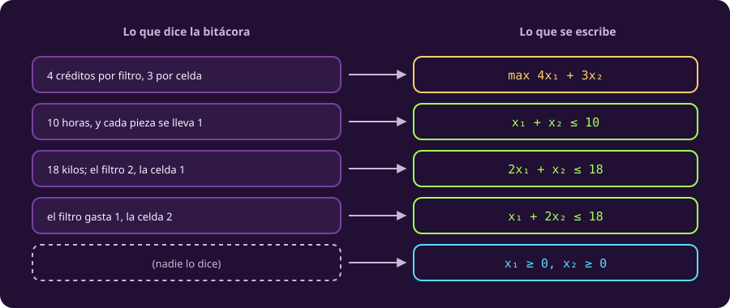

# Escribir el modelo

**¿Cómo convierto esta tabla en matemáticas?**

De la bitácora saliste con una tabla: 11 números, un supuesto anotado y una frase
ambigua resuelta. Eso ya es mucho más de lo que tenías. Pero una tabla todavía no
se puede resolver: **hay que decidir qué de ahí es una incógnita, qué es un dato
y qué es una regla.**

Esa traducción tiene siempre las mismas cinco piezas, y siempre en el mismo
orden. Aprendértelas es lo que hace que el segundo problema de tu vida cueste la
mitad que el primero.

## 1 · Las cinco piezas

Léelas seguidas: cada una contesta una pregunta distinta sobre el mismo texto que
ya leíste.

::: definition {#opt-variable title="Variable de decisión"}
Una **variable de decisión** es cada cosa cuyo valor **eliges tú**, junto con el
conjunto de valores que puede tomar, su **dominio**.

La prueba para distinguirla de todo lo demás: si al terminar tienes que anunciar
ese número, es variable; si ya venía dado y no lo puedes cambiar, no lo es.

Aquí las variables son $x_1$, cuántos filtros se imprimen, y $x_2$, cuántas
celdas. Su dominio son los **reales no negativos**. Las 10 horas no son
variable: nadie decide cuántas horas quedan antes de la parada.
:::

**Que las variables sean reales es un supuesto de modelado, y hay que decirlo en
voz alta.** El depósito paga por pieza entregada, así que media celda no abona
nada: si el modelo permite fracciones es porque nosotros se lo permitimos, no
porque la historia lo diga. Se hace por dos razones.

1. Los métodos de esta unidad necesitan variables continuas. Con variables
   enteras el dibujo de la página siguiente deja de ser una figura de lados
   rectos y hace falta otra cosa.
2. **Aquí sale gratis**, y eso se comprueba al final: la respuesta que da el
   modelo con fracciones permitidas resulta ser de piezas enteras de todos modos,
   así que no hay nada que redondear ni nada que disculpar.

Cuando **no** sale gratis, que es casi siempre, hace falta maquinaria aparte.

::: definition {#opt-parametro title="Parámetro"}
Un **parámetro** es cada número que el problema te **da** y que tú no eliges.

Este problema tiene **11**, y conviene verlos uno por uno, porque «los números de
la tabla» es justo el tipo de frase que suena clara y no lo es.

| # | Qué mide | Valor |
|---:|---|---:|
| 1 | Horas que consume **un filtro** | 1 h |
| 2 | Horas que consume **una celda** | 1 h |
| 3 | Polímero que consume un filtro | 2 kg |
| 4 | Polímero que consume una celda | 1 kg |
| 5 | Energía que consume un filtro | 1 kWh |
| 6 | Energía que consume una celda | 2 kWh |
| 7 | Horas de impresora **disponibles** | 10 h |
| 8 | Polímero disponible | 18 kg |
| 9 | Energía disponible | 18 kWh *(supuesto)* |
| 10 | Créditos que paga **un filtro** | 4 |
| 11 | Créditos que paga **una celda** | 3 |

Los seis primeros son **de consumo**: cuánto se lleva cada pieza de cada recurso.
Van a ser los coeficientes del lado izquierdo de las restricciones. Los tres
siguientes son **de disponibilidad**, y van del lado derecho. Los dos últimos son
**de precio**, y van en el objetivo.

**Qué no es parámetro, para que la definición muerda.** El 4 de «cuatro grados
bajo cero» no lo es: no entra en ninguna cuenta, así que no es un número del
problema aunque esté en la bitácora. Y $x_1$ y $x_2$ tampoco: ésos los eliges tú,
y por eso son variables.

Cambiar un parámetro es plantear **otro problema**, no resolver mejor el mismo.
:::

::: definition {#opt-funcion-lineal title="Función lineal"}
Una **función lineal** se escribe como una suma de las variables, cada una
multiplicada por un número fijo, y nada más:

$$a_1x_1 + a_2x_2 + \dots + a_nx_n.$$

Nada de potencias, nada de multiplicar dos variables entre sí, nada de dividir
entre una variable.

El objetivo $4x_1+3x_2$ es lineal, y también lo son los tres lados izquierdos de
las restricciones. **Un problema en el que el objetivo y todas las restricciones
son lineales se llama problema lineal**, y esta unidad entera trata de uno.
:::

::: definition {#opt-problema title="Problema de optimización"}
Un **problema de optimización** es la terna objetivo, restricciones y dominio,
escrita así:

$$\max_{x \in X}\; f(x) \quad \text{sujeto a}\quad g_i(x) \le b_i,\;\; i = 1,\dots,m.$$

Se lee así: **elige el punto $x$, de entre los que están en $X$, que haga $f$ lo
más grande posible sin violar ninguna de las $m$ desigualdades.**

Esa forma corta esconde tres cosas que conviene saber desde ahora:

- **Mínimo y máximo son el mismo problema.** Minimizar $f$ es maximizar $-f$:
  son **los mismos puntos**, y el valor cambia de signo,
  $\min f = -\max(-f)$. Los dos detalles importan, porque los programas que
  resuelven estos problemas hacen justo esta maniobra.
- **$\ge$ y $=$ también caben.** Una restricción $a\cdot x \ge b$ se escribe
  $-a\cdot x \le -b$; una igualdad son las dos desigualdades a la vez. Se
  escriben todas con $\le$ para tener una sola forma.
- **$X$ dice con qué números trabajas.** Aquí, reales que no pueden ser
  negativos. Es la única parte del modelo que no habla de la impresora sino del
  tipo de número, y por eso va pegada al $\max$ y no en la lista de
  restricciones. Que $x_1$ y $x_2$ no sean negativos se puede escribir en los dos
  sitios; lo que no se puede es no escribirlo.
:::

::: definition {#opt-factible title="Punto factible y conjunto factible"}
Un **punto** es una elección concreta de valores para todas las variables, sea
buena o mala, posible o imposible: $(8,2)$ y $(-2,10)$ son los dos puntos.

Un punto es **factible** si está en el dominio **y** cumple todas las
restricciones. El **conjunto factible** —también llamado **región factible**— es
el de todos los puntos factibles: todo lo que se puede hacer, antes de preguntar
qué conviene.
:::

**Y por eso son cinco condiciones y no tres.** El punto $(-2,10)$ cumple las tres
desigualdades de recurso y no es un plan: no se imprimen menos de 2 filtros. Si la
definición dijera «cualquier plan que cumpla las tres», lo admitiría.

## 2 · El lienzo, paso a paso

Ya tienes las piezas. Falta el **orden en que se buscan**, porque empezar por las
restricciones es la manera más rápida de acabar modelando otro problema.

Son siete preguntas en dos bloques. Las cuatro primeras **construyen**; las tres
últimas **revisan**. El segundo bloque no es adorno: es donde se atrapan los
errores que si no aparecen hasta el final, cuando ya diste por buena una
respuesta absurda.

Renglón por renglón, así se ve la traducción:

::: figure {#opt-historia-a-modelo title="De la frase a la desigualdad"}

:::

::: table {#opt-lienzo-pasos title="Los siete pasos, aplicados a este problema"}
| Paso | Pregunta | Lo que sale |
|---|---|---|
| 1 | ¿Qué decido? | $x_1$, $x_2$, reales $\ge 0$ |
| 2 | ¿Qué sé? | Los 11 parámetros, con sus unidades |
| 3 | ¿Qué quiero? | $\max 4x_1+3x_2$ |
| 4 | ¿Qué no puedo? | Tres desigualdades de recurso |
| 5 | ¿Cuadran las unidades? | Horas con horas, kilos con kilos, kWh con kWh |
| 6 | ¿Hay una solución tonta, y alguna absurda? | $(0,0)$ es factible; y ninguna variable crece sin freno |
| 7 | ¿Qué forma tiene? | Las cuatro funciones son lineales |
:::

Fíjate en el último renglón de la figura: **la columna izquierda está vacía**.
Nadie dijo en la bitácora que no se pueden imprimir menos de cero filtros, y aun
así hay que escribirlo. Ésa es la restricción que todo el mundo olvida.

Con eso, el modelo completo queda:

$$\max\; 4x_1 + 3x_2 \quad \text{sujeto a}\quad x_1 + x_2 \le 10,\;\; 2x_1 + x_2 \le 18,\;\; x_1 + 2x_2 \le 18,\;\; x_1, x_2 \ge 0.$$

## 3 · El paso 6, con honestidad

De los siete pasos, el 6 es el que más gente se salta, así que vale la pena
detenerse. Comprueba las dos maneras de no tener respuesta. Que exista algún punto
factible descarta que el problema sea imposible. Que ninguna variable crezca sin
freno descarta que se pueda mejorar para siempre.

**En este problema la segunda mitad no puede fallar.** Las tres restricciones
tienen todos sus coeficientes positivos, así que **cualquiera de ellas junto con
la no negatividad** ya pone techo: no hay manera de imprimir sin límite. El paso
6 vale para el caso general, no para éste, y aquí se hace por costumbre.

**Y «junto con la no negatividad» no es un detalle que se pueda ahorrar.** Con
$x_1+x_2\le10$ sola, sin exigir $x \ge 0$, el punto se puede ir en la dirección
que aumenta $x_1$ y disminuye $x_2$ para siempre, y el objetivo crece sin freno
porque $4-3>0$. Las tres restricciones se comportan igual.

## 4 · Tu turno

::: exercise {#opt-ej-polimero title="Un parámetro cambia"}
La ingeniera se equivocó: en la bodega hay **14 kg** de polímero, no 18.

Escribe qué cambia **en el modelo**. Después **apunta tu predicción**: ¿crees que
cambia también la respuesta?
:::

::: hint {#opt-pista-polimero of="opt-ej-polimero" title="Por dónde empezar"}
Recorre los siete pasos del lienzo y márcalos: ¿cuáles se rehacen y cuáles no?

Para la predicción no hace falta resolver nada: piensa si el plan que tenías en
mente sigue cabiendo con 4 kilos menos.
:::

::: answer {#opt-resp-polimero of="opt-ej-polimero"}
En el modelo cambia **un solo número**, el lado derecho de la restricción del
polímero:

$$2x_1+x_2 \le 14.$$

No cambia ninguna variable, ningún otro parámetro, ni el objetivo, ni la forma
del problema. De los siete pasos del lienzo, solo el 2 y el 4 se tocan.

Sobre la predicción, la respuesta honesta es **«no lo sé todavía, hay que
resolver otra vez»**, y ésa es la lección: cambiar un parámetro cuesta un
carácter, y saber si cambió la respuesta cuesta resolver el problema entero. La
página siguiente lo comprueba.
:::

> [!WARNING]
> No escribas «$x_1 + x_2 \le 10$ horas». Las unidades se comprueban en el paso 5
> y después no se arrastran dentro de la desigualdad.

## Lo que hay que llevarse

- Las variables son **lo que decides**, no lo que sabes.
- Cada recurso **limitado** da una restricción, se agote o no, y la no
  negatividad va aunque nadie la diga.
- Cambiar un parámetro es barato; saber si cambió la respuesta, no.

El modelo ya está escrito. Ahora se ve y se resuelve, en
[[el-dibujo|la página siguiente]].
