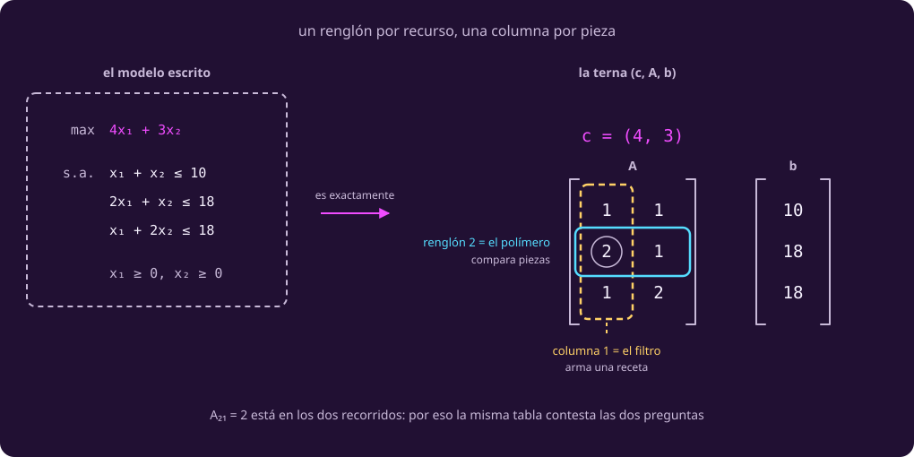

# El modelo como matriz

**¿Cómo se escribe este modelo para que no dependa de que sean dos variables?**

El modelo de la impresora está escrito, dibujado y certificado. Lo que sigue no
cabe en una hoja.

Con dos piezas, apilar tres desigualdades era razonable. Con veinte no: son
veinte sumandos por renglón y nadie los lee.

## 1 · Lo mínimo de vectores

Mira el objetivo, $4x_1+3x_2$: cada precio por su variable, y todo sumado. Esa
operación tiene nombre.

::: definition {#opt-producto-punto title="Vector y producto punto"}
Un **vector** es una lista ordenada de números.

El **producto punto** de $u=(u_1,\dots,u_k)$ y $v=(v_1,\dots,v_k)$ es
$u\cdot v = u_1v_1+\dots+u_kv_k$: un solo número.

La función objetivo de la impresora **es** un producto punto. Con $c=(4,3)$ y
$x=(x_1,x_2)$, lo que vale un plan es $c\cdot x$. En el óptimo,
$(4,3)\cdot(8,2) = 32+6 = 38$.
:::

Los precios del depósito son un vector, y un plan de producción también. Con
veinte piezas cambia el largo, no la cuenta.

## 2 · La matriz, y las dos maneras de recorrerla

Faltan las restricciones. En la tabla de la bitácora ya venían ordenadas, un
renglón por recurso y una columna por pieza: su bloque de consumos, sin la
columna de disponible ni el renglón de créditos, es el segundo dato.

::: definition {#opt-matriz-de-restricciones title="La matriz de restricciones"}
Las tres restricciones de recurso se apilan en una tabla de números, $A$, con
**un renglón por recurso** y **una columna por pieza**:

$$A=\begin{pmatrix}1&1\\2&1\\1&2\end{pmatrix},\qquad b=\begin{pmatrix}10\\18\\18\end{pmatrix}$$

La entrada del renglón $i$ y la columna $j$ se escribe $A_{ij}$: **primero el
renglón**. Así que $A_{21}=2$ es el segundo renglón, primera columna.

- **Recorre un renglón y estás comparando piezas.** El segundo, $2$ y $1$, es el
  del polímero: el filtro se lleva 2 kilos y la celda 1. Ahí se ve **cuál pieza
  es cara** en ese recurso.
- **Recorre una columna y estás armando una receta.** La primera, de arriba
  abajo $\begin{pmatrix}1\\2\\1\end{pmatrix}$, es el filtro entero: una hora, dos
  kilos, un kWh. Ahí no se compara nada; se junta **todo lo que cuesta una
  pieza**.

El número $A_{21}=2$ vive en los dos recorridos, y por eso una matriz se lee de
las dos maneras sin escribirla dos veces.
:::

Las dos marcas se cruzan en un solo número, y ése es el punto del dibujo.

::: figure {#opt-fig-matriz title="La misma tabla, recorrida de las dos maneras"}

:::

## 3 · El problema entero, en una línea

Ya tienes dos de los tres datos: precios y consumos. Falta lo disponible, y con
eso se escribe todo.

::: definition {#opt-forma-matricial title="Problema lineal en forma matricial"}
Con $n$ piezas y $m$ recursos:

$$\max_{x\ge 0}\; c\cdot x \quad\text{sujeto a}\quad Ax\le b.$$

$Ax\le b$ quiere decir esto: haz el producto punto de cada renglón de $A$ con
$x$, y ninguno de esos $m$ números puede pasar de la entrada de $b$ que le toca.
Son las $m$ desigualdades de recurso a la vez, escritas de un tirón.

Todo esto cabe en una línea porque el modelo está en **forma estándar**: todas
las restricciones con $\le$, todas las variables no negativas, y el mínimo
escrito como máximo. La clase 1 lo dejó casi ahí —lo que allá se llamó
**forma canónica** es la maqueta de la hoja: dónde va cada cosa— y lo único que
falta es voltear las que van con $\ge$, que es la maniobra que
[[escribir-el-modelo|Escribir el modelo]] ya describe sin ponerle nombre.
**Un problema lineal es exactamente una terna $(c, A, b)$.**

Para la impresora, $n=2$ y $m=3$, y la terna es la de arriba.
:::

**«Programación lineal» no tiene nada que ver con programar computadoras.** Viene
de *programa* en el sentido de plan —un programa de vuelo—, y se quedó desde los
años cuarenta. Es el mismo objeto que la clase 1 llamó «problema lineal»: nada
aquí exige escribir código.

## 4 · Tu turno

::: exercise {#opt-ej-matriz title="Cuenta la historia"}
Alguien te deja esta terna sobre la mesa, sin explicación:

$$c=(3,4),\qquad A=\begin{pmatrix}1&1\\2&1\\0&1\end{pmatrix},\qquad b=\begin{pmatrix}9\\12\\4\end{pmatrix}$$

1. ¿Cuántas piezas y cuántos recursos hay?
2. ¿Qué dice el tercer renglón, y por qué su primer número es cero?
3. Escríbelo con desigualdades, como en la clase 1.
:::

::: hint {#opt-pista-matriz of="opt-ej-matriz" title="Por dónde empezar"}
El tamaño de $A$ contesta la primera pregunta sin pensar: cuenta renglones y
cuenta columnas.

Para la segunda, escribe el renglón completo con sus dos coeficientes antes de
simplificarlo, y luego lee en voz alta lo que quedó.
:::

::: answer {#opt-resp-matriz of="opt-ej-matriz"}
1. **Dos piezas y tres recursos.** $A$ tiene tres renglones y dos columnas.
2. El tercer renglón es $0\cdot x_1 + 1\cdot x_2 \le 4$, o sea **$x_2\le 4$**. Es
   el patrón **cota sobre una variable** de
   [[patrones-lineales|Patrones lineales]], visto desde la matriz: una cota sobre
   una variable es un renglón con ceros en todas las columnas menos una.
3. $\max 3x_1+4x_2$ sujeto a $x_1+x_2\le 9$, $2x_1+x_2\le 12$, $x_2\le 4$,
   $x_1,x_2\ge 0$.

Y una cosa que se ve al dibujarlo, si tienes curiosidad: **el primer renglón no
muerde.** Sobre todo lo demás, $x_1+x_2$ nunca pasa de 8, así que la recta
$x_1+x_2=9$ ni siquiera toca la región. Hay restricciones que no hacen nada, y
reconocerlas es parte del oficio. *(El óptimo es $(4,4)$ con 28, por si lo
resolviste.)*
:::

> [!WARNING]
> El error clásico es escribir $A$ **transpuesta**, o sea con los renglones y las
> columnas cambiados. La prueba de tamaños lo caza: $b$ tiene una entrada por
> **renglón** de $A$ y $c$ una por **columna**. Si $|b|$ no coincide con los
> renglones que escribiste, está transpuesta. Pero ojo: **con tantas piezas como
> recursos, $A$ es cuadrada y la prueba no dice nada**: es justo lo que pasa en
> la página siguiente. Ahí toca revisar un renglón contra la bitácora.
>
> Y $A$ lleva un renglón por restricción **de recurso**: las de no negatividad
> viven en el $x\ge0$.

## Lo que hay que llevarse

- Escribir la terna es todo el trabajo; a partir de ahí el método no sabe de
  impresoras.
- Un renglón es un recurso y una columna es una receta: la misma tabla contesta
  «¿cuál pieza es cara?» y «¿qué se lleva esta pieza?», según por dónde la
  recorras.
- Los tamaños delatan el error, salvo cuando $A$ es cuadrada: ahí la prueba
  calla, y callar no es aprobar.

El modelo ya no depende de que sean dos variables. El dibujo sí, y el tercer
molde acaba con él: [[cuando-se-acaba-el-dibujo|la página siguiente]].
