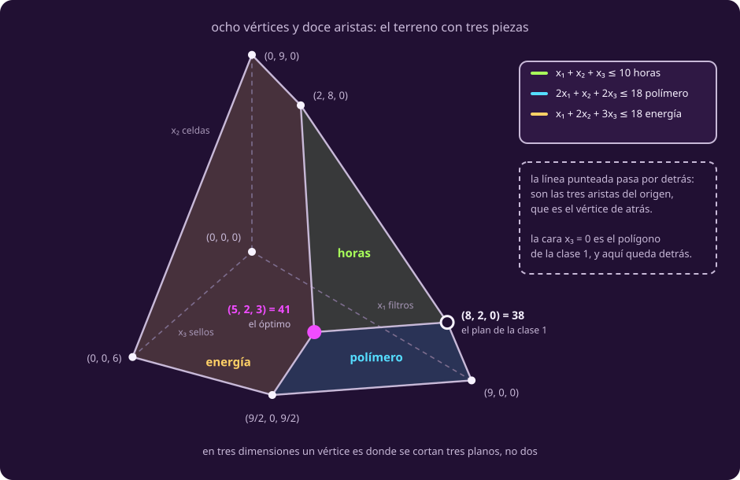
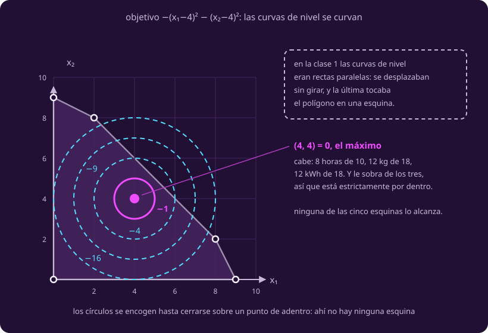

# Cuando se acaba el dibujo

**¿Y si hay tres variables, o veinte?**

El modelo ya es una terna. Nada obliga a que tenga dos columnas.

> **Aviso del depósito.** Antes de la parada: además de filtros y celdas, este
> viaje también nos compran **sellos de vacío**, a 5 créditos. La ingeniera
> cargó el tercer molde, el que llevábamos guardado. Dice que el sello sale
> igual que un filtro —una hora, dos kilos— pero que chupa el triple de
> corriente.

::: table {#opt-el-sello title="Las tres piezas del viaje, con 10 horas, 18 kg y 18 kWh disponibles"}
| Recurso | Por filtro | Por celda | Por sello |
|---|---:|---:|---:|
| Horas de impresora | 1 | 1 | 1 |
| Polímero (kg) | 2 | 1 | 2 |
| Energía (kWh) | 1 | 2 | 3 |
| **Créditos que abona el depósito** | **4** | **3** | **5** |
:::

Con $x_3$ los sellos:

$$c=(4,3,5),\quad A=\begin{pmatrix}1&1&1\\2&1&2\\1&2&3\end{pmatrix},\quad b=\begin{pmatrix}10\\18\\18\end{pmatrix}$$

La terna aguantó la tercera columna. El dibujo no.

## 1 · El polígono se vuelve poliedro

Cada restricción partía el plano en dos. Ya no hay plano.

::: definition {#opt-semiespacio title="Semiespacio"}
En el plano, una desigualdad lineal deja un **semiplano** —ya lo viste—. En tres
dimensiones deja un **semiespacio**: todo lo que queda de un lado de un plano.
En $n$ dimensiones se sigue llamando semiespacio, y su frontera es un
**hiperplano**: así se le dice a un plano cuando tiene más dimensiones de las
que se pueden dibujar.

La frontera del polímero era una recta y ahora es el plano
$2x_1+x_2+2x_3=18$: los planes que gastan los 18 kilos exactos.
:::

::: definition {#opt-poliedro title="Poliedro"}
Un **poliedro** es lo que queda al superponer un número finito de semiespacios:
el conjunto factible de $Ax\le b$, $x\ge0$.

El polígono de la clase 1 era un poliedro de dos dimensiones. El de la impresora
con sello tiene tres, y **ocho vértices**. Con veinte piezas tiene veinte
dimensiones, y nadie lo ha visto nunca.
:::

## 2 · Qué es una esquina cuando no hay esquinas que ver

Dos planos se cortan en una recta, no en un punto.

::: definition {#opt-vertice-n-dimensiones title="Vértice, en cualquier dimensión"}
Extiende la caja de [[el-dibujo|El dibujo]], donde $n$ valía 2.

Llama $n$ al **número de variables**. Un punto factible es un **vértice** si en
él se cumplen con igualdad $n$ restricciones cuyas direcciones son
independientes: ninguna se deduce de las otras.

- En el plano, $n=2$: **dos rectas** que se cruzan.
- En el espacio, $n=3$: **tres planos** que se cortan en un punto.

Y sigue haciendo falta el segundo paso de la clase 1: cruzar $n$ fronteras da un
**candidato**, y solo es vértice si además cumple todas las demás
desigualdades.

El mejor plan del viaje, $(5,2,3)$, es donde se cortan los tres planos de
recurso: cinco filtros, dos celdas y tres sellos, con las horas, el polímero y
la energía acabados exactos. Y el plan de la clase 1, $(8,2,0)$, **también** es
vértice: ahí se cumplen con igualdad las horas, el polímero y $x_3=0$. Sigue
valiendo 38, y ya no gana.

**De aquí en adelante se dice «vértice». «Esquina» se queda para el dibujo de
dos variables.**
:::

::: figure {#opt-fig-poliedro title="El poliedro de la impresora con sello"}

:::

## 3 · Los ocho vértices, y quién es vecino de quién

::: table {#opt-ocho-vertices title="Los ocho vértices del poliedro, y qué se acaba en cada uno"}
| Plan | Vale | Qué se acaba ahí |
|---|---:|---|
| $(0,0,0)$ | 0 | $x_1=0$, $x_2=0$, $x_3=0$ |
| $(0,9,0)$ | 27 | energía, $x_1=0$, $x_3=0$ |
| $(0,0,6)$ | 30 | energía, $x_1=0$, $x_2=0$ |
| $(2,8,0)$ | 32 | horas, energía, $x_3=0$ |
| $(9,0,0)$ | 36 | polímero, $x_2=0$, $x_3=0$ |
| $(8,2,0)$ | 38 | horas, polímero, $x_3=0$ |
| $(\tfrac92,0,\tfrac92)$ | $\tfrac{81}{2}$ | polímero, energía, $x_2=0$ |
| $(5,2,3)$ | **41** | horas, polímero, energía |
:::

**Vecinos** son los vértices que une una arista: comparten dos activas
—$(9,0,0)$ y $(8,2,0)$, el polímero y $x_3=0$—. Contar alcanza porque aquí
ningún vértice es **degenerado**: en ninguno hay más de tres activas.

## 4 · El teorema, ahora con sus hipótesis

::: theorem {#opt-teo-vertice title="Teorema del vértice"}
Si un problema **lineal** con variables no negativas tiene óptimo, entonces al
menos uno de sus puntos óptimos es un **vértice** del poliedro.

En el viaje: el mejor plan es $(5,2,3)$, con 41 créditos, y es uno de los ocho
de la tabla.
:::

::: remark {#opt-que-le-falta-al-dibujo title="Qué le falta al argumento de la clase 1"}
Esta página no lo demuestra otra vez: el argumento de cuatro pasos está en
[[el-dibujo|El dibujo]]. Pero aquel empieza suponiendo que el polígono es
«cerrado y de tamaño finito», o sea acotado, y el teorema de arriba no lo pide.

Lo cierra un renglón. Con $x\ge0$ el poliedro no contiene ninguna recta, así que
aunque se extienda al infinito siempre se puede bajar por una arista hasta un
vértice.
:::

**«Al menos uno» no es una hipótesis: es una palabra de la conclusión.** Con la
celda a 4 empatan $(2,8)$, $(8,2)$ y el segmento entero.

### Por qué «lineal» no es decoración

Sobre el mismo polígono, maximiza $-(x_1-4)^2-(x_2-4)^2$: las curvas de nivel
ya no son rectas paralelas sino círculos alrededor de $(4,4)$, que es factible,
queda estrictamente por dentro, y **ningún vértice lo alcanza**.

::: figure {#opt-fig-circulos title="Curvas de nivel que se curvan"}

:::

### Por qué «x ≥ 0»

Sin ella el teorema **es falso**, no queda sin referente: sobre la franja
$0\le x_2\le1$ con $x_1$ libre, el máximo de $x_2$ se alcanza y no hay vértices.
Es suficiente, no necesaria.

## 5 · Y por qué no se pueden mirar todos

::: table {#opt-cuenta-de-cruces title="Cuántos candidatos habría que mirar"}
| Problema | Restricciones | Tríos que revisar |
|---|---:|---|
| 2 piezas, 3 recursos — el de la clase 1 | 5 | $\binom{5}{2}=10$, de los que sobreviven **5** |
| 3 piezas, 3 recursos — con el sello | 6 | $\binom{6}{3}=20$, de los que sobreviven **8** |
| 20 piezas, 20 recursos | 40 | $\binom{40}{20}\approx 1.4\times 10^{11}$ |
:::

Con $n$ piezas y $m$ recursos hay $m+n$ restricciones y a lo más
$\binom{m+n}{n}$ candidatos. **Enumerar está descartado**, y no por
lentitud: es el muro de [[las-clases|P, NP y EXP]].

## 6 · Tu turno

::: exercise {#opt-ej-poliedro title="Cruza tres planos"}
En el poliedro con sello, cruza los planos de **horas** y **polímero** con el
plano $x_1=0$.

1. ¿Qué punto sale?
2. ¿Es un vértice?
:::

::: hint {#opt-pista-poliedro of="opt-ej-poliedro" title="Por dónde empezar"}
Son tres ecuaciones con tres incógnitas, y una de ellas ya te da $x_1$.
Sustitúyela en las otras dos y te quedan dos ecuaciones con dos incógnitas.

Cuando tengas el punto, acuérdate del segundo paso: te falta revisar una
restricción que no usaste.
:::

::: answer {#opt-resp-poliedro of="opt-ej-poliedro"}
**Sale $(0,2,8)$**: sin filtros, dos celdas y ocho sellos. Cumple las horas
—$0+2+8=10$— y el polímero —$0+2+16=18$—, los dos exactos, y ninguna coordenada
es negativa. Tiene todo el aspecto de un vértice.

**No lo es.** Falta la energía: $0+4+24=28$, y solo hay 18. El punto queda
**fuera** del poliedro. Compruébalo también contra la tabla de los ocho: no
está.

Y de paso, un viejo conocido: cruzar polímero, energía y $x_3=0$ da $(6,6,0)$
—el $(6,6)$ que ya te tendió una trampa en el dibujo—, que pide 12 horas de las
10 que hay.
:::

> [!WARNING]
> El $n$ de la definición de vértice es cuántas **variables** hay, no cuántas
> restricciones. Con tres piezas hacen falta **tres** igualdades: donde solo dos
> se cumplen, estás sobre una **arista**.

## Lo que hay que llevarse

- Dibujar era el atajo, no el método: el modelo aguantó la tercera columna y el
  dibujo no.
- El teorema vive de sus hipótesis: sin «lineal», el mejor plan se va al
  interior.
- Saber que la respuesta está en un vértice no dice en cuál, y ya no se pueden
  mirar todos.

Falta el método que camina hasta ahí:
[[de-esquina-en-esquina|la página siguiente]].
