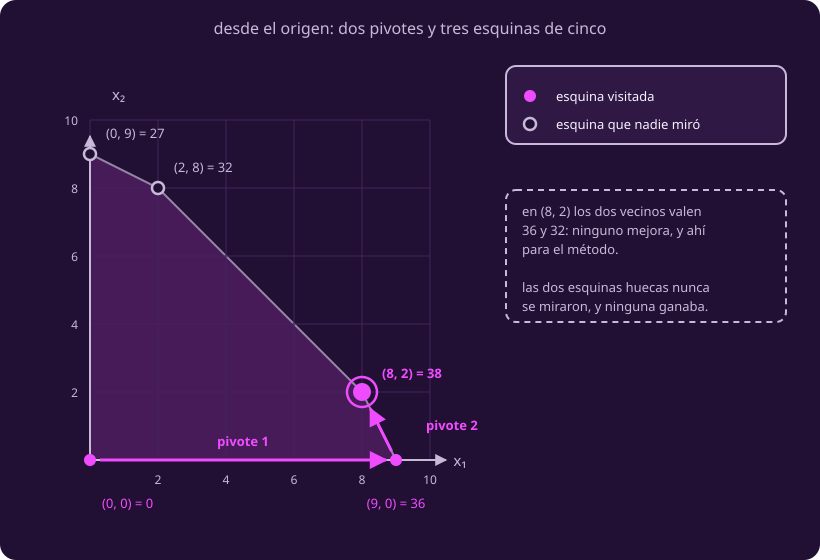

# De esquina en esquina

**¿Cómo llego al vértice correcto sin ver el dibujo?**

Sabemos que la respuesta es un vértice y que hay demasiados.

## 1 · La idea, sin fórmulas

Estás parado en una esquina del polígono, con niebla. No ves la figura: solo
puedes preguntarle a las esquinas de al lado cuánto pagan. Si alguna paga más,
te mueves. Si ninguna, te quedas.

Toda la clase se juega en que esa regla baste.

## 2 · Vecinos, y por qué la regla local alcanza

Esas esquinas de al lado tienen nombre, y se reconocen sin dibujo.

::: definition {#opt-vertice-adyacente title="Vértice adyacente, o vecino"}
Dos vértices son **adyacentes**, o vecinos, si están unidos por una **arista**
del poliedro.

En los dos cuerpos de esta clase eso se comprueba contando: **comparten $n-1$
restricciones activas**, y esas $n-1$ son independientes. Contar no equivale a
estar unidos por una arista: si las compartidas no fueran independientes, el
conteo declararía vecinos a los extremos de la diagonal de una cara. Aquí
coincide porque ningún vértice es degenerado.

En el polígono de la clase 1, $(9,0)$ y $(8,2)$ son vecinos: los dos agotan el
polímero. $(9,0)$ y $(2,8)$ no comparten ninguna, y no lo son. Cada esquina de
**ese** polígono tiene dos vecinos, y cada vértice del poliedro con sello tiene
tres. Es una cuenta de **estos** dos cuerpos, no una regla: el ápice de una
pirámide de base cuadrada tiene cuatro.
:::

Con la palabra puesta, el método cabe en un renglón.

::: definition {#opt-simplex title="El método simplex"}
**Simplex** es este procedimiento: empieza en un vértice factible; mira sus
vecinos; si alguno mejora el objetivo, muévete a él; repite; para cuando
ninguno mejore. A cada movimiento se le llama un **pivote**.

**Por qué termina.** Cada paso mejora estrictamente el valor, así que ningún
vértice se visita dos veces, y los vértices son finitos.

**Por qué parar es correcto**, que es lo que no es obvio, son dos pasos:

1. **De los vecinos al alrededor.** Desde un vértice, cualquier movimiento
   factible es una mezcla de los movimientos hacia sus vecinos. Si ninguno de
   ésos sube, ninguna mezcla sube: cerca no hay nada mejor.
2. **Del alrededor a todo el poliedro.** Aquí se cobra lo que
   [[que-es-una-respuesta|Qué es una respuesta]] ya dijo: el conjunto factible
   es **convexo** —no tiene huecos ni entrantes— **y** el objetivo es lineal.
   Con esas dos cosas, lo mejor de un alrededor es lo mejor de todo. La clase 3
   lo demuestra.

Parado en el mejor plan del viaje, $(5,2,3)$, hay que preguntarle a tres planes
y no a los ocho de la tabla.
:::

**Y hacen falta las dos.** Con la convexidad sola es falso: sobre este mismo
polígono, $(x_1-x_2)^2+x_1/10$ tiene en $(0,9)$ un máximo local estricto —sus
vecinos valen 0 y 36.2, y ninguna dirección factible sube— y el global está en
$(9,0)$. El polígono no cambió: falla la linealidad del objetivo.

## 3 · Un ejemplo que puedes comprobar con el dedo

Sobre las **dos** variables de la clase 1, a propósito: es el único caso en que
puedes poner el dedo en el dibujo y revisar cada paso.

::: table {#opt-traza-simplex title="Simplex sobre el polígono de la clase 1, desde el origen"}
| Estoy en | Vale | Vecinos, y lo que valen | Me voy a |
|---|---:|---|---|
| $(0,0)$ | 0 | $(0,9)=27$ · $(9,0)=36$ | $(9,0)$ |
| $(9,0)$ | 36 | $(0,0)=0$ · $(8,2)=38$ | $(8,2)$ |
| $(8,2)$ | **38** | $(2,8)=32$ · $(9,0)=36$ | — |
:::

Dos pivotes, y tres esquinas de cinco. En la última ninguno mejora, así que ahí
para. El resultado es el que la clase 1 ya sabía: por eso se puede comprobar.

::: figure {#opt-fig-camino title="Dos pivotes, y dos esquinas que nadie miró"}

:::

## 4 · El procedimiento, en nueve líneas

```text
ENTRADA  un problema lineal de máximo con x ≥ 0, y un vértice factible v₀.
SALIDA   un vértice óptimo, o el aviso de que el problema no está acotado.

 1  v ← v₀                                      ▷ dónde estoy
 2  repetir
 3      si sale de v un rayo que mejora y nunca choca con otro vértice
 4          devolver «no acotado»
 5      M ← { w vecino de v : c·w > c·v }       ▷ hacia dónde: los que mejoran
 6      si M = ∅
 7          devolver v                          ▷ ¿paro? ninguno mejora
 8      v ← el w de M con mayor c·w             ▷ cuánto avanzo: hasta ese vecino
 9  fin repetir
```

**De dónde sale $v_0$.** El **origen** siempre sirve, porque todas las
restricciones son $\le$ con lado derecho no negativo. No hacer nada siempre es
un plan.

**La regla de la línea 8, declarada.** Si dos vecinos empatan, esta página se
queda con el de menor $x_1$; si también empatan ahí, con el de menor $x_2$. Es
una convención, no matemáticas.

**Y de otra ruta se promete el valor, no el destino.** Con la celda a 4 —el
empate que la clase 1 ya mostró— desde el origen empatan $(9,0)$ y $(0,9)$: una
ruta termina en $(8,2)$ y la otra en $(2,8)$, las dos con 40. El valor óptimo
coincide siempre; el vértice, solo cuando el óptimo es único.

Las líneas 3 y 4 son la rama del problema **no acotado**, que
[[que-es-una-respuesta|Qué es una respuesta]] ya definió; aquí nunca se ejecuta.

## 5 · Tu turno

::: exercise {#opt-ej-simplex title="Empieza en otra esquina"}
Corre simplex sobre el polígono de la clase 1 empezando en $(0,9)$ en vez del
origen. Escribe la traza completa, con los vecinos de cada paso.

¿Llegas al mismo sitio? ¿En cuántos pivotes?
:::

::: hint {#opt-pista-simplex of="opt-ej-simplex" title="Por dónde empezar"}
Empieza por los vecinos, no por los valores: los de una esquina del polígono son
las dos que comparten un lado con ella. Ubícalas en el dibujo antes de hacer
ninguna cuenta.

Los cinco valores ya están tabulados en [[el-dibujo|El dibujo]], así que no hay
nada que recalcular. Escribe un renglón por paso, con las mismas cuatro
columnas de la tabla de arriba, y para cuando la última columna se quede vacía.
:::

::: answer {#opt-resp-simplex of="opt-ej-simplex"}
$(0,9)=27$, vecinos $(0,0)=0$ y $(2,8)=32$: me voy a $(2,8)$.

$(2,8)=32$, vecinos $(0,9)=27$ y $(8,2)=38$: me voy a $(8,2)$.

$(8,2)=38$, vecinos $(2,8)=32$ y $(9,0)=36$: ninguno mejora, paro.

**El mismo vértice, $(8,2)$ con 38, y también en dos pivotes.** Aquí el destino
coincide porque el óptimo es único. Que el número de pivotes también coincida es
casualidad del tamaño del problema.
:::

> [!WARNING]
> Simplex no promete recorrer pocos vértices: promete no recorrerlos todos, y
> parar en el correcto. Y no promete llegar por tu camino: si dos vecinos
> empatan, dos personas terminan en vértices distintos con el mismo valor.

## Lo que hay que llevarse

- Preguntarle a los vecinos sale barato; que su respuesta valga para todo el
  poliedro es lo que hay que demostrar.
- Funciona por dos cosas juntas: el conjunto no tiene huecos ni entrantes **y**
  el objetivo es una recta. Quítale una y se cae.
- Empezar es gratis, porque el origen siempre sirve; lo caro es saber cuándo
  dejar de moverse.

Ya está descrito, y comprobado donde había dibujo. Falta soltarlo donde no lo
hay: [[sin-dibujo|la página siguiente]].
